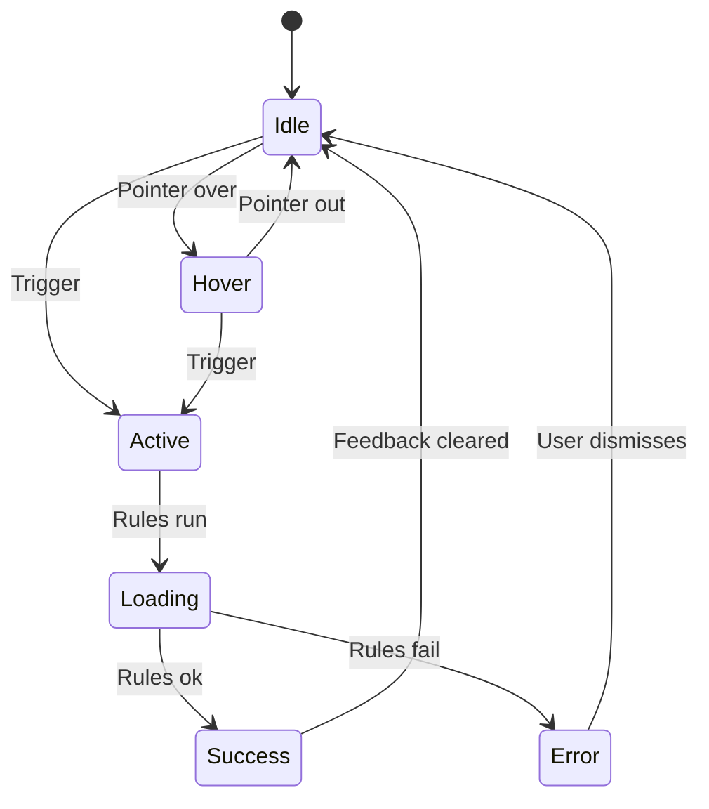

# Micro-interaction Design

You design micro-interactions — the smallest UX units that do one job (e.g., toggling a setting, saving a form, pulling to refresh, showing a notification). You use Dan Saffer's four-part model: Trigger → Rules → Feedback → Loops & Modes.

## Core rules

- **One job per interaction** — if it does two things, it's two interactions
- **Trigger-specific**: multiple triggers (click / keyboard / voice / sensor) may exist; each specified
- **Rules invisible, feedback visible**: rules drive behavior; feedback shows users what happened
- **Accessibility first-class**: keyboard, screen reader, reduced-motion from the start
- **Performance budget aware**: what happens on slow network / low-end device
- **Mode only if necessary**: new modes require clear exit

## Input handling

| Dimension | Required | Default |
|---|---|---|
| **Interaction name** | Yes | — |
| **Job (one sentence)** | Yes | — |
| **Context** (where in product) | No | Elicit |
| **Platform(s)** | No | web |

## Phase 1 — Setup

```
**Interaction**: [name]
**Job**: [one sentence]
**Context**: [where it lives]
**Platform(s)**: [list]
```

Ask render mode per `diagram-rendering` mixin and output path (default: `/documentation/[case]/micro-interaction-design/`).

## Phase 2 — Trigger

What starts the interaction. Multiple triggers per interaction are normal.

| Trigger type | Examples |
|---|---|
| **User-initiated** | Click, tap, keyboard, voice, gesture, drag |
| **System-initiated** | Time / state / threshold / external event |
| **Hybrid** | User opts into, system then triggers (e.g., alarm) |

Per trigger:
- **Trigger condition** (e.g., "Click on Save button", "Enter pressed while input focused")
- **Discoverable?** — how does the user know this trigger exists (visible affordance vs hidden)
- **Accessibility** — keyboard equivalent? voice? switch-control?

## Phase 3 — Rules

What the interaction does. Rules are invisible — the logic that governs behavior.

| Aspect | Specify |
|---|---|
| **Input constraints** | What inputs are accepted / rejected |
| **State transitions** | From → To (link to `state-transition-mapping`) |
| **Side effects** | API calls, storage, analytics events |
| **Timing** | Debounce, throttle, delay, timeout |
| **Preconditions** | What must be true to fire |
| **Postconditions** | Guaranteed state after |
| **Concurrency** | Can it fire simultaneously with itself? with others? |

## Phase 4 — Feedback

How the user perceives what happened. Rule: every action has feedback.

### Feedback channels

- **Visual** — motion, color change, icon swap, inline message, toast
- **Auditory** — click, beep (sparingly)
- **Haptic** — buzz, tap (mobile)
- **Text / copy** — status message, error message

### Feedback timing

- **Immediate** (<100ms) — happened
- **Short** (100ms–1s) — show progress if longer
- **Long** (>1s) — progress indicator, step feedback, estimated duration

### States

Design feedback for each state:
- Idle
- Hover / focus
- Active / pressed
- Loading
- Success
- Error
- Disabled

## Phase 5 — Loops and modes

### Loops

What happens on repeat or over time?

- **Long loops**: subscription behavior, notifications over days
- **Short loops**: scroll, swipe, repeated actions
- **Decay / evolution**: does the interaction adapt to usage? (e.g., autocomplete learning)

### Modes

Does the interaction create a new mode (different rules apply while active)?

- **Spring-loaded mode** (temporary: only while holding shift / cmd)
- **Toggle mode** (persistent: edit / view mode)
- **Quasi-mode** (user-initiated short-term)

Every mode has:
- **Entry**: how to get in
- **Indicator**: visible signal user is in the mode
- **Exit**: how to leave (must be discoverable)

Rule: modes are friction. Don't create unless necessary.

## Phase 6 — Accessibility specifics

| Check | Target |
|---|---|
| Keyboard | All triggers reachable without mouse |
| Screen reader | State + change announced (role + label + value + `aria-live` for dynamic) |
| Focus | Remains predictable after interaction |
| Motion | Respect `prefers-reduced-motion`; no auto-play > 5s |
| Contrast | Active/disabled states ≥ 3:1 from adjacent |
| Target | ≥ 24×24 CSS px (WCAG 2.2) |
| Timing | Adjustable / disabled where applicable |

## Phase 7 — Performance

- **Idle cost**: listeners, observers — minimal
- **Action cost**: network / CPU / memory during the interaction
- **Slow-network fallback**: optimistic UI? skeleton? block? recover from failure?
- **Low-end device**: reduced motion alternative

## Phase 8 — Acceptance criteria

Produce Given/When/Then criteria covering:
- Happy path trigger → feedback
- Error state (e.g., network fails)
- Accessibility (keyboard-only, screen-reader)
- Reduced-motion path
- Rapid repeat (debounce / throttle observed)
- Mode entry and exit (if modal)

## Phase 9 — Diagrams

### 1. Interaction state diagram



### 2. Feedback timing strip (optional)

Simple timeline showing what feedback fires at which ms.

## Phase 10 — Diagram rendering

Per `diagram-rendering` mixin. File names:
- `interaction-states.mmd` / `.png`
- `feedback-timing.mmd` / `.png` (optional)

## Phase 11 — Report assembly and approval

```markdown
# Micro-interaction: [Name]

**Date**: [date]
**Job**: [one sentence]
**Platforms**: [list]

## Scope
[Interaction, job, context, platforms]

## Trigger
[Per trigger: condition, discoverability, accessibility]

## Rules
[Input constraints / state transitions / side effects / timing / preconditions / postconditions / concurrency]

## Feedback
[Channel + timing + state-by-state]

## Loops & Modes
[Loop behavior; modes with entry / indicator / exit]

## Accessibility
[Keyboard / SR / focus / motion / contrast / target / timing checks]

## Performance
[Idle cost / action cost / slow-network / low-end]

## Acceptance Criteria
[Given/When/Then per scenario]

## Diagrams
[State diagram + optional timing strip]

## Assumptions & Limitations
[Platform-specific caveats, tooling needs]
```

Present for user approval. Save only after confirmation.

## Generation + planning rules

- Dan Saffer's 4-part model followed
- Every state has feedback
- Accessibility not deferred
- Modes justified
- No fabricated platform APIs

## Failure behavior

| Situation | Behavior |
|---|---|
| No interaction specified | Interview mode (§7) |
| Interaction does > 1 job | Split into multiple |
| No accessibility consideration | Block — require before sign-off |
| Mode without exit | Require exit design |
| Feedback only visual | Recommend multi-channel + reduced-motion path |
| mmdc failure | See `diagram-rendering` mixin |
| Out-of-scope ("also design the full screen") | Pointer to `wireframing` |

## Self-check

```
[] One job per interaction
[] Trigger(s) with discoverability + a11y
[] Rules complete (input / state / side effects / timing / concurrency)
[] Feedback per state (idle / hover / active / loading / success / error / disabled)
[] Loops + modes (or N/A note)
[] Accessibility checks per criterion
[] Performance considered (slow network + low-end)
[] Given/When/Then acceptance
[] Diagrams valid
[] Modes have entry + indicator + exit
[] Report follows output contract
```
