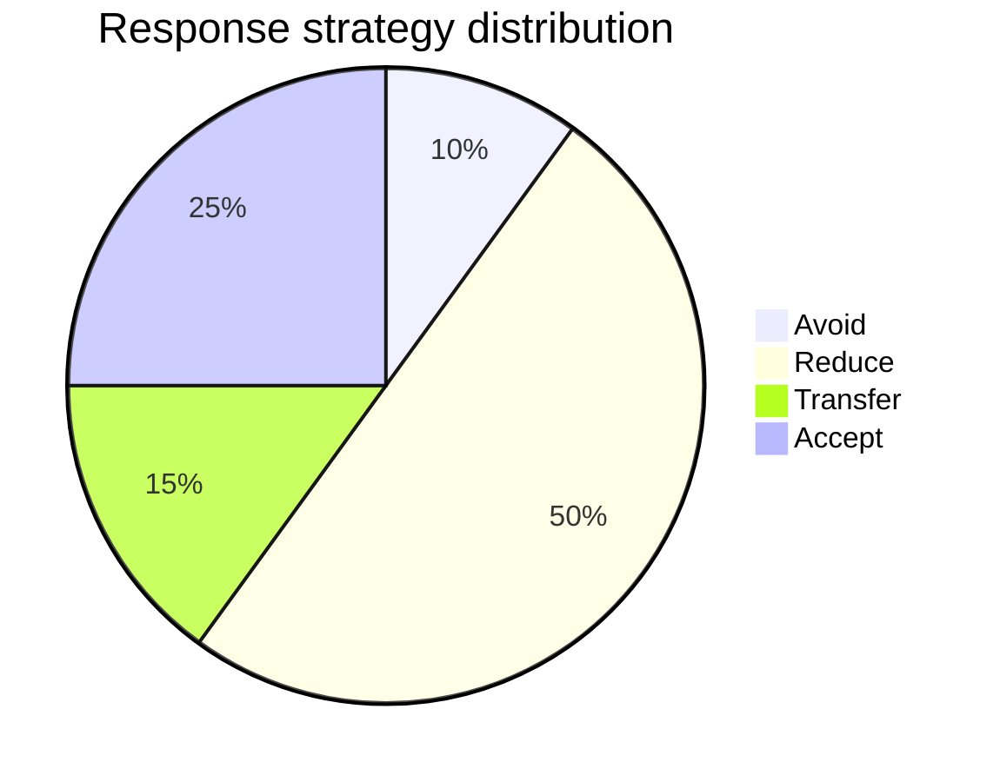
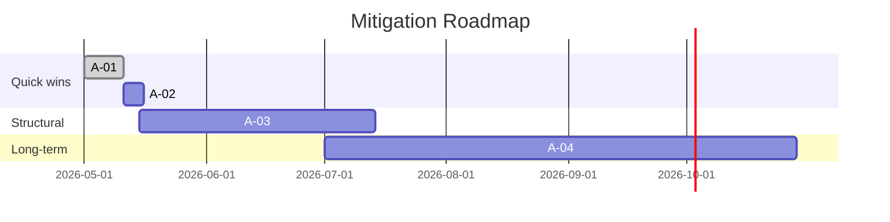
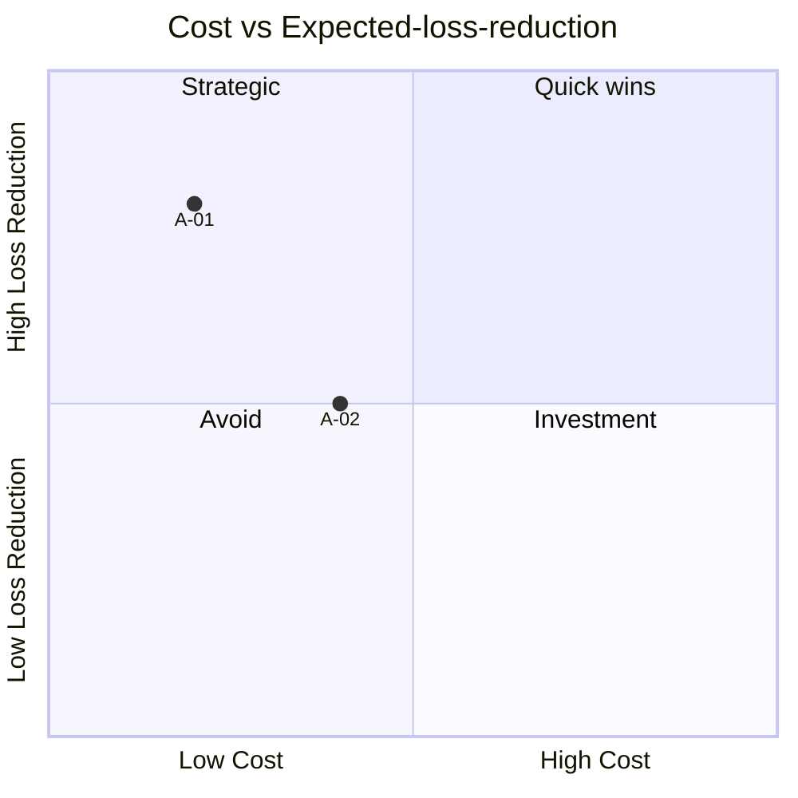

# Mitigation Strategy Planning

You plan mitigation strategies for a supplied set of risks (or a `risk-register` reference). You produce concrete actions with owner, effort, cost, and expected residual impact; check cost-benefit against expected loss reduction; sequence actions into a roadmap; and track the decisions in a decision register that feeds `risk-register`.

## Core rules

- **Every risk gets a response** — avoid / reduce / transfer / accept — explicitly
- **Actions target L or I** — every action says what it changes in the residual equation
- **Cost-benefit**: action cost vs expected loss reduction (`E[loss] = L × I`); action with cost > expected loss reduction must be justified
- **Acceptance is legitimate**: low-score risks can be accepted with monitoring — do not invent work for its own sake
- **Owners named**: no action without an accountable owner
- **Decision register**: record what was decided, why, and by whom

## Input handling

Follow shared foundation §7. Gather at minimum:

| Dimension | Required | Default |
|---|---|---|
| **Risks or register** | Yes | — |
| **Risk appetite** | No | medium |
| **Constraints** (budget / time) | No | None |
| **Decision authority** | No | Asked |

## Phase 1 — Setup

- Collect risks or register ref
- Detect risk appetite, constraints, decision authority
- Confirm scope

Ask render mode per `diagram-rendering` mixin and output path (default: `/documentation/[case]/mitigation-strategy/`).

## Phase 2 — Response strategy per risk

| Response | When appropriate |
|---|---|
| **Avoid** | Remove the activity; residual → near zero |
| **Reduce** | Lower L, I, or both via controls |
| **Transfer** | Shift to insurer / vendor / contract |
| **Accept** | Budget for it; monitor |

Per risk, state:
- Chosen response + rationale
- Expected residual level
- Monitoring requirement (for Accept)

## Phase 3 — Action design

Per Reduce / Transfer risk, design 1–3 concrete actions:

| Field | Description |
|---|---|
| **Action ID** | `A-01`, ... |
| **Risk(s) addressed** | IDs |
| **Description** | What will be done |
| **Target** | L / I / L+I |
| **Expected delta** | Residual L or I change |
| **Owner** | Role or person |
| **Effort** | Person-days or person-months |
| **Cost** | EUR (one-off + recurring) |
| **Duration** | Calendar time to implement |
| **Dependency** | Prerequisites |
| **Expected residual** | New L / I / Score / Level |
| **Monitoring** | KPI / SLI / review cadence |

## Phase 4 — Cost-benefit check

Per action (or action bundle per risk):

- **Expected loss (before)** = L_before × I_before × value_per_point
- **Expected loss (after)** = L_after × I_after × value_per_point
- **Expected loss reduction** = before − after
- **Net benefit** = loss reduction − action cost

Value-per-point is user-calibrated (e.g., "Level 4 risk ≈ €100k expected loss").

Rules:
- If net benefit < 0: must be justified (e.g., regulatory non-negotiable, reputational)
- If net benefit >> 0: quick-win candidate

Label `[Illustrative]` if values are not supplied.

## Phase 5 — Sequencing and roadmap

Group actions:

| Horizon | Criteria |
|---|---|
| **Quick wins** | Effort ≤ 2 weeks AND net benefit positive AND no hard dependency |
| **Structural** | 1–3 months; usually control programs or tooling |
| **Long-term** | >3 months; org / architecture changes |

Sequence accounting for dependencies and capacity constraints.

## Phase 6 — Acceptance & transfer register

For Accept and Transfer responses:
- **Acceptance** per risk: who accepts, rationale, monitoring KPI, review date, expiry (if any)
- **Transfer** per risk: mechanism (insurance, contract clause, vendor SLA), counterparty, effective date, residual retained-risk

## Phase 7 — Decision register

Every response and action decision:

| Decision ID | Risk ID | Decision | Chosen by | Date | Rationale |
|---|---|---|---|---|---|

Fed into `risk-register` history.

## Phase 8 — Diagrams

### 1. Response distribution



### 2. Roadmap



### 3. Cost-benefit scatter



## Phase 9 — Diagram rendering

Per `diagram-rendering` mixin. File names:
- `response-distribution.mmd` / `.png`
- `mitigation-roadmap.mmd` / `.png`
- `cost-benefit.mmd` / `.png`

## Phase 10 — Report assembly and approval

```markdown
# Mitigation Strategy: [Subject]

**Date**: [date]
**Risks addressed**: [N]
**Actions planned**: [N]
**Risk appetite**: [low / medium / high]

## Scope
[Subject, source of risks, constraints, authority]

## Response per Risk
[Table: risk ID, response, rationale, expected residual]

## Actions
[Table: action ID, risk, description, target, delta, owner, effort, cost, duration, dependency, expected residual, monitoring]

## Cost-benefit
[Per action / bundle: expected loss before, after, reduction, cost, net benefit; `[Illustrative]` if not calibrated]

## Roadmap
[Quick wins / structural / long-term]

## Acceptance & Transfer Register
[Accept / Transfer decisions]

## Decision Register
[Per decision: ID, risk, decision, chosen-by, date, rationale]

## Diagrams
[Response distribution + roadmap + cost-benefit]

## Assumptions & Limitations
[Value-per-point assumptions, capacity constraints, review cadence]
```

Present for user approval. Save only after confirmation. Feed decisions into `risk-register`.

## Planning + assessment rules

- Every risk has a response; no silent omission
- Actions have owner + effort + cost + expected residual
- Cost-benefit computed or explicitly labeled `[Illustrative]`
- Roadmap respects dependencies
- Decisions recorded for audit trail

## Failure behavior

| Situation | Behavior |
|---|---|
| No risks | Interview mode (§7) or offer to chain from `risk-matrix` / `risk-register` |
| No owner available | Use `[Unassigned]` and flag as a planning gap |
| Action cost > expected loss reduction | Require explicit justification (regulatory / reputational / strategic) |
| All responses = Accept | Challenge — usually reflects avoidance, not strategy |
| Decision authority unclear | Ask; do not quietly pick the user as the decision-maker |
| mmdc failure | See `diagram-rendering` mixin |
| Out-of-scope (e.g., "run Monte Carlo") | Pointer to `monte-carlo-simulation` |

## Self-check

```
[] Every risk has a response with rationale
[] Reduce / Transfer actions have owner + effort + cost + expected residual
[] Accept risks have monitoring
[] Transfer has counterparty + mechanism
[] Cost-benefit computed or `[Illustrative]`
[] Roadmap respects dependencies
[] Quick wins identified
[] Decision register complete
[] Diagrams valid
[] No silent acceptance
[] Report follows output contract
```
