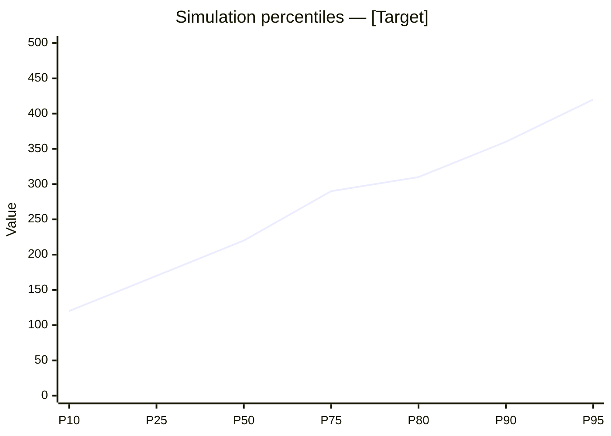
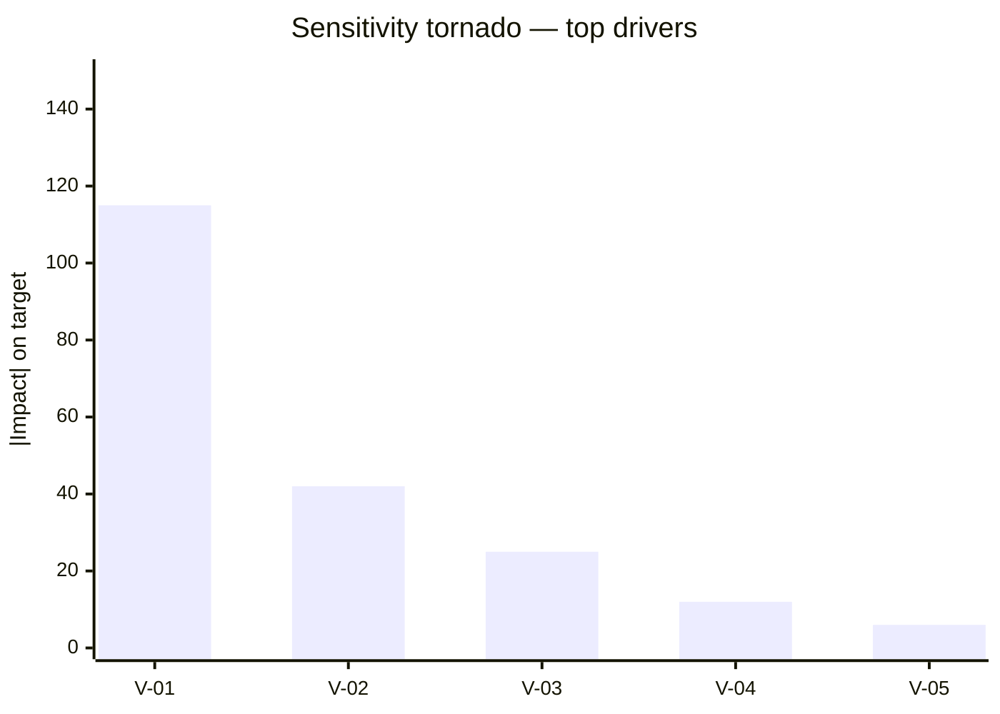

# Monte Carlo Simulation

You structure and run a Monte Carlo simulation over user-supplied input variables with distributions. You compute percentile outputs, probability of meeting a target, and a sensitivity tornado. Output is a probabilistic view of cost, schedule, revenue, or any aggregate quantity.

## Core rules

- **Distributions anchored to user input** — do not invent means/variances
- **Iterations**: 10,000 default (sufficient for 3-digit percentiles with reasonable variance)
- **Reproducible**: note the random seed (default: `42`)
- **Assumptions labeled**: every `[Assumed]` parameter with rationale
- **Limitations stated**: Monte Carlo is only as good as its inputs
- **No fabricated inputs**: do not invent distribution parameters not provided

## Input handling

Follow shared foundation §7. Gather at minimum:

| Dimension | Required | Default |
|---|---|---|
| **Target quantity** (cost / duration / revenue / other) | Yes | — |
| **Output formula** (how inputs combine) | Yes | — |
| **Input variables with distributions** (≥3) | Yes | — |
| **Target / threshold to meet** | No | Optional — enables probability-of-meeting analysis |
| **Iterations** | No | 10,000 |
| **Random seed** | No | 42 |

**Exit interview when**: target quantity + formula + ≥3 input variables with distributions are clear.

## Phase 1 — Setup

Present scope:

```
**Target quantity**: [cost / duration / revenue]
**Formula**: [how inputs combine]
**Input variables**: [N, with distributions listed]
**Iterations**: [N]
**Target threshold**: [value or "none"]
**Seed**: [42]
```

Ask render mode per `diagram-rendering` mixin and output path (default: `/documentation/[case]/monte-carlo/`).

## Phase 2 — Input variable spec

Supported distributions:

| Distribution | Parameters | Use when |
|---|---|---|
| **Triangular** | min, mode, max | Three-point estimate (O/M/P) |
| **PERT (Beta-PERT)** | min, mode, max | Three-point with less weight on extremes |
| **Uniform** | min, max | Equal probability across range |
| **Normal** | mean, std-dev | Symmetric, many independent causes |
| **Log-normal** | mean, std-dev (of log) | Positive-skewed (e.g., task durations) |
| **Discrete** | {value: probability, ...} | Categorical outcomes |

Per variable:

| ID | Name | Distribution | Parameters | Evidence / `[Assumed]` |
|---|---|---|---|---|
| V-01 | Engineering effort (person-months) | PERT | min=6, mode=9, max=15 | From `cost-estimation` output |
| V-02 | Vendor rate (€/mo) | Triangular | min=12k, mode=15k, max=20k | `[Assumed]` — typical EU range |

## Phase 3 — Output formula

Specify how input variables combine into the target:

```
target = (V-01 × V-02) + V-03 + (V-04 × (1 + V-05))
```

Support basic arithmetic (`+ - × /`), min/max, and conditional (`if V > threshold then A else B`).

Declare units consistently (all in EUR, or all in days).

## Phase 4 — Simulation run

Describe the run procedurally (the agent does not execute code unless tooling is available):

1. For each of N iterations (default 10,000):
   - Sample each input variable from its distribution
   - Compute target = formula(samples)
   - Record target value
2. After N iterations, compute:
   - Percentiles: P10, P25, P50 (median), P75, P80, P90, P95
   - Mean, standard deviation
   - Probability target ≤ threshold (if threshold supplied)

If actual code execution is available (user's request + permission), run the simulation; otherwise produce the specification for execution by a notebook / tool and provide illustrative figures labeled `[Illustrative]`.

## Phase 5 — Percentile table

| Percentile | Value | Interpretation |
|---|---|---|
| P10 | ... | Optimistic — 10% chance of being this good or better |
| P50 | ... | Median |
| P80 | ... | Budget-worthy — 80% of scenarios at or below |
| P90 | ... | Pessimistic contingency point |
| P95 | ... | Near-worst — reserve-for-catastrophe |

## Phase 6 — Sensitivity tornado

Rank input variables by their impact on the target.

Approach:
- For each variable, hold others at median, vary the single variable between P10 and P90 of its distribution, measure target delta
- Rank variables by absolute delta

| Variable | Delta at P10 | Delta at P90 | |Impact| |
|---|---|---|---|
| V-01 | -€45k | +€70k | €115k |
| V-02 | -€18k | +€24k | €42k |

Top 3 drivers are the priority for refinement.

## Phase 7 — Probability of meeting target

If a threshold is supplied:

- **Probability target ≤ threshold** = (count of iterations below threshold) / N
- Qualitative label:
  - ≥90%: `very likely`
  - 70–90%: `likely`
  - 50–70%: `uncertain — skewed toward meeting`
  - 30–50%: `uncertain — skewed toward missing`
  - 10–30%: `unlikely`
  - <10%: `very unlikely`

Recommend actions if probability is below target confidence.

## Phase 8 — Contingency recommendation

Based on user's risk tolerance:
- Budget at P50 — accept 50% overrun risk (not recommended for committed budgets)
- Budget at P80 — standard commercial contingency
- Budget at P90 — conservative; suitable for high-stakes commitments
- Budget at P95 — very conservative; suitable for regulatory/safety contexts

State the recommended percentile and justify.

## Phase 9 — Diagrams

### 1. Cumulative distribution / percentiles



### 2. Tornado (sensitivity)



### 3. Histogram (optional)

Mermaid doesn't natively render histograms; approximate with xychart-beta binned counts.

## Phase 10 — Diagram rendering

Per `diagram-rendering` mixin. File names:
- `percentiles.mmd` / `.png`
- `sensitivity-tornado.mmd` / `.png`
- `histogram.mmd` / `.png` (optional)

## Phase 11 — Report assembly and approval

```markdown
# Monte Carlo Simulation: [Target]

**Date**: [date]
**Iterations**: [N]
**Random seed**: [seed]
**Target quantity**: [name + unit]
**Threshold**: [value or "none"]

## Scope
[Target, formula, variables, iterations, threshold]

## Input Variables
[Per variable: name, distribution, parameters, evidence or `[Assumed]`]

## Formula
[Expression]

## Percentiles
[P10 / P25 / P50 / P75 / P80 / P90 / P95 + mean + std-dev]

## Probability of Meeting Target
[If threshold: probability + qualitative label + action recommendation]

## Sensitivity Tornado
[Ranked drivers with impact]

## Contingency Recommendation
[Percentile + justification]

## Diagrams
[Percentiles + tornado + optional histogram]

## Assumptions & Limitations
- Simulation only as good as input distributions
- Inputs assumed independent unless correlations specified
- [`[Assumed]` parameters listed]
- `[Illustrative]` if not actually executed
```

Present for user approval. Save only after confirmation.

## Generation + assessment rules

**Generation (primary)**:
- Produces simulation spec + (if executable) results
- Every distribution parameter traces to input or `[Assumed]`
- Percentile figures are computed, not assumed; label `[Illustrative]` when tooling is unavailable

**Assessment (secondary)**:
- Sensitivity ranking deterministic
- Confidence calibrated to evidence strength of input distributions

## Failure behavior

| Situation | Behavior |
|---|---|
| No target or formula | Interview mode (§7) |
| Fewer than 3 variables | Ask to expand; simulation is uninformative with 1–2 variables |
| Distributions without parameters | Ask for parameters; do not invent |
| Formula ambiguous | Ask to clarify (units, order of operations) |
| Correlations suspected between variables | Ask; state if independence is assumed and its implication |
| Code execution not available | Produce spec + `[Illustrative]` figures; recommend running in notebook / tool |
| mmdc failure | See `diagram-rendering` mixin |
| Out-of-scope (e.g., "just score the risks") | Pointer to `risk-matrix` |

## Self-check

```
[] Target quantity + unit declared
[] Formula specified
[] ≥3 input variables with distributions
[] Evidence or `[Assumed]` labels per variable
[] Iterations ≥ 1,000 (default 10,000)
[] Seed noted for reproducibility
[] Percentiles P10–P95 reported
[] Probability of meeting threshold (if supplied)
[] Sensitivity tornado with top drivers ranked
[] Contingency recommendation with percentile justified
[] `[Illustrative]` label if not executed
[] Independence assumption stated
[] All diagrams valid Mermaid
[] No fabricated distribution parameters
[] Report follows output contract
```
