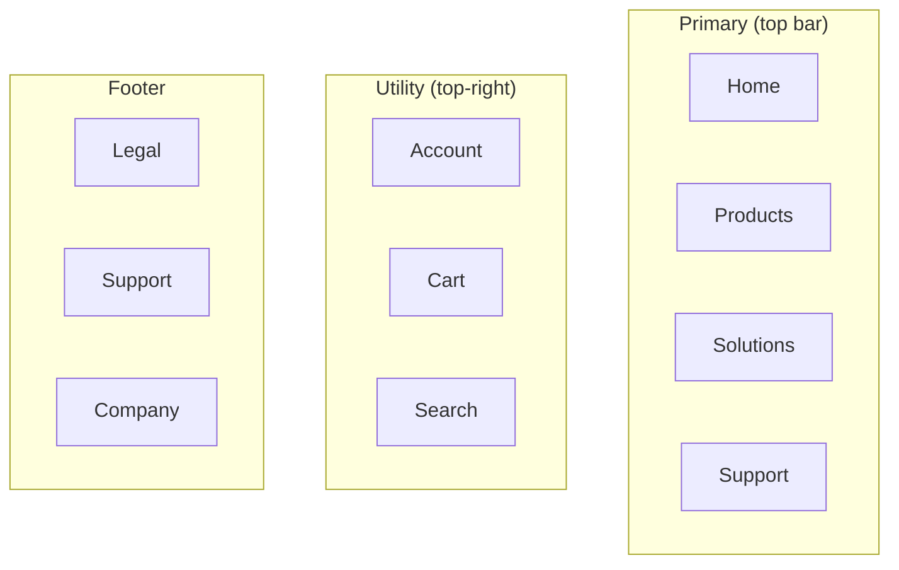

# Navigation Modeling

You design the navigation system for a site or app — the primary way users move between pages / sections / states. Distinct from `site-mapping` (which is the page inventory / hierarchy) — navigation is how the hierarchy is *exposed*.

## Core rules

- **Pattern fits product**: don't default to a mega-menu if 12 pages; don't default to flat if 200 pages
- **Mobile and desktop treated separately**: neither is a resize of the other
- **State behavior explicit**: active / hover / focus / disabled / current-section breadcrumb
- **Accessibility-first**: landmark roles, keyboard navigation, focus order
- **No fabricated navigation items**: work from supplied page inventory / site-map / content

## Input handling

| Dimension | Required | Default |
|---|---|---|
| **Subject** (site / app) | Yes | — |
| **Content scope** (page count or site-map reference) | Yes | — |
| **Platforms** | No | web + mobile |
| **User segments** | No | Single-segment |
| **Existing navigation pattern** | No | Elicit |

## Phase 1 — Setup

```
**Subject**: [name]
**Content scope**: [page count, or `site-mapping` reference]
**Platforms**: [web-desktop / web-mobile / iOS / Android / desktop-app]
**User segments**: [all / admin / end-user / multi-role]
**Breakpoints**: [asked: mobile / tablet / laptop / desktop]
```

Ask render mode per `diagram-rendering` mixin and output path (default: `/documentation/[case]/navigation-modeling/`).

## Phase 2 — Pattern selection

| Pattern | Use when | Example |
|---|---|---|
| **Hub-and-spoke** | Clear home base; few distinct destinations; user returns to home frequently | Mobile OS home screen, marketing site |
| **Hierarchical** (tree / drill-down) | Content has clear parent-child structure | Docs, knowledge bases, catalogs |
| **Flat** | Small site, ≤ 7 top-level areas, all equal importance | Small marketing sites, simple apps |
| **Faceted** (filter-based) | Large content, multi-dimensional search / filter | E-commerce, job boards, libraries |
| **Sequential / wizard** | Linear process (signup, checkout, onboarding) | Forms, setup flows |
| **Hybrid** | Mix of patterns for different sections | Most real-world products |

Declare pattern + rationale. Hybrid is most common in production products.

## Phase 3 — Navigation areas

Design each area (skip if not applicable):

### Primary navigation

- **Location**: top bar (web) / bottom tabs (mobile app) / hamburger drawer (mobile web) / sidebar (app)
- **Items**: 5–7 max for top bar; 3–5 for bottom tabs
- **Labels**: user language (from `taxonomy-design` if available)
- **Max depth before drill-down**: typically 1 (top-level items are destinations or mega-menu triggers)

### Secondary navigation

- **Location**: sub-nav under primary / sidebar / second tier in mega-menu / contextual
- **Triggered by**: primary selection or current-section context
- **Items**: 5–12 typical

### Utility navigation

- **Location**: top-right corner (web) / profile menu (app)
- **Items**: account, settings, help, notifications, sign-out
- **Persistent**: always available regardless of primary selection

### Contextual navigation

- **Location**: within content (breadcrumbs, in-page tabs, "related", "jump to")
- **Triggered by**: current content
- **Items**: page-specific; computed not curated

### Footer navigation

- **Location**: bottom of page
- **Items**: legal, support, company, locale, sitemap
- **Purpose**: low-frequency but universally expected

### Mobile adaptations

| Element | Desktop | Mobile |
|---|---|---|
| Primary | Top bar | Bottom tabs (app) / hamburger (web) |
| Secondary | Sub-nav / sidebar | Drill-down screens or accordions |
| Utility | Top-right profile | Profile tab / hamburger top |
| Search | Persistent in header | Icon → expands to full screen |
| Contextual | Inline | Bottom sheet or drill-down |

## Phase 4 — Per-item spec

Per primary / secondary / utility item:

| Field | Description |
|---|---|
| **ID** | `N-001` |
| **Label** | User-facing text (from taxonomy if available) |
| **Destination** | Page ID (from `site-mapping`) or URL pattern |
| **Icon** (if used) | Semantic meaning |
| **Position** | Order in nav area |
| **Platform scope** | web / mobile / both |
| **Visibility rules** | always / authenticated / role-specific / feature-flag |
| **Active-state trigger** | URL pattern that marks this item active |

## Phase 5 — State behavior

Per navigation item:

| State | Visual + a11y behavior |
|---|---|
| **Default (rest)** | Visible, clickable |
| **Hover** | Visual change; no action |
| **Focus** | Focus ring visible |
| **Active** (current) | Current-section indicator; `aria-current="page"` or `"true"` |
| **Disabled** | Grayed; non-clickable; `aria-disabled` |
| **Loading** (submenus) | Loading indicator where async |

For dropdown / mega-menu:
- Trigger (hover / click / both)
- Open direction
- Close behavior (click-outside / Escape / mouse-leave with grace)
- Keyboard support (Arrow keys to navigate items, Tab to next trigger)

## Phase 6 — Accessibility

| Requirement | How |
|---|---|
| Landmark roles | `<nav aria-label="Primary">`, `<nav aria-label="Footer">` (multiple navs need unique labels) |
| Skip links | Present for keyboard users to bypass primary nav |
| Current page | `aria-current="page"` on active item |
| Keyboard order | Logical tab sequence; sub-nav reachable via keyboard |
| Screen reader announcements | Menu open / close states announced via `aria-expanded` |
| Target size | ≥ 24×24 CSS px (WCAG 2.2) |
| Contrast | ≥ 4.5:1 for text, ≥ 3:1 for focus indicators |

## Phase 7 — Wayfinding signals

Beyond navigation items, how does user know where they are?

- **Breadcrumbs** — for hierarchical > 2 levels deep
- **Active-state indicator** — visual emphasis on current item
- **Page title** (H1) matching nav label — reinforces
- **URL** — reflects hierarchy where possible (see `site-mapping` URL conventions)
- **Progress indicator** — for sequential flows

## Phase 8 — Transitions & persistence

- **Scroll behavior** — sticky primary? collapsing header? always-visible?
- **Session persistence** — remember last-visited sub-nav state?
- **Cross-device** — sync active section on mobile ↔ desktop?
- **Animation** — none (default) / subtle / none-preferred (respect `prefers-reduced-motion`)

## Phase 9 — Diagrams

### 1. Navigation system overview



### 2. Primary nav item pattern

Mermaid flowchart showing hover / dropdown / mega-menu behavior.

### 3. Mobile adaptation

Side-by-side comparison of desktop vs mobile primary nav (flowchart with two columns).

## Phase 10 — Diagram rendering

Per `diagram-rendering` mixin. File names:
- `nav-system.mmd` / `.png`
- `nav-state-behavior.mmd` / `.png`
- `mobile-vs-desktop.mmd` / `.png`

## Phase 11 — Report assembly and approval

```markdown
# Navigation Model: [Subject]

**Date**: [date]
**Subject**: [name]
**Pattern**: [chosen + rationale]
**Platforms**: [list]

## Scope
[Subject, content scope, platforms, segments, breakpoints]

## Pattern Selection
[Rationale]

## Navigation Areas
[Primary / Secondary / Utility / Contextual / Footer — full specs]

## Per-item Specification
[Table: ID / label / destination / position / visibility / active-state]

## State Behavior
[Default / hover / focus / active / disabled / loading per item type]

## Mobile Adaptation
[Desktop vs mobile per area + breakpoint behavior]

## Accessibility
[Landmark roles / skip / aria-current / keyboard / contrast / target]

## Wayfinding Signals
[Breadcrumbs / active state / title / URL / progress]

## Transitions & Persistence
[Scroll / session / cross-device / animation]

## Diagrams
[Nav system + state + mobile-vs-desktop]

## Assumptions & Limitations
[Grounding gaps, platform-specific caveats]
```

Present for user approval. Save only after confirmation.

## Generation + planning rules

- Pattern grounded in content scope (not defaulted)
- Mobile treated as first-class (not just smaller desktop)
- A11y not deferred
- State behavior complete per item type
- No fabricated nav items beyond supplied page inventory

## Failure behavior

| Situation | Behavior |
|---|---|
| No subject or content scope | Interview mode (§7) |
| No site-map available | Work from described page list; flag pages that may be missing |
| Pattern mismatch (e.g., 200 pages, flat nav proposed) | Surface mismatch, recommend alternative |
| Mobile treated as afterthought | Require per-platform spec |
| Missing a11y | Block — require aria-label + keyboard + skip |
| mmdc failure | See `diagram-rendering` mixin |
| Out-of-scope ("build the nav") | "Design only; implementation is engineering." |

## Self-check

```
[] Pattern declared with rationale
[] All applicable nav areas specified (primary / secondary / utility / contextual / footer)
[] Per-item: ID / label / destination / position / visibility / active-state
[] State behavior complete (default / hover / focus / active / disabled / loading)
[] Mobile adaptation per area
[] A11y: landmarks + skip + aria-current + keyboard + contrast + target
[] Wayfinding signals documented
[] Transitions + persistence declared
[] Diagrams valid
[] No fabricated nav items
[] Cross-references to site-mapping / taxonomy-design where applicable
[] Report follows output contract
```
