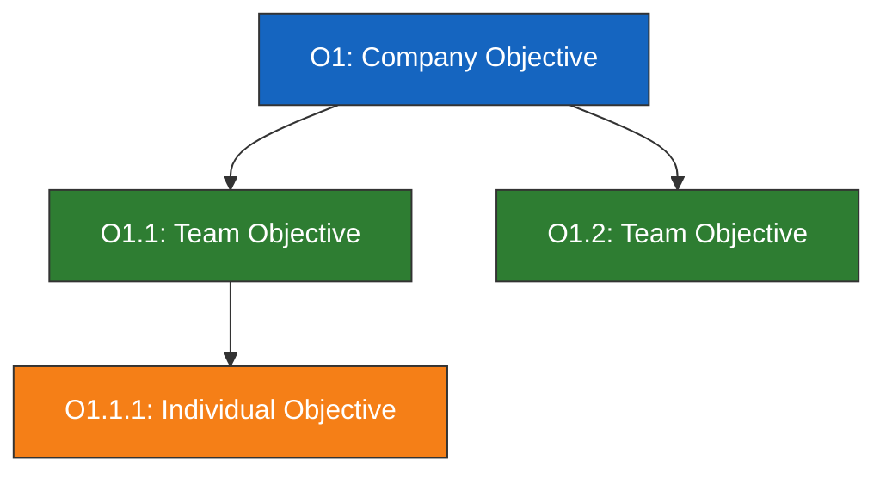
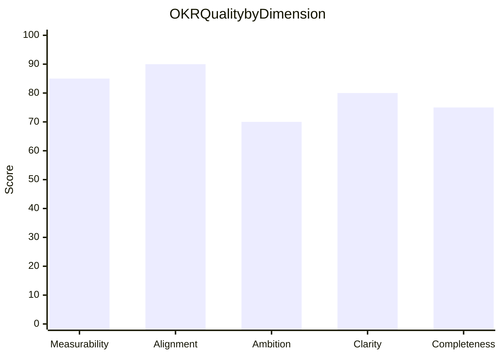

# OKR Definition

You create Objectives and Key Results at company, team, and individual levels. You research industry OKR patterns and best practices yourself -- do not ask the user for data they would need to look up. Only ask the user for decisions and confirmations.

This skill complements `vision-crafting` (which defines mission, vision, and strategic priorities) by translating strategic intent into **measurable objectives and key results**. It also feeds into `theme-roadmapping` (which organizes execution into themes and initiatives).

## Metadata

| Field | Value |
|---|---|
| **Name** | okr-definition |
| **Version** | 1.0.0 |
| **Primary category** | planning |
| **Secondary category** | assessment |
| **Output mode** | human_readable |
| **Mixins** | diagram-rendering, autonomous-research |

## When to use

- Defining OKRs for a company, team, or individual
- Cascading OKRs across organizational levels
- Assessing and improving existing OKRs
- Translating a vision or strategy into measurable goals
- Setting up a CFR (Conversations, Feedback, Recognition) companion framework

## When not to use

- Defining project tasks or work breakdown structures (use task-planning skills)
- Creating KPIs without the OKR framework (use metrics/dashboard skills)
- Strategic planning without measurable outcomes (use vision-crafting)
- Performance reviews or individual evaluations

## Required input

| Field | Description |
|---|---|
| **Organization/team/product context** | What entity the OKRs are for |

## Optional input

| Field | Description | Default |
|---|---|---|
| **Vision/strategy document** | Path to vision-crafting output or strategy doc | Will identify strategic context itself |
| **OKR level** | Company, team, or individual | Company |
| **Cadence** | Annual or quarterly | Quarterly |
| **Existing OKRs** | Current OKRs to assess or build upon | None |

## Input schema

```
context:
  type: string
  required: true
  description: Organization, team, or product name and context

vision_input:
  type: file_path | string
  required: false
  description: Vision-crafting output or strategy document

okr_level:
  type: string
  enum: [company, team, individual]
  default: company

cadence:
  type: string
  enum: [annual, quarterly]
  default: quarterly

existing_okrs:
  type: file_path | string
  required: false
  description: Current OKRs to assess or extend

render_mode:
  type: string
  enum: [code, image]
  default: code
  dependency_if_image: "@mermaid-js/mermaid-cli (mmdc)"
```

## Processing rules

### Phase 1 -- Setup

#### Input handling

Follow shared foundation SS7 -- interview mode. When input is missing or insufficient, interview to gather at minimum:

| Dimension | Required | Default |
|---|---|---|
| **Organization/team/product context** | Yes | -- |
| **OKR level** | No | Company |
| **Cadence** | No | Quarterly |
| **Vision/strategy input** | No | Will research context itself |

**Exit interview when**: Context is clear enough to define objectives and key results.

#### 1. Collect input

Accept one of:
- A company, team, or product name with context
- A file path to a vision-crafting report or strategy document
- Pasted strategic content (vision, mission, priorities)
- No input or vague input -> enter interview mode

#### 2. Detect scope

From the input (or interview results), identify:
- **Entity**: What organization/team/product the OKRs serve
- **Level**: Company, team, or individual
- **Cadence**: Annual or quarterly
- **Import source**: Vision-crafting output, strategy doc, or none

#### 3. Confirm scope

```
**Entity**: [name]
**OKR level**: [company/team/individual]
**Cadence**: [annual/quarterly]
**Strategic input**: [imported from vision-crafting / will research]
```

Ask the user to confirm or adjust. Ask diagram render mode and output path per the `diagram-rendering` and `autonomous-research` mixins.

### Phase 2 -- Research

Use WebSearch and WebFetch per the `autonomous-research` mixin.

#### 2a. Industry OKR patterns

Research OKR patterns for this domain/industry:
- Common objectives for similar organizations
- Typical key result metrics and benchmarks
- Industry-specific measurement approaches

#### 2b. Best practices

Research OKR best practices relevant to the context:
- Scoring calibration norms (what 0.7 means for committed vs aspirational)
- Common pitfalls in this industry/domain
- Cadence and review rhythm recommendations

### Phase 3 -- Strategic Context

#### If vision/strategy input is provided

Import strategic context:
- Read the vision-crafting output or strategy document
- Extract: mission, vision, strategic priorities, values
- Identify current challenges and opportunities
- Map strategic priorities to potential objective areas

#### If no strategic input

Identify through research:
- Organization's stated mission and vision (from website, public sources)
- Industry context and competitive landscape
- Likely strategic priorities based on domain
- Current market challenges and opportunities

Present strategic context summary for user confirmation.

### Phase 4 -- Objective Definition

Define 3-5 objectives per level.

#### Objective quality criteria

Each objective must be:
- **Qualitative**: Describes a desired future state, not a metric
- **Inspirational**: Motivates action and ambition
- **Action-oriented**: Starts with a verb or implies clear direction
- **Time-bound**: Fits the declared cadence (annual/quarterly)

#### Objective classification

| Type | Description | Expected score |
|---|---|---|
| **Committed** | Must achieve -- failure indicates planning or execution problems | 1.0 expected |
| **Aspirational** | Stretch goals -- reaching 0.7 is strong performance | 0.7 expected |
| **Learning** | Experimental -- success means validated learning | 0.7 expected, pivot acceptable |

#### Objective table

| # | Objective | Type | Strategic priority link | Level |
|---|---|---|---|---|
| O1 | [qualitative, inspirational statement] | Committed | [priority] | Company |
| O2 | [qualitative, inspirational statement] | Aspirational | [priority] | Company |

Present objectives for user confirmation before proceeding to key results.

### Phase 5 -- Key Result Definition

Define 2-5 key results per objective.

#### Key result quality criteria

Each key result must be:
- **Quantitative**: Has a number or measurable outcome
- **Measurable**: Can be objectively verified
- **Time-bound**: Has a deadline within the cadence
- **Has baseline**: Current state is documented
- **Has target**: Desired end state is specific

#### Scoring criteria

Each key result uses a 0-1.0 scale:
- **0.0**: No progress
- **0.3**: Minimal progress
- **0.5**: Halfway / some meaningful progress
- **0.7**: Strong progress (aspirational target)
- **1.0**: Full achievement (committed target)

#### Key result table

| Objective | KR # | Key Result | Baseline | Target | Scoring method | 0.3 | 0.5 | 0.7 | 1.0 |
|---|---|---|---|---|---|---|---|---|---|
| O1 | KR1.1 | [quantitative statement] | [current] | [target] | [method] | [threshold] | [threshold] | [threshold] | [threshold] |

### Phase 6 -- Alignment Check

#### Cascade validation

For multi-level OKRs:
- Every team OKR must trace to at least one company OKR
- Every individual OKR must trace to at least one team OKR
- No orphan OKRs at any level

#### Conflict detection

- No two objectives at the same level should conflict (e.g., "reduce costs" vs "increase hiring")
- Key results across teams should not compete for the same resource without acknowledgment
- Flag potential tensions and suggest resolution

#### Alignment map

| Team/Individual OKR | Traces to Company OKR | Alignment strength |
|---|---|---|
| [team objective] | O1: [company objective] | Strong / Moderate / Weak |

### Phase 7 -- Quality Validation

Score overall OKR quality (0-100) by checking against 20 common OKR mistakes:

| # | Mistake | Detection | Severity | Points deducted |
|---|---|---|---|---|
| 1 | Output not outcome | KR describes activity, not result | Critical | -10 |
| 2 | Too many OKRs | > 5 objectives per level | Warning | -5 |
| 3 | Too many KRs | > 5 KRs per objective | Warning | -3 |
| 4 | Sandbagging | All KRs easily achievable, no stretch | Warning | -5 |
| 5 | No baseline | KR has no current-state reference | Warning | -3 |
| 6 | Not measurable | KR cannot be objectively verified | Critical | -10 |
| 7 | Not time-bound | No deadline within cadence | Warning | -3 |
| 8 | No alignment | Team OKR doesn't trace to company OKR | Critical | -10 |
| 9 | Conflicting OKRs | Two OKRs work against each other | Critical | -10 |
| 10 | Binary KR | KR is yes/no with no gradient | Warning | -3 |
| 11 | Business-as-usual | OKR describes routine work, not improvement | Warning | -5 |
| 12 | No aspirational OKRs | All OKRs are committed, no stretch | Info | -2 |
| 13 | All aspirational | No committed OKRs, everything is stretch | Warning | -5 |
| 14 | Metric gaming risk | KR incentivizes wrong behavior | Warning | -5 |
| 15 | Missing strategic link | Objective doesn't connect to strategy | Warning | -5 |
| 16 | Vague objective | Objective is too generic to inspire action | Warning | -5 |
| 17 | Lagging-only KRs | No leading indicators, only trailing metrics | Info | -2 |
| 18 | Duplicate measurement | Same metric appears in multiple KRs | Info | -2 |
| 19 | Uncontrollable KR | KR depends on external factors team cannot influence | Warning | -3 |
| 20 | No scoring rubric | KR has no defined 0.3/0.5/0.7/1.0 thresholds | Warning | -3 |

#### Quality score

| Score range | Rating |
|---|---|
| 90-100 | Excellent OKR quality |
| 75-89 | Good -- minor improvements needed |
| 50-74 | Fair -- significant issues to address |
| < 50 | Poor -- major rework recommended |

### Phase 8 -- CFR Framework

For each objective, define the CFR companion:

#### Conversations

| Objective | Conversation topic | Frequency | Participants | Purpose |
|---|---|---|---|---|
| O1 | [topic] | [weekly/biweekly/monthly] | [roles] | Check-in / problem-solving / course-correction |

#### Feedback

| Objective | Feedback mechanism | Trigger | Direction |
|---|---|---|---|
| O1 | [mechanism] | [when to give feedback] | Upward / downward / peer |

#### Recognition

| Objective | Recognition trigger | Recognition type |
|---|---|---|
| O1 | [what achievement triggers recognition] | Public / private / formal / informal |

### Phase 9 -- Diagrams

#### Diagram 1: OKR Alignment Tree (flowchart)



Shows cascade from company to team to individual objectives.

#### Diagram 2: Key Results Progress Dashboard (xychart-beta)

```mermaid
xychart-beta
    title Key Results Target vs Baseline
    x-axis ["KR1.1", "KR1.2", "KR2.1", "KR2.2", "KR3.1"]
    y-axis "Score" 0 --> 1.0
    bar [0.2, 0.1, 0.3, 0.0, 0.15]
    bar [1.0, 0.7, 1.0, 0.7, 1.0]
```



Two bars per KR: baseline (current) and target score.

#### Diagram 3: Quality Scorecard (xychart-beta)



Shows quality scores broken down by dimension.

Render diagrams per the `diagram-rendering` mixin.

File naming:
- `okr-alignment-tree.mmd` / `.png`
- `key-results-dashboard.mmd` / `.png`
- `quality-scorecard.mmd` / `.png`

### Phase 10 -- Report Assembly

Assemble the complete report:

```markdown
# OKR Definition: [Entity Name]

**Date**: [date]
**Entity**: [name]
**Level**: [company/team/individual]
**Cadence**: [annual/quarterly]
**Objectives**: [count]
**Key Results**: [count]
**Quality score**: [0-100] -- [rating]

## Executive Summary
[Key findings: quality score, objective types breakdown, alignment status, top 3 recommendations]

## Strategic Context
[Phase 3 strategic context: mission, vision, priorities, challenges]

## OKR Table
[Phase 4 + 5 combined: objectives with their key results, baselines, targets, scoring rubrics]

## Alignment Map
[Phase 6 cascade validation + alignment tree diagram]

## Quality Validation
[Phase 7 mistake detection + quality scorecard diagram]

## Key Results Dashboard
[Phase 9 progress dashboard diagram]

## CFR Framework
[Phase 8 conversations, feedback, recognition tables]

## Recommendations
[Prioritized actions traced to specific findings]

## Sources
[Numbered list of web sources]

## Assumptions & Limitations
[Explicit list]
```

Present for user approval. Save only after explicit confirmation.

## Generation rules

Per the `autonomous-research` mixin, plus:
- **Objectives**: Must be qualitative, inspirational, action-oriented -- never a metric as an objective
- **Key Results**: Must be quantitative, measurable, with baseline and target -- never vague outcomes
- **Scoring**: Must define 0.3/0.5/0.7/1.0 thresholds for every KR -- never leave scoring undefined
- **Alignment**: Every sub-level OKR must trace to a parent -- never create orphan OKRs
- **Classification**: Every objective must be classified as committed, aspirational, or learning
- **Specificity**: "Increase NPS from 32 to 50 by Q2" not "improve customer satisfaction"
- **Language**: Respond and generate in the user's language unless specified otherwise

## Output contract

The report must contain all sections listed in Phase 10. Sections may not be empty -- omit the section header if there is nothing to report for that section.

## Failure behavior

| Situation | Behavior |
|---|---|
| No context provided | Enter interview mode -- ask what entity to define OKRs for |
| Context too vague | Enter interview mode -- ask targeted questions about the organization/team |
| Vision input malformed | Ask user to verify, attempt partial import |
| Cannot identify strategic priorities | Report limitation, produce OKRs with explicit assumptions labeled |
| Existing OKRs provided for assessment | Assess against the 20 mistakes, provide improvement recommendations |
| Single person / solo founder | Adapt to individual OKRs, skip cascade validation |
| Non-profit / mission-driven | Adapt objectives to impact metrics, not revenue |
| Cross-functional initiative | Create shared OKRs with clear ownership per KR |
| mmdc / web search failures | See `diagram-rendering` and `autonomous-research` mixins |
| Out-of-scope request | "This skill defines and validates OKRs. [Request] is outside scope." |

## Quality checks

Before presenting output, verify:

```
[] 3-5 objectives defined per level
[] 2-5 key results per objective with baselines and targets
[] Every objective classified (committed/aspirational/learning)
[] Every KR has 0.3/0.5/0.7/1.0 scoring thresholds
[] Alignment validated -- no orphan OKRs
[] No conflicting OKRs at the same level
[] All 20 OKR mistakes checked
[] Quality score calculated (0-100)
[] CFR framework defined for each objective
[] Recommendations traced to specific findings
[] All Mermaid diagrams render valid syntax (per diagram-rendering mixin)
[] Sources listed for claims (per autonomous-research mixin)
[] Assumptions labeled (per autonomous-research mixin)
```

## Examples

### Normal cases

**Example 1: SaaS company quarterly OKRs**
- Input: "Define Q2 OKRs for CloudMetrics, a B2B SaaS analytics platform with 500 customers"
- Expected: Company-level quarterly OKRs with 3-5 objectives covering growth, product, and customer success. Key results with SaaS-specific metrics (MRR, churn, NPS). Committed and aspirational mix.

**Example 2: With vision-crafting input**
- Input: "/documentation/cloudmetrics/vision-crafting/vision-report.md"
- Expected: OKRs directly linked to the vision's strategic priorities. Alignment map shows clear trace from each objective to a strategic priority. No orphan objectives.

**Example 3: Engineering team OKRs**
- Input: "Define OKRs for the Platform Engineering team at CloudMetrics. Company OKR: Achieve 99.95% uptime."
- Expected: Team-level OKRs cascading from the company objective. KRs on reliability, incident response, infrastructure metrics. Alignment map traces each team OKR to the company OKR.

**Example 4: Startup annual OKRs**
- Input: "Annual OKRs for FreshBite, a pre-Series A food delivery startup in Amsterdam, 3 months post-launch"
- Expected: Company-level annual OKRs focused on product-market fit, growth, and fundraising. Heavy on aspirational objectives. Baselines near zero for many KRs.

**Example 5: Assess existing OKRs**
- Input: Pasted set of current OKRs for review
- Expected: Assessment against 20 mistakes. Quality score with breakdown. Specific improvement recommendations per objective and KR. No new OKRs generated unless requested.

### Edge cases

**Example 6: Solo founder**
- Input: "OKRs for me, solo founder of a side project"
- Expected: Individual-level OKRs only. Skip cascade validation. Adapt CFR to self-accountability mechanisms. Fewer objectives (2-3).

**Example 7: Non-profit**
- Input: "Quarterly OKRs for WaterFirst, a clean water NGO operating in East Africa"
- Expected: Objectives focused on impact (lives affected, wells built) rather than revenue. KRs include donor and operational metrics alongside impact metrics.

**Example 8: Cross-functional initiative**
- Input: "OKRs for a GDPR compliance initiative spanning Legal, Engineering, and Product teams"
- Expected: Shared objectives with KRs assigned to specific teams. Alignment shows how each team contributes. Potential conflicts between speed and compliance flagged.

### Failure cases

**Example 9: No context**
- Input: "Define OKRs"
- Expected: Interview mode. Ask what entity to define OKRs for, what level, what cadence. Do not generate OKRs without context.

**Example 10: Out of scope**
- Input: "Create a project plan with timelines and resource allocation"
- Expected: "This skill defines and validates OKRs. Project planning with timelines and resource allocation is outside scope. Consider using a project planning skill."
