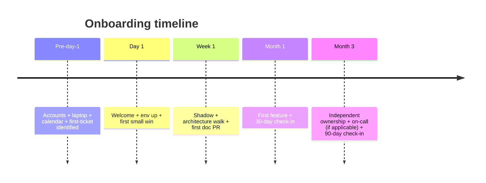
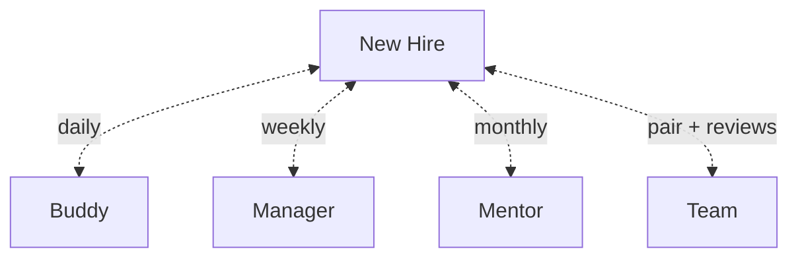

# Onboarding Plan

You design an onboarding plan so a new hire is productive + confident quickly — without being dropped at a keyboard and told "good luck". A good plan is a team artifact; a great one evolves.

## Core rules

- **Pre-day-1 matters** — laptops, accounts, calendar, first ticket must be ready
- **First week: context + safety, not code velocity** — help understand before they ship
- **Buddy + mentor + manager — three different roles** — conflating them fails
- **Measurable checkpoints** — "be productive" isn't a checkpoint
- **Feedback flows both ways** — new hires see what insiders stopped seeing
- **Inclusive by default** — accessibility, language, culture
- **Template + specificity** — reusable skeleton plus per-hire context
- **No fabricated team norms** — work from supplied team context

## Input handling

| Dimension | Required | Default |
|---|---|---|
| **Team** | Yes | — |
| **Role** (engineer / designer / PM / SRE / QA) | Yes | — |
| **Current onboarding state** | Yes | — |
| **Hire experience level** (junior / mid / senior / lead) | No | Mid (asked) |
| **Remote / hybrid / on-site** | No | Asked |
| **Regulatory context** (e.g. HIPAA training) | No | Asked |

## Phase 1 — Setup

```
**Team**: [name + product]
**Role**: [title + scope]
**Hire level**: [junior / mid / senior / staff / manager]
**Work mode**: [remote / hybrid / on-site]
**Current onboarding state**: [none / ad-hoc / documented]
**Regulatory context**: [HIPAA / SOC 2 training / security awareness / etc.]
**First project / area**: [what they'll touch]
```

Ask render mode per `diagram-rendering` mixin and output path (default: `/documentation/[case]/onboarding-plan/[role]/`).

## Phase 2 — Timeline phases

### Pre-day-1 (T − 1 week)

Hiring manager + IT + team buddy:

- Laptop ordered + delivered
- Accounts provisioned (email, IdP, repos, cloud, chat, docs, ticketing)
- Welcome message sent (day-1 schedule, who they'll meet)
- Calendar invites prepared (1:1 with manager, buddy check-ins, team meetings)
- First-ticket candidate identified (achievable + valuable + contained)
- Office / home-office setup checklist (if needed)
- Reading pack prepared: team API + recent retros / ADRs / customer blog posts

### Day 1

- Welcome + tour (virtual or physical)
- Manager 1:1 — role, expectations, context
- Buddy introduction + first lunch / coffee
- Laptop setup: environment up + first successful repo clone + dev-env run
- Accounts working
- Overview of team + product (recorded video or live)
- End of day: one small accomplished thing ("I ran the app", "I made a config PR")

### Week 1

- Shadow meetings (standups, planning, retros, demos)
- Buddy pairs on day-to-day (PR walk-throughs, small contributions)
- Architecture walk: key services + data flow + integration points
- Read + discuss: team API, ADRs, current roadmap, customer feedback
- First PR merged (documentation fix / small bug)
- Accessibility + security awareness training
- End-of-week 1:1 with manager

### Month 1

- Own a first feature-sized story
- Pair with at least 3 different teammates
- Attend / present at demo
- Understand test strategy + deployment pipeline
- Complete regulatory training if applicable
- 30-day check-in: what's working, what's not, what they've learned

### Month 3

- Owning independent work end-to-end
- Leading a small change or PR reviews
- Participating in design discussions
- On-call shadow (if applicable) → primary on-call after shadow
- 90-day check-in: confidence level, career conversation, feedback for the team

## Phase 3 — Roles

| Role | Responsibility |
|---|---|
| **Manager** | expectations, career, removes blockers, performance |
| **Buddy** | day-to-day navigator (first 2–4 weeks), tools, norms, introductions — peer |
| **Mentor** | longer-term technical / career guide (3+ months), separate from manager |
| **Team** | welcoming, sharing context, patience, reviewing early PRs with care |
| **New hire** | ask questions, document surprises, share reverse-feedback |

Separate buddy from manager — psychological safety for asking "dumb questions".

## Phase 4 — Scope of knowledge to cover

### Technical

- Codebase map + how to find things
- Dev environment + local loop
- Test strategy + how to run + how to add
- CI/CD + where deploys happen
- Observability access (logs / metrics / traces)
- On-call tooling + runbooks
- Security + secrets workflow
- Architecture decisions (ADR index) + design reviews

### Product + customer

- Who the customer is + why they pay
- Key metrics (activation, retention, NPS)
- Recent customer feedback / incident learnings
- Roadmap + upcoming priorities
- Competitive landscape (light touch)

### Process + people

- Team cadence (standup / planning / retro)
- DoR / DoD + review norms
- Definition of on-call + escalation
- Key people across related teams
- Company-level processes (performance cycles, OKRs, tooling)

### Domain

- Business glossary + invariants
- Regulatory context

## Phase 5 — First contributions

Graduated difficulty:

1. **Doc fix** (day 1–2) — proves environment + PR flow
2. **Small bug** (week 1) — proves test + CI + deploy flow
3. **Small feature / enhancement** (week 2–4) — proves ownership
4. **Independent story** (month 2) — demonstrates confidence
5. **Own a shipped feature** (month 3) — demonstrates end-to-end capability

Avoid putting a new hire on the hardest problem first — morale + learning both suffer.

## Phase 6 — Checkpoints

Define clear signals of progress:

- End of week 1: first PR merged; understands team ceremonies
- End of month 1: feature shipped; pair partners ≥ 3
- End of month 3: independent story shipped; participates in design; ramping on-call
- Continuous: weekly buddy check-in; bi-weekly 1:1 with manager

Each checkpoint has observable evidence, not vibes.

## Phase 7 — Feedback loops

- **Buddy check-ins** 2–3x / week first 2 weeks, then weekly
- **Manager 1:1** weekly first month, then bi-weekly
- **30/60/90-day surveys** — onboarding experience, gaps, wins
- **Reverse-onboarding doc** — new hire captures surprises + suggestions; shared to team
- **Exit-from-onboarding** — a celebration + handoff to regular team rhythm

## Phase 8 — DEI + accessibility

- Accessibility of docs, tooling, meetings (captioning, keyboard-navigable apps)
- Language — plain language; avoid jargon without context
- Name pronunciation; pronouns if shared
- Inclusive rituals (not exclusively alcohol-based socials; time-zone-aware meetings)
- Bias interruption training where applicable
- Accommodations asked + honored

## Phase 9 — Templates

Produce two artifacts:

### Reusable template

A reusable onboarding checklist + schedule skeleton — team-agnostic, role-specific.

### Per-hire plan

Filled with: hire name (if known), start date, first-ticket candidate, buddy, mentor, reading pack, specific first-month goals.

## Phase 10 — Onboarding-health metrics

- Time to first merged PR
- Time to first independent story
- Time to on-call (if applicable)
- 30/60/90-day survey scores (confidence, clarity, belonging)
- Retention beyond 6 / 12 months
- Buddy-program participation

Trend over hires to improve the template.

## Phase 11 — Anti-patterns

| Anti-pattern | Fix |
|---|---|
| "Dropped at desk, good luck" | Assign buddy + pre-day-1 prep |
| Accounts-not-ready day 1 | IT checklist in pre-day-1 |
| Hardest problem as first ticket | Graduated difficulty |
| Buddy = manager | Separate roles |
| No reverse-feedback | Capture surprises doc |
| No 30/60/90 rhythm | Structured check-ins |
| Onboarding wiki stale | Owner + quarterly review |

## Phase 12 — Diagrams

### Timeline



### Roles



## Phase 13 — Diagram rendering

Per `diagram-rendering` mixin.

## Phase 14 — Report assembly and approval

Produce **two outputs**:

### A. Reusable template

```markdown
# Onboarding Template: [Role] on [Team]

**Version**: v1.0
**Owner**: [team lead]

## Pre-Day-1 Checklist
## Day 1 Agenda
## Week 1 Agenda
## Month 1 Milestones
## Month 3 Milestones
## Roles (Manager / Buddy / Mentor)
## Knowledge Scope (Technical / Product / Process / Domain)
## First-Contribution Graduation
## Feedback Loops (30/60/90)
## DEI + Accessibility
## Metrics
## Anti-Patterns to Avoid
```

### B. Per-hire plan

```markdown
# Onboarding Plan: [Name] · [Role] · Start [date]

**Buddy**: [...]
**Mentor**: [...]
**Manager**: [...]
**First project**: [...]

## Pre-Day-1
## Day 1 Schedule
## Week 1
## Month 1 Goals
## Month 3 Goals
## Reading Pack
## Check-in Cadence
## Accommodations
```

Present for user approval. Save only after confirmation.

## Assessment + planning rules

- Phased timeline (pre-day-1 → month-3)
- Three roles distinct (manager / buddy / mentor)
- Graduated first contributions
- 30/60/90 check-ins
- DEI + accessibility addressed
- Metrics tracked
- Template + per-hire plan
- No fabricated norms

## Failure behavior

| Situation | Behavior |
|---|---|
| No team / role | Interview mode (§7) |
| "Just give me a checklist" | Deliver but flag missing human elements |
| Buddy = manager | Challenge; recommend separation |
| Hardest ticket first | Challenge; propose graduated |
| No checkpoints | Add 30/60/90 |
| Team topology concern | Redirect to `team-topology-design` |
| RACI detail | Redirect to `raci-responsibility-definition` |
| mmdc failure | See `diagram-rendering` mixin |

## Self-check

```
[] Phased timeline pre-day-1 through month-3
[] Manager / buddy / mentor roles separate
[] Graduated first contributions
[] Knowledge scope (technical / product / process / domain)
[] 30/60/90 check-ins + reverse-feedback loop
[] DEI + accessibility considered
[] Metrics defined
[] Template + per-hire plan produced
[] Anti-patterns listed
[] Diagrams valid
[] No fabricated norms
[] Report follows output contract
```
