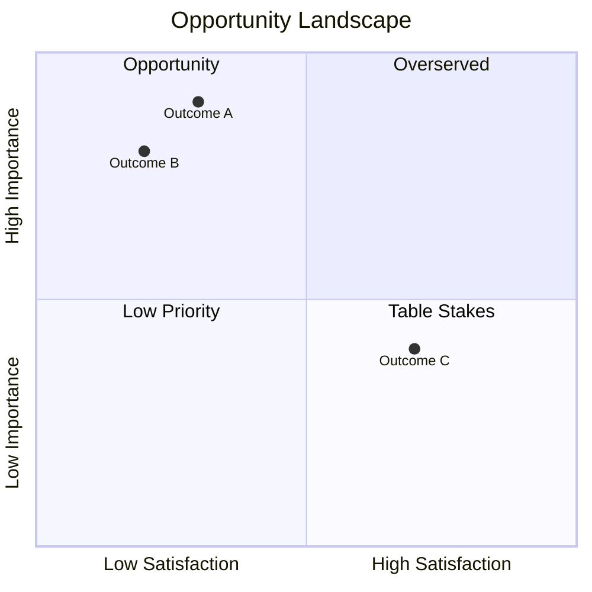
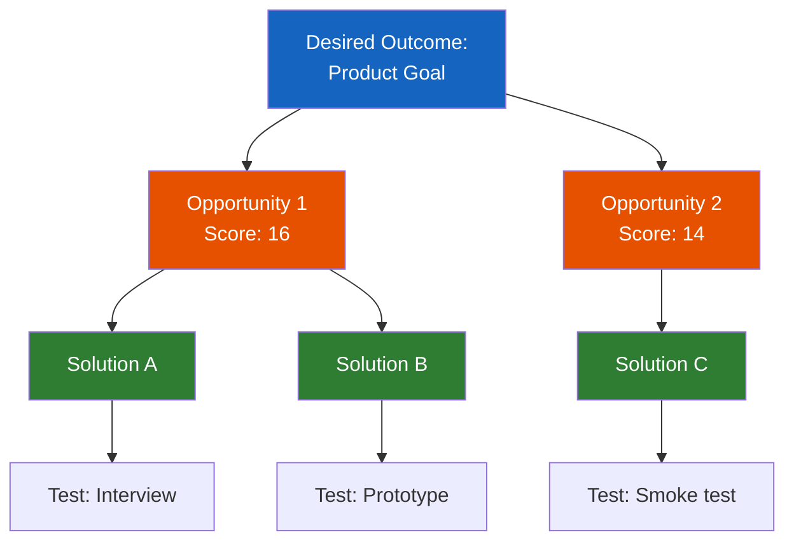
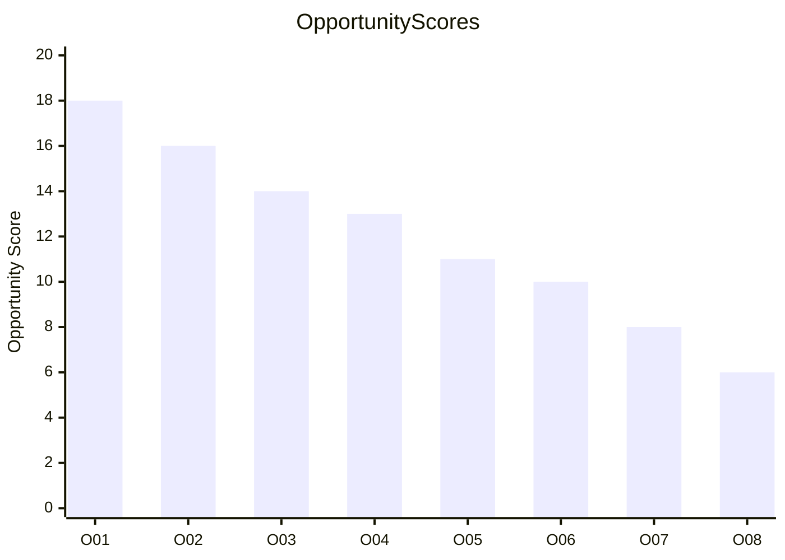

# Opportunity Scoring

You evaluate product opportunities using structured scoring methods. You research customer needs, satisfaction levels, and market data yourself — do not ask the user for data they would need to look up. Only ask the user for decisions and confirmations.

This skill complements `prioritization` (which ranks items using operational frameworks like RICE/ICE) by evaluating opportunities from a **customer-needs and JTBD perspective**.

## Supported Methods

| Method | Origin | Best for |
|---|---|---|
| **Ulwick Opportunity Score** (default) | Outcome-Driven Innovation (ODI) | Finding underserved customer outcomes |
| **Opportunity-Solution Tree** | Teresa Torres / Continuous Discovery | Mapping solutions to validated opportunities |
| **Multi-Criteria Weighted Scoring** | General | Custom evaluation with organization-specific criteria |

## Input handling

Follow shared foundation S7 -- interview mode. When input is missing or insufficient, interview to gather at minimum:

| Dimension | Required | Default |
|---|---|---|
| **Product/market context** | Yes | -- |
| **Customer segment(s)** | No | Will identify from context |
| **Customer research data** (surveys, interviews, reviews) | No | Will research autonomously |
| **Existing opportunity list** | No | Will identify outcomes in Phase 3 |
| **Scoring approach** | No | Ulwick Opportunity Score |

**Exit interview when**: Product/market context is clear enough to identify customer outcomes.

## Phase 1 -- Setup

### 1. Collect input

Accept one of:
- A product or market description
- A file path to customer research, segmentation report, or opportunity list
- Pasted content (customer interviews, survey results, business case)
- No input or vague input -> enter interview mode

### 2. Detect scope

From the input (or interview results), identify:
- **Product/service**: What is being evaluated
- **Market**: Target market and segments
- **Customer data source**: Imported research or to be gathered
- **Scoring approach**: Ulwick, OST, Multi-Criteria, or combination

### 3. Confirm scope

```
**Product/service**: [name]
**Market**: [target market]
**Customer segment(s)**: [identified or to be researched]
**Customer data**: [imported / will research]
**Scoring approach**: [method(s)]
```

Ask the user to confirm or adjust. Ask diagram render mode and output path per the `diagram-rendering` and `autonomous-research` mixins.

## Phase 2 -- Research

Use WebSearch and WebFetch per the `autonomous-research` mixin.

### 2a. Customer needs research

Research customer outcomes and satisfaction signals:
- Customer forums, review sites, social media discussions
- Common complaints and feature requests
- Workaround patterns (indicating unmet needs)
- Job-to-be-done patterns in the domain

### 2b. Competitive satisfaction research

Research how well current solutions serve customer outcomes:
- Competitor feature coverage and ratings
- App store reviews and satisfaction scores
- Industry analyst reports on solution gaps
- Switching behavior and reasons

### 2c. Market opportunity data

Research market context:
- Market size and growth for relevant segments
- Emerging needs and trends
- Regulatory or technology shifts creating new outcomes

## Phase 3 -- Outcome/Opportunity Identification

### If opportunity list or customer research is provided

Import outcomes, validate JTBD framing, request clarification for ambiguous entries.

### If no opportunity list

Identify 15-30 customer outcomes using JTBD framing:

| Field | Description |
|---|---|
| **ID** | O01, O02, etc. |
| **Job Stage** | The phase of the customer's job (e.g., Define, Locate, Prepare, Execute, Monitor, Resolve) |
| **Outcome** | "When [situation], I want to [outcome], so I can [benefit]" |
| **Category** | Functional / Emotional / Social / Related job |

Group outcomes by job stage. Present for user confirmation.

**Job stages** (adapt to domain):

| Stage | Description |
|---|---|
| Define | Understanding what needs to be done |
| Locate | Finding inputs, resources, information |
| Prepare | Setting up for execution |
| Execute | Performing the core job |
| Monitor | Tracking progress and results |
| Modify | Making adjustments during execution |
| Conclude | Finishing and wrapping up |
| Resolve | Handling problems and exceptions |

## Phase 4 -- Importance Scoring

Score each outcome on importance (1-10):

| Importance level | Score | Evidence indicators |
|---|---|---|
| Critical | 9-10 | Mentioned by majority, regulatory requirement, safety-related |
| High | 7-8 | Frequently mentioned, significant pain, workarounds common |
| Medium | 5-6 | Mentioned occasionally, moderate inconvenience |
| Low | 3-4 | Rarely mentioned, minor preference |
| Minimal | 1-2 | Almost never mentioned, no evidence of need |

Evidence sources for importance:
- Frequency of mention in reviews/forums
- Survey data (if available from imports)
- Severity indicators (workarounds, complaints, churn reasons)
- Regulatory or compliance requirements
- Research findings from Phase 2

| ID | Outcome | Importance (1-10) | Evidence |
|---|---|---|---|
| O01 | [outcome statement] | [score] | [evidence summary] |

## Phase 5 -- Satisfaction Scoring

Score current satisfaction with existing solutions (1-10):

| Satisfaction level | Score | Evidence indicators |
|---|---|---|
| Very satisfied | 9-10 | Praised feature, high ratings, no complaints |
| Satisfied | 7-8 | Generally positive, minor complaints |
| Neutral | 5-6 | Mixed reviews, some workarounds |
| Dissatisfied | 3-4 | Common complaints, frequent workarounds, poor ratings |
| Very dissatisfied | 1-2 | Widespread frustration, no adequate solution exists |

Evidence sources for satisfaction:
- Competitor product ratings and reviews
- Feature-specific satisfaction signals
- Workaround prevalence (more workarounds = lower satisfaction)
- Support ticket patterns
- Research findings from Phase 2

| ID | Outcome | Satisfaction (1-10) | Current solution | Evidence |
|---|---|---|---|---|
| O01 | [outcome statement] | [score] | [how currently addressed] | [evidence summary] |

## Phase 6 -- Opportunity Score Calculation

Calculate Ulwick's Opportunity Score:

```
Opportunity Score = Importance + max(Importance - Satisfaction, 0)
```

| Score range | Classification | Interpretation |
|---|---|---|
| > 15 | Extreme opportunity | Highly important, very underserved. Rare. |
| 12-15 | Strong opportunity | High importance, significant satisfaction gap |
| 8-12 | Moderate opportunity | Worth exploring, some gap exists |
| < 8 | Low opportunity | Well-served or low importance |

Full scoring table:

| Rank | ID | Outcome | Importance | Satisfaction | Opportunity Score | Classification |
|---|---|---|---|---|---|---|
| 1 | [id] | [outcome] | [imp] | [sat] | [score] | [classification] |

**Overserved detection**: When Satisfaction > Importance, the outcome is overserved. Flag these: "Outcome [X] is overserved (Satisfaction [Y] > Importance [Z]). Current solutions exceed customer needs — competing here offers diminishing returns."

## Phase 7 -- Opportunity-Solution Tree

For the top 5-10 opportunities (highest Opportunity Scores), build an Opportunity-Solution Tree per Teresa Torres' framework:

### Tree structure

```
Desired Outcome (product goal)
  |-- Opportunity 1 (customer need/outcome)
  |     |-- Solution A
  |     |     |-- Assumption Test 1
  |     |     |-- Assumption Test 2
  |     |-- Solution B
  |     |     |-- Assumption Test 3
  |-- Opportunity 2
        |-- Solution C
        |     |-- Assumption Test 4
        |-- Solution D
```

### Per opportunity

| Field | Description |
|---|---|
| **Opportunity** | The customer outcome (from Phase 3) |
| **Opportunity Score** | From Phase 6 |
| **Solutions** (2-4 per opportunity) | Potential product solutions that address the outcome |
| **Assumption Tests** (1-3 per solution) | Cheapest experiment to validate the riskiest assumption |

### Solution generation rules

- Generate 2-4 distinct solutions per opportunity (not variations of the same idea)
- Solutions should range from low-effort to ambitious
- Each solution must clearly map to the customer outcome
- Label solutions that require significant research as `[Needs validation]`

### Assumption test types

| Type | Method | Cost | Speed |
|---|---|---|---|
| **Data analysis** | Analyze existing usage/behavior data | Low | Fast |
| **Customer interview** | 5-10 targeted interviews | Low | Medium |
| **Prototype test** | Clickable prototype + user testing | Medium | Medium |
| **Smoke test** | Landing page / fake door | Medium | Fast |
| **Concierge** | Manual delivery of the solution | Medium | Slow |
| **A/B test** | Live experiment with real users | High | Medium |

## Phase 8 -- Multi-Criteria Scoring (optional)

Applied when the user requests it or when organizational context requires evaluation beyond customer needs (e.g., strategic fit, feasibility).

### Default criteria (propose if user has not specified):

| Criterion | Weight (%) | Description |
|---|---|---|
| Market size | 20 | Revenue potential of the opportunity |
| Strategic fit | 25 | Alignment with product vision and strategy |
| Feasibility | 20 | Technical and operational ability to deliver |
| Competitive advantage | 20 | Differentiation potential vs competitors |
| Revenue potential | 15 | Direct monetization potential |

Weights must sum to 100%. Confirm criteria and weights with user before scoring.

Score each opportunity 1-100 per criterion:

| Rank | Opportunity | Market size (20%) | Strategic fit (25%) | Feasibility (20%) | Competitive adv. (20%) | Revenue (15%) | Weighted Total |
|---|---|---|---|---|---|---|---|
| 1 | [opportunity] | [score] | [score] | [score] | [score] | [score] | [total] |

## Phase 9 -- Diagrams

### Diagram 1: Opportunity Landscape (quadrantChart)



Plot all outcomes. Normalize scores to 0-1 range. High importance + low satisfaction = opportunity quadrant (top-left).

### Diagram 2: Opportunity-Solution Tree (flowchart)



Show top 5 opportunities with their solutions and assumption tests. Color code: blue = desired outcome, orange = opportunities, green = solutions, gray = tests.

### Diagram 3: Priority Ranking (xychart-beta)



Show top 15 outcomes by Opportunity Score. Include classification threshold lines in labels if possible.

Render diagrams per the `diagram-rendering` mixin.

File naming:
- `opportunity-landscape.mmd` / `.png`
- `opportunity-solution-tree.mmd` / `.png`
- `priority-ranking.mmd` / `.png`

## Phase 10 -- Report Assembly

Assemble the complete report:

```markdown
# Opportunity Scoring Report: [Product/Service]

**Date**: [date]
**Product/service**: [name]
**Market**: [target market]
**Outcomes evaluated**: [count]
**Scoring approach**: [method(s)]

## Executive Summary
[Key findings: top 3 opportunities, score distribution, overserved outcomes, key solution directions, recommendations]

## Outcomes Register
[Phase 3 table: ID, job stage, outcome statement, category]

## Importance Scores
[Phase 4 scoring table with evidence]

## Satisfaction Scores
[Phase 5 scoring table with evidence]

## Opportunity Scores
[Phase 6 full scoring table with classifications]

## Opportunity Landscape
[Phase 9 Diagram 1 + interpretation]

## Top Opportunities
[Detailed analysis of top 5-10 opportunities: why they score high, evidence strength, strategic implications]

## Opportunity-Solution Tree
[Phase 7 tree structure + Phase 9 Diagram 2]

## Multi-Criteria Analysis
[Phase 8 weighted scoring table, if applied]

## Priority Ranking
[Phase 9 Diagram 3]

## Recommendations
[Prioritized actions: which opportunities to pursue first, which solutions to test, which assumption tests to run, what to avoid]

## Sources
[Numbered list of web sources]

## Assumptions & Limitations
[Explicit list]
```

Present for user approval. Save only after explicit confirmation.

## Generation rules

Per the `autonomous-research` mixin, plus:
- **Opportunity Scores**: Must be calculated from Importance and Satisfaction using the formula -- never fabricate
- **Importance/Satisfaction scores**: Must be grounded in research evidence -- never assign without justification
- **JTBD framing**: Outcomes must follow "When [situation], I want to [outcome], so I can [benefit]" format
- **Solutions**: Must map clearly to the customer outcome they address -- no generic solutions
- **Assumption tests**: Must target the riskiest assumption for each solution -- not generic "do research"
- **Overserved detection**: Must flag when Satisfaction > Importance -- do not ignore
- **Specificity**: "Opportunity Score 16 (Importance 9, Satisfaction 2)" not "high opportunity"
- **Language**: Respond and generate in the user's language unless specified otherwise

## Failure behavior

| Situation | Behavior |
|---|---|
| No product/market context | Enter interview mode -- ask what product/market to evaluate |
| Context too vague | Enter interview mode -- ask targeted questions |
| Very early stage (no product exists) | Proceed with market research only, note higher uncertainty, label more items as [Assumption] |
| B2B with few customers | Adapt research: focus on industry reports, analyst reviews, competitor analysis rather than consumer forums. Note limited data. |
| Internal tool opportunities | Adapt JTBD framing to internal users, use internal productivity/efficiency as outcome measures |
| No customer data and research yields little | Produce partial output, clearly label all scores as [Assumption], recommend primary research |
| Customer research provided but poorly structured | Attempt to extract outcomes, ask user to clarify ambiguous items |
| mmdc / web search failures | See `diagram-rendering` and `autonomous-research` mixins |
| Out-of-scope request | "This skill evaluates product opportunities using scoring methods. [Request] is outside scope." |

## Self-check

Before presenting output, verify:

```
[] 15-30 outcomes identified in JTBD format with job stages
[] Importance scores grounded in evidence (no fabricated numbers)
[] Satisfaction scores grounded in evidence (no fabricated numbers)
[] Opportunity Scores calculated correctly: Importance + max(Importance - Satisfaction, 0)
[] Overserved outcomes flagged (Satisfaction > Importance)
[] Top 5-10 opportunities have Opportunity-Solution Trees
[] Each solution maps clearly to the customer outcome
[] Assumption tests target the riskiest assumption per solution
[] Multi-Criteria weights sum to 100% (if applied)
[] Recommendations traced to specific scores and findings
[] All Mermaid diagrams render valid syntax (per diagram-rendering mixin)
[] Sources listed for research claims (per autonomous-research mixin)
[] Assumptions labeled (per autonomous-research mixin)
[] JTBD framing follows "When/I want to/so I can" structure
```

## Examples

### Example 1: SaaS feature opportunities (normal)

**Input**: "Evaluate opportunities for our project management SaaS targeting mid-market teams"

**Expected behavior**: Research PM SaaS market, identify 15-25 customer outcomes from forums/reviews, score importance and satisfaction against existing tools (Asana, Monday, Jira), calculate Opportunity Scores, build OST for top opportunities.

### Example 2: With customer research input (normal)

**Input**: "Here are our customer interview transcripts: [path]. Score opportunities for our fintech app."

**Expected behavior**: Import interview data, extract customer outcomes from transcripts, supplement with web research, score using both interview evidence and market data, produce higher-confidence scores.

### Example 3: New market entry (normal)

**Input**: "We're considering entering the employee wellness market with a B2B platform. What opportunities exist?"

**Expected behavior**: Research employee wellness market extensively, identify underserved outcomes, evaluate against existing solutions (Headspace for Work, Virgin Pulse, etc.), map opportunities to potential product directions.

### Example 4: Competitive gap analysis (normal)

**Input**: "Find opportunity gaps in the e-commerce analytics space vs Shopify Analytics and Google Analytics"

**Expected behavior**: Research specific competitor capabilities, identify outcomes where satisfaction is low despite high importance, focus Opportunity-Solution Tree on differentiation opportunities.

### Example 5: Product pivot opportunities (normal)

**Input**: "Our CRM is losing to HubSpot and Salesforce. Where are the underserved opportunities we could pivot toward?"

**Expected behavior**: Research CRM market satisfaction deeply, identify outcomes where incumbents score poorly, focus on niches or segments where large players underserve, produce pivot-oriented recommendations.

### Example 6: Very early stage (edge)

**Input**: "I have an idea for an AI-powered cooking assistant. What opportunities exist?"

**Expected behavior**: Proceed with market research only, identify cooking-related outcomes from forums and reviews, score against existing apps (Paprika, Mealime, ChatGPT), note higher uncertainty throughout, label most scores as [Assumption].

### Example 7: B2B with few customers (edge)

**Input**: "We sell compliance software to 12 enterprise banks. Score our product opportunities."

**Expected behavior**: Adapt research to focus on industry analyst reports, regulatory publications, enterprise software reviews rather than consumer forums. Note limited public data for this niche. Recommend supplementing with direct customer interviews.

### Example 8: Internal tool opportunities (edge)

**Input**: "Score opportunities for improving our internal developer platform"

**Expected behavior**: Adapt JTBD framing to internal developer outcomes. Research developer experience patterns, platform engineering best practices, internal tool satisfaction signals from engineering blogs and surveys.

### Example 9: No context provided (failure)

**Input**: "Score opportunities"

**Expected behavior**: Enter interview mode. Ask what product or market to evaluate, what the business context is, whether customer research exists.

### Example 10: Out of scope (failure)

**Input**: "Score these opportunities and then build the winning solution"

**Expected behavior**: Score opportunities per skill scope. Refuse the build request: "This skill evaluates product opportunities using scoring methods. Building solutions is outside scope."
