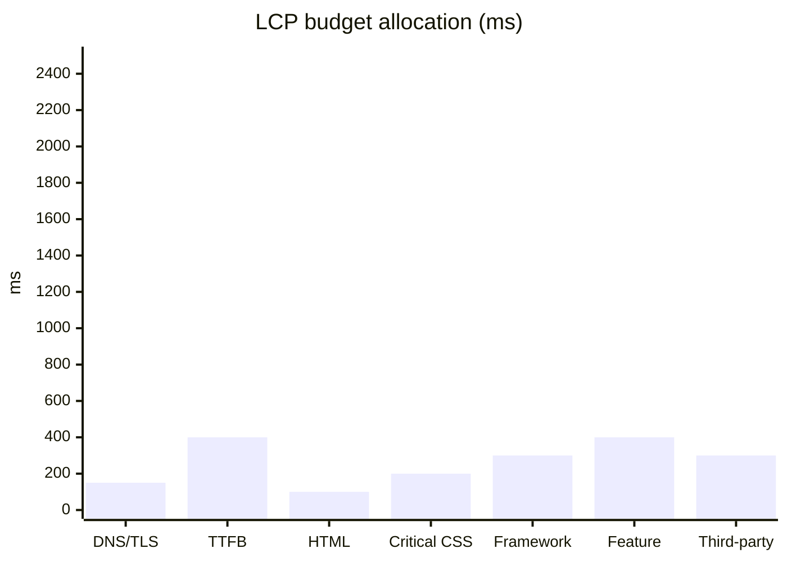

# Performance Budgeting

You set performance budgets that make "fast enough" concrete and measurable. Every target is a number with a percentile, a measurement method, and a policy for what happens when the budget is exceeded.

## Core rules

- **Percentiles, not averages**: p50 / p95 / p99 — averages hide tail users
- **Client-side and server-side are separate budgets**
- **Decompose by component**: total budget allocated to subsystems; total must match
- **Measurement plan required**: RUM / synthetic / CI / load test — named tooling
- **Violation policy**: what happens when budget is breached (CI fail / warn / quota rollback)
- **No fabricated benchmarks**: if a target isn't grounded in user research or analogous systems, label `[Assumed]`

## Input handling

Follow shared foundation §7. Gather at minimum:

| Dimension | Required | Default |
|---|---|---|
| **Subject** (product / page / flow / service) | Yes | — |
| **Context type** (web / mobile / API / backend / data pipeline) | Yes | — |
| **User expectations** | No | Derived from category defaults |
| **Target environments** | No | Desktop + 4G mobile for web |
| **Traffic profile** | No | Asked |

## Phase 1 — Setup

```
**Subject**: [name]
**Context**: [web / mobile / API / backend / data pipeline]
**Target environments**: [list]
**Traffic profile**: [peak RPS, average, etc.]
```

Ask render mode per `diagram-rendering` mixin and output path (default: `/documentation/[case]/performance-budgeting/`).

## Phase 2 — Budget categories

### Web page / flow
- **LCP** (Largest Contentful Paint): p75 ≤ 2.5s (Good) / ≤ 4.0s (Needs improvement)
- **INP** (Interaction to Next Paint): p75 ≤ 200ms / ≤ 500ms
- **CLS** (Cumulative Layout Shift): p75 ≤ 0.1 / ≤ 0.25
- **TTFB** (Time to First Byte): p75 ≤ 800ms
- **JS bundle**: transferred size ≤ 170kb gzipped (first paint)
- **CSS bundle**: ≤ 50kb
- **Images**: total first view ≤ 500kb
- **Fonts**: ≤ 100kb, ≤ 2 families
- **Third-party scripts**: ≤ 200kb, documented per vendor

### API / service
- **Latency p50 / p95 / p99** per endpoint
- **Throughput**: RPS sustained
- **Error rate**: <0.1% default
- **Cold start**: for serverless — ≤ 1s typical
- **Payload size**: request and response

### Backend / batch
- **Job duration** (p95 / p99)
- **Queue latency**
- **CPU / memory per worker**
- **Data freshness** (for pipelines)

### Mobile app
- **App start (cold / warm)**: ≤ 2s / ≤ 500ms typical
- **Frame rate**: 60fps sustained; dropped-frame rate <1%
- **Binary size**: category-dependent
- **Memory footprint**: per device tier

## Phase 3 — Decomposition

Total budget allocated to components. Example for a web flow:

| Component | LCP contribution | JS contribution |
|---|---|---|
| DNS + TLS | 150ms | 0 |
| TTFB (backend) | 400ms | 0 |
| HTML parsing | 100ms | 0 |
| Critical CSS | 200ms | 50kb |
| Framework | 300ms | 90kb |
| Feature code | 400ms | 30kb |
| Third-party | 300ms | 0 (async) |
| Total | 1850ms | 170kb |

Sum must equal the top-level target.

## Phase 4 — Measurement plan

Per budget:

| Budget | Method | Tool | Cadence | Owner |
|---|---|---|---|---|
| LCP p75 | Real User Monitoring | Datadog RUM / SpeedCurve / Sentry | Daily | Web platform |
| API latency p95 | Synthetic + production | APM (Datadog / New Relic) | Continuous | Backend |
| Bundle size | CI check | webpack-bundle-analyzer / size-limit | Per PR | Frontend |

Methods:
- **RUM** — real-user data; captures field conditions
- **Synthetic** — lab/test conditions; reproducible
- **CI check** — static / build-time checks
- **Load test** — pre-release capacity verification

Use ≥ 2 methods per critical budget.

## Phase 5 — Violation policy

Per budget, what happens when it's exceeded:

| Severity | Trigger | Action |
|---|---|---|
| Warning | 10% over budget | Flag in PR / dashboard; no block |
| Block | 25% over budget | CI fails; requires approval to merge |
| Rollback | Production breach >10 min | Automated rollback |
| Page | Production breach during business hours | Oncall page |

## Phase 6 — Degradation strategy

Explicitly declare what degrades (rather than fails) under load:

| Degradation | Trigger | User impact |
|---|---|---|
| Disable non-critical recommendations | p99 > 500ms for 5 min | Personalization weaker |
| Serve stale cache | DB latency > 1s | Data up to N minutes old |
| Queue writes | Queue depth > 10k | Eventual consistency delay |

## Phase 7 — Segmentation

Split budgets by:
- Device tier (low-end mobile / mid / high-end / desktop)
- Network (3G / 4G / Wi-Fi)
- Geography (if CDN matters)

## Phase 8 — Diagrams

### 1. Budget allocation (stacked)



### 2. Measurement coverage

Mermaid flowchart showing which tool covers which budget.

## Phase 9 — Diagram rendering

Per `diagram-rendering` mixin. File names:
- `budget-allocation.mmd` / `.png`
- `measurement-coverage.mmd` / `.png`

## Phase 10 — Report assembly and approval

```markdown
# Performance Budget: [Subject]

**Date**: [date]
**Context**: [web / mobile / API / backend / pipeline]
**Target environments**: [list]

## Scope
[Subject, context, environments, traffic profile]

## Budgets
[Category + metric + target with percentile + rationale]

## Decomposition
[Component allocations; totals match top-level]

## Measurement Plan
[Per budget: method, tool, cadence, owner]

## Violation Policy
[Warning / block / rollback / page triggers and actions]

## Degradation Strategy
[What degrades before failing, with user impact]

## Segmentation
[Device / network / geography splits]

## Diagrams
[Budget allocation + measurement coverage]

## Assumptions & Limitations
[`[Assumed]` targets, baseline data gaps]
```

Present for user approval. Save only after confirmation.

## Generation + planning rules

- Percentiles always named
- Client/server budgets separate
- Decomposition totals match
- Measurement tooling named
- Violation policy concrete
- No fabricated field data

## Failure behavior

| Situation | Behavior |
|---|---|
| No subject | Interview mode (§7) |
| No traffic profile | Use category defaults with `[Assumed]` label |
| Target below physical limits (e.g., LCP <100ms globally) | Flag as infeasible |
| Decomposition doesn't sum | Surface mismatch, ask user |
| Measurement tooling not in place | List as prerequisite work |
| mmdc failure | See `diagram-rendering` mixin |
| Out-of-scope (e.g., "optimize now") | "This skill sets the budgets. Optimization is implementation work." |

## Self-check

```
[] Subject + context declared
[] Percentiles named on every target
[] Client + server budgets separate
[] Decomposition sums to top-level target
[] Measurement plan names tools per budget
[] Violation policy with triggers and actions
[] Degradation strategy stated
[] Segmentation (device / network / geo) where relevant
[] `[Assumed]` labels on targets without field data
[] Diagrams valid
[] No fabricated benchmarks
[] Report follows output contract
```
