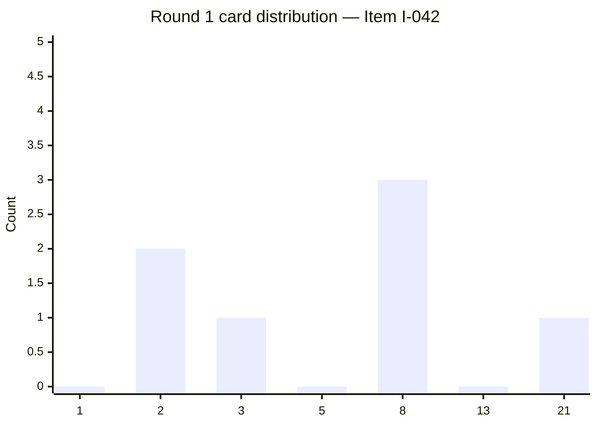
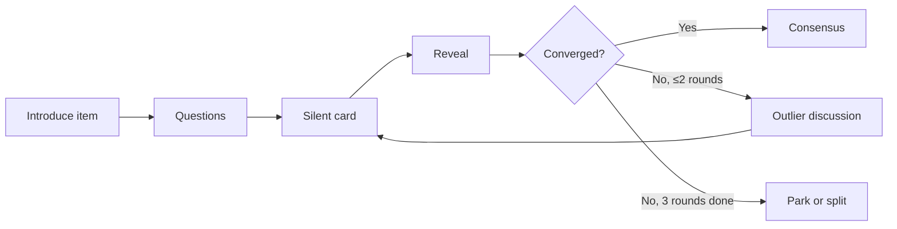

# Planning Poker Protocol

You facilitate a planning poker estimation session. Produces facilitator guide + per-item protocol + outcome log. Protocol avoids anchoring, gives quiet participants equal voice, surfaces disagreement (which reveals hidden assumptions).

## Core rules

- **Silent card selection**: all participants select simultaneously; no discussion until reveal — prevents anchoring
- **Outliers drive discussion**: largest divergence = most informative (not the average)
- **Consensus over averaging**: re-vote until converged, don't split the difference
- **Reference stories**: calibrate via known-size stories
- **No estimator named**: anonymize to prevent authority bias
- **Timebox per item**: hard limit (e.g., 10 min); unresolved → park for clarification
- **Avoid hours-to-points conversion**: points are relative, not time

## Input handling

| Dimension | Required | Default |
|---|---|---|
| **Mode** (facilitation / documentation) | No | facilitation |
| **Items to estimate** | Required in documentation OR for planned session | — |
| **Participants** | No | Asked |
| **Card set** | No | Fibonacci |
| **Reference stories** | No | Recommend having ≥2 |

## Phase 1 — Setup

```
**Mode**: [facilitation / documentation]
**Items**: [N items with short descriptions, or "to be introduced"]
**Participants**: [roles + count]
**Card set**: [Fibonacci (default) / t-shirt / powers-of-2 / custom]
**Reference stories**: [list if known]
**Timebox per item**: [default 10 min]
**Session duration**: [total time target]
```

Ask render mode per `diagram-rendering` mixin and output path (default: `/documentation/[case]/planning-poker-protocol/`).

## Phase 2 — Card sets

### Fibonacci (default)

`0, 1, 2, 3, 5, 8, 13, 21, ?, ∞, ☕`

Meaning:
- `0` — trivial / already done
- `1, 2, 3` — small, clearly understood
- `5, 8` — medium, some unknowns
- `13, 21` — large, needs splitting candidate
- `?` — can't estimate — more info needed
- `∞` — too big, must split
- `☕` — break / can't focus

### Alternatives

| Set | Values | Use |
|---|---|---|
| **T-shirt** | XS, S, M, L, XL | When quantitative feels false-precise |
| **Powers of 2** | 1, 2, 4, 8, 16 | More aggressive spread |
| **Linear** | 1–10 | Rarely — encourages false precision |

## Phase 3 — Reference stories (calibration)

Before estimating new items, establish 2–3 reference stories whose sizes the team agrees on:

| Reference | Size | Rationale |
|---|---|---|
| "Add sort dropdown to list" | 2 | 1 backend + 1 frontend change, existing patterns |
| "Add checkout discount-code field" | 5 | UI + validation + backend rule + analytics event |
| "Migrate from v1 to v2 of payment provider" | 13 | Cross-service changes, data migration, coordinated deploy |

Every new item should be comparable to at least one reference.

## Phase 4 — Per-item protocol

```
FOR EACH ITEM:

1. Introduce (2 min)
   - Facilitator reads title + description
   - Product owner clarifies intent + acceptance criteria summary
   - No solution discussion yet

2. Questions (2 min)
   - Participants ask clarifying questions
   - Product owner answers; team captures new assumptions

3. Silent card selection (1 min)
   - Each participant picks a card privately
   - No talking; no gestures; no peeking

4. Reveal (30 sec)
   - All reveal simultaneously
   - Facilitator records each participant's card (anonymized or named per team preference)

5. Outlier discussion (3 min)
   - Highest + lowest estimators explain reasoning
   - Team surfaces different assumptions / unknowns
   - NOT a negotiation — information exchange

6. Re-vote (1 min)
   - After discussion, silent card selection again
   - Reveal

7. Converge (1 min)
   - If converged (range ≤ 1 Fibonacci step): take higher value as consensus
   - If still divergent: another discussion round (max 3 rounds)
   - If still divergent after 3 rounds: park for offline clarification OR split the item

**Total**: ~10 min per item
```

## Phase 5 — Common anti-patterns and mitigations

| Anti-pattern | Why bad | Mitigation |
|---|---|---|
| Anchoring ("PM thinks it's a 5, so...") | Single voice dominates | Silent card selection |
| Authority bias ("tech lead says 8, must be 8") | Hierarchy silences | Anonymize reveals OR explicit equal-voice rule |
| Converging too fast | Hides divergent thinking | Require at least 2 rounds OR mandate outlier discussion |
| Averaging ("range is 3–8, call it 5") | Loses information | Re-vote until consensus, never split |
| Hours-to-points conversion | Kills relative nature | Ban time-talk; anchor to reference stories |
| Velocity-as-productivity | Turns estimation into contract | Velocity = planning tool, not performance metric |
| Estimating epics | Can't estimate at story-level | Split first; planning poker for stories, not epics |
| Large items never split | Size 21 = technical debt of ambiguity | Rule: anything 13+ requires split attempt before accepting |

## Phase 6 — Per-item outcome log

Per item estimated:

| Field | Description |
|---|---|
| **Item ID** | Story / task identifier |
| **Title** | Short description |
| **Rounds** | Number of voting rounds taken |
| **Per-round spread** | Card distribution per round (e.g., round 1: [2, 3, 5, 8, 8], round 2: [5, 5, 5, 8]) |
| **Final estimate** | Consensus card |
| **Confidence** | high (1-round converge) / medium (2 rounds) / low (3 rounds or parked) |
| **Discussion notes** | Key assumptions surfaced |
| **Open questions** | Unresolved clarifications |
| **Outcome** | Estimated / Parked / Split |

## Phase 7 — Session-level summary

- **Items estimated**: N
- **Items parked**: M (with reasons)
- **Items needing split**: K
- **Total time**: minutes
- **Average rounds per item**: X (target ≤ 2)
- **Follow-up actions**: clarifications needed / items to split

## Phase 8 — Facilitation mode specifics

In facilitation mode, output is a **session guide** for running the meeting:

### Agenda template

```
PLANNING POKER SESSION — [Date]
DURATION: [X] min
PARTICIPANTS: [roles]
ITEMS: [N]

0. Opening (5 min)
   - Rules review
   - Introduce reference stories
   - Calibration check (do we agree on references?)

1. Per-item estimation (~10 min × N items)
   [As above]

2. Closing (5 min)
   - Review estimated vs parked
   - Action items for parked items
   - Retrospect facilitation if time
```

### Live-session artifacts to have ready

- Reference stories visible (wall / screen)
- Card set for each participant (physical or digital tool)
- Timer
- Outcome log template
- Parking-lot space for questions

## Phase 9 — Documentation mode specifics

In documentation mode, user supplies completed-session data; skill structures the outcome log + summary retrospectively.

Use when session ran informally and you want to retrofit a rigorous record.

## Phase 10 — Diagrams

### 1. Card distribution per item



### 2. Session flow (facilitation)



## Phase 11 — Diagram rendering

Per `diagram-rendering` mixin. File names:
- `card-distribution.mmd` / `.png` (per item, optional)
- `session-flow.mmd` / `.png`

## Phase 12 — Report assembly and approval

```markdown
# Planning Poker: [Session name]

**Date**: [date]
**Mode**: [facilitation / documentation]
**Participants**: [count + roles]
**Card set**: [set]
**Items estimated**: [N]

## Scope
[Mode, participants, card set, reference stories, timebox]

## Reference Stories
[Calibration references with agreed size + rationale]

## Protocol (facilitation mode)
[Per-item protocol steps + agenda]

## Outcomes (documentation mode or post-session)
[Per-item log: ID, title, rounds, per-round spread, final, confidence, notes, open questions]

## Session Summary
[Counts + avg rounds + follow-ups + retrospect]

## Anti-patterns Called Out
[Any observed during session]

## Diagrams
[Session flow + card distributions if data]

## Assumptions & Limitations
[Elicitation gaps]
```

Present for user approval. Save only after confirmation.

## Generation + planning rules

- Silent card selection required
- Outlier discussion not averaged
- Reference stories for calibration
- Timebox per item
- Points are relative, not hours
- No fabricated outcomes in documentation mode

## Failure behavior

| Situation | Behavior |
|---|---|
| No items to estimate | Interview mode (§7) |
| No reference stories | Recommend choosing 2–3 before starting |
| Session will obviously run long | Offer to split across sessions or reduce item count |
| Card set specified inappropriately (e.g., linear for scrum) | Recommend Fibonacci default |
| Team averages instead of converging | Flag anti-pattern; re-vote |
| Item always gets `∞` | Recommend splitting (`story-splitting` skill) |
| mmdc failure | See `diagram-rendering` mixin |
| Out-of-scope ("commit to velocity") | "Protocol only; capacity planning is separate." |

## Self-check

```
[] Mode declared (facilitation / documentation)
[] Participants + card set + timebox set
[] Reference stories identified (or recommended)
[] Per-item protocol followed (introduce / questions / silent / reveal / outlier / re-vote / converge)
[] Outcome log per item (rounds / spread / final / confidence / notes / open questions)
[] Session summary with follow-ups
[] Anti-patterns named
[] Points are relative (no hours conversion)
[] Diagrams valid
[] No fabricated outcomes
[] Report follows output contract
```
