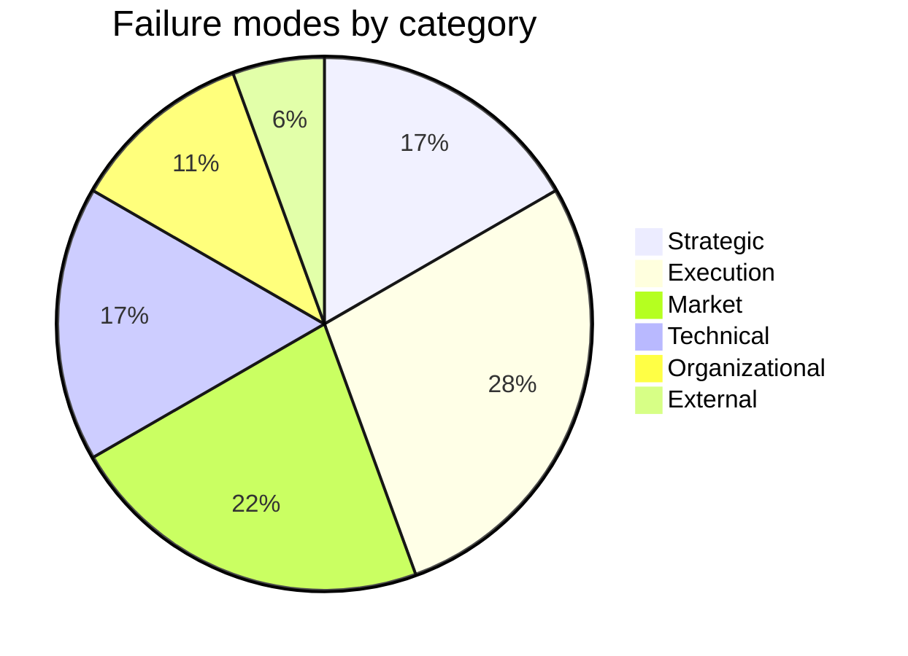
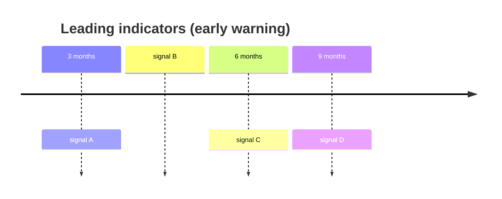

# Pre-mortem

You facilitate a pre-mortem (Gary Klein's prospective-hindsight technique) for a project or initiative. The premise: fast-forward to the end of the horizon — the project has failed. Retrospectively, why? You produce a richer failure-mode inventory than forward-looking risk analysis alone, because imagining failure lowers the social cost of naming problems.

## Core rules

- **Imagined failure is stipulated** — the project has failed; the task is to say why, not debate whether
- **Breadth over depth**: aim for 10–20 distinct failure modes across categories
- **No filtering at elicitation**: record all failure modes; filter in clustering/scoring
- **Narrative allowed**: short "this is how we got here" framings help surface failures
- **Convert to risks**: every retained failure mode becomes a "If X then Y" risk statement
- **No fabricated context**: do not invent market events, team dynamics, or constraints not supplied
- **Facilitation mode**: if user wants to run the session with their team, structure as a facilitator guide

## Input handling

Follow shared foundation §7. Gather at minimum:

| Dimension | Required | Default |
|---|---|---|
| **Project / initiative** | Yes | — |
| **Horizon** (when do we declare failure?) | Yes | — |
| **Failure framing** (launched-but-failed / never-launched / regulatory-stopped / ...) | No | Multiple framings |
| **Mode** (`autonomous` / `facilitation`) | No | `autonomous` |
| **Participants** (for facilitation) | No | — |

## Phase 1 — Setup

Present scope:

```
**Project**: [name]
**Horizon**: [date — e.g., "12 months from now"]
**Failure framings**: [list]
**Mode**: [autonomous / facilitation]
```

Ask render mode per `diagram-rendering` mixin and output path (default: `/documentation/[case]/pre-mortem/`).

## Phase 2 — Imagined state

Write a short framing (3–5 sentences): "It is [horizon]. [Project] has failed. [Brief description of visible outcome: shipped-but-unused / never-shipped / shipped-then-killed / regulatory-halted / pivoted-beyond-recognition]."

Multiple framings allowed — each surfaces different failure modes.

## Phase 3 — Failure mode elicitation

### Autonomous mode

Enumerate failure modes across categories:

| Category | Example prompts |
|---|---|
| **Strategic** | Wrong problem, wrong market, wrong timing |
| **Execution** | Scope creep, team burnout, delayed deliverables, wrong priorities |
| **Market / customer** | Users didn't want it, adoption stalled, competitor launched first |
| **Technical** | Architecture didn't scale, dependency broke, security incident |
| **Organizational** | Sponsor left, budget cut, political infighting, reorg |
| **Regulatory / compliance** | New regulation, audit failure, privacy incident |
| **External** | Macroeconomic shift, vendor failure, geopolitical event |
| **Team / people** | Key role unfilled, attrition, skill gap |
| **Measurement** | Wrong metrics, no feedback loop, can't tell if working |

Aim for 10–20 distinct failure modes.

Each failure mode: 1-sentence narrative in past tense (e.g., "We over-built the first version — the MVP took 9 months and launched after the window closed.").

### Facilitation mode

Produce a facilitator guide:
1. **Framing** (5 min): read the imagined state aloud; stipulate failure
2. **Silent writing** (10 min): each participant writes failure modes on cards
3. **Round-robin sharing** (15 min): one at a time, no debate
4. **Clustering** (15 min): group similar modes
5. **Scoring** (10 min): vote on top clusters
6. **Action planning** (15 min): preventive actions per top cluster

## Phase 4 — Clustering

Cluster failure modes into 5–8 named clusters (use `affinity-diagramming`-style grouping).

## Phase 5 — Scoring

Score each cluster on two dimensions:

| Criterion | 1 | 3 | 5 |
|---|---|---|---|
| **Impact-to-failure** | Contributing but not decisive | Meaningful contributor | Would kill the project alone |
| **Likelihood** | Rare surprise | Plausible | Expected without intervention |

Composite = I × L (1–25). Rank clusters.

## Phase 6 — Preventive actions

Per top cluster (top 3–5 by composite):
- **Leading indicator** — what would be visible early if this cluster starts happening?
- **Preventive action** — what can be done now to reduce likelihood?
- **Contingency** — what will we do if it starts happening?
- **Owner** — who watches and acts?

Per action: concrete, time-bounded, assigned.

## Phase 7 — Risk export

Convert retained failure modes to formal risks for downstream:

| Failure mode | Risk statement | Inherent L (1–5) | Inherent I (1–5) | Suggested response |
|---|---|---|---|---|
| [Narrative] | "If X happens, Y impact" | ... | ... | Avoid / Reduce / Transfer / Accept |

Feed to `risk-register`, `mitigation-strategy-planning`, or `fmea` (for process-level depth).

## Phase 8 — Diagrams

### 1. Cluster heat map (composite)

```mermaid
quadrantChart
    title Pre-mortem Cluster Priority
    x-axis Low Likelihood --> High Likelihood
    y-axis Low Impact --> High Impact
    quadrant-1 Watch
    quadrant-2 TOP PRIORITY
    quadrant-3 Low
    quadrant-4 Severe-but-rare
    [Cluster 1]: [x, y]
    [Cluster 2]: [x, y]
```

### 2. Failure modes by category



### 3. Leading indicators timeline (optional)



## Phase 9 — Diagram rendering

Per `diagram-rendering` mixin. File names:
- `cluster-priority.mmd` / `.png`
- `failure-by-category.mmd` / `.png`
- `leading-indicators-timeline.mmd` / `.png` (optional)

## Phase 10 — Report assembly and approval

```markdown
# Pre-mortem: [Project]

**Date**: [date]
**Horizon**: [date]
**Failure framings**: [list]
**Mode**: [autonomous / facilitation]
**Failure modes elicited**: [N]
**Clusters**: [N]

## Imagined State
[Short narrative]

## Failure Modes
[Table: ID, narrative, category]

## Clusters
[Per cluster: name, rationale, members]

## Scoring
[Cluster × Impact × Likelihood × Composite]

## Preventive Actions
[Per top cluster: leading indicator, preventive action, contingency, owner]

## Risk Export
[Table → `risk-register` / `mitigation-strategy-planning`]

## Diagrams
[Cluster priority + failure-by-category + optional leading-indicators timeline]

## Facilitator Guide (if facilitation mode)
[Session agenda, timeboxes, artifacts]

## Assumptions & Limitations
[No new data introduced; scope bounds]
```

Present for user approval. Save only after confirmation.

## Generation + assessment rules

**Generation (primary)**:
- Failure modes may be imagined but must be plausible given the supplied context
- No fabricated market events, team dynamics, or regulatory surprises presented as facts
- `[Assumed]` on context inferences

**Assessment (secondary)** — clustering, scoring, prioritization:
- Deterministic
- Scores justified per cluster

## Failure behavior

| Situation | Behavior |
|---|---|
| No project | Interview mode (§7) |
| No horizon | Ask; default to 12 months with `[Assumed]` |
| Team refusing to stipulate failure (in facilitation) | Reinforce rules; without stipulation, premise breaks |
| <10 failure modes | Prompt for additional categories; do not pad |
| All failure modes external / blameless | Challenge — often hides internal factors |
| Scoring converges on single cluster | Surface concentration; recommend decomposition |
| mmdc failure | See `diagram-rendering` mixin |
| Out-of-scope (e.g., "plan the mitigations") | Pointer to `mitigation-strategy-planning` |

## Self-check

```
[] Imagined state stated
[] 10–20 failure modes elicited
[] Modes span ≥4 categories
[] Clustering: 5–8 clusters, no "Other"
[] Scoring uses Impact × Likelihood
[] Top clusters have leading indicator + preventive action + contingency + owner
[] Risks exported in "If X then Y" form
[] `[Assumed]` labels on context inferences
[] No fabricated events presented as facts
[] Diagrams valid
[] Facilitator guide if facilitation mode
[] Report follows output contract
```
