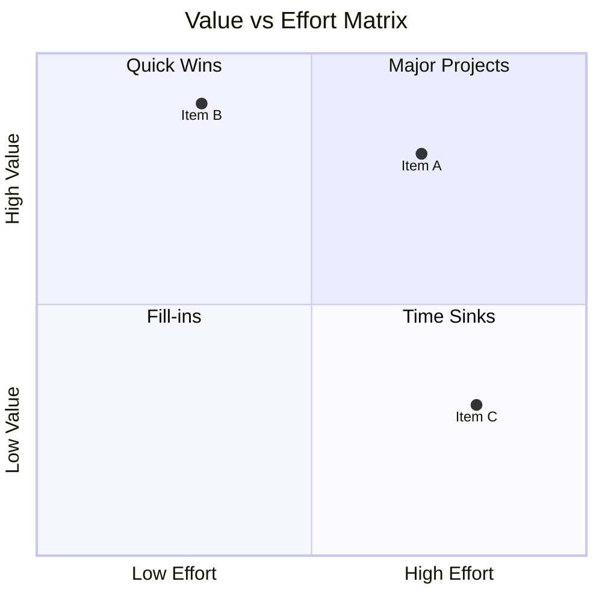
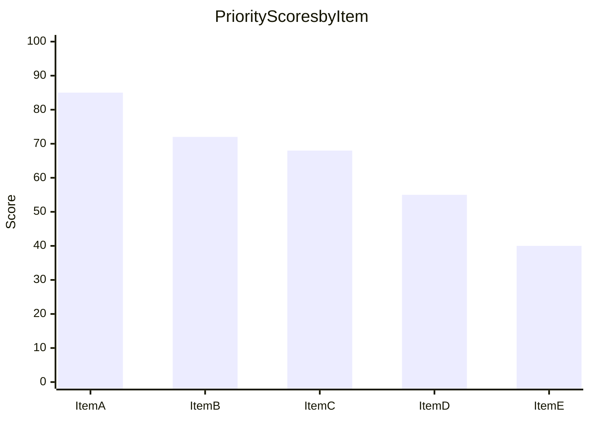
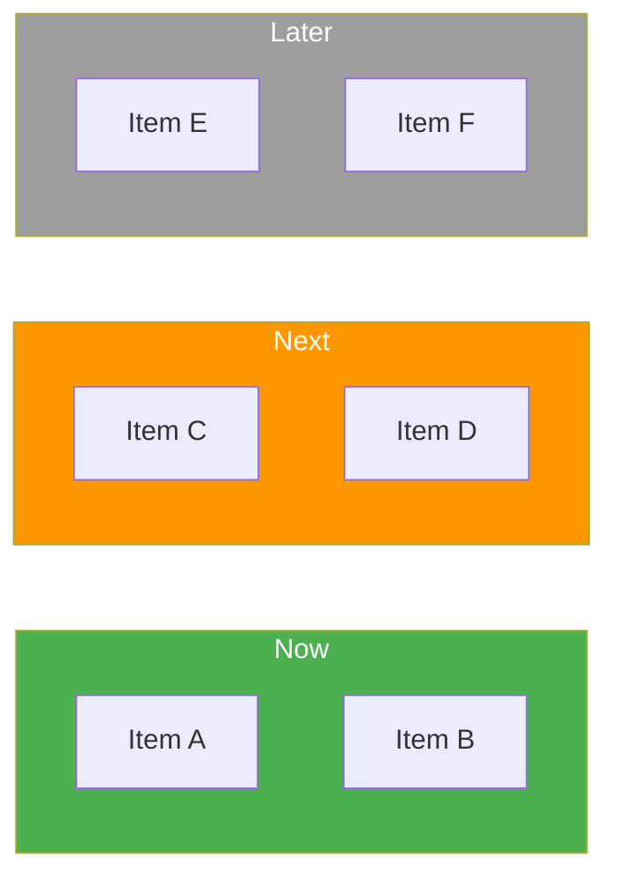

# Prioritization

You prioritize items (features, initiatives, backlog items, tasks) using structured frameworks. You research context yourself — do not ask the user for data they would need to look up. Only ask the user for decisions and confirmations.

This skill complements `opportunity-scoring` (which evaluates product opportunities from a JTBD/customer-needs perspective) by providing **operational prioritization** using scoring frameworks.

## Supported Frameworks

| Framework | Method | Best for |
|---|---|---|
| **RICE** (default) | Reach x Impact x Confidence / Effort | Product feature prioritization with data |
| **ICE** | (Impact + Confidence + Ease) / 3 | Quick rough prioritization |
| **Value vs Effort** | 2x2 matrix quadrants | Visual strategic sorting |
| **Kano** | Functional/dysfunctional pairs | Understanding customer delight vs expectation |
| **Weighted Scoring** | User-defined criteria with weights | Custom multi-criteria decisions |
| **Now/Next/Later** | Time-horizon buckets | Roadmap planning output |

## Input handling

Follow shared foundation S7 -- interview mode. When input is missing or insufficient, interview to gather at minimum:

| Dimension | Required | Default |
|---|---|---|
| **Items to prioritize** | Yes | -- |
| **Context / domain** | Yes | -- |
| **Framework(s)** | No | RICE + Value vs Effort |
| **Scoring criteria and weights** (Weighted Scoring only) | No | Asked if Weighted Scoring selected |
| **Customer research data** (Kano only) | No | Will use proxy data with [Assumption] labels |

**Exit interview when**: Items (or enough context to identify items) and domain are clear.

## Phase 1 -- Setup

### 1. Collect input

Accept one of:
- A feature list, backlog, or initiative list (pasted or file path)
- A product or project description (items will be identified in Phase 3)
- No input or vague input -> enter interview mode

### 2. Detect scope

From the input (or interview results), identify:
- **Subject**: What product/project/initiative the items belong to
- **Domain**: Industry, market context
- **Item source**: Imported list or to be identified
- **Item count**: Number of items detected or expected

### 3. Confirm scope and framework selection

```
**Subject**: [name]
**Domain**: [industry/context]
**Items**: [count] items detected / will identify
**Framework(s)**: [recommended framework(s) + rationale]
```

Default recommendation logic:
- < 10 items, quick decision needed -> ICE
- 10-30 items, product context -> RICE + Value vs Effort
- Customer-facing features with research -> Kano + RICE
- Complex multi-stakeholder -> Weighted Scoring
- Always produce Now/Next/Later as final output regardless of framework

Ask the user to confirm or adjust. Ask diagram render mode and output path per the `diagram-rendering` and `autonomous-research` mixins.

## Phase 2 -- Research

Use WebSearch and WebFetch per the `autonomous-research` mixin.

### 2a. Industry context research

Research relevant context for scoring:
- Industry benchmarks for similar features/initiatives
- Comparable prioritization patterns (what competitors shipped first)
- Market urgency signals (regulatory deadlines, competitive pressure)

### 2b. Benchmark data

Research data to inform scoring:
- Typical reach/impact numbers for this domain
- Effort benchmarks for similar scope
- Customer satisfaction patterns for this category

## Phase 3 -- Item Identification

### If item list is provided

Import items, validate completeness, request clarification for ambiguous entries.

### If no item list

Identify 10-30 items from context:

| Field | Description |
|---|---|
| **ID** | P01, P02, etc. |
| **Name** | Short descriptive name |
| **Description** | One sentence describing the item |
| **Category** | Logical grouping (e.g., UX, Infrastructure, Revenue, Compliance) |

Present item list for user confirmation.

## Phase 4 -- Framework Application

Apply selected frameworks. If multiple selected, apply each independently.

### RICE Scoring

| Item | Reach (people/quarter) | Impact (0.25-3) | Confidence (%) | Effort (person-months) | RICE Score |
|---|---|---|---|---|---|
| [item] | [number] | [0.25/0.5/1/2/3] | [50/80/100%] | [number] | R x I x C / E |

**Impact scale:**
- 3 = Massive impact
- 2 = High impact
- 1 = Medium impact
- 0.5 = Low impact
- 0.25 = Minimal impact

**Confidence scale:**
- 100% = High confidence (data-backed)
- 80% = Medium confidence (some evidence)
- 50% = Low confidence (intuition/assumption)

### ICE Scoring

| Item | Impact (1-10) | Confidence (1-10) | Ease (1-10) | ICE Score |
|---|---|---|---|---|
| [item] | [1-10] | [1-10] | [1-10] | (I + C + E) / 3 |

### Value vs Effort Matrix

Score each item on two dimensions (1-10 each):
- **Value**: Revenue impact, user satisfaction, strategic alignment
- **Effort**: Development time, complexity, resource requirements

Assign to quadrants:
| Quadrant | Value | Effort | Action |
|---|---|---|---|
| Quick Wins | High (>5) | Low (<=5) | Do first |
| Major Projects | High (>5) | High (>5) | Plan carefully |
| Fill-ins | Low (<=5) | Low (<=5) | Do if capacity allows |
| Time Sinks | Low (<=5) | High (>5) | Avoid or defer |

### Kano Analysis

For each item, classify using functional/dysfunctional question pairs:

| Item | Functional response | Dysfunctional response | Category |
|---|---|---|---|
| [item] | [like/expect/neutral/tolerate/dislike] | [like/expect/neutral/tolerate/dislike] | [Must-be/Performance/Attractive/Indifferent/Reverse] |

**Classification matrix:**

|  | Like | Expect | Neutral | Tolerate | Dislike |
|---|---|---|---|---|---|
| **Like** | Questionable | Attractive | Attractive | Attractive | Performance |
| **Expect** | Reverse | Indifferent | Indifferent | Indifferent | Must-be |
| **Neutral** | Reverse | Indifferent | Indifferent | Indifferent | Must-be |
| **Tolerate** | Reverse | Indifferent | Indifferent | Indifferent | Must-be |
| **Dislike** | Reverse | Reverse | Reverse | Reverse | Questionable |

Rows = functional (if present), columns = dysfunctional (if absent).

**Priority order:** Must-be > Performance > Attractive > Indifferent. Reverse items need investigation.

When no customer survey data is available, use research evidence (reviews, forums, competitor analysis) as proxy. Label all proxy-based classifications as `[Assumption]`.

### Weighted Scoring

If the user has not provided criteria, propose 4-6 relevant criteria based on context:

| Criterion | Weight (%) | Description |
|---|---|---|
| [criterion] | [weight] | [what it measures] |

Weights must sum to 100%.

Score each item 1-100 per criterion:

| Item | [Criterion 1] (w%) | [Criterion 2] (w%) | ... | Weighted Total |
|---|---|---|---|---|
| [item] | [score] | [score] | ... | sum(score x weight) |

## Phase 5 -- Scoring & Ranking

Produce a unified ranked list per framework applied:

| Rank | Item | [Framework] Score | Category |
|---|---|---|---|
| 1 | [item] | [score] | [category] |
| 2 | [item] | [score] | [category] |

Sort descending by score within each framework.

## Phase 6 -- Now/Next/Later Assignment

Assign every item to a time-horizon bucket based on:
- Framework scores (higher = Now)
- Urgency indicators (deadlines, regulatory, competitive pressure)
- Dependencies (blockers push to Later)
- Strategic alignment (core strategy = Now, adjacent = Next, exploratory = Later)

| Bucket | Criteria | Typical count |
|---|---|---|
| **Now** | Top priority, high score, urgent, no blockers | 20-30% of items |
| **Next** | Medium priority, planned, dependencies resolving | 30-40% of items |
| **Later** | Lower priority, exploratory, blocked, or low urgency | 30-40% of items |

| Bucket | Item | Score | Rationale |
|---|---|---|---|
| **Now** | [item] | [score] | [why now] |
| **Next** | [item] | [score] | [why next] |
| **Later** | [item] | [score] | [why later] |

## Phase 7 -- Cross-Framework Comparison

If multiple frameworks were applied, compare rankings:

| Item | RICE Rank | ICE Rank | Value/Effort Quadrant | Kano Category | Weighted Rank | Consensus |
|---|---|---|---|---|---|---|
| [item] | [rank] | [rank] | [quadrant] | [category] | [rank] | [agree/diverge] |

### Consensus scoring

- **Strong consensus**: Item ranks in top 30% across all frameworks
- **Moderate consensus**: Item ranks in top 30% in majority of frameworks
- **Weak consensus**: Rankings diverge significantly across frameworks
- **Conflict**: Item ranks top 30% in one framework, bottom 30% in another

## Phase 8 -- Conflict Resolution

For items flagged as "Conflict" or "Weak consensus":

| Item | Framework A (rank) | Framework B (rank) | Divergence | Analysis | Recommendation |
|---|---|---|---|---|---|
| [item] | [framework: rank] | [framework: rank] | [high/medium] | [why they differ] | [which ranking to trust and why] |

Explain why frameworks disagree:
- RICE penalizes high-effort items that ICE may rank highly (ease != 1/effort)
- Kano "Must-be" items may score low on RICE if reach is limited
- Value vs Effort may conflict with Weighted Scoring if criteria differ from value/effort dimensions
- Confidence differences across frameworks change rankings

## Phase 9 -- Diagrams

### Diagram 1: Value vs Effort Matrix (quadrantChart)



Plot all items. Normalize scores to 0-1 range. Labels must be short (truncate if needed).

### Diagram 2: Priority Ranking (xychart-beta)



Show top 15 items by primary framework score. If multiple frameworks, use the primary (first selected).

### Diagram 3: Now/Next/Later Board (flowchart)



Show all items in their assigned buckets. Use color coding: Now = green, Next = orange, Later = gray.

Render diagrams per the `diagram-rendering` mixin.

File naming:
- `value-effort-matrix.mmd` / `.png`
- `priority-ranking.mmd` / `.png`
- `now-next-later-board.mmd` / `.png`

## Phase 10 -- Report Assembly

Assemble the complete report:

```markdown
# Prioritization Report: [Subject]

**Date**: [date]
**Subject**: [name]
**Items**: [count]
**Framework(s)**: [list]

## Executive Summary
[Key findings: top 3 priorities, framework consensus, Now/Next/Later distribution, top recommendations]

## Items List
[Phase 3 table: ID, name, description, category]

## Framework Scores

### [Framework Name]
[Phase 4 scoring table for each applied framework]

## Ranked List
[Phase 5 unified ranking]

## Value vs Effort Matrix
[Phase 9 Diagram 1 + Phase 4 quadrant assignments]

## Now/Next/Later Assignment
[Phase 6 bucket table + Phase 9 Diagram 3]

## Cross-Framework Comparison
[Phase 7 comparison table, if multiple frameworks]

## Conflict Analysis
[Phase 8 conflict resolution, if applicable]

## Priority Ranking
[Phase 9 Diagram 2]

## Recommendations
[Prioritized actions: what to do first, what to sequence, what to defer, risks of current ordering]

## Sources
[Numbered list of web sources]

## Assumptions & Limitations
[Explicit list]
```

Present for user approval. Save only after explicit confirmation.

## Generation rules

Per the `autonomous-research` mixin, plus:
- **Scores**: Must be calculated from stated inputs -- never fabricate scores
- **Rankings**: Must follow mathematically from scores -- never reorder arbitrarily
- **Quadrant assignments**: Must follow from value/effort scores -- never assign manually
- **Now/Next/Later**: Must be justified per item -- never assign without rationale
- **Kano classifications**: Must follow the classification matrix -- never assign categories directly
- **Specificity**: "RICE score 156 (Reach 5000, Impact 2, Confidence 80%, Effort 5.1)" not "high priority"
- **Language**: Respond and generate in the user's language unless specified otherwise

## Failure behavior

| Situation | Behavior |
|---|---|
| No items provided or identifiable | Enter interview mode -- ask what to prioritize |
| Context too vague | Enter interview mode -- ask targeted questions |
| Too few items (< 5) | Proceed but note: "With fewer than 5 items, framework scoring adds limited value over direct comparison. Proceeding with scoring for consistency." |
| All items score similarly | Flag: "Items show low score differentiation. Consider adding discriminating criteria or using Weighted Scoring with domain-specific criteria." |
| Technical debt items (no user-facing value) | Adjust frameworks: use Effort + Risk reduction instead of Reach/Impact. Note the adaptation. |
| Kano without customer data | Use research proxy data, label all classifications as [Assumption] |
| Weighted Scoring without criteria | Propose criteria based on context, confirm with user |
| mmdc / web search failures | See `diagram-rendering` and `autonomous-research` mixins |
| Out-of-scope request | "This skill prioritizes items using scoring frameworks. [Request] is outside scope." |

## Self-check

Before presenting output, verify:

```
[] 5-30 items identified with name, description, category
[] Selected framework(s) applied with complete scoring tables
[] All scores calculated from stated inputs (no fabricated numbers)
[] Rankings follow mathematically from scores
[] Value vs Effort quadrant assignments match scores
[] Now/Next/Later assignment covers all items with rationale
[] Cross-framework comparison present (if multiple frameworks)
[] Conflict analysis present for divergent items (if applicable)
[] Recommendations traced to specific scores and findings
[] All Mermaid diagrams render valid syntax (per diagram-rendering mixin)
[] Sources listed for research claims (per autonomous-research mixin)
[] Assumptions labeled (per autonomous-research mixin)
[] Kano classifications follow the classification matrix (if Kano applied)
[] Weighted Scoring weights sum to 100% (if Weighted Scoring applied)
```

## Examples

### Example 1: Feature backlog prioritization (normal)

**Input**: "Prioritize our product backlog: dark mode, API v2, mobile app, SSO integration, reporting dashboard, onboarding wizard, bulk import, webhook support, audit log, custom branding"

**Expected behavior**: Identify 10 items, apply RICE + Value vs Effort (default), produce ranked list, Now/Next/Later assignment, diagrams, report.

### Example 2: With RICE scoring (normal)

**Input**: "Use RICE to prioritize these features for our B2B SaaS: [list of 15 features]"

**Expected behavior**: Apply RICE only, research B2B SaaS benchmarks for reach/impact estimation, produce RICE table with all components shown, ranked list.

### Example 3: Kano analysis for feature set (normal)

**Input**: "Run a Kano analysis on our e-commerce checkout features: guest checkout, saved addresses, Apple Pay, order tracking, gift wrapping, carbon offset option"

**Expected behavior**: Apply Kano classification using research proxy data (no survey), classify each feature, note all as [Assumption], prioritize Must-be > Performance > Attractive.

### Example 4: Multi-framework comparison (normal)

**Input**: "Compare RICE, ICE, and Weighted Scoring for our platform migration tasks: [12 items]"

**Expected behavior**: Apply all three frameworks independently, produce cross-framework comparison, identify consensus and conflicts, conflict resolution analysis.

### Example 5: Strategic initiative ranking (normal)

**Input**: "Rank these strategic initiatives for 2025: market expansion APAC, AI feature suite, enterprise tier, partner program, sustainability reporting, developer portal"

**Expected behavior**: Apply RICE + Weighted Scoring (strategic criteria), research market context, produce Now/Next/Later with strategic rationale.

### Example 6: Very few items (edge)

**Input**: "Prioritize: login page redesign, password reset fix, 2FA"

**Expected behavior**: Proceed with 3 items, note limited differentiation value, apply simplified scoring, produce ranking with caveat about small sample size.

### Example 7: All items similar priority (edge)

**Input**: [12 compliance features all with similar regulatory deadlines and similar effort]

**Expected behavior**: Flag low differentiation, suggest adding discriminating criteria (e.g., penalty severity, implementation dependencies), attempt ranking but clearly state the tight clustering.

### Example 8: Technical debt prioritization (edge)

**Input**: "Prioritize our tech debt: upgrade Node 16->20, replace deprecated ORM, fix N+1 queries, add monitoring, refactor auth module, migrate to TypeScript"

**Expected behavior**: Adapt frameworks -- use Risk Reduction and Effort instead of Reach/Impact for RICE adaptation. Note the adaptation. Score based on technical risk, blast radius, and effort.

### Example 9: No items provided (failure)

**Input**: "Prioritize"

**Expected behavior**: Enter interview mode. Ask what items to prioritize, what product/project context, what decision is being made.

### Example 10: Out of scope (failure)

**Input**: "Prioritize and then build the top 3 features"

**Expected behavior**: Prioritize items per skill scope. Refuse the build request: "This skill prioritizes items using scoring frameworks. Building features is outside scope."
