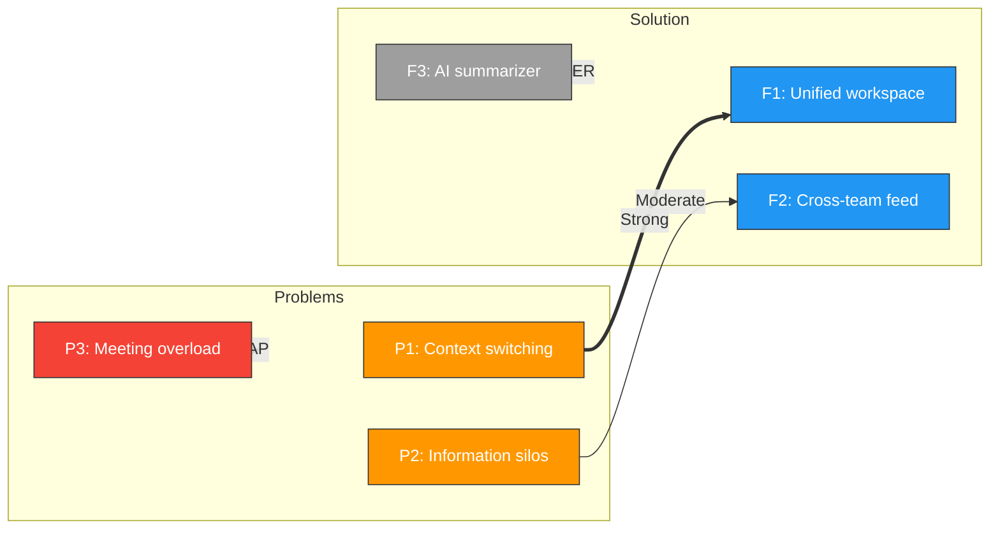
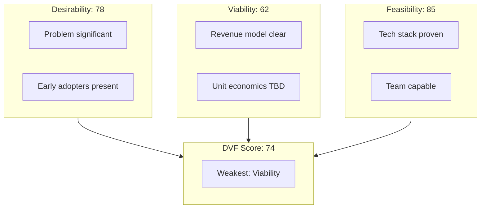
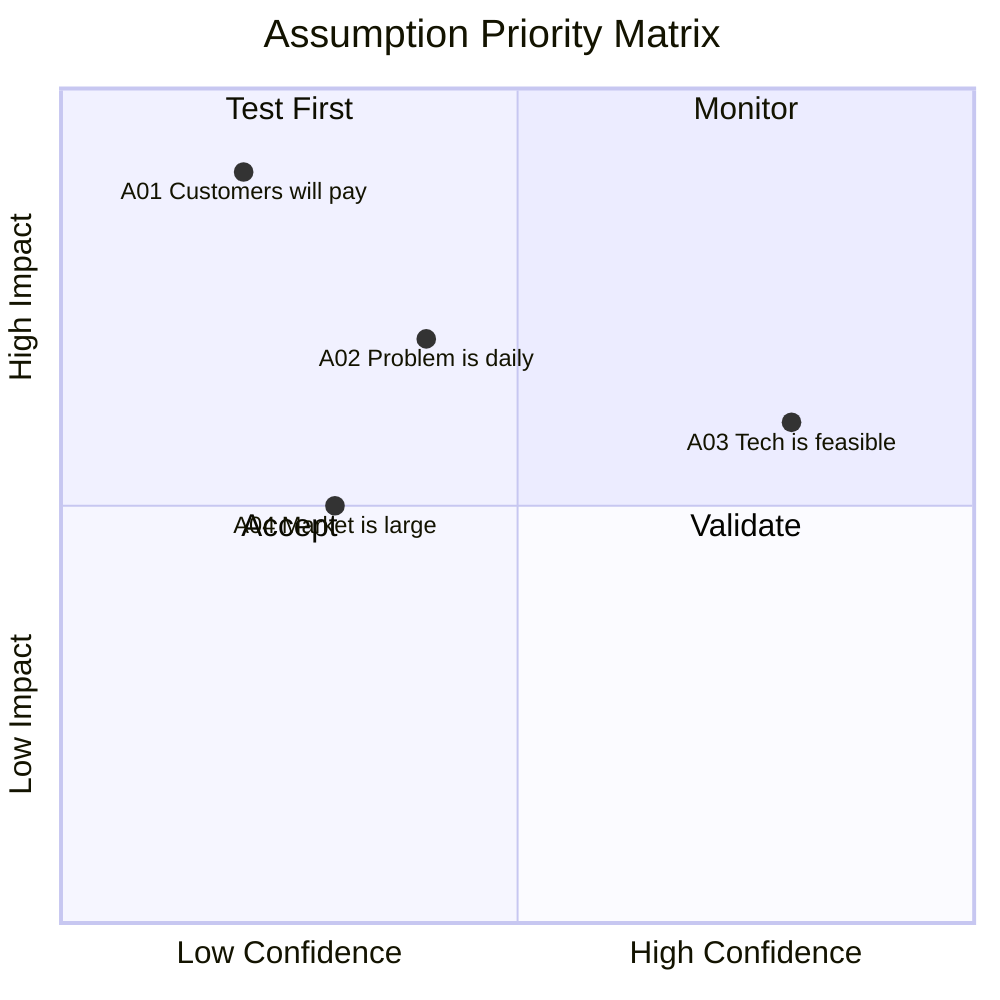
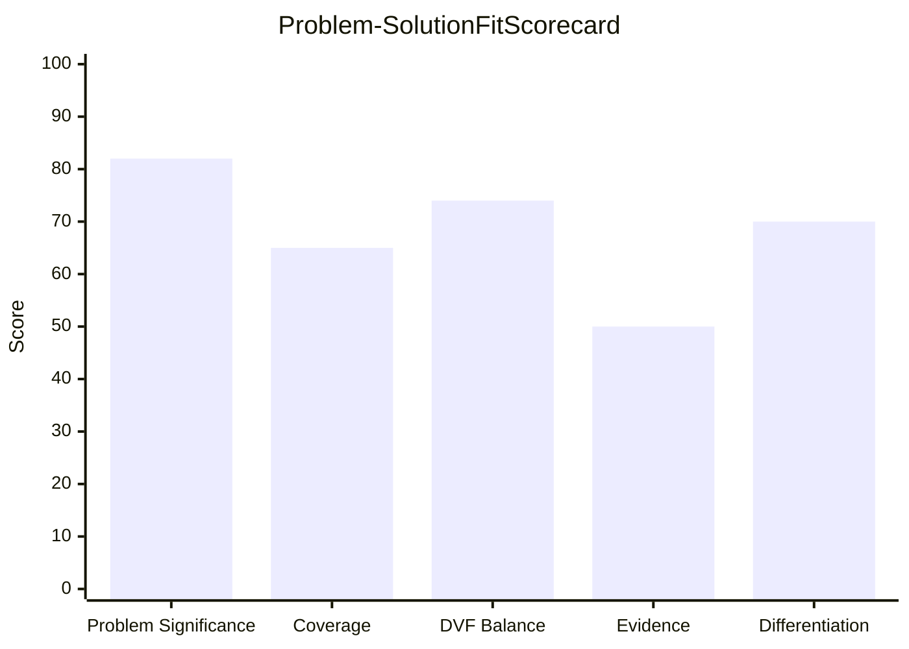

# Problem-Solution Fit

You assess problem-solution fit for proposed solutions. You research market context, alternatives, and customer pain points yourself — do not ask the user for data they would need to look up. Only ask the user for decisions and confirmations.

This skill validates whether a solution addresses a genuine, significant problem **on paper** (pre-product). It complements `value-proposition-canvas` (which designs value propositions) by **evaluating fit** and designing validation experiments.

## Phase 1 — Setup

### Input handling

Follow shared foundation §7 — interview mode. When input is missing or insufficient, interview to gather at minimum:

| Dimension | Required | Default |
|---|---|---|
| **Problem description** | Yes | — |
| **Solution description** | Yes | — |
| **VPC / persona data** | No | None |
| **Existing evidence** | No | None |
| **Competitors/alternatives** | No | Will be researched |

**Exit interview when**: Problem and solution are clear enough to assess fit.

### 1. Collect input

Accept one of:
- A problem and solution description
- A file path to a VPC, business case, or Lean Canvas
- Pasted content describing the idea
- No input or vague input → enter interview mode

### 2. Confirm scope

```
**Problem**: [brief description]
**Solution**: [brief description]
**Target customer**: [segment or "to be researched"]
**Evidence available**: [yes/no — what type]
**Data source**: [imported from VPC / from input / will research]
```

Ask the user to confirm or adjust. Ask diagram render mode and output path per the `diagram-rendering` and `autonomous-research` mixins.

## Phase 2 — Research

Use WebSearch and WebFetch per the `autonomous-research` mixin.

### 2a. Problem space research

- Market context for the problem domain
- Evidence of the problem in forums, reviews, articles, social media
- Frequency and severity indicators from real-world sources
- Industry reports on the problem space

### 2b. Alternatives research

- Existing solutions (direct competitors)
- Workarounds and makeshift solutions (strong signal for problem significance)
- Adjacent solutions that partially address the problem
- Why existing alternatives fail or fall short

## Phase 3 — Problem Assessment

### Problem significance scoring

| Dimension | Scale | Score |
|---|---|---|
| **Frequency** | Daily (5) / Weekly (4) / Monthly (3) / Quarterly (2) / Rarely (1) | [1-5] |
| **Intensity** | Critical (5) / High (4) / Moderate (3) / Low (2) / Trivial (1) | [1-5] |
| **Willingness to pay** | Proven (5) / Likely (4) / Uncertain (3) / Unlikely (2) / None (1) | [1-5] |

**Problem significance score** = (Frequency + Intensity + WTP) / 15 × 100

### Problem validation level

| Level | Description | Evidence required |
|---|---|---|
| **Confirmed** | Validated with customer evidence | Interviews, surveys, behavioral data |
| **Observed** | Seen in market but not directly validated | Forum posts, reviews, support tickets |
| **Hypothesis** | Assumed based on reasoning | No direct evidence |

### Existing alternatives

| Alternative | Type | Strengths | Weaknesses | Market share |
|---|---|---|---|---|
| [name] | Direct / Workaround / Adjacent | [list] | [list] | [estimate] |

**Key signal**: Customers using makeshift/workaround solutions = strong problem validation (pain hierarchy level 4-5).

### Root cause analysis (5 Whys)

Apply the 5 Whys technique to the stated problem to uncover root causes. The solution should address root causes, not symptoms.

## Phase 4 — Customer Forces Canvas

| Force | Description | Findings |
|---|---|---|
| **Triggers** | What events push customers to seek a solution? | [specific events] |
| **Desired outcomes** | What does success look like? | [measurable outcomes] |
| **Existing alternatives** | What are they using today? | [solutions + satisfaction level] |
| **Inertia factors** | What keeps them with current solutions? | [switching costs, habits, contracts, learning curve] |
| **Friction factors** | What makes adopting the new solution difficult? | [onboarding, integration, trust, price] |

### Force balance assessment

- **Push forces** (triggers + pain intensity): How strongly are customers pushed toward change?
- **Pull forces** (desired outcomes + solution appeal): How strongly does the new solution attract?
- **Resistance forces** (inertia + friction): How strongly do forces resist adoption?

Net force = (Push + Pull) - Resistance. Positive = favorable conditions for adoption.

## Phase 5 — Solution-Problem Mapping

### Mapping table

| Problem (validated) | Solution feature | Mapping strength | Notes |
|---|---|---|---|
| P1: [problem] | F1: [feature] | Strong / Moderate / Weak | [evidence] |
| P2: [problem] | — | **GAP** | No feature addresses this |
| — | F3: [feature] | **OVER-ENGINEERING** | No validated problem for this |

### Coverage metrics

- **Problems addressed**: [X] of [Y] validated problems = [%]
- **Features justified**: [X] of [Y] features mapped to problems = [%]
- **Gaps**: [count] validated problems without solution
- **Over-engineering**: [count] features without validated problem

### Coverage score = (Problems addressed / Total validated problems) × 100

## Phase 6 — DVF Assessment

### Desirability (0-100)

| Factor | Score (0-20) | Evidence |
|---|---|---|
| Problem significance | [0-20] | [from Phase 3] |
| Customer pull signals | [0-20] | [search volume, forum activity, willingness to pay] |
| Emotional resonance | [0-20] | [frustration level, urgency] |
| Early adopter presence | [0-20] | [makeshift solutions = level 4-5 on pain hierarchy] |
| Competitive gap | [0-20] | [what existing solutions miss] |

### Viability (0-100)

| Factor | Score (0-20) | Evidence |
|---|---|---|
| Revenue potential | [0-20] | [market size, pricing feasibility] |
| Cost structure | [0-20] | [unit economics, margins] |
| Scalability | [0-20] | [growth potential, network effects] |
| Business model clarity | [0-20] | [how money is made] |
| Competitive moat | [0-20] | [defensibility, switching costs] |

### Feasibility (0-100)

| Factor | Score (0-20) | Evidence |
|---|---|---|
| Technical complexity | [0-20] | [known technology, novel components] |
| Resource requirements | [0-20] | [team, budget, timeline] |
| Dependencies | [0-20] | [third-party, regulatory, partnerships] |
| Time to market | [0-20] | [MVP timeline, iteration speed] |
| Risk level | [0-20] | [technical, market, regulatory risks] |

### Overall DVF

- **DVF score** = (Desirability × Viability × Feasibility)^(1/3) — geometric mean ensures all three must be strong
- **Weakest lens**: [which dimension is lowest and why]
- Scores below 40 on any single lens = critical weakness

## Phase 7 — Riskiest Assumption Testing (RAT)

### Assumption register

| ID | Assumption | Category | Impact (1-5) | Confidence (1-5) | Risk Score | Rank |
|---|---|---|---|---|---|---|
| A01 | [assumption] | Value / Audience / Problem / Motivation / Execution / Competition | [1-5] | [1-5] | [Impact × (6-Confidence)] | [rank] |

Risk Score = Impact × Lack of Confidence (where Lack of Confidence = 6 - Confidence)

### Top 5 validation experiments

For each of the 5 highest-risk assumptions:

| Field | Description |
|---|---|
| **Assumption** | [what we're testing] |
| **Test type** | Landing page / Survey / Customer interview / Prototype / Pre-sale / Concierge |
| **Success criteria** | [specific, measurable threshold] |
| **Fail condition** | [what would disprove the assumption] |
| **Evidence quality** | [target level on Strategyzer ladder] |
| **Effort** | Low / Medium / High |
| **Timeline** | [estimated duration] |

## Phase 8 — Evidence Assessment

If evidence is provided by the user, score it per Strategyzer's Evidence Quality Ladder:

| Level | Type | Strength | Example |
|---|---|---|---|
| 1 | Gut feel / hypothesis | Weakest | "I think customers want this" |
| 2 | What people say (opinions) | Weak | Survey: "Would you use this?" |
| 3 | What people say (facts) | Moderate | "When is the last time you faced this problem?" |
| 4 | Landing page signups | Moderate-Strong | Email capture, waitlist |
| 5 | Pre-sales / deposits | Strong | Advance payment, LOI |
| 6 | Actual purchases | Strongest | Revenue from real transactions |

### Per-assumption evidence table

| Assumption | Evidence type | Level | Volume | Confidence |
|---|---|---|---|---|
| A01 | [type] | [1-6] | [count] | [High/Medium/Low] |

### Overall evidence strength score (0-100)

Weighted average of evidence levels across assumptions, scaled to 0-100.

## Phase 9 — Fit Scorecard

### Composite PSF score

| Dimension | Weight | Score (0-100) | Weighted |
|---|---|---|---|
| Problem significance | 30% | [from Phase 3] | [weighted] |
| Solution-problem coverage | 25% | [from Phase 5] | [weighted] |
| DVF balance | 20% | [from Phase 6] | [weighted] |
| Evidence strength | 15% | [from Phase 8, or 50 if no evidence] | [weighted] |
| Competitive differentiation | 10% | [from research] | [weighted] |
| **PSF Score** | **100%** | | **[total]** |

### PSF rating

| Score | Rating | Meaning |
|---|---|---|
| ≥ 75 | **Strong** | Clear problem-solution fit — ready to build/scale |
| 50-74 | **Moderate** | Promising but needs more validation |
| 25-49 | **Weak** | Significant gaps — consider pivoting |
| < 25 | **Not achieved** | Fundamental misalignment — rethink or kill |

### Pivot/Persevere recommendation

| Decision | Criteria |
|---|---|
| **Scale** | Strong fit (≥75) + strong evidence (level 4+) |
| **Persevere** | Moderate fit (50-74) — gather more evidence, run experiments |
| **Pivot** | Weak fit (25-49) — change one component (problem, solution, segment, or model) |
| **Kill** | Not achieved (<25) + no viable pivot direction identified |

Provide specific justification referencing scorecard dimensions.

## Phase 10 — Diagrams

### Diagram 1: Problem-Solution Map (flowchart)



### Diagram 2: DVF Venn Diagram (flowchart)



### Diagram 3: Assumption Priority Matrix (quadrantChart)



### Diagram 4: Fit Scorecard Chart (xychart-beta)



Render diagrams per the `diagram-rendering` mixin.

File naming:
- `problem-solution-map.mmd` / `.png`
- `dvf-assessment.mmd` / `.png`
- `assumption-matrix.mmd` / `.png`
- `fit-scorecard.mmd` / `.png`

## Phase 11 — Report Assembly and Approval

Assemble the complete report:

```markdown
# Problem-Solution Fit: [Solution Name]

**Date**: [date]
**Problem**: [brief]
**Solution**: [brief]
**Target customer**: [segment]
**PSF Score**: [0-100] — [Strong/Moderate/Weak/Not achieved]
**Recommendation**: [Scale/Persevere/Pivot/Kill]

## Executive Summary
[Key findings: problem significance, solution coverage, DVF balance, top risks, recommendation]

## Problem Assessment
### Problem Significance
[Frequency/Intensity/WTP scoring table]
### Validation Level
[Confirmed/Observed/Hypothesis with evidence]
### Root Cause Analysis (5 Whys)
[Chain from symptom to root cause]
### Existing Alternatives
[Alternative comparison table]

## Customer Forces Canvas
[Force table + balance assessment]

## Solution-Problem Mapping
[Mapping table + Problem-Solution Map diagram]
### Coverage Analysis
[Coverage metrics]
### Gaps
[Unaddressed problems]
### Over-engineering
[Unjustified features]

## DVF Assessment
[Scoring tables per lens + DVF Venn diagram]
### Weakest Lens Analysis
[Which dimension needs most attention]

## Riskiest Assumptions
[Assumption Priority Matrix diagram]
### Assumption Register
[Full assumption table ranked by risk]
### Top 5 Validation Experiments
[Experiment designs with success/fail criteria]

## Evidence Assessment
[Evidence table + overall strength score (if evidence provided)]

## Fit Scorecard
[Fit Scorecard Chart diagram]
### Composite Score Breakdown
[Weighted scoring table]
### PSF Rating
[Rating with justification]

## Pivot/Persevere Recommendation
[Decision with specific justification referencing scorecard]

## Recommendations
[Prioritized next actions traced to specific findings]

## Sources
[Numbered list of web sources]

## Assumptions & Limitations
[Explicit list with confidence levels]
```

Present for user approval. Save only after explicit confirmation.

## Generation rules

Per the `autonomous-research` mixin, plus:
- **Scores**: Must be calculated from documented factors — never fabricate fit scores
- **Evidence**: Distinguish between researched observations and user-provided evidence
- **Experiments**: Validation experiment designs must be actionable and specific
- **Specificity**: "73% of Hacker News threads about X mention workarounds" not "problem seems common"
- **Language**: Respond and generate in the user's language unless specified otherwise

## Failure behavior

| Situation | Behavior |
|---|---|
| No problem/solution described | Enter interview mode — ask what problem and solution to assess |
| Context too vague | Enter interview mode — ask targeted questions |
| No customer data available | Use research-based inference with `[Assumption]` labels |
| VPC input malformed | Ask user to verify, attempt partial import |
| Problem appears trivial | Report finding with evidence, assess anyway, note in recommendations |
| Solution is very early stage | Adjust expectations, focus on assumption testing over evidence assessment |
| Cannot find market evidence | Note gap, produce analysis with lower confidence, recommend primary research |
| mmdc / web search failures | See `diagram-rendering` and `autonomous-research` mixins |
| Out-of-scope request | "This skill assesses problem-solution fit. [Request] is outside scope." |

## Self-check

Before presenting output, verify:

```
[] Problem significance scored on 3 dimensions (frequency, intensity, WTP)
[] Validation level assessed (confirmed/observed/hypothesis)
[] Root cause analysis completed (5 Whys)
[] Existing alternatives mapped with strengths/weaknesses
[] Customer forces canvas complete (triggers, outcomes, alternatives, inertia, friction)
[] Solution-problem mapping with coverage score calculated
[] Gaps (unaddressed problems) identified
[] Over-engineering (unjustified features) identified
[] DVF scored (0-100 per lens) with geometric mean
[] Weakest DVF lens identified with rationale
[] Assumptions listed, categorized, and risk-scored
[] Top 5 assumptions have validation experiment designs
[] Experiment designs have specific success criteria and fail conditions
[] Evidence scored per Strategyzer ladder (if provided)
[] Fit scorecard calculated with weighted composite (0-100)
[] PSF rating assigned (Strong/Moderate/Weak/Not achieved)
[] Pivot/persevere recommendation justified with scorecard references
[] All 4 Mermaid diagrams render valid syntax (per diagram-rendering mixin)
[] Sources listed for market claims (per autonomous-research mixin)
[] Assumptions labeled with confidence (per autonomous-research mixin)
```
