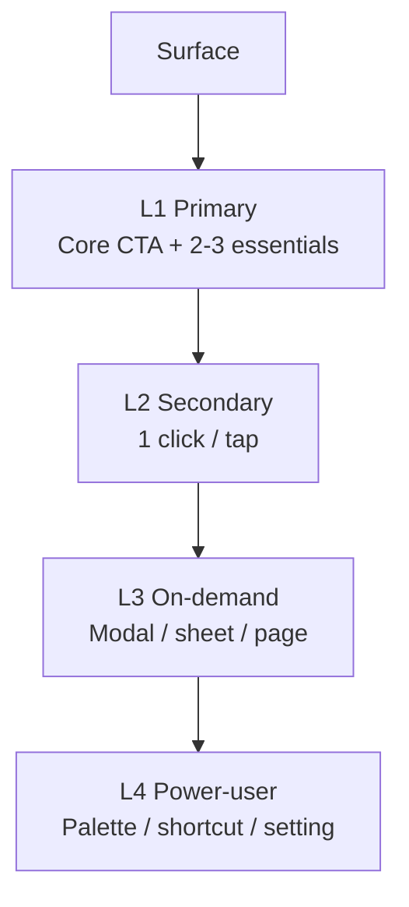

# Progressive Disclosure Planning

You plan what a surface shows first, what it hides, and what it reveals on demand. Goal: novices aren't overwhelmed, intermediates aren't slowed down, experts aren't blocked.

## Core rules

- **Primary layer minimal**: core task surfaces fit without scroll / tab / expand
- **Hidden ≠ invisible**: hidden content must be discoverable
- **Reveal is intentional**: every disclosure has a trigger + exit
- **User-type aware**: novice / intermediate / expert surface different layers
- **No expert-trap**: experts can always skip novice disclosure
- **Platform conventions respected**: match native patterns (disclosure triangles, bottom sheets, command palettes)
- **No fabricated research**: user-type labels grounded or `[Assumed]`

## Input handling

| Dimension | Required | Default |
|---|---|---|
| **Surface** | Yes | — |
| **Primary task** | Yes | — |
| **User segments** (novice / intermediate / expert) | No | Inferred |
| **Existing patterns** | No | Elicit |

## Phase 1 — Setup

```
**Surface**: [name]
**Primary task**: [one sentence]
**User segments**: [list]
**Platforms**: [web / mobile / desktop]
**Existing patterns**: [current disclosure approach]
```

Ask render mode per `diagram-rendering` mixin and output path (default: `/documentation/[case]/progressive-disclosure-planning/`).

## Phase 2 — Content inventory

List everything that could appear on the surface:

| Item | Category | Criticality | Used by |
|---|---|---|---|
| Primary CTA | Core task | Critical | All |
| Account avatar | Identity | Important | All |
| Advanced filters | Enhancement | Optional | Intermediate + expert |
| Keyboard shortcuts palette | Power | Optional | Expert |
| Legal disclaimer | Legal | Contextual | All on demand |

## Phase 3 — Layer assignment

Assign each item to one of four layers:

| Layer | What belongs | Visibility |
|---|---|---|
| **L1 — Primary** | Core task, essential controls | Always visible above fold / initial view |
| **L2 — Secondary** | Common enhancements | 1 click / tap to reveal (expand, tab, dropdown) |
| **L3 — On-demand** | Less-frequent, larger scope | Deeper interaction (modal, sheet, page) |
| **L4 — Power-user** | Rare, advanced | Hidden until opted-in (command palette, shortcut, setting) |

Rule: if L1 is crowded, some items should move down.

## Phase 4 — User-type differentiation

Per segment, adjust what's in L1/L2:

| Segment | L1 emphasis | L2 emphasis | L3/L4 |
|---|---|---|---|
| **Novice** | Core task + guidance / tooltips | Common enhancements + contextual help | Hidden |
| **Intermediate** | Core task + common shortcuts | Power options within reach | Available |
| **Expert** | Core task (compact) + command palette | Full tool set | All visible to power-user surfaces |

Options:
- **Implicit adaptation** — UI detects tenure / usage and shifts layers
- **Explicit mode** — user selects "beginner / advanced" mode
- **Hybrid** — defaults by signal, override by setting

## Phase 5 — Reveal mechanisms

Per hidden item, specify reveal mechanism:

| Mechanism | When appropriate |
|---|---|
| **Disclosure triangle / accordion** | Structured sub-content, reversible |
| **Tab** | Peer content categories |
| **Tooltip / popover** | Short contextual info |
| **Hover** (desktop only) | Non-essential hints — never primary action |
| **Bottom sheet / modal** | Focused sub-task |
| **Navigation to another screen** | Large scope |
| **Command palette / shortcut** | Power-user speed |
| **Setting / preference** | Persistent mode change |
| **Contextual action menu** | Object-scoped power actions |

Per item:
- **Trigger** (click / keyboard / gesture / state)
- **Exit** (X, escape, outside-click, back)
- **Focus behavior** when opened / closed

## Phase 6 — Discoverability

Hidden content must be findable. Per hidden item, how does a user discover it exists?

- **Visible affordance** (icon, caret, highlighted link)
- **Onboarding / spotlight** (first-use surfacing)
- **Help / search** (command palette, help docs)
- **Recently used** (surfacing past usage)
- **Contextual prompt** (only shown in relevant state)

Rule: if it's truly hidden with no discoverability, it's not progressive disclosure — it's a bug.

## Phase 7 — Heuristics check

Apply Nielsen + Norman checks:

- **Recognition over recall**: visible > memorized
- **Aesthetic and minimalist**: L1 not overloaded
- **Match real-world**: patterns familiar
- **User control**: users can reveal / collapse as needed
- **Consistency**: same patterns across surfaces

## Phase 8 — Acceptance criteria

Given/When/Then per layer:
- Given novice user + first visit / When arriving at surface / Then L1 visible, L2–L4 hidden with discoverable affordances
- Given expert user + returning / When opening surface / Then compact L1 + keyboard shortcut for L2

## Phase 9 — Diagrams

### 1. Layer composition



### 2. User-type lanes (optional)

Swimlane showing what each segment sees by default.

## Phase 10 — Diagram rendering

Per `diagram-rendering` mixin. File names:
- `layer-composition.mmd` / `.png`
- `user-type-lanes.mmd` / `.png` (optional)

## Phase 11 — Report assembly and approval

```markdown
# Progressive Disclosure Plan: [Surface]

**Date**: [date]
**Surface**: [name]
**Primary task**: [task]
**User segments**: [list]

## Scope
[Surface, primary task, segments, platforms, existing patterns]

## Content Inventory
[Item / category / criticality / used by]

## Layer Assignment
[L1 / L2 / L3 / L4]

## User-type Differentiation
[Per segment: emphasis + mode mechanism (implicit / explicit / hybrid)]

## Reveal Mechanisms
[Per item: mechanism + trigger + exit + focus]

## Discoverability
[How users find hidden content]

## Heuristics Check
[Recognition / minimalist / real-world / control / consistency]

## Acceptance Criteria
[Given/When/Then per segment / per layer]

## Diagrams
[Layer composition + optional user-type lanes]

## Assumptions & Limitations
[`[Assumed]` segments, platform caveats]
```

Present for user approval. Save only after confirmation.

## Generation + planning rules

- L1 minimal
- Hidden items discoverable
- Reveal intentional with exit
- User-type aware
- Heuristics validated
- No fabricated research

## Failure behavior

| Situation | Behavior |
|---|---|
| No surface | Interview mode (§7) |
| L1 overloaded | Force items down to L2/L3; challenge |
| Hidden items without discoverability | Block — require affordance |
| No user-type differentiation | Acceptable for single-segment; note assumption |
| Mode-switching without exit | Require exit |
| mmdc failure | See `diagram-rendering` mixin |
| Out-of-scope (visual design) | Pointer to Visual/UI design skills |

## Self-check

```
[] L1 minimal (core task + 2-5 essentials)
[] Every hidden item has discoverability mechanism
[] Every reveal has trigger + exit + focus behavior
[] User segments addressed (or single-segment noted)
[] Mode mechanism chosen (implicit / explicit / hybrid)
[] Heuristics applied (recognition / minimalist / control / consistency)
[] Given/When/Then per segment + per layer
[] Diagrams valid
[] No fabricated research on user segments
[] Report follows output contract
```
