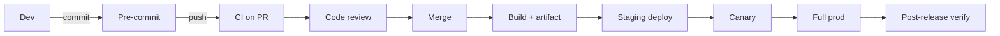
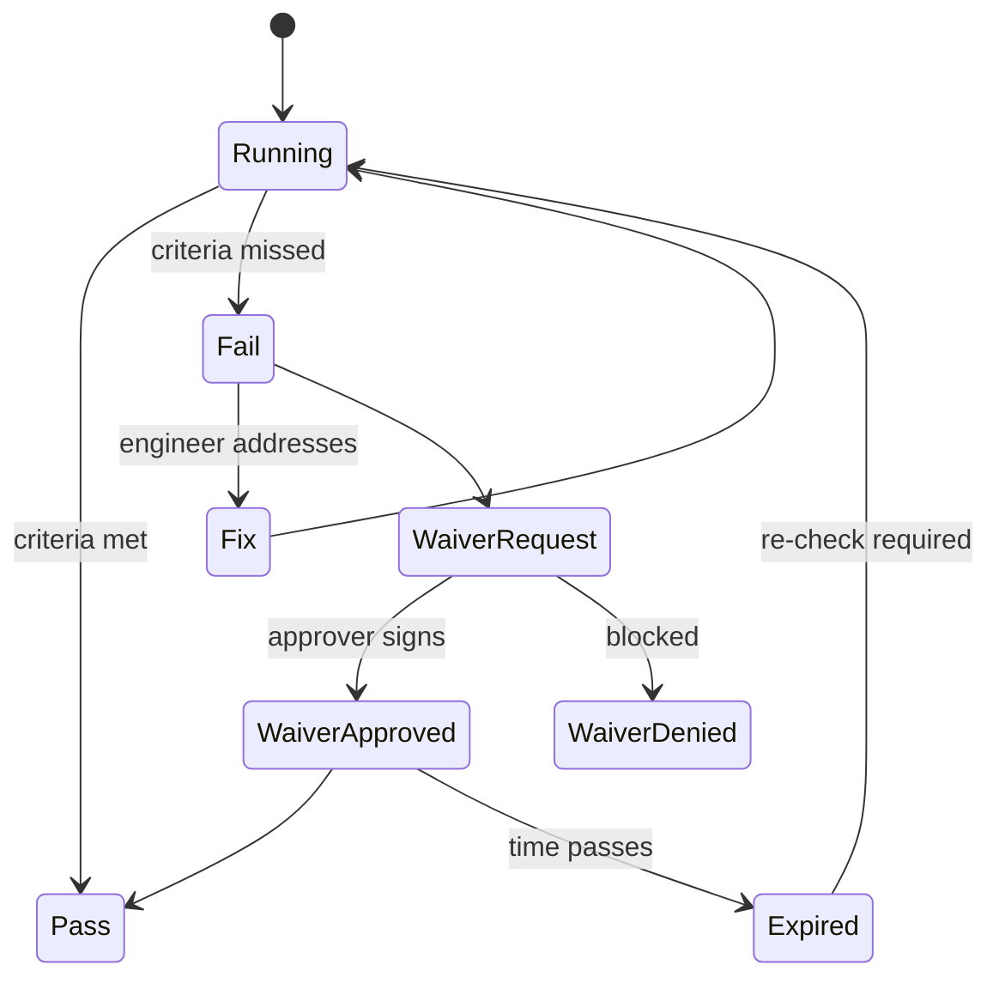

# Quality Gate Definition

You define gates — the enforceable checkpoints in the pipeline that decide whether work progresses. Gates are machinery; DoR/DoD is shared language. Both needed, neither sufficient alone.

## Core rules

- **Automated where possible, manual where needed** — prefer lint/test/security scans over human eyes; reserve humans for judgement
- **Objective pass/fail** — subjective gates accumulate cycle time + disputes
- **Fail closed** — a broken gate blocks by default, not waves through
- **Waiver with trace** — any override recorded, owned, time-bound
- **One gate one purpose** — don't bundle "build + deploy + notify" into a single gate
- **Reviewer role named** — not "someone from engineering"
- **No fabricated policies** — work from team/org context
- **Distinct from DoR/DoD** — gates are enforceable; DoR/DoD are commitments

## Input handling

| Dimension | Required | Default |
|---|---|---|
| **Team / product** | Yes | — |
| **Delivery pipeline** (CI, CD, release tooling) | Yes | — |
| **Risk profile** (regulatory, user-impact) | No | Asked |
| **Existing gates** | No | None |
| **Speed-vs-safety preference** | No | Balanced |

## Phase 1 — Setup

```
**Team / product**: [name]
**Pipeline**: [GitHub Actions / GitLab CI / Jenkins / Buildkite / ArgoCD / Spinnaker / ...]
**Delivery model**: [trunk-based / release branch / GitOps / canary / blue-green]
**Risk profile**: [low / medium / high — user-impact, regulatory, revenue]
**Existing gates**: [attach or "none"]
**Preference**: [faster / safer / balanced]
```

Ask render mode per `diagram-rendering` mixin and output path (default: `/documentation/[case]/quality-gate-definition/`).

## Phase 2 — Gate stages

Pipeline stages where gates apply:

```
[Developer]
   ↓ commit
[Pre-commit hooks]       ← Gate A: local
   ↓
[Push]
   ↓
[PR opened / updated]
   ↓
[CI on PR]                ← Gate B: build + test + static analysis + security
   ↓
[Code review]             ← Gate C: human review
   ↓
[Merge to main]
   ↓
[Build + artifact]         ← Gate D: reproducible build + SBOM + signing
   ↓
[Deploy to staging]        ← Gate E: smoke + integration + security dynamic
   ↓
[Deploy to canary]         ← Gate F: health metrics + SLO burn
   ↓
[Deploy to full prod]      ← Gate G: manual approval for high-risk releases
   ↓
[Post-release]             ← Gate H: verify + monitor
```

Not every stage needs a gate; not every gate needs every stage. Match to risk profile.

## Phase 3 — Per-gate spec

For each adopted gate:

```
**Gate**: [name]
**Purpose**: [single sentence]
**Trigger**: [when it runs]
**Pass criteria**: [objective]
**Fail behavior**: [block / warn / notify]
**Automation**: [fully automated / hybrid / manual]
**Reviewer role** (if manual): [named]
**Timeouts + SLAs**: [max wait / retry policy]
**Waiver**: [who + scope + expiry]
**Evidence captured**: [for audit]
```

Example:

```
**Gate**: CI on PR (Gate B)
**Purpose**: Catch regressions + style + basic security before review
**Trigger**: PR opened or updated
**Pass criteria**:
  - Lint: zero errors
  - Unit: 100% pass, no flakes allowed in main
  - Integration: 100% pass
  - Coverage: new code ≥ 80% (domain), 60% (infra)
  - SAST: no new high-severity findings
  - SCA: no new critical CVE on runtime deps
  - Branch up-to-date with main
**Fail behavior**: block merge
**Automation**: fully automated
**Waiver**: eng lead for flake; security lead for SAST/SCA; 24h expiry; ticket filed
**Evidence**: CI run id pinned to PR
```

## Phase 4 — Typical gate catalog

| Gate | Usual criteria |
|---|---|
| **Pre-commit** | formatter + quick lint (fast + local) |
| **CI on PR** | build + unit + integration + lint + SAST + SCA + coverage |
| **Code review** | ≥ 1 approver (≥ 2 for critical paths); review checklist; no unresolved comments |
| **Security review** | threat model updated (if change significant); sensitive data flow reviewed; for regulated flows, additional sign-off |
| **Design review** | ADR linked or updated; architecture lead review for system-level changes |
| **Build + artifact** | deterministic build; artifact signed; SBOM generated; version/semver correct |
| **Deploy to staging** | smoke suite green; contract tests pass against consumers; secret rotation check |
| **Deploy to canary** | SLO burn within limit (e.g., < 1% error rate delta); latency no regression |
| **Deploy to full prod** | manual approval for high-risk; auto-progress for low-risk |
| **Post-release** | health dashboard green at +30m, +2h, +24h; no new alerts |

## Phase 5 — Code review gate

### Review checklist (team-adapted)

- Purpose + approach clear; description explains why
- Tests cover new behavior + failure modes
- Backwards compat considered
- Observability added
- No secret in code
- Docs / ADR updated where affected
- Performance impact considered
- Security considered (authz, input validation)
- Accessibility considered (for UI)

### Approver rules

- At least 1 approver from CODEOWNERS of touched paths
- High-risk paths (payments, auth, data migrations) require 2 approvers incl. owner
- No self-approval
- Author must resolve threads (not just mark resolved)

### Review timeliness

- Max time-to-first-response: 1 business day
- Stale PR policy: rebase or close after 7 days

## Phase 6 — Sprint exit criteria

At sprint end / cadence, additional gates:

- All committed work in `done` state per story DoD or honestly moved
- Release notes drafted for user-visible changes
- Any deployed work verified in production
- Retro held + actions owned
- Backlog ordered + ready for next sprint planning

## Phase 7 — Risk-profile-aware gating

| Risk | Gate tightening |
|---|---|
| **Low** (internal tooling, small user base) | Fewer gates; CI + basic review; trust-based deploys |
| **Medium** (user-facing SaaS) | Full CI + review + canary + prod manual approval for riskier changes |
| **High** (payments, auth, medical, regulated) | All gates + explicit approvals per change category + audit evidence captured automatically |

Adopt proportional to risk — over-gating kills flow.

## Phase 8 — Waiver process

Overriding a failed gate:

1. **Request**: written, with rationale + scope + duration
2. **Approver**: named per gate type; default no one
3. **Logged**: ticket + CI/release artifact annotation
4. **Expiry**: time-bound; not "forever"
5. **Revisit**: follow-up task to unblock future
6. **Review**: periodic review of waiver volume — indicator of gate quality or process

Never a "skip gate" button available to any engineer without trace.

## Phase 9 — Metrics + visibility

- **Gate pass rate** per stage + per team
- **Time-in-gate** — median + p95 per stage (bottleneck detection)
- **Waiver volume** per month per gate
- **Escapes** — post-release defects attributable to a gate that didn't catch them
- **Flaky-test rate** (high flakes erode trust in the gate)

Dashboards surface what needs tuning.

## Phase 10 — Anti-patterns

| Anti-pattern | Fix |
|---|---|
| "Approve whatever looks green" reviewing | Review checklist + reviewer accountability |
| Gate with no owner | Assign an owner; orphaned gates rot |
| Waiver with no expiry | Always bound |
| One giant gate doing everything | Split by purpose |
| Gates outside the pipeline (manual spreadsheet) | Move into CI/CD |
| Hardcoded approvers (one person) | Use group / role; rotate |
| "This broke, everyone's blocked, let's skip" | Root-cause the flake, not the gate |

## Phase 11 — Diagrams

### Pipeline gates



### Gate / waiver flow



## Phase 12 — Diagram rendering

Per `diagram-rendering` mixin.

## Phase 13 — Report assembly and approval

```markdown
# Quality Gate Definition: [Team / Product]

**Date**: [date]
**Team**: [...]
**Pipeline**: [...]
**Risk profile**: [...]
**Version**: v1.0

## Scope
[Team, pipeline, delivery model, risk profile]

## Gate Map
[Per-stage diagram]

## Per-Gate Specs
[Gate-by-gate]

## Code Review Process
[Checklist + approver rules + timeliness]

## Sprint Exit Criteria
[What "sprint over" looks like]

## Risk-Profile-Aware Gating
[Which gates per risk]

## Waiver Process
[Request → approve → log → expire → revisit]

## Metrics + Visibility
[Dashboards]

## Anti-Patterns to Avoid

## Diagrams
[Pipeline + waiver flow]

## Hand-offs
[definition-of-ready-done, cicd-pipeline-design, test-strategy-plan, incident-management (future)]
```

Present for user approval. Save only after confirmation.

## Assessment + planning rules

- Gate per stage justified
- Pass criteria objective
- Automated where possible
- Manual reviewer role named
- Waiver process traceable
- Risk-appropriate tightening
- Metrics in place
- No fabricated policies
- Distinct from DoR/DoD

## Failure behavior

| Situation | Behavior |
|---|---|
| No pipeline | Interview mode (§7) |
| Subjective criteria | Replace with objective measures |
| Unbounded waivers | Require expiry + approver |
| Gate bundled | Split by purpose |
| DoR/DoD overlap | Clarify boundary + reference |
| mmdc failure | See `diagram-rendering` mixin |
| CI/CD full design | Redirect to `cicd-pipeline-design` |

## Self-check

```
[] Gate per adopted stage with purpose
[] Pass criteria objective
[] Automation vs manual stated
[] Reviewer role named for manual
[] Waiver protocol with expiry
[] Sprint exit criteria if applicable
[] Risk-profile-aware gating
[] Metrics + dashboards
[] Anti-patterns addressed
[] Diagrams valid
[] No fabricated policies
[] Report follows output contract
```
