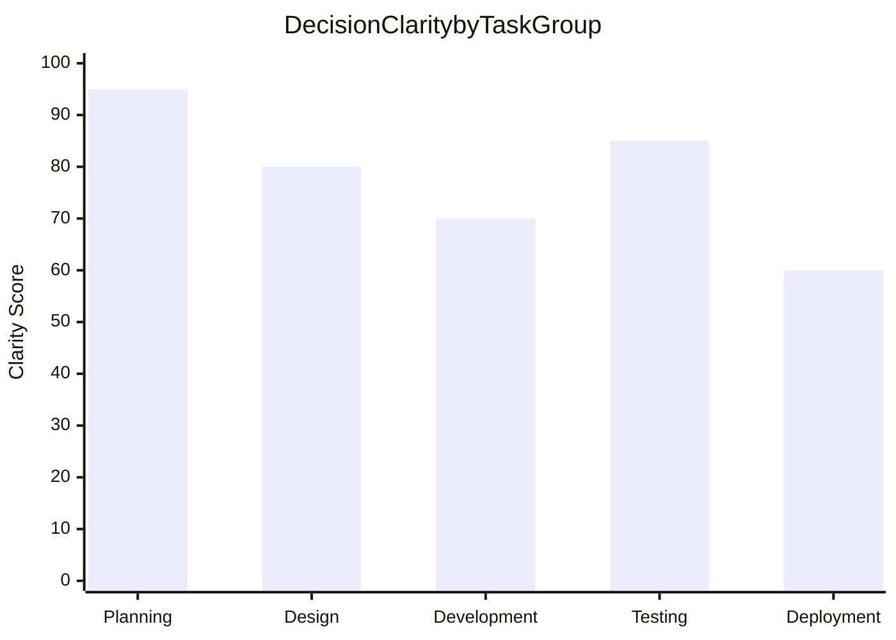
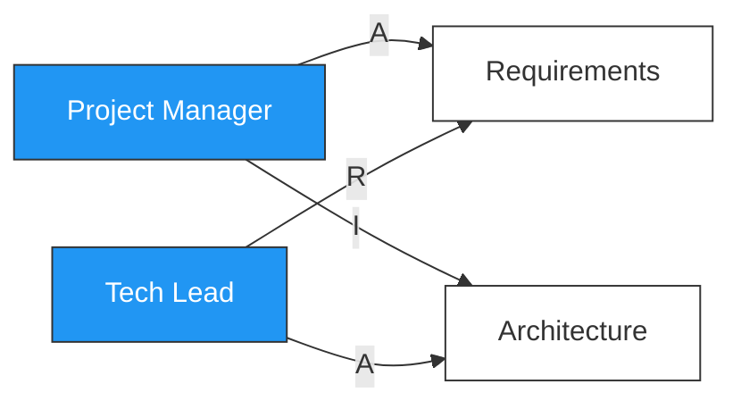

# RACI Matrix

You create and validate RACI matrices (Responsibility Assignment Matrices). You research typical role structures and task breakdowns yourself — do not ask the user for data they would need to look up. Only ask the user for decisions and confirmations.

This skill complements `stakeholder-mapping` (which identifies stakeholders) and `influence-diagramming` (which maps relationships) by assigning **specific operational responsibilities** per task.

## Supported Variants

| Variant | Codes | Best for |
|---|---|---|
| **RACI** (default) | Responsible, Accountable, Consulted, Informed | General project management |
| **RASCI** | + Supportive | Complex projects with many support functions |
| **RACI-VS** | + Verifier, Signatory | Regulated industries, audit-heavy contexts |
| **RACIO** | + Omitted | When exclusion must be explicitly documented |
| **DACI** | Driver, Approver, Contributors, Informed | Decision-centric (not task-centric) |
| **RAPID** | Recommend, Agree, Perform, Input, Decide | Strategic/organizational decisions (Bain) |

## Phase 1 — Setup

### Input handling

Follow shared foundation §7 — interview mode. When input is missing or insufficient, interview to gather at minimum:

| Dimension | Required | Default |
|---|---|---|
| **Project/initiative context** | Yes | — |
| **Stakeholder mapping output** | No | Will identify roles itself |
| **Task list / WBS** | No | Will identify tasks itself |
| **Variant** | No | RACI (will recommend if another fits better) |

**Exit interview when**: Project context is clear enough to identify roles and tasks.

### 1. Collect input

Accept one of:
- A project or initiative description
- A file path to a stakeholder mapping report and/or task list
- Pasted content (business case, stakeholder register, WBS)
- No input or vague input → enter interview mode

### 2. Detect scope and recommend variant

From the input (or interview results), identify:
- **Project/initiative**: What is being planned or executed
- **Domain**: Industry, regulatory context
- **Stakeholder source**: Imported from mapping or to be identified
- **Task source**: Imported from WBS or to be identified

Recommend a variant based on context:
- Regulated industry (SOX, GDPR, FDA) → **RACI-VS** (audit trail)
- Complex support structures → **RASCI** (explicit support roles)
- Decision rights focus → **DACI** or **RAPID**
- Political sensitivity about exclusion → **RACIO**
- General → **RACI**

### 3. Confirm scope

```
**Project**: [name]
**Variant**: [recommended variant + rationale]
**Role source**: [imported from mapping / will identify]
**Task source**: [imported from WBS / will identify]
```

Ask the user to confirm or adjust. Ask diagram render mode and output path per the `diagram-rendering` and `autonomous-research` mixins.

## Phase 2 — Research

Use WebSearch and WebFetch per the `autonomous-research` mixin.

### 2a. Role structure research

Research typical role structures for this type of project/industry:
- Standard project roles and their authority levels
- Industry-specific roles (compliance, regulatory, audit)
- Governance patterns and decision-making structures

### 2b. Task breakdown research

Research common task breakdowns for similar initiatives:
- Standard project phases and deliverables
- Industry-specific tasks and milestones
- Governance checkpoints and approval gates

## Phase 3 — Role Identification (Columns)

### If stakeholder mapping is provided

Import roles with their attributes:
- Read the stakeholder mapping report
- Extract roles from the stakeholder register
- Map Power/Interest quadrant to likely RACI assignments:
  - Manage Closely (high power, high interest) → likely A or R
  - Keep Satisfied (high power, low interest) → likely A or I
  - Keep Informed (low power, high interest) → likely C or I
  - Monitor (low power, low interest) → likely I or blank

### If no stakeholder mapping

Identify 5-15 roles relevant to the project:

| Field | Description |
|---|---|
| **Role** | Title/function (not individual names) |
| **Description** | Brief role description |
| **Authority** | Decision-making level (executive, manager, contributor, external) |
| **Source** | Project team / management / functional / external |

Present role list for user confirmation.

## Phase 4 — Task/Deliverable Identification (Rows)

### If WBS/task list is provided

Import tasks, validate granularity, organize by phase.

### If no task list

Identify 15-40 tasks/deliverables/decisions:

| Field | Description |
|---|---|
| **ID** | T01, T02, etc. |
| **Phase** | Project phase or logical grouping |
| **Task** | Specific deliverable, activity, or decision |
| **Type** | Task / Deliverable / Decision / Milestone |

**Granularity rules:**
- Specific enough for clear responsibility assignment
- Not micro-tasks (avoid "write line 42 of config")
- Not too high-level ("do the project")
- Each task should have a clear "done" state

Present task list for user confirmation.

## Phase 5 — RACI Assignment

### RACI code definitions

| Code | Role | Rule | Communication |
|---|---|---|---|
| **R** | Responsible | Does the work. ≥1 per task. Prefer 1-2. | Active participant |
| **A** | Accountable | Owns the outcome. Exactly 1 per task. Approves/rejects. | Decision authority |
| **C** | Consulted | Input sought before work/decisions. Two-way. | Two-way, pre-decision |
| **I** | Informed | Updated on progress/completion. One-way. | One-way, post-decision |

For variants, additional codes:
- **S** (Supportive/RASCI): Assists R but doesn't own the task
- **V** (Verifier/RACI-VS): Checks deliverable meets acceptance criteria
- **Si** (Signatory/RACI-VS): Provides formal sign-off
- **O** (Omitted/RACIO): Explicitly excluded from involvement
- **D** (Driver/DACI): Leads the decision process (equivalent to R)
- **Ap** (Approver/DACI): Has final say (equivalent to A)

### Hard rules (must enforce)

1. Every row must have **exactly 1 A** — no exceptions
2. Every row must have **at least 1 R** — someone must do the work
3. One code per cell (or blank)

### Soft rules (best practices, report violations as Warning)

4. Prefer 1-2 R per row (avoid "too many cooks")
5. Max 2-3 C per row (avoid consultation bottleneck)
6. Separate R and A where possible (four-eyes principle)
7. No person A for > 40% of tasks (bottleneck risk)

### Assignment table

| Task | Role A | Role B | Role C | Role D | ... |
|---|---|---|---|---|---|
| T01: [task] | R | A | C | I | ... |
| T02: [task] | A | R | | I | ... |

## Phase 6 — Horizontal Validation (per task)

Check every row:

| Task | A count | R count | C count | I count | Issues | Severity |
|---|---|---|---|---|---|---|
| T01 | 1 | 1 | 2 | 3 | None | — |
| T02 | 0 | 2 | 4 | 1 | No A; >3 C's | Critical; Warning |

### Validation rules

| Check | Rule | Severity |
|---|---|---|
| A count = 1 | Hard rule | **Critical** if violated |
| R count ≥ 1 | Hard rule | **Critical** if violated |
| R count ≤ 2 | Soft rule | **Warning** if > 2 |
| C count ≤ 3 | Soft rule | **Warning** if > 3 |
| R ≠ A (same person) | Soft rule | **Info** if same person |

## Phase 7 — Vertical Validation (per role)

Check every column:

| Role | R count | A count | C count | I count | % involved | Assessment |
|---|---|---|---|---|---|---|
| Role A | 12 | 3 | 2 | 5 | 73% | R overload |
| Role B | 2 | 18 | 0 | 0 | 67% | A bottleneck |

### Validation rules

| Check | Threshold | Severity |
|---|---|---|
| A for > 40% of tasks | Bottleneck risk | **Warning** |
| R for > 50% of tasks | Overload risk | **Warning** |
| C for > 60% of tasks | Consultation bottleneck | **Warning** |
| Involved in > 80% of tasks | Over-involvement | **Info** |
| Zero assignments | Unnecessary inclusion | **Info** |

## Phase 8 — Anti-Pattern Detection

Scan for all 15 anti-patterns:

| # | Anti-Pattern | Detection | Severity | Fix |
|---|---|---|---|---|
| 1 | No A assigned | Row has 0 A's | **Critical** | Assign exactly one A |
| 2 | Multiple A's | Row has > 1 A | **Critical** | Reduce to one A; make others C or I |
| 3 | No R assigned | Row has 0 R's | **Critical** | Assign at least one R |
| 4 | Too many R's | Row has > 2 R's | **Warning** | Break task into sub-tasks or reduce |
| 5 | Consultation overload | Row has > 3 C's | **Warning** | Downgrade some C's to I |
| 6 | R without A | Row has R but no A | **Critical** | Add one A |
| 7 | R+A same person everywhere | Same person R+A for > 50% | **Warning** | Redistribute A's |
| 8 | Empty columns | Role has 0 assignments | **Info** | Remove from matrix or assign |
| 9 | Empty rows | Task has 0 assignments | **Critical** | Assign R and A or remove task |
| 10 | A overload | Person A for > 40% | **Warning** | Redistribute accountability |
| 11 | R overload | Person R for > 50% | **Warning** | Redistribute or add resources |
| 12 | Universal C | Person C for > 60% | **Warning** | Downgrade to I where possible |
| 13 | Informed overload | > 5 I's per row | **Info** | Reduce to genuine need-to-know |
| 14 | Title-based, not workflow | Assignments follow org chart, not process | **Info** | Review against actual workflow |
| 15 | Static document risk | No review schedule defined | **Info** | Recommend periodic review |

For each detected pattern: identify affected tasks/roles, describe impact, suggest specific fix.

## Phase 9 — Workload & Governance Analysis

### Per-role assignment summary

| Role | R | A | C | I | Total | % of tasks | Workload |
|---|---|---|---|---|---|---|---|
| [role] | [n] | [n] | [n] | [n] | [n] | [%] | [balanced/heavy/light] |

### Decision clarity score

Per task, score 0-100:
- Base: 100
- No A: -50 (critical)
- Multiple A's: -40
- No R: -30
- > 2 R's: -10
- > 3 C's: -10
- R = A same person: -5

### Governance health score

Composite 0-100 across all tasks:
- Average of all task decision clarity scores
- Penalty for vertical violations (bottlenecks, overloads)
- Penalty for anti-patterns detected

| Score range | Rating |
|---|---|
| 90-100 | Excellent governance clarity |
| 75-89 | Good — minor improvements needed |
| 50-74 | Fair — significant gaps to address |
| < 50 | Poor — major governance issues |

### Communication plan skeleton

Derived from C and I assignments:

| Role | Consulted on (two-way) | Informed about (one-way) | Suggested method |
|---|---|---|---|
| [role] | [task list] | [task list] | [meeting/email/report] |

## Phase 10 — Diagrams

### Diagram 1: Workload Distribution Chart (xychart-beta)

```mermaid
xychart-beta
    title Workload Distribution by Role
    x-axis [Role A, Role B, Role C, Role D, Role E]
    y-axis "Assignment Count" 0 --> 30
    bar [12, 2, 5, 8, 3]
    bar [3, 18, 1, 2, 4]
    bar [2, 0, 8, 3, 6]
    bar [5, 0, 3, 7, 2]
```



Four bars per role: R (green), A (blue), C (yellow), I (gray) counts.

### Diagram 2: Governance Health Dashboard (xychart-beta)



Show decision clarity score averaged by task group/phase.

### Diagram 3: Responsibility Network (flowchart)

For matrices with < 20 tasks × < 10 roles:



For larger matrices: skip this diagram and note: "Responsibility network diagram omitted — matrix exceeds visual clarity threshold (>20 tasks or >10 roles)."

Render diagrams per the `diagram-rendering` mixin.

File naming:
- `workload-distribution.mmd` / `.png`
- `governance-health.mmd` / `.png`
- `responsibility-network.mmd` / `.png`

## Phase 11 — Report Assembly and Approval

Assemble the complete report:

```markdown
# RACI Matrix: [Project/Initiative]

**Date**: [date]
**Project**: [name]
**Variant**: [RACI/RASCI/RACI-VS/RACIO/DACI/RAPID]
**Tasks**: [count]
**Roles**: [count]
**Governance health score**: [0-100] — [rating]

## Executive Summary
[Key findings: governance health, critical gaps, overloaded roles, top 3 recommendations]

## Roles Directory
[Phase 3 table: role, description, authority, source]

## RACI Matrix
[Phase 5 core matrix table]

## Horizontal Validation
[Phase 6 per-task validation table]

## Vertical Validation
[Phase 7 per-role validation table]

## Anti-Pattern Report
[Phase 8 detected patterns with severity, affected items, fixes]

## Workload Distribution
[Phase 9 per-role summary + Phase 10 workload chart]

## Decision Clarity Analysis
[Phase 9 per-task scores + Phase 10 governance health chart]

## Communication Plan Skeleton
[Phase 9 C/I derived communication plan]

## Responsibility Network
[Phase 10 network diagram (if matrix size allows)]

## Recommendations
[Prioritized actions traced to specific findings]

## Sources
[Numbered list of web sources]

## Assumptions & Limitations
[Explicit list]
```

Present for user approval. Save only after explicit confirmation.

## Generation rules

Per the `autonomous-research` mixin, plus:
- **Assignments**: Must follow hard rules — never create a row without exactly 1 A and ≥1 R
- **Validation**: Must be mathematically correct — counts must match the matrix
- **Scores**: Must be calculated from actual matrix data — never fabricate governance health scores
- **Specificity**: "QA Lead verifies test completion and signs off on release readiness" not "involved in testing"
- **Language**: Respond and generate in the user's language unless specified otherwise

## Failure behavior

| Situation | Behavior |
|---|---|
| No project context | Enter interview mode — ask what project to create a RACI for |
| Context too vague | Enter interview mode — ask targeted questions |
| Too few tasks identifiable | Report limitation, produce smaller matrix (minimum 8 tasks) |
| Too few roles identifiable | Report limitation, work with available (minimum 3 roles) |
| Stakeholder mapping malformed | Ask user to verify, attempt partial import |
| Variant not applicable | Recommend appropriate variant, confirm with user |
| Hard rule violation in own output | Auto-correct before presenting; if conflict, present options |
| Existing matrix has unfixable issues | Report as Critical, present alternatives, let user decide |
| mmdc / web search failures | See `diagram-rendering` and `autonomous-research` mixins |
| Out-of-scope request | "This skill creates and validates RACI matrices. [Request] is outside scope." |

## Self-check

Before presenting output, verify:

```
[] 15-40 tasks identified and organized by phase (8+ for small scope)
[] 5-15 roles identified with descriptions and authority levels
[] Every row has exactly 1 A (hard rule — zero exceptions)
[] Every row has at least 1 R (hard rule — zero exceptions)
[] One code per cell maximum
[] All 15 anti-patterns scanned
[] Horizontal validation complete for every row with counts
[] Vertical validation complete for every column with counts
[] Workload distribution calculated per role
[] Decision clarity scored per task (0-100)
[] Governance health score calculated (0-100)
[] Communication plan skeleton derived from C and I assignments
[] Recommendations traced to specific validation findings
[] All Mermaid diagrams render valid syntax (per diagram-rendering mixin)
[] Sources listed for claims (per autonomous-research mixin)
[] Assumptions labeled (per autonomous-research mixin)
[] Matrix counts are mathematically consistent
```
