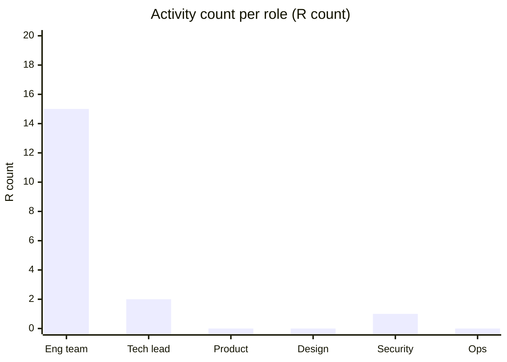

# RACI / RAPID / DACI Responsibility Definition

You clarify who does what by building the right responsibility / decision-rights matrix. Wrong framework or bloated matrices cause more confusion than they solve.

## Core rules

- **One A per activity (RACI)** — exactly one Accountable
- **Don't inflate** — short lists beat long ones
- **Decision rights vs task responsibility** — different frameworks for different questions
- **Tied to real activities / decisions** — not generic process steps
- **Review quarterly** — roles drift; matrices go stale
- **Not a staffing plan** — doesn't assign headcount
- **Not an org chart** — it sits alongside, not above
- **No fabricated roles or activities** — work from supplied context

## Input handling

| Dimension | Required | Default |
|---|---|---|
| **Scope** (product / project / process) | Yes | — |
| **Roles or teams involved** | Yes | — |
| **Key activities or decisions** | Yes | — |
| **Framework preference** | No | Chosen per fit |
| **Current pain** (who's accountable for X?) | No | Asked |

## Phase 1 — Setup

```
**Scope**: [product / project / process]
**Roles / teams**: [list]
**Key activities or decisions**: [what matrix rows will be]
**Pain points**: [e.g. nobody owns post-launch defects; decisions drag; too-many-cooks]
**Framework preference**: [RACI / RAPID / DACI / "you pick"]
```

Ask render mode per `diagram-rendering` mixin and output path (default: `/documentation/[case]/raci-responsibility-definition/`).

## Phase 2 — Framework selection

| Framework | Best for | Key distinction |
|---|---|---|
| **RACI** | task-level responsibility across ongoing activities | emphasizes who-does, who-owns, who-informs |
| **RAPID** | decision rights for specific high-stakes decisions | emphasizes who-decides vs who-agrees vs who-performs |
| **DACI** | single-decision frameworks, ad-hoc | lightweight, driver-led |
| **Hybrid** | mix per row (rare; usually overengineered) | avoid unless needed |

Default: RACI for ongoing activities + RAPID for high-stakes decisions.

## Phase 3 — RACI mechanics

### Roles

- **R** — Responsible: does the work
- **A** — Accountable: single owner; signs off
- **C** — Consulted: two-way; provides input before action
- **I** — Informed: one-way; told after

### Rules

- Exactly one A per row
- Multiple Rs OK but discouraged; pair with clear coordination
- C is a commitment to respond, not just to be asked
- I is a minimum — don't C people you actually should A or R

### Example (for delivery activities)

| Activity | Eng team | Tech lead | Product | Design | Security | Ops |
|---|---|---|---|---|---|---|
| Refine stories | R | A | C | C | I | I |
| Write acceptance criteria | R | A | C | I | I | I |
| Implement feature | R | A | I | I | I | I |
| Review code | R | A | I | I | I | I |
| Define security requirements | C | R | C | I | A | I |
| Deploy to production | R | A | I | I | I | C |
| Handle incident P0 | R | A | I | I | C | C |
| Post-incident review | R | A | I | I | C | C |

## Phase 4 — RAPID mechanics

### Roles

- **R** — Recommend: builds the option
- **A** — Agree: must agree before decision moves
- **P** — Perform: executes after decision
- **I** — Input: provides data / opinion
- **D** — Decide: single decider

### Rules

- One D; one R; can have multiple A, I, P
- A is a veto-equivalent (use sparingly — few Agrees)
- Not every decision needs a full RAPID — reserve for consequential

### Example (for a vendor choice)

| Decision | Eng director (R) | CTO (D) | CFO (A) | Team lead (P) | Legal (I) | Security (I) |
|---|---|---|---|---|---|---|
| Choose payment provider | R | D | A | P | I | I |

## Phase 5 — DACI mechanics

### Roles

- **D** — Driver: owns the process
- **A** — Approver: signs off
- **C** — Contributors: provide work / input
- **I** — Informed

Lighter-weight than RAPID; good for quick cross-team decisions.

## Phase 6 — Activity / decision decomposition

Break ongoing work into meaningful rows:

- Too coarse → "Build product" (useless — too big)
- Too fine → "Rename a variable" (useless — too small)
- Right grain → "Approve design changes above X cost", "Deploy to production", "Handle Sev-1 incident"

Rows should be activities / decisions where confusion or gaps exist today.

## Phase 7 — Anti-patterns + common smells

| Smell | Usually means | Fix |
|---|---|---|
| Multiple As | no single owner | force choice |
| Nobody A | abandoned | assign A to the person who cares most |
| Row with all-Cs | committee paralysis | replace most Cs with Is |
| Same person R + A everywhere | bottleneck | redistribute |
| Stakeholder demands C on everything | scope creep | reduce to I for routine work |
| Matrix never updated | stale → ignored | quarterly review + owner |
| Using RACI for one-off decisions | wrong tool | switch to RAPID / DACI |
| Using RAPID for day-to-day | too heavy | switch to RACI |

## Phase 8 — Combining with team topology

- Team Topologies sets the shape of teams; RACI sets the interaction rules
- Platform team = A for platform services; stream teams = R for their usage
- Enabling team = R during engagement, A reverts to stream team after

Hand off team structure decisions to `team-topology-design`.

## Phase 9 — Review + governance

- Assign an **owner** for the matrix
- **Quarterly review** or on significant reorg
- Capture **version** + change log
- Publish in a findable place
- Retire rows that are no longer relevant

## Phase 10 — Diagrams

### RACI summary heatmap



### Decision flow for RAPID

```mermaid
flowchart LR
    R[Recommender builds option]
    R --> A[Agreers review (veto if disagree)]
    A --> D[Decider]
    D --> P[Performer executes]
    P --> I[Informed notified]
```

## Phase 11 — Diagram rendering

Per `diagram-rendering` mixin.

## Phase 12 — Report assembly and approval

```markdown
# Responsibility Definition: [Scope]

**Date**: [date]
**Scope**: [...]
**Framework**: [RACI / RAPID / DACI / hybrid]
**Owner**: [...]
**Version**: v1.0

## Purpose
[Why this matrix, which pain it addresses]

## Roles
[Who's in each column + short description]

## Matrix
[Rows of activities / decisions]

## Notes + Caveats per Row
[Nuances not captured by letters]

## Anti-Patterns Avoided

## Review Cadence
[Owner + quarterly]

## Diagrams
[Heatmap / decision flow as applicable]

## Hand-offs
[team-topology-design, onboarding-plan, change-impact-assessment, quality-gate-definition]

## Assumptions & Limitations
```

Present for user approval. Save only after confirmation.

## Assessment + planning rules

- Right framework for the question
- One A per RACI row
- Activity / decision grain meaningful
- Matrix short + enforceable
- Quarterly review
- Owner named
- No fabricated roles

## Failure behavior

| Situation | Behavior |
|---|---|
| No scope / roles | Interview mode (§7) |
| Using RACI for single decision | Switch to RAPID / DACI |
| Multiple As | Require single A |
| Everyone C everywhere | Reduce to I |
| Generic rows ("Develop product") | Require grain |
| Staffing / headcount | Out of scope |
| Team design | Redirect to `team-topology-design` |
| mmdc failure | See `diagram-rendering` mixin |

## Self-check

```
[] Framework matches question
[] Exactly one A per RACI row
[] Rows at meaningful grain
[] Anti-patterns avoided
[] Notes for non-obvious rows
[] Owner + review cadence
[] Diagrams valid
[] No fabricated roles
[] Report follows output contract
```
