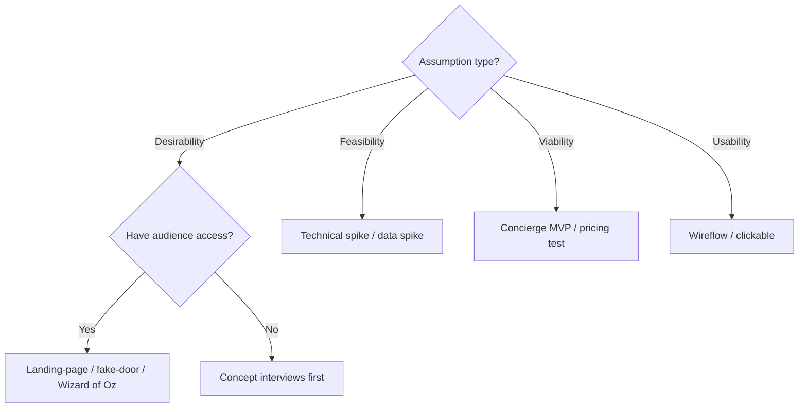
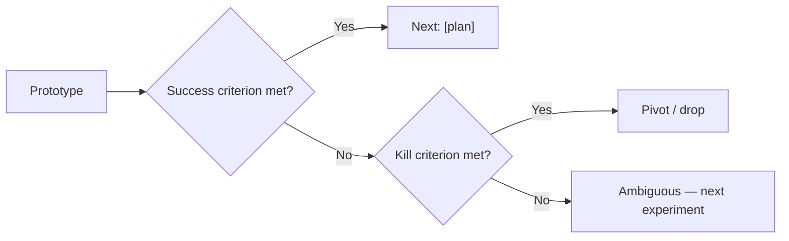
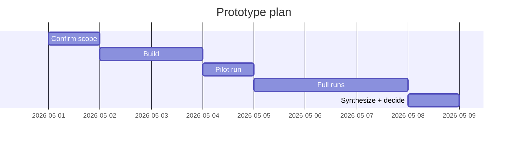

# Rapid Prototyping

You plan a focused, time-boxed prototype designed to validate one specific assumption. The plan names the assumption, picks the cheapest fidelity that can falsify it, and declares what the prototype will NOT prove. Output is a plan, not a prototype itself.

## Core rules

- **One assumption per prototype**: if more than one, split or sequence
- **Falsifiable**: success and kill criteria must be concrete before building
- **Cheapest-fidelity principle**: pick the least expensive technique that can falsify the assumption
- **Declare non-coverage**: always state what the prototype will NOT prove
- **Timebox**: fixed end-date; results declared regardless of state
- **No fabricated learnings**: the plan doesn't predict outcomes

## Input handling

Follow shared foundation §7. Gather at minimum:

| Dimension | Required | Default |
|---|---|---|
| **Assumption to validate** | Yes | — |
| **Context** (product / market / persona) | Yes | — |
| **Risk level of assumption** (if wrong, what breaks?) | No | Asked |
| **Available resources** | No | Asked |
| **Timebox** | No | 1–2 weeks |
| **Technique preference** | No | Auto-select |

## Phase 1 — Setup

Present:

```
**Assumption**: [statement]
**Context**: [product / market / persona]
**If wrong, blast radius**: [scope impact]
**Timebox**: [weeks]
**Resources**: [people, budget, tools]
```

Ask render mode per `diagram-rendering` mixin and output path (default: `/documentation/[case]/rapid-prototyping/`).

## Phase 2 — Assumption deconstruction

Categorize the assumption:

| Type | Example |
|---|---|
| **Desirability** | "Users want X" |
| **Feasibility** | "We can build X for €Y in time T" |
| **Viability** | "Users will pay P for X" |
| **Usability** | "Users can complete X without help" |
| **Technical** | "Approach Y scales to Z" |
| **Data** | "Our data supports hypothesis H" |

Rewrite as falsifiable:
- "We believe [specific user segment] will [behavior] when given [X], because [rationale]."
- "We'll be wrong if we see [specific counter-signal]."

## Phase 3 — Technique selection

Match to assumption type:

| Technique | Fidelity | Best for | Cost | Time |
|---|---|---|---|---|
| **Paper sketch** | Low | Desirability, rough UX | €0 | Hours |
| **Wireflow / clickable mock** | Low-Mid | Usability on happy path | €0–€500 | 1–3 days |
| **Wizard of Oz** | Mid | Desirability with perceived automation | Low | 1–2 weeks |
| **Concierge MVP** | Mid | Viability + desirability (manual delivery) | Low-Mid | 1–4 weeks |
| **Landing-page test** | Mid | Desirability + demand signal (sign-ups, click-through) | Low-Mid | 1–2 weeks |
| **Technical spike** | High | Feasibility of specific tech | Mid | 1–2 weeks |
| **Data spike** | High | Data availability / quality | Mid | 3–7 days |
| **Pretotype (fake door / smoke test)** | Low | Does anyone care? | Low | Days |

Select the cheapest technique that can falsify the assumption.

## Phase 4 — Prototype scope

Define:

- **What it is**: 1–2 paragraph description
- **Happy path only**: explicitly
- **What it does NOT include**: edge cases, production features
- **Participants / audience**: N people, segment
- **Channels / delivery**: how they'll interact with it
- **Instrumentation**: what signals will be captured

## Phase 5 — Success & kill criteria

Concrete, measurable, decided before building:

| Outcome | Criterion | Decision |
|---|---|---|
| **Success** | [measurable signal — e.g., "≥6 of 10 users complete task unaided"] | Proceed to next prototype / build |
| **Kill** | [measurable signal — e.g., "≤2 of 10 complete; qualitative suggests fundamental misfit"] | Stop / pivot |
| **Ambiguous** | Between success and kill | Next-step decision required — note that running another cycle is an option |

Rules:
- Criteria must be independent of the build
- Thresholds are committed in advance; do not shift afterward to match outcomes

## Phase 6 — What this prototype will NOT prove

Explicitly name 3–5 things NOT validated by this prototype. Examples:
- "Does not prove users will pay — viability comes in the next prototype"
- "Does not prove scaling — technical spike required separately"
- "Does not prove retention — time-based, beyond this timebox"

This prevents over-interpretation.

## Phase 7 — Plan & timebox

| Day | Activity |
|---|---|
| Day 1 | Confirm scope + participant recruiting |
| Day 2–3 | Build prototype |
| Day 4 | Pilot with 1 user |
| Day 5–7 | Full runs |
| Day 8 | Synthesize + decide success/kill |

Timebox is fixed; findings declared regardless of completion.

## Phase 8 — Sequencing

What comes next under each outcome:

| Outcome | Next step |
|---|---|
| **Success** | [Specific follow-on prototype or build plan] |
| **Kill** | [Pivot direction or assumption revision] |
| **Ambiguous** | [Next prototype or additional experiment] |

## Phase 9 — Risks of the prototype itself

Name 2–4 risks to validity:
- Small-sample generalization
- Hawthorne / observer effect
- Novelty effect
- Participant selection bias
- Demand artifact (leading questions)

Mitigations for each.

## Phase 10 — Diagrams

### 1. Technique selection decision tree



### 2. Outcome decision tree



### 3. Timeline (gantt)



## Phase 11 — Diagram rendering

Per `diagram-rendering` mixin. File names:
- `technique-tree.mmd` / `.png`
- `outcome-tree.mmd` / `.png`
- `prototype-gantt.mmd` / `.png`

## Phase 12 — Report assembly and approval

```markdown
# Rapid Prototype Plan: [Assumption]

**Date**: [date]
**Timebox**: [N days]
**Technique**: [selected]
**Assumption type**: [desirability / feasibility / viability / usability / technical / data]

## Scope
[Context, assumption, risk level, resources]

## Assumption (Falsifiable)
[Rewrite: "We believe X will Y because Z. We'll be wrong if we see W."]

## Technique Selection
[Chosen technique + rationale]

## Prototype Scope
[What it is, happy path only, out-of-scope, participants, instrumentation]

## Success & Kill Criteria
[Table]

## What This Will NOT Prove
[3–5 items]

## Timeline
[Gantt diagram + table]

## Sequencing
[Success / kill / ambiguous branches]

## Risks to Validity
[Biases + mitigations]

## Diagrams
[Technique tree + outcome tree + timeline]

## Assumptions & Limitations
[Participant pool, tooling, scope constraints]
```

Present for user approval. Save only after confirmation.

## Planning + generation rules

- Technique choice grounded in assumption type
- Success/kill criteria concrete and pre-committed
- Non-coverage explicit
- No outcome prediction
- Timebox fixed

## Failure behavior

| Situation | Behavior |
|---|---|
| No assumption | Interview mode (§7) |
| Multiple assumptions | Split into separate prototypes; sequence |
| Assumption not falsifiable | Rewrite to falsifiable form with user |
| Resources make cheapest technique infeasible | Recommend next-cheapest + note trade-off |
| No audience access for desirability test | Recommend recruiting phase first |
| Timebox too short for chosen technique | Recommend smaller scope or shorter technique |
| mmdc failure | See `diagram-rendering` mixin |
| Out-of-scope (e.g., "actually build it") | "This skill plans validation prototypes. Full build belongs in later phases." |

## Self-check

```
[] Assumption stated falsifiably
[] Assumption type classified
[] Technique chosen matches assumption type
[] Cheapest-fidelity principle applied (or exception noted)
[] Prototype scope (happy path only) declared
[] Success + kill + ambiguous criteria defined before build
[] What will NOT be proven (3–5 items)
[] Timebox fixed with concrete days
[] Sequencing per outcome branch
[] Risks to validity with mitigations
[] Diagrams valid
[] No outcome prediction
[] Report follows output contract
```
