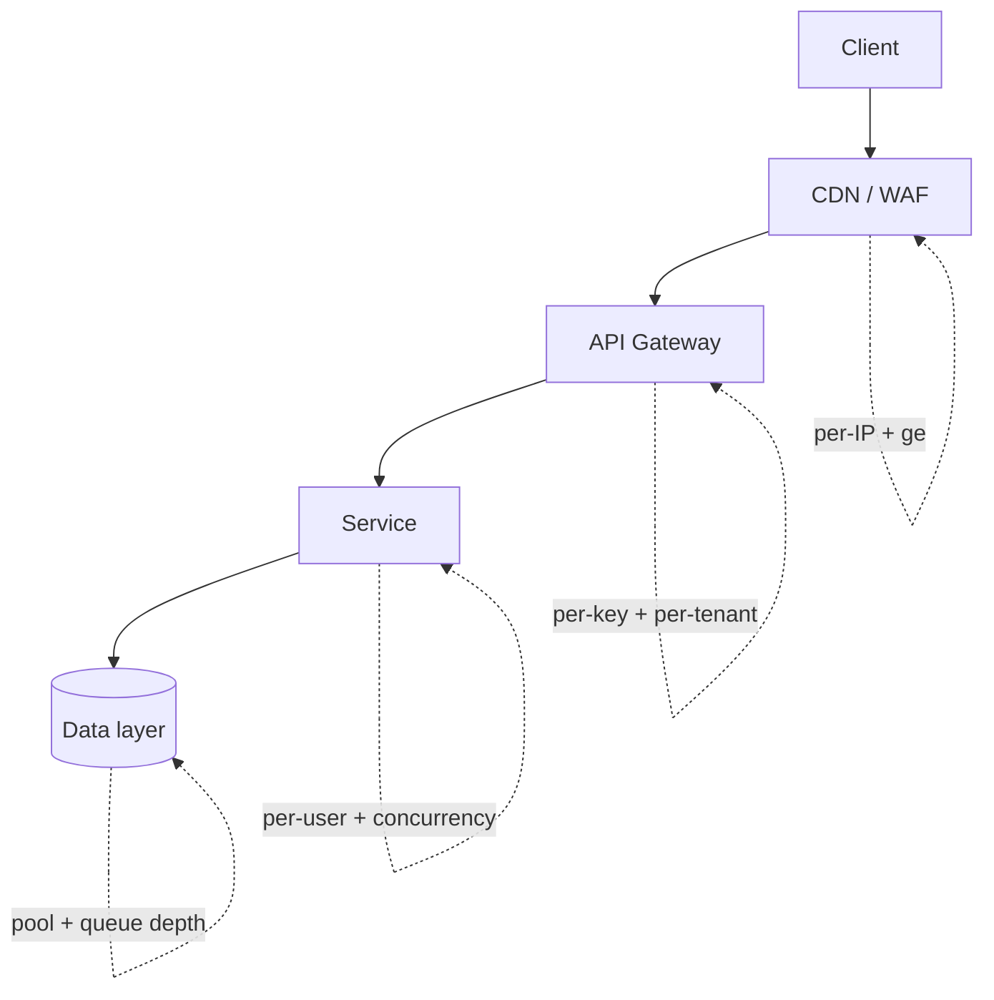
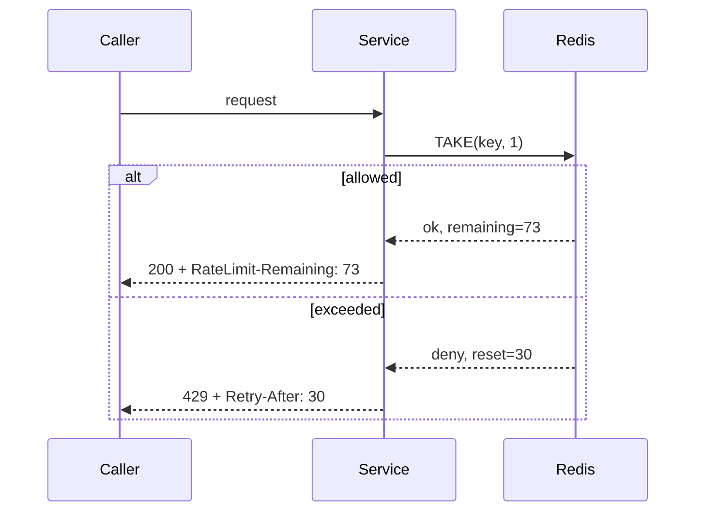

# Rate Limiting + Throttling Strategy

You design how an API protects itself and its callers from overload — with a limit strategy, fair response contract, and backpressure that prevents cascading failure.

## Core rules

- **Protect the service first** — global limits before user-visible ones
- **Fairness matters** — one abusive tenant shouldn't starve others
- **Communicate limits** — `RateLimit-*` headers + clear `429` responses
- **Honor limits you publish** — don't advertise 1000/min and actually allow 500
- **Backpressure, not buffering** — unbounded queues are the root of cascade failures
- **Circuit-break failing dependencies** — don't retry a down service into oblivion
- **No fabricated traffic profile** — work from supplied facts

## Input handling

| Dimension | Required | Default |
|---|---|---|
| **API / service** | Yes | — |
| **Traffic profile** (steady + burst + sources) | Yes | — |
| **Consumer tiers** (free / pro / enterprise / internal) | No | Asked |
| **SLO targets** (latency / availability) | No | Asked |
| **Existing infra** (API gateway / CDN / sidecar) | No | Asked |

## Phase 1 — Setup

```
**API / service**: [name]
**Consumers**: [public / partner / internal / mixed]
**Tiers**: [free=100/min, pro=1000/min, enterprise=custom]
**Traffic profile**: [sustained req/s + peak + burst patterns]
**SLO**: [p99 latency, availability]
**Existing infra**: [CDN / API gateway / service mesh / sidecar]
**Threats**: [credential stuffing / scraping / DDoS] (defence hand-off to security skills)
```

Ask render mode per `diagram-rendering` mixin and output path (default: `/documentation/[case]/rate-limiting-throttling-strategy/`).

## Phase 2 — Algorithm selection

### Token bucket (recommended default)

- Tokens refill at rate R; bucket holds B tokens; each request consumes 1 token
- Allows bursts up to B, then limits to R
- Simple, fair, widely implemented

### Leaky bucket

- Requests enter a queue, leak out at fixed rate R
- Smooths traffic completely; no burst
- Use when downstream is sensitive to rate spikes

### Fixed window counter

- Count requests per wall-clock window (e.g. per minute)
- Simple; suffers from boundary-spike effect (2x at window edge)
- OK for coarse limits

### Sliding window log

- Store exact timestamps; count in rolling window
- Most accurate; memory per user scales with rate
- Use when precision matters at low rates

### Sliding window counter

- Weighted combination of current + previous fixed window
- Approximates sliding log with much less memory
- Good default for high-volume APIs

### Concurrency limit (semaphore)

- Cap in-flight requests rather than rate
- Protects against slow requests exhausting threads
- Complementary to rate limits, not a replacement

### GCRA (generic cell rate algorithm)

- Mathematical equivalent of token bucket with continuous time; efficient single-value state
- Used by Redis `@upstash/ratelimit` / `go-redis/redis_rate`
- Good default in Redis-backed setups

## Phase 3 — Scope

| Scope | When |
|---|---|
| **Global** | Protect service; ceiling regardless of user |
| **Per-IP** | Anonymous endpoints; abuse protection |
| **Per-API-key / per-token** | Authenticated API consumers |
| **Per-user** | User-level fairness inside a tenant |
| **Per-tenant / account** | Multi-tenant fairness |
| **Per-endpoint** | Protect expensive endpoints differently |
| **Per-method-on-resource** | Writes stricter than reads |

Use multiple scopes layered: global > per-tenant > per-user > per-IP.

## Phase 4 — Enforcement layers

```
[Client]
   ↓
[CDN / WAF]           ← coarse per-IP limits, geo blocks
   ↓
[API Gateway]         ← per-API-key + per-tenant + per-endpoint limits
   ↓
[Service]             ← per-user + business-specific limits, concurrency caps
   ↓
[Data layer]          ← connection pool, query concurrency, queue depth
```

Push as far to the edge as possible; duplicate server-side for defense-in-depth.

## Phase 5 — Response contract (IETF RateLimit headers)

Per the IETF draft (`draft-ietf-httpapi-ratelimit-headers`):

```
HTTP/1.1 200 OK
RateLimit-Limit: 100
RateLimit-Remaining: 73
RateLimit-Reset: 30
```

On limit exceeded:

```
HTTP/1.1 429 Too Many Requests
RateLimit-Limit: 100
RateLimit-Remaining: 0
RateLimit-Reset: 30
Retry-After: 30
Content-Type: application/problem+json

{
  "type": "https://errors.example.com/rate-limited",
  "title": "Rate limit exceeded",
  "status": 429,
  "detail": "Too many requests; try again in 30 seconds.",
  "limit": 100,
  "reset": 30,
  "scope": "per-api-key"
}
```

- Always set `Retry-After` (seconds or HTTP-date)
- Indicate which limit was hit in `scope` for client debuggability
- Return body in the service's error envelope (RFC 7807 for REST)

## Phase 6 — Tier + quota model

| Tier | Rate (req/min) | Burst | Concurrency | Monthly cap | Support |
|---|---|---|---|---|---|
| Free | 100 | 20 | 10 | 1M req/mo | community |
| Pro | 1000 | 100 | 50 | 10M req/mo | email |
| Enterprise | custom | custom | custom | custom | 24/7 SLA |
| Internal | 10000 | 1000 | — | unlimited | n/a |

- Quotas (monthly) independent from rate limits (short-term)
- Overage behavior: reject / throttle / bill — per-tier policy

## Phase 7 — Backpressure

- **Never unbounded queue** — cap queue depth; reject when full
- **Shed load** — when CPU > threshold, return 503 with `Retry-After`
- **Prefer fail-fast to slow-success** — slow responses compound latency
- **Propagate backpressure upstream** — producer learns, slows down

Patterns:
- **Bulkhead**: pool isolation per tenant or per endpoint
- **Circuit breaker**: open when downstream fails; fail-fast; half-open probes
- **Adaptive concurrency** (e.g., Netflix concurrency-limits): auto-tune limit based on observed latency

## Phase 8 — Storage backend

| Backend | When |
|---|---|
| **In-process (per node)** | Simple; imprecise across nodes; ok for global coarse limits |
| **Redis** (GCRA / token bucket) | Most common; atomic ops via Lua; low-latency |
| **DynamoDB + conditional write** | Already-AWS; eventual consistency trade-off |
| **Envoy global rate-limit service** | Service mesh; gRPC limit service |
| **API gateway native** (Kong, Apigee, AWS API Gateway) | Out-of-the-box; limited algorithm choice |

Recommend Redis + GCRA as default for custom implementations; gateway-native when possible.

## Phase 9 — Special cases

### Bulk / batch endpoints

- Count requests and items (e.g. `rate_limit_weight = 10` per bulk call)
- Publish the weighting in docs + response headers

### Long-running / streaming

- Use concurrency limit, not per-request rate

### Retries + idempotency

- Limits should be token-aware: a retried idempotent request might get a lower cost than a new one in some designs
- Document clearly

### Webhooks outbound

- Per-endpoint sending rate limit to protect consumer
- Hand off to `webhook-design`

## Phase 10 — Observability

- Per-scope metrics: limit hits, rejects, 429 rate, retry success rate
- Alert on: sustained 429 to legitimate tier (under-provisioning), noisy tenant, backpressure saturation
- Audit log of adjustments (who raised a tenant's limit, when, why)

## Phase 11 — Diagrams

### Enforcement layers



### Token bucket state



## Phase 12 — Diagram rendering

Per `diagram-rendering` mixin.

## Phase 13 — Report assembly and approval

```markdown
# Rate Limiting + Throttling Strategy: [API / Service]

**Date**: [date]
**API**: [...]
**Tiers**: [...]

## Scope
[API, consumers, tiers, traffic profile, SLO, infra, threats]

## Algorithm Selection
[Chosen + rationale]

## Scope Model
[Global / per-tenant / per-user / per-IP / per-endpoint]

## Enforcement Layers
[CDN / gateway / service / data]

## Response Contract
[Headers + 429 envelope]

## Tier + Quota Model
[Per-tier rates + bursts + concurrency + quotas + overage]

## Backpressure
[Queue caps + shed-load + bulkhead + circuit breaker + adaptive]

## Storage Backend
[Redis / gateway-native / in-process]

## Special Cases
[Bulk + streaming + retries + webhooks]

## Observability
[Metrics + alerts + audit]

## Diagrams
[Layers + bucket state]

## Hand-offs
[Webhook design, API design, security / abuse protection]

## Assumptions & Limitations
```

Present for user approval. Save only after confirmation.

## Assessment + planning rules

- Algorithm matches traffic profile
- Scope layered correctly
- Response contract uses RateLimit-* + Retry-After
- Backpressure defined
- Tiers + quotas specified
- Storage backend justified
- No fabricated traffic

## Failure behavior

| Situation | Behavior |
|---|---|
| No traffic profile | Interview mode (§7) |
| Fixed-window suggested for high precision | Challenge — sliding window or GCRA |
| Unbounded queue proposed | Challenge — cap + shed-load |
| No 429 body / no Retry-After | Require |
| DDoS protection expected from app-layer rate limits only | Flag — hand off to security skills + CDN/WAF |
| mmdc failure | See `diagram-rendering` mixin |
| Implementation request | "Strategy only; impl is engineering." |

## Self-check

```
[] Algorithm chosen
[] Scope layered
[] Enforcement layers defined
[] RateLimit-* + Retry-After in response
[] Tier + quota model
[] Backpressure patterns
[] Storage backend
[] Observability + alerts
[] Hand-offs listed
[] Diagrams valid
[] No fabricated traffic
[] Report follows output contract
```
