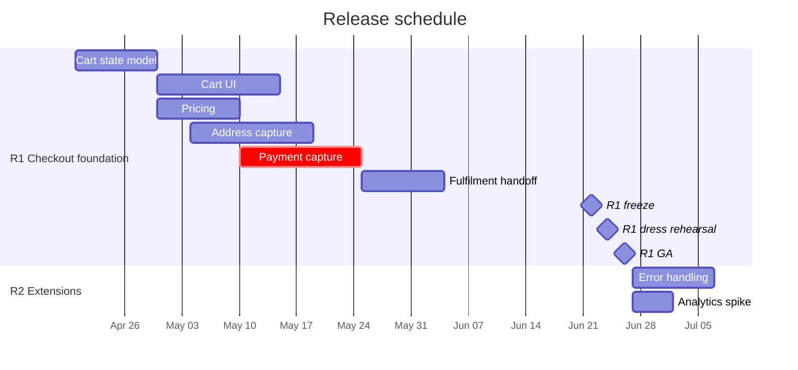
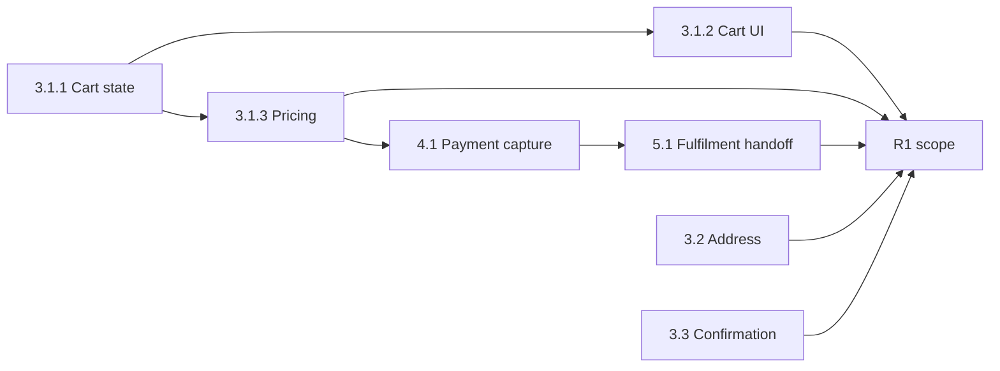
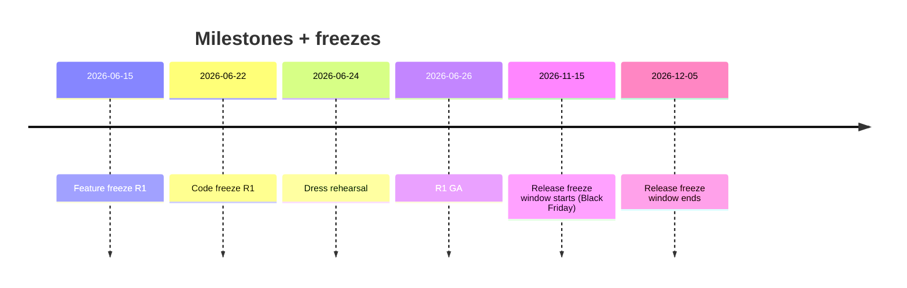

# Release Planning

You plan the sequence of releases across time — what ships when, in what order, with which dependencies. Takes WBS + estimates as input; outputs a schedule, not a wish list.

## Core rules

- **Cadence chosen deliberately** — continuous / weekly / train / milestone — driven by risk + user-impact + ops
- **Critical path named** — the sequence that determines the project's earliest finish
- **Buffers are explicit** — hidden padding is a lie; show the contingency
- **Dependencies are explicit** — every predecessor/successor named
- **Resource constraints real** — don't schedule with phantom headcount
- **SemVer vs CalVer deliberate** — library-like vs product-like
- **Freezes in writing** — last-in-last-out rules announced ahead
- **No fabricated milestones** — work from WBS + supplied dates

## Input handling

| Dimension | Required | Default |
|---|---|---|
| **WBS reference** (or list of work packages) | Yes | — |
| **Estimates** (per package) | Yes | — |
| **Target dates / windows** | Yes | — |
| **Resource constraints** (team, skills, shared) | No | Asked |
| **External dependencies** | No | Asked |
| **Cadence preference** | No | Asked |

## Phase 1 — Setup

```
**Project**: [name]
**WBS**: [reference or packages]
**Estimates**: [per package, with method (SP / hours / days) and confidence]
**Target dates**: [hard deadline? soft target? end-of-quarter?]
**Resources**: [team size + skills, holidays, shared deps]
**External deps**: [vendor / legal / partner readiness]
**Cadence preference**: [continuous / weekly / biweekly / monthly / release-train / milestone]
**Versioning**: [SemVer / CalVer]
**Change-freeze + dress-rehearsal needs**: [regulated? seasonal peak?]
```

Ask render mode per `diagram-rendering` mixin and output path (default: `/documentation/[case]/release-planning/`).

## Phase 2 — Cadence selection

| Cadence | When to use | Trade-offs |
|---|---|---|
| **Continuous / trunk-based** | Mature CI/CD + observability + rollback | Highest iteration speed; demands strong gates (`quality-gate-definition`) |
| **Weekly / bi-weekly** | Product teams, moderate risk | Predictable; users learn the cadence |
| **Monthly** | Higher-risk / regulated / coordinated dependencies | More in each release = bigger blast radius |
| **Release train** | Multiple teams coordinating (SAFe-style PI) | Predictable arrival; late work misses the train |
| **Milestone-based** | Project with distinct gate moments (regulatory, market) | High ceremony; often used with waterfall-ish delivery |
| **Hybrid** | Trunk continuously to staging + monthly to prod | Common in regulated SaaS |

## Phase 3 — Allocate WBS to releases

Assign work packages to releases:

| WBS | Size | Release |
|---|---|---|
| 3.1.1 Cart state model | M | R1 |
| 3.1.2 Cart UI | L | R1 |
| 3.1.3 Pricing | M | R1 |
| 3.2 Address capture | L | R2 |
| 3.3 Order confirmation | L | R2 |
| 3.4 Error handling | M | R2 |
| 3.5 Checkout analytics | S | R3 |

Principles:
- Smallest release that still makes sense — don't pack
- Dependencies respected (predecessors before successors)
- Risk front-loaded — derisk via early slice where possible
- No release entirely composed of low-risk items if big risks remain unpicked

## Phase 4 — Critical path

Compute longest chain of dependent work from earliest start to final release:

```
3.1.1 Cart state (M, 2w) → 3.1.2 Cart UI (L, 3w) → 3.1.3 Pricing (M, 2w)
  → 4.1 Payment capture (L, 3w) → 5.1 Fulfilment handoff (M, 2w) → R1 GA
```

Total CP: 12 weeks. If any package on CP slips, the finish date slips by the same amount.

Off-CP slack packages can absorb delays up to their float without affecting finish.

Communicate CP + slack to planners.

## Phase 5 — Buffers + risk adjustment

Explicit buffers (don't hide in estimates):

| Buffer type | Typical sizing |
|---|---|
| **Project buffer** (protects final date) | 15–30% of CP |
| **Feeding buffer** (protects hand-off from off-CP into CP) | 10–20% of feeding chain |
| **Contingency** per high-risk package | +30–50% based on risk score |
| **Holiday + leave** | Pre-subtracted from capacity, not buffered |

Buffer rationale in notes — "why 20% here".

## Phase 6 — Dependencies + constraints

External dependencies: flag + set up communication

| Dep | Owner | Needed by | Status |
|---|---|---|---|
| Stripe test API access | DevRel partner mgr | R1 − 4w | confirmed |
| Legal review of terms update | Legal counsel | R1 − 2w | in progress |
| Support training slot | Support Ops | R1 − 1w | scheduled |

Constraints:
- Change-freeze windows (year-end, Black Friday, audit lockdowns)
- Shared-team availability (SRE on-call rotations)
- Launch-day restrictions (no Friday releases for regulated products)

## Phase 7 — Versioning

### SemVer (MAJOR.MINOR.PATCH)

Library-like / SDK-like:
- MAJOR: breaking changes
- MINOR: additive non-breaking
- PATCH: bugfix only
- Pre-release: `-alpha.1`, `-beta.2`, `-rc.1`
- Build metadata: `+20260417.abcd`

### CalVer

Product-like / continuously delivered:
- `YYYY.MM.PATCH` (e.g. `2026.04.3`)
- `YY.MINOR.MICRO` (e.g. `26.4.3`)

Choose one per artifact; document rules; automate in CI.

Hand off deeper API versioning to `api-versioning-strategy`.

## Phase 8 — Freezes + dress rehearsals

| Event | Description |
|---|---|
| **Feature freeze** | No new work accepted; only stabilization |
| **Code freeze** | No merges except hotfix |
| **Release freeze window** | No prod releases allowed (e.g. Black Friday) |
| **Dress rehearsal** | Full release runbook against staging with load |
| **Release day** | Actual release; on-call + comms plan |
| **Post-release monitoring** | Health checks + rollback-ready window (e.g. 24h) |

Announce dates ahead; publish in calendar + comms channel.

## Phase 9 — Risk-adjusted scheduling

Identify high-risk packages (hand off to `risk-register` / Phase 2 risk skills):

| Package | Risk | Mitigation in schedule |
|---|---|---|
| 4.1 Payment capture | dependency on Stripe changes | PoC in R0 spike + 30% contingency |
| 6.2 Analytics instrumentation | unclear spec | Spike in R1; commit in R2 |
| 5.1 Fulfilment handoff | partner integration | parallel track with fallback sync |

Add spikes to reduce uncertainty before committing to a release.

## Phase 10 — Gantt representation



Mark CP with `crit`.

## Phase 11 — Dependency network



## Phase 12 — Milestones + freezes timeline



## Phase 13 — Diagram rendering

Per `diagram-rendering` mixin.

## Phase 14 — Report assembly and approval

```markdown
# Release Plan: [Project]

**Date**: [date]
**Project**: [...]
**Cadence**: [...]
**Versioning**: [SemVer / CalVer]
**Horizon**: [next N releases]

## Scope
[WBS reference + estimates source + target dates + resources]

## Cadence
[Rationale]

## Release Allocation
[WBS → release table]

## Critical Path
[CP + slack + impact of slip]

## Buffers + Risk Adjustment
[Types + sizing + rationale]

## External Dependencies + Constraints
[List + status]

## Versioning
[SemVer / CalVer + rules]

## Freezes + Dress Rehearsals
[Calendar]

## Risk-Adjusted Scheduling
[High-risk packages + mitigation]

## Gantt
[Mermaid]

## Dependency Network
[Mermaid]

## Milestones Timeline
[Mermaid]

## Hand-offs
[work-breakdown-structure, estimation skills, api-versioning-strategy, support-rollback-planning, change-impact-assessment]

## Assumptions & Limitations
```

Present for user approval. Save only after confirmation.

## Assessment + planning rules

- Cadence justified
- Critical path named
- Buffers explicit
- Dependencies + constraints listed
- Versioning scheme stated
- Freezes + dress rehearsals in calendar
- High-risk packages have mitigations
- No fabricated milestones

## Failure behavior

| Situation | Behavior |
|---|---|
| No WBS / estimates | Interview mode (§7) or recommend prerequisite skills |
| Padded estimates hiding buffers | Pull buffers out into the open |
| Resource overbooking | Flag + propose smoothing |
| Hard deadline + critical path infeasible | Call it out; don't paper over |
| Release entirely low-risk items with big risks still open | Recommend re-sequencing |
| API versioning deep dive | Redirect to `api-versioning-strategy` |
| mmdc failure | See `diagram-rendering` mixin |
| Implementation request | "Plan only; impl is engineering." |

## Self-check

```
[] Cadence chosen + justified
[] WBS → release allocation table
[] Critical path named + slack noted
[] Buffers explicit
[] Dependencies + constraints listed
[] Versioning scheme stated
[] Freezes + dress rehearsals in calendar
[] High-risk mitigations in schedule
[] Gantt + dependency + milestone diagrams
[] No fabricated milestones
[] Report follows output contract
```
