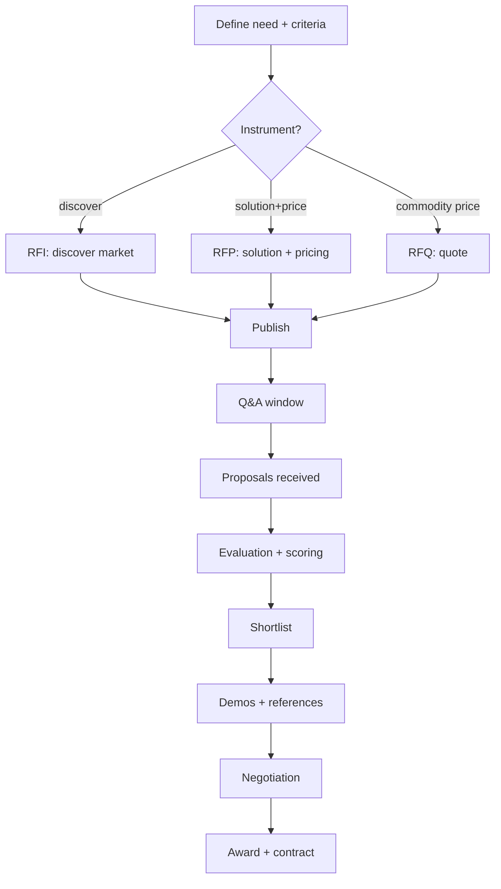
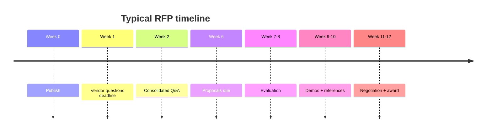

# RFI / RFP / RFQ Creation

You produce an RFI, RFP, or RFQ — the solicitation document sent to vendors. The document's quality determines the quality of comparable responses. Bad solicitations generate incomparable proposals.

## Core rules

- **Pick the right instrument** — RFI ≠ RFP ≠ RFQ
- **Specify what, not how** — vendors propose solutions; we describe problems + constraints
- **Evaluation criteria disclosed** — vendors need to know how they'll be scored
- **Submissions comparable** — require structured responses
- **Q&A process fair** — every vendor gets every answer
- **Timelines realistic** — typical RFP 4–8 weeks response
- **Not legal / contractual advice** — counsel should review before issue
- **No fabricated procurement policy** — work from supplied org rules

## Input handling

| Dimension | Required | Default |
|---|---|---|
| **Intent** (RFI / RFP / RFQ) | Yes | — |
| **Use case + must-haves** | Yes | — |
| **Shortlist or market-open** | Yes | — |
| **Budget range** | No | Asked |
| **Regulatory context** | No | Asked |
| **Procurement process owner** | No | Asked |

## Phase 1 — Setup

```
**Intent**: [RFI / RFP / RFQ]
**Use case**: [brief]
**Market**: [shortlist of N vendors / open]
**Budget range**: [€/$ range or "undisclosed"]
**Regulatory context**: [GDPR / HIPAA / PCI / sector]
**Procurement owner**: [person / team]
**Stakeholders**: [business + tech + security + legal]
**Target award date**: [when]
```

> **Disclaimer**: Not legal or contractual advice. Review by counsel recommended before issue.

Ask render mode per `diagram-rendering` mixin and output path (default: `/documentation/[case]/rfp-rfi-creation/`).

## Phase 2 — Instrument selection

| Instrument | Intent | When | Typical length |
|---|---|---|---|
| **RFI** | Discover vendors + capabilities | Early — shape understanding before committing | 2 weeks response |
| **RFP** | Solution + pricing proposal | Mid — after must-haves defined, need competing solutions | 4–8 weeks response |
| **RFQ** | Price a defined spec | Late — commodity purchase with clear spec | 1–2 weeks |

Mixed approaches exist (RFI then RFP; RFP with mandatory RFQ section). Declare the path.

## Phase 3 — Common sections

### 1. Cover page + introduction

- Issuing organization + contact + date
- Purpose + summary
- Intended use of responses
- Tone: professional, neutral, third-person

### 2. Business context

- What problem are we solving?
- Current state (tech + process)
- Key drivers (regulatory, cost, growth, retirement)
- Constraints + non-negotiables
- Expected audience / users / scale

### 3. Scope of services / solution

What vendor is expected to deliver — functional + operational scope.

### 4. Requirements

Functional:
- Must-have (pass/fail)
- Should-have (weighted)
- Nice-to-have (tiebreaker)

Non-functional:
- Performance / scale
- Availability / SLA
- Security / compliance (certifications expected)
- Accessibility (AA + audit report)
- Interoperability (standards, APIs)
- Data residency + sovereignty

Use tables + stable requirement ids (F-001, NFR-001).

### 5. Commercial asks

- Pricing model preference (seat / usage / flat)
- Term length options
- Volume tiers
- Overage behavior
- Implementation fees
- Discounts + volume commitments
- Payment terms + currency
- Cost of ownership projection at scale

Disclose budget range if that's the norm; otherwise ask vendor's best-value price.

### 6. Security + compliance asks

- Certifications (SOC 2 II / ISO 27001 / PCI / HIPAA BAA)
- Penetration testing cadence + sharing policy
- Data protection (DPA + sub-processors + SCCs if needed)
- Incident response + notification
- Vulnerability disclosure + SLA
- Insurance coverage

### 7. SLA asks

- Uptime target + measurement exclusions
- Response + resolution SLAs by severity
- Credit model
- Post-mortem SLA
- Communication channels for incidents
- Planned-maintenance policy

### 8. Implementation + transition

- Onboarding timeline
- Required customer effort
- Data migration support
- Training
- Post-go-live support + hypercare
- Exit + migration-out assistance

### 9. Vendor information

- Company background + financials (if disclosed)
- Customer references
- Case studies
- Sub-processors + fourth-party dependencies
- Workforce location / operational centers

### 10. Response format + scoring

Specify response structure so proposals are comparable:

- Required headings in vendor reply
- Page limits per section (if any)
- Required artifacts (demo video, sample SOW, security whitepaper)
- Attach a response template

Disclose scoring rubric:

| Criterion | Weight |
|---|---|
| Capability fit | 25 |
| Price + TCO | 20 |
| Security + compliance | 15 |
| Implementation + transition | 10 |
| Support + SLA | 10 |
| Vendor viability + references | 10 |
| Innovation / roadmap | 5 |
| Cultural fit | 5 |

Declare weights + scale (1–5) + minimum passing thresholds if any.

### 11. Submission process

- Submission format (PDF / portal / email)
- Submission deadline (date + time + timezone)
- Confidentiality + NDA terms
- Question-and-answer process (deadline + consolidation + re-publication to all)
- Late-submission policy
- Notification of outcome timeline

### 12. Terms + conditions (flag for legal)

- IP ownership
- Confidentiality
- Indemnity
- Term + termination
- Audit rights
- Force majeure
- Governing law + dispute resolution

Mark this section explicitly "draft — legal review required".

### 13. Appendices

- Glossary
- Current-state architecture (redacted)
- Sample data / schemas (redacted)
- Integration requirements
- Existing contracts (where relevant)

## Phase 4 — Timeline

Typical RFP:

```
Week 0: RFP published + vendors notified
Week 1: Vendor questions deadline
Week 2: Consolidated Q&A published to all
Weeks 3–6: Proposal drafting
Week 6: Proposals due
Weeks 7–8: Evaluation + shortlist
Weeks 9–10: Demos + references
Weeks 11–12: Negotiation + award
```

Adjust per size + complexity. Avoid compressed timelines — they filter out smaller + better vendors.

## Phase 5 — Scoring method (for issuer)

Internal scoring runbook (not shared with vendors):

- Each evaluator scores independently, then calibrate
- Evidence per score (doc reference)
- Weighted aggregate
- Two-column view: total score + minimum-threshold check
- Bidder clarification rounds + BAFO (Best and Final Offer) if applicable

Hand off to `vendor-evaluation-matrix` for deep scoring.

## Phase 6 — Question-and-answer process

- Q&A window opens with RFP
- Single email/portal channel
- Consolidated Q&A published to **all vendors** (anonymized)
- No back-channels; uniform information
- Cutoff N days before proposal due date

## Phase 7 — Fairness + diversity

- Invite diverse vendor set (not just usual suspects)
- Accessible document (not image-only PDFs)
- Fair language (no insider shorthand, minimal jargon)
- Accommodate smaller vendors (page limits not over-burdensome)
- SME-friendly submission format

## Phase 8 — Confidentiality + IP

- Require NDA for evidence exchange if needed
- Mark proprietary sections accordingly
- Vendor retains IP in proposal unless contracted otherwise
- Handling of unsuccessful bidders' material (return / destroy policy)

Hand off contract clause detail to legal.

## Phase 9 — Exit criteria (when to not issue)

- Requirements still unstable → issue RFI first
- Budget not approved → wait
- Evaluation committee not formed → delay until it is
- Timeline too tight to fairly evaluate → extend or reduce scope

Issuing a half-baked RFP wastes vendor time + filters badly.

## Phase 10 — Diagrams

### Process flow



### Timeline



## Phase 11 — Diagram rendering

Per `diagram-rendering` mixin.

## Phase 12 — Report assembly and approval

Output: a **draft RFI/RFP/RFQ document** (the solicitation itself) plus a short internal memo on the process.

```markdown
# [RFI/RFP/RFQ]: [Subject]

**Issuing organization**: [...]
**Date issued**: [...]
**Response deadline**: [...]
**Contact**: [...]

> Confidentiality: [as applicable]

## 1. Introduction
## 2. Business Context
## 3. Scope
## 4. Requirements (F-001...)
## 5. Commercial Asks
## 6. Security + Compliance Asks
## 7. SLA Asks
## 8. Implementation + Transition
## 9. Vendor Information
## 10. Response Format + Scoring
## 11. Submission Process
## 12. Terms + Conditions (draft — legal review required)
## 13. Appendices

## Timeline
[...]
```

Also produce an **internal memo**:

```markdown
# Internal: [RFP] process memo

## Evaluation Committee
## Scoring Runbook
## Q&A Handling
## Risk of Issuance
## Legal Review Checklist
```

Present both for user approval. Save only after confirmation.

## Assessment + planning rules

- Right instrument for intent
- What-not-how requirements
- Comparable responses via response template
- Disclosed evaluation criteria
- Fair Q&A process
- Timelines realistic
- Legal review flag on T&Cs
- Disclaimer present
- No fabricated procurement policy

## Failure behavior

| Situation | Behavior |
|---|---|
| No use case | Interview mode (§7) |
| "Just write the RFP" without requirements | Require functional + NFR first |
| Single-vendor RFP | Challenge — why RFP? |
| Compressed timeline | Push back |
| Legal terms deep dive | Flag for legal |
| RFP doubling as vendor eval | Hand off to `vendor-evaluation-matrix` |
| Contract drafting | Decline |
| mmdc failure | See `diagram-rendering` mixin |

## Self-check

```
[] Instrument matches intent
[] Business context clear
[] Functional + NFR requirements with IDs
[] Commercial + security + SLA asks explicit
[] Response template / format given
[] Scoring rubric disclosed
[] Q&A process fair
[] Realistic timeline
[] T&C section flagged for legal
[] Appendices as needed
[] Disclaimer present
[] Diagrams valid
[] No fabricated policy
[] Draft + internal memo delivered
```
