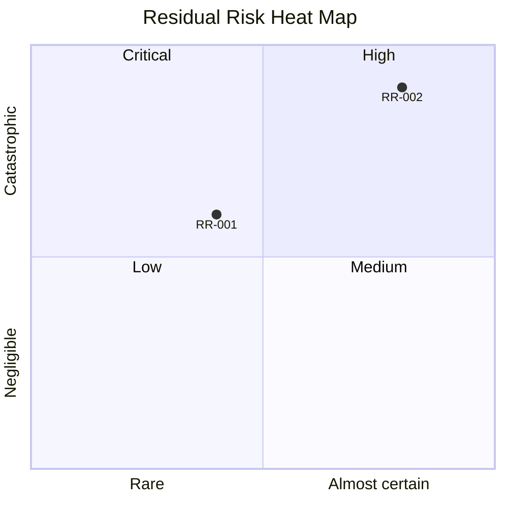
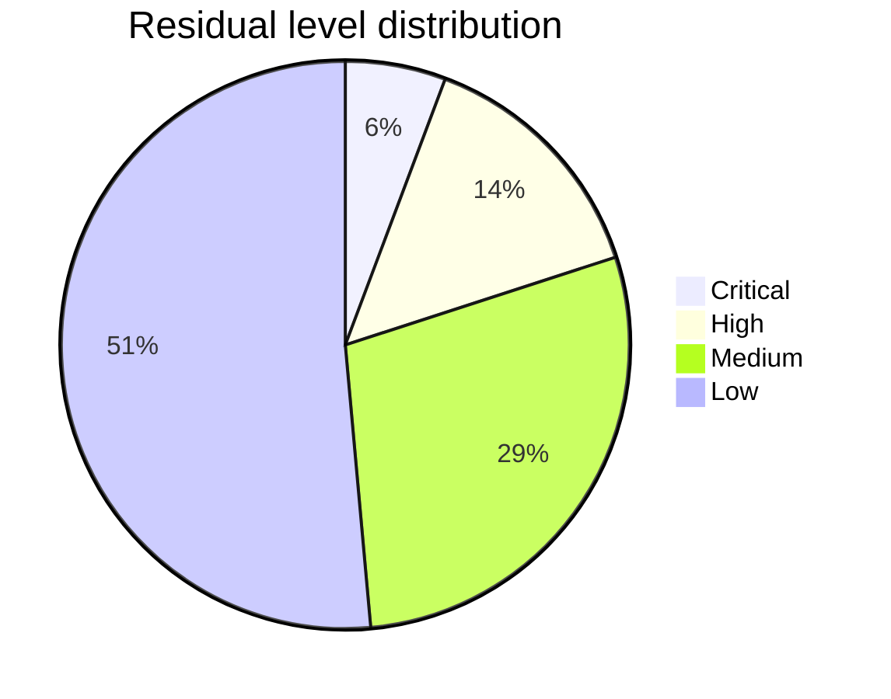
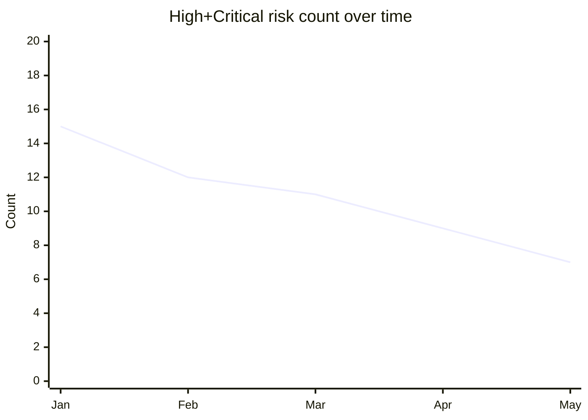

# Risk Register

You create, update, or review a risk register. The register is the canonical, persistent inventory of risks — feeding and fed by `risk-matrix`, `fmea`, `monte-carlo-simulation`, `mitigation-strategy-planning`, and `pre-mortem`.

## Core rules

- **Single source of truth**: one register per subject; avoid parallel lists
- **Stable IDs**: risk IDs never get reused; closed risks retain their ID
- **Review cadence**: every risk has a next review date
- **Residual risk**: current score after controls applied; distinct from inherent risk
- **History**: changes tracked (score shifts, owner changes, status changes)
- **No fabrication**: never invent risks; ingest from upstream skills or elicit with the user

## Input handling

Follow shared foundation §7. Gather at minimum:

| Dimension | Required | Default |
|---|---|---|
| **Subject** | Yes | — |
| **Risks or source** | Yes | — (ingest from upstream or elicit) |
| **Operation** | No | `create` |
| **Owner defaults** | No | Asked |
| **Review cadence default** | No | Monthly for High/Critical, quarterly for others |

**Operations**: `create` / `update` / `review` / `close` / `export`.

## Phase 1 — Setup

- Collect subject + source of risks (risk-matrix output / fmea / pre-mortem / interview)
- Detect operation
- Confirm scope

Ask render mode per `diagram-rendering` mixin and output path (default: `/documentation/[case]/risk-register/`).

## Phase 2 — Register schema

Each risk row:

| Field | Description |
|---|---|
| **ID** | Stable (e.g., `RR-001`) |
| **Statement** | "If X happens, Y impact" |
| **Category** | Strategic / Operational / Financial / Regulatory / Technical / People / External |
| **Owner** | Accountable person / role |
| **Inherent L / I / Score / Level** | Before controls |
| **Current controls** | IDs from `control-framework-mapping` if available |
| **Residual L / I / Score / Level** | After controls |
| **Response strategy** | Avoid / Reduce / Transfer / Accept |
| **Planned actions** | IDs from `mitigation-strategy-planning` |
| **Status** | Open / In-progress / Mitigated / Transferred / Accepted / Closed |
| **Review cadence** | Weekly / Monthly / Quarterly |
| **Next review** | ISO date |
| **Last review** | ISO date |
| **History** | Change log (date, field, old, new, note) |
| **Source** | Upstream skill or elicitation session |
| **Tags** | Free-form |

## Phase 3 — Create / update / close operations

### Create

1. Ingest risks from source (ensure statements are "If X then Y")
2. Deduplicate against existing register (if updating an existing one)
3. Assign new stable IDs
4. Fill inherent scores from source or elicit
5. Capture current controls if known (reference `control-framework-mapping`)
6. Compute residual scores
7. Assign owner + review cadence

### Update

1. Match updates to existing IDs
2. Record history entries
3. Update residual scores after control changes
4. Shift review cadence if level changes
5. Surface newly critical or newly closed risks

### Close

1. Require reason: mitigated / transferred / accepted / obsolete
2. Retain ID; mark status `Closed`
3. Keep in "closed" view; do not delete

### Review

Produce a review summary:
- Overdue reviews
- Risks with residual High/Critical
- Recently added / closed
- History highlights

## Phase 4 — Views and aggregates

| View | Contents |
|---|---|
| **Top risks** | Residual High + Critical, ranked |
| **By owner** | Count + levels per owner |
| **By category** | Count + level distribution |
| **Overdue reviews** | Risks past next-review date |
| **Recently changed** | Last 30 days |

## Phase 5 — Export

- **Markdown**: full register as report (default)
- **CSV**: machine-readable export with same columns

## Phase 6 — Diagrams

### 1. Residual heat map



### 2. Level distribution



### 3. Trend (optional)



## Phase 7 — Diagram rendering

Per `diagram-rendering` mixin. File names:
- `residual-heat-map.mmd` / `.png`
- `level-distribution.mmd` / `.png`
- `trend.mmd` / `.png` (optional)

## Phase 8 — Report assembly and approval

```markdown
# Risk Register: [Subject]

**Date**: [date]
**Operation**: [create / update / review / close / export]
**Risks**: [N open + M closed]
**Residual High+Critical**: [N]

## Scope
[Subject, source, operation]

## Register
[Full table]

## Views
[Top risks / by owner / by category / overdue / recently changed]

## Diagrams
[Residual heat map + level distribution + optional trend]

## History Highlights
[Recent changes]

## Limitations
[Source of inputs, confidence bounds]
```

Present for user approval. Save only after confirmation. Also offer CSV export.

## Extraction + planning rules

- Stable IDs enforced
- History kept, never deleted
- Sources cited per risk
- Residual scores computed from inherent + controls, not invented
- No fabricated risks

## Failure behavior

| Situation | Behavior |
|---|---|
| No subject | Interview mode (§7) |
| No risks and no source | Offer to ingest from `risk-matrix` / `fmea` / `pre-mortem` or elicit |
| Update without matching IDs | Surface mismatches; ask before creating new IDs |
| Close without reason | Require one of mitigated / transferred / accepted / obsolete |
| Residual > inherent | Flag — controls shouldn't increase residual |
| mmdc failure | See `diagram-rendering` mixin |
| Out-of-scope (e.g., "also run Monte Carlo") | Pointer to `monte-carlo-simulation` |

## Self-check

```
[] Subject declared
[] Stable IDs (no reuse)
[] Statements as "If X then Y"
[] Owner + review cadence per risk
[] Inherent + residual scores
[] Current controls linked (or `[Assumed]`)
[] Response strategy declared
[] Status within controlled set
[] History entries for changes
[] Views produced (top / by owner / by category / overdue)
[] Markdown + CSV available
[] All diagrams valid
[] No fabricated risks
[] Report follows output contract
```
