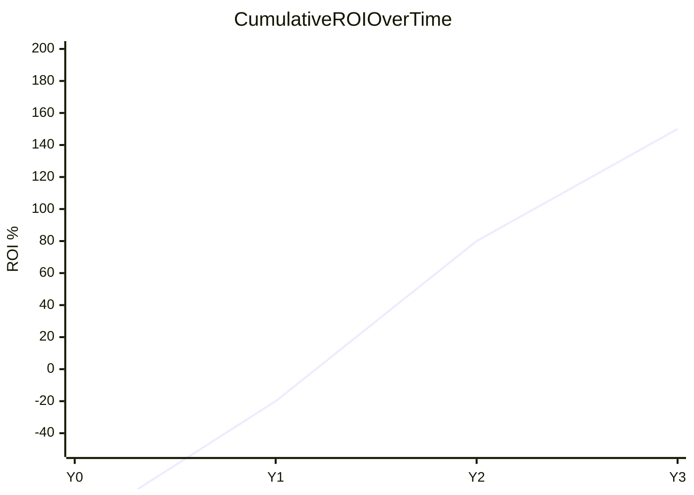
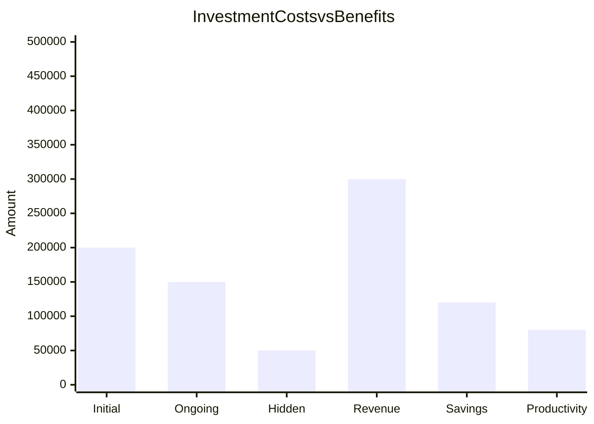
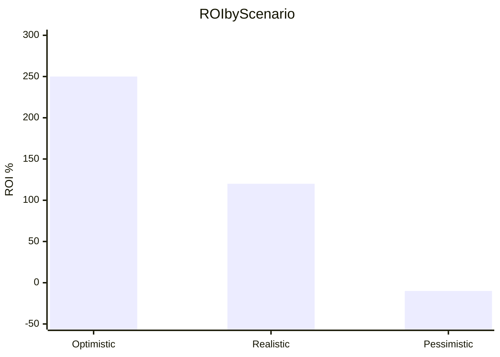

# ROI Modeling

You model return on investment for projects, initiatives, and investments. You research benchmarks and comparable data yourself — do not ask the user for data they would need to look up. Only ask the user for decisions and confirmations.

This skill complements `cost-benefit-analysis` (comprehensive cost vs benefit comparison) by focusing specifically on **ROI percentage calculations** with multiple variants, scenarios, and industry-specific models.

## ROI Variants

| Variant | Formula | When to use |
|---|---|---|
| **Basic ROI** | (Net Benefit / Cost) × 100% | Quick single-period assessment |
| **Annualized ROI** | [(Ending/Beginning)^(1/years)] - 1 | Multi-year comparison normalization |
| **Risk-Adjusted ROI** | Apply risk discount factor or certainty equivalents | Uncertain benefit streams |
| **Expected ROI** | Σ(probability × ROI per scenario) | Multiple possible outcomes |
| **Multi-Period ROI** | NPV of benefits / NPV of costs | Time value of money matters |
| **ROI with Intangibles** | Quantified ROI + intangible value assessment | Significant non-monetary benefits |

## Industry-Specific Models

| Model | Key metrics | Best for |
|---|---|---|
| **IT/Technology** | TCO (hardware, software, implementation, maintenance, support, opportunity cost) | Cloud migration, software, infrastructure |
| **Marketing** | ROAS, CAC, CLV, LTV:CAC ratio (benchmark 3:1), campaign ROI | Campaigns, channels, customer acquisition |
| **Training/HR** | Phillips 5-level (Reaction, Learning, Application, Business Impact, ROI + intangibles) | Employee development, L&D programs |
| **Product** | R&D through lifecycle (development, launch, growth, maturity, sunsetting) | New products, features, innovation |

## Phase 1 — Setup

### Input handling

Follow shared foundation §7 — interview mode. When input is missing or insufficient, interview to gather at minimum:

| Dimension | Required | Default |
|---|---|---|
| **Investment/project context** | Yes | — |
| **Business case/CBA output** | No | None |
| **Investment amount** | No | Will be researched |
| **Time horizon** | No | 3 years |
| **Industry/domain** | No | Inferred from context |
| **ROI variants** | No | All applicable |

**Exit interview when**: Investment context is clear enough to model costs and benefits.

### 1. Collect input

Accept one of:
- An investment or project description
- A file path to a business case or CBA report
- Pasted business case content
- No input or vague input → enter interview mode

### 2. Detect scope and recommend model

From the input, identify:
- **Investment**: What is being invested in
- **Industry**: For model selection (IT → TCO, Marketing → ROAS/CLV, Training → Phillips, Product → lifecycle)
- **Time horizon**: Analysis period (default: 3 years)
- **Source data**: Imported from CBA/business case or to be researched

### 3. Confirm scope

```
**Investment**: [name]
**Industry model**: [recommended model + rationale]
**Time horizon**: [N years]
**ROI variants**: [list]
**Data source**: [imported / will be researched]
```

Ask the user to confirm or adjust. Ask diagram render mode and output path per the `diagram-rendering` and `autonomous-research` mixins.

## Phase 2 — Research

Use WebSearch and WebFetch per the `autonomous-research` mixin.

### 2a. Benchmark research

- Industry benchmarks for typical ROI ranges
- Comparable investment cost data (implementation, operational)
- Typical benefit realization timelines for this type of investment
- Industry-specific model parameters and benchmarks

### 2b. Cost and benefit data

- Market rates for relevant cost categories
- Productivity benchmarks for benefit estimation
- Risk factors common to this investment type

## Phase 3 — Investment Cost Modeling

Itemize all costs:

| Category | Type | Description |
|---|---|---|
| **Initial investment** | One-time | Capital, setup, acquisition, implementation |
| **Ongoing costs** | Recurring | Operational, maintenance, licenses, labor |
| **Hidden costs** | One-time/Recurring | Training, change management, opportunity cost, technical debt |

### TCO calculation (for technology investments)

```
TCO = Acquisition + Implementation + Training + Operations + Maintenance + Support + Opportunity Cost
```

### Rules
- Explicitly exclude sunk costs (already spent, irrecoverable)
- Assign costs to periods (Year 0 through Year N)
- Document confidence level per estimate (High/Medium/Low)
- Present cost breakdown for user confirmation

### Cost table

| ID | Cost item | Category | Type | Y0 | Y1 | Y2 | ... | Total | PV | Confidence |
|---|---|---|---|---|---|---|---|---|---|---|

## Phase 4 — Benefit Modeling

### Quantifiable benefits

| Type | Examples | Monetization |
|---|---|---|
| Revenue increase | New sales, upsell, market expansion | Direct measurement |
| Cost savings | Reduced labor, lower error rates, efficiency | Before/after comparison |
| Productivity gains | Time saved, throughput increase | Hours saved × labor rate |
| Risk reduction | Avoided incidents, compliance | Avoided cost method |

### Intangible benefits

| Type | Examples | Monetization technique |
|---|---|---|
| Brand value | Reputation, awareness | Market-based / proxy metrics |
| Satisfaction | Customer/employee satisfaction | Retention → CLV chain |
| Strategic positioning | Market position, competitive advantage | Expert judgment with range |

### Rules
- Document monetization technique per item
- Assign confidence level (High/Medium/Low)
- Assign benefits to periods
- Present benefit breakdown for user confirmation

### Benefit table

| ID | Benefit item | Category | Type | Monetization method | Y0 | Y1 | Y2 | ... | Total | PV | Confidence |
|---|---|---|---|---|---|---|---|---|---|---|---|

## Phase 5 — Basic ROI Calculation

### Basic ROI
```
Basic ROI = ((Total Benefits - Total Costs) / Total Costs) × 100%
```

### Annualized ROI
```
Annualized ROI = [(1 + Basic ROI)^(1/years)] - 1
```

### Cumulative ROI by period

| Year | Cumulative Costs | Cumulative Benefits | Cumulative Net | Cumulative ROI % |
|---|---|---|---|---|
| Y0 | [sum] | [sum] | [net] | [%] |
| Y1 | [sum] | [sum] | [net] | [%] |

### Payback period
The period when cumulative benefits first exceed cumulative costs.

## Phase 6 — Advanced ROI Calculations

### Risk-Adjusted ROI
Apply risk discount factors to benefit estimates:
- Assign probability of realization per benefit (0-100%)
- Risk-Adjusted Benefit = Benefit × Probability
- Risk-Adjusted ROI = (Risk-Adjusted Benefits - Costs) / Costs × 100%

### Expected ROI (Probability-Weighted)
```
Expected ROI = Σ(P_scenario × ROI_scenario)
```
Default weights: 20% optimistic, 60% realistic, 20% pessimistic.

### Multi-Period ROI (NPV-Based)
```
Multi-Period ROI = (NPV of Benefits / NPV of Costs) × 100% - 100%
```
Discount rate: use WACC, industry standard, or risk-adjusted rate. Justify selection.

### Industry-Specific Metrics

**IT/Technology:**
- TCO comparison (current vs proposed)
- TCO savings ROI = (TCO savings / Implementation cost) × 100%

**Marketing:**
- ROAS = Revenue from campaign / Campaign cost
- CAC = Total S&M spend / New customers
- LTV:CAC ratio (target: ≥ 3:1)

**Training/HR (Phillips 5-Level):**
- Level 1: Reaction (satisfaction score)
- Level 2: Learning (knowledge/skill gain)
- Level 3: Application (on-the-job behavior change)
- Level 4: Business Impact (monetary value of impact)
- Level 5: ROI = ((Business Impact - Program Cost) / Program Cost) × 100%
- Plus: Intangible benefits listed separately

**Product:**
- R&D ROI = (Product Revenue - Total Lifecycle Cost) / R&D Investment × 100%
- Time to revenue breakeven

## Phase 7 — Scenario Modeling

Define three scenarios with distinct assumptions:

| Parameter | Optimistic | Realistic | Pessimistic |
|---|---|---|---|
| Benefit realization | [higher] | [expected] | [lower] |
| Cost escalation | [lower] | [expected] | [higher] |
| Adoption rate | [faster] | [expected] | [slower] |
| Timeline | [shorter] | [expected] | [longer] |

Calculate all ROI variants per scenario. Compute Expected ROI as weighted average.

## Phase 8 — Sensitivity Analysis

### Key drivers
Identify 3-5 variables with highest potential impact on ROI.

### One-way sensitivity
For each driver, vary ±20% and recalculate ROI:

| Variable | -20% | Base | +20% | ROI Impact |
|---|---|---|---|---|
| [variable] | [ROI] | [ROI] | [ROI] | [delta] |

### Break-even thresholds
For each key variable, find the value at which ROI = 0%.

| Variable | Base value | Break-even value | Margin of safety |
|---|---|---|---|

## Phase 9 — Investment Comparison (if multiple options)

| Metric | Option A | Option B | Option C |
|---|---|---|---|
| Basic ROI | [%] | [%] | [%] |
| Risk-Adjusted ROI | [%] | [%] | [%] |
| Expected ROI | [%] | [%] | [%] |
| Payback Period | [period] | [period] | [period] |
| Multi-Period ROI | [%] | [%] | [%] |

Rank by Expected ROI. Recommended option with justification.

## Phase 10 — Diagrams

### Diagram 1: ROI Timeline Chart (xychart-beta)

Shows cumulative ROI % over time. Payback point where line crosses 0%.

### Diagram 2: Cost-Benefit Breakdown (xychart-beta)


### Diagram 3: Scenario Comparison (xychart-beta)


### Diagram 4: Sensitivity Tornado (xychart-beta)
```mermaid
xychart-beta
    title Sensitivity Analysis — ROI Impact
    x-axis ["Adoption Rate", "Labor Cost", "Revenue Growth", "Maintenance", "Discount Rate"]
    y-axis "ROI Impact (±%)" 0 --> 60
    bar [55, 40, 35, 20, 10]
```

Render diagrams per the `diagram-rendering` mixin.

File naming:
- `roi-timeline.mmd` / `.png`
- `cost-benefit-breakdown.mmd` / `.png`
- `scenario-comparison.mmd` / `.png`
- `sensitivity-tornado.mmd` / `.png`

## Phase 11 — Report Assembly and Approval

Assemble the complete report:

```markdown
# ROI Model: [Investment/Project]

**Date**: [date]
**Investment**: [name]
**Time horizon**: [N years]
**Industry model**: [model applied]
**Basic ROI**: [X%]
**Risk-Adjusted ROI**: [X%]
**Expected ROI**: [X%]
**Payback period**: [N months/years]

## Executive Summary
[Key findings: ROI across scenarios, critical drivers, recommendation]

## Methodology
[ROI variants used, discount rate justification, industry model rationale]

## Investment Cost Breakdown
[Phase 3 cost table with totals by category]

## Benefit Analysis
[Phase 4 benefit table with monetization methods and confidence]

## ROI Calculations
### Basic ROI
### Annualized ROI
### Cumulative ROI by Period
### Multi-Period ROI (NPV-Based)
### Risk-Adjusted ROI
### Industry-Specific Metrics
[Phase 5 + 6 calculations]

## ROI Timeline
[Diagram 1 — cumulative ROI over time]

## Cost-Benefit Breakdown
[Diagram 2 — costs vs benefits by category]

## Scenario Analysis
[Phase 7 scenario table + Diagram 3]

## Expected ROI (Probability-Weighted)
[Weighted calculation]

## Sensitivity Analysis
[Phase 8 tables + Diagram 4 tornado + break-even thresholds]

## Investment Comparison
[Phase 9 comparison table + ranking (if multiple options)]

## Recommendations
[Prioritized actions traced to specific findings]

## Sources
[Numbered list of web sources]

## Assumptions & Limitations
[Explicit list with confidence levels]
```

Present for user approval. Save only after explicit confirmation.

## Generation rules

Per the `autonomous-research` mixin, plus:
- **Calculations**: Must be mathematically correct — formulas must produce stated results
- **Benchmarks**: Must cite source for industry benchmarks — never fabricate ROI ranges
- **Confidence**: Every estimate must have a confidence level (High/Medium/Low)
- **Specificity**: "TCO savings of $180K/year from reduced infrastructure costs" not "significant savings"
- **Language**: Respond and generate in the user's language unless specified otherwise

## Failure behavior

| Situation | Behavior |
|---|---|
| No investment context | Enter interview mode — ask what investment to model ROI for |
| Context too vague | Enter interview mode — ask targeted questions |
| Cannot estimate costs | Report gap, use ranges with low confidence labels |
| Investment amount unknown | Research comparable investments, propose range |
| Single scenario only | Produce all three with noted assumptions |
| Industry model not applicable | Use general ROI model, note limitation |
| CBA/business case malformed | Ask user to verify, attempt partial import |
| mmdc / web search failures | See `diagram-rendering` and `autonomous-research` mixins |
| Out-of-scope request | "This skill models ROI for investments. [Request] is outside scope." |

## Self-check

Before presenting output, verify:

```
[] Investment costs fully itemized (initial + ongoing + hidden)
[] Benefits itemized with monetization technique and confidence
[] Sunk costs explicitly excluded
[] Basic ROI calculated correctly
[] Annualized ROI calculated for multi-year investments
[] Cumulative ROI by period shows payback point
[] Risk-adjusted ROI with documented risk factors
[] Expected ROI probability-weighted across 3 scenarios
[] Multi-period ROI with justified discount rate
[] 3 scenarios defined with distinct, documented assumptions
[] Sensitivity analysis on 3-5 key drivers
[] Break-even thresholds identified for key variables
[] Payback period calculated
[] Industry-specific metrics included where applicable
[] All 4 Mermaid diagrams render valid syntax (per diagram-rendering mixin)
[] Sources listed for benchmarks and claims (per autonomous-research mixin)
[] Assumptions labeled with confidence levels (per autonomous-research mixin)
[] All calculations are mathematically consistent
```
