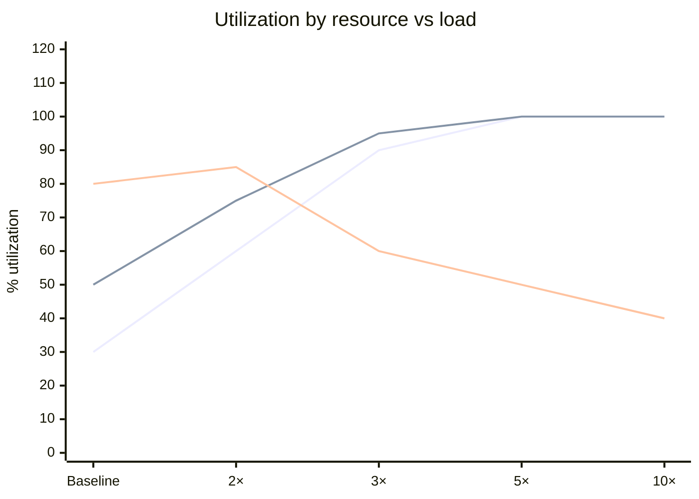
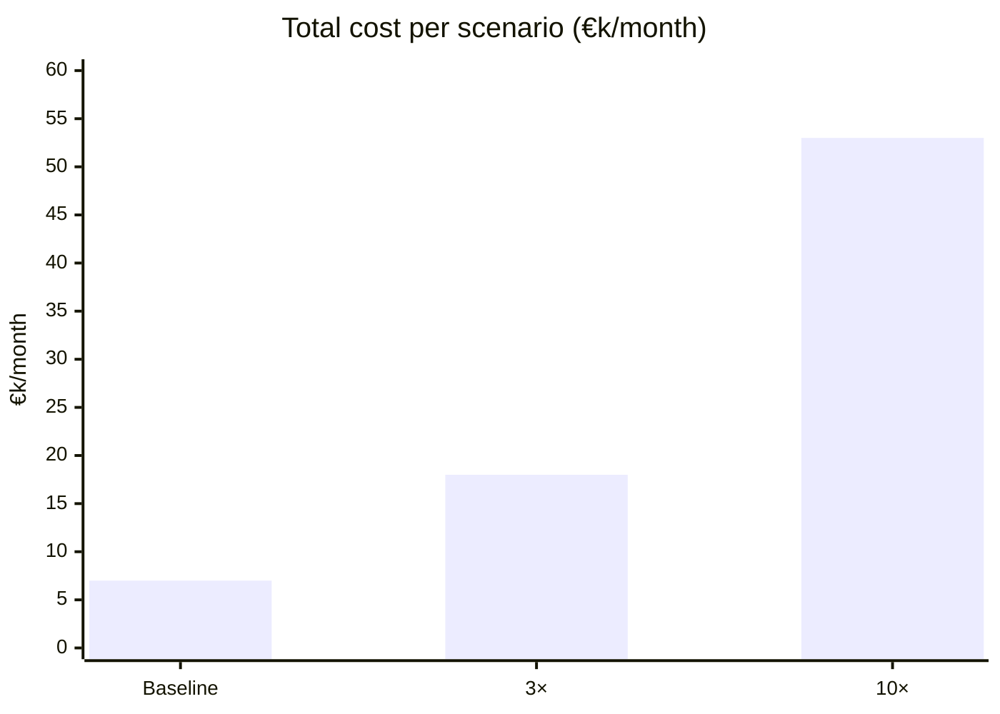

# Scalability Modeling

You model how a service behaves as load grows. You name current load, project growth scenarios, identify the bottleneck that will hit first, propose a scaling strategy, and model cost at each milestone.

## Core rules

- **Scenario-based**: always model ≥3 scenarios (e.g., baseline / 3× / 10×)
- **Bottleneck-first**: identify the limiting resource per scenario — there's always one
- **Strategy per bottleneck**: not "scale the service" but "scale this specific bottleneck this way"
- **Cost model**: scaling isn't free; surface cost curve
- **Evidence or `[Assumed]`**: current load, resource ratios, scaling behavior from data or labeled

## Input handling

| Dimension | Required | Default |
|---|---|---|
| **Service** | Yes | — |
| **Current load** | No | `[Assumed]` |
| **Growth scenarios** | No | Baseline / 3× / 10× |
| **Current architecture** | No | Elicit |
| **Time horizon** | No | 12 months |

## Phase 1 — Setup

```
**Service**: [name]
**Current load**: [RPS / QPS / CCU / data volume / events]
**Growth scenarios**: [baseline, 3×, 10×]
**Current architecture**: [overview]
**Horizon**: [N months]
```

Ask render mode per `diagram-rendering` mixin and output path (default: `/documentation/[case]/scalability-modeling/`).

## Phase 2 — Load dimensions

Per service, pick relevant dimensions:

| Dimension | Unit | Example |
|---|---|---|
| **Request rate** | RPS / QPS | 500 RPS peak |
| **Concurrent users / sessions** | CCU | 10k concurrent |
| **Data volume** | GB / TB | 50 GB in DB, growing 5 GB/month |
| **Event rate** | events/sec | 2k events/sec into queue |
| **Throughput** | MB/s | 20 MB/s network |
| **Latency targets** | ms (p95/p99) | Must stay ≤ 500ms p95 at any scale |

## Phase 3 — Current state

Per dimension:
- **Current value** (with evidence or `[Assumed]`)
- **Resource utilization** at current load (CPU / memory / DB connections / cache hit rate / queue depth)
- **Headroom** (% of capacity remaining)

## Phase 4 — Bottleneck analysis

For each scenario (baseline / 3× / 10×), identify which resource hits its limit first:

| Scenario | Load | Projected utilization | Bottleneck | Evidence |
|---|---|---|---|---|
| Baseline | 500 RPS | CPU 30%, DB 50%, cache 80% hit | Cache capacity | Hit rate degrades non-linearly above 80% |
| 3× | 1.5k RPS | CPU 90%, DB 95%, cache 60% hit | DB connection pool + cache hit rate | — |
| 10× | 5k RPS | CPU saturated, DB throttled | DB write capacity + CPU | Multiple converging |

At each scenario, there is one dominant bottleneck and potentially secondary.

## Phase 5 — Scaling strategy per bottleneck

| Bottleneck | Strategies (pick applicable) |
|---|---|
| **CPU** | Horizontal scale (add replicas) / optimize hot paths / offload to async |
| **Memory** | Vertical scale / streaming instead of buffering / reduce object retention |
| **DB read** | Read replicas / caching layer / denormalization / materialized views |
| **DB write** | Partition / shard / async write / CQRS / batch writes |
| **Network** | CDN / edge compute / compression / HTTP/2 or /3 |
| **Cache** | Larger cache / better eviction / key design / multiple tiers |
| **Queue** | Partition topic / consumer scaling / backpressure policy |
| **External API** | Request batching / caching / local fallback / circuit breaker |

Per selected strategy:
- **What changes** (component / config / architecture)
- **Estimated effort** (person-days or months)
- **Estimated cost delta** (€/month at scale)
- **Risk** (e.g., "sharding introduces hotspot risk on key X")
- **Pre-requisites** (instrumentation / data migration)

## Phase 6 — Capacity plan

Per scenario:

| Scenario | When reached (est.) | Actions needed | Lead time | Readiness |
|---|---|---|---|---|
| Baseline | Today | — | — | Ready |
| 3× | Month 6 | Add 2 read replicas + larger cache | 2 weeks | At risk — need caching strategy |
| 10× | Month 18 | Shard DB, partition event topic | 4 months | Not ready — major work |

Readiness: Ready / At risk / Not ready.

## Phase 7 — Cost model

Model cost per scenario (EUR/month or similar):

| Scenario | Compute | DB | Cache | Network | Other | Total |
|---|---|---|---|---|---|---|
| Baseline | 2k | 3k | 0.5k | 0.5k | 1k | 7k |
| 3× | 5k | 8k | 1.5k | 1.5k | 2k | 18k |
| 10× | 12k | 25k | 4k | 6k | 6k | 53k |

Rule: report cost-per-unit-of-load (e.g., €/1k RPS) to see whether scaling is efficient or unit costs grow.

## Phase 8 — Risks at scale

Name failure modes specific to scale:
- Cold-cache thundering herd
- Backpressure cascades
- Cross-AZ bandwidth costs
- Retry storms during degradation
- Log volume overwhelming observability
- Schema migration at large data volume

Per risk: detection + mitigation.

## Phase 9 — Diagrams

### 1. Bottleneck curve



Lines: CPU, DB, cache hit rate.

### 2. Cost at scale



## Phase 10 — Diagram rendering

Per `diagram-rendering` mixin.

## Phase 11 — Report assembly and approval

```markdown
# Scalability Model: [Service]

**Date**: [date]
**Horizon**: [N months]
**Scenarios**: [baseline, 3×, 10×]

## Scope
[Service, current architecture, horizon, scenarios]

## Load Dimensions
[Per dimension: current value + source + utilization]

## Bottleneck Analysis
[Per scenario: utilization projection, bottleneck, evidence]

## Scaling Strategy
[Per bottleneck: strategies, effort, cost delta, risk, pre-requisites]

## Capacity Plan
[Scenario → actions → lead time → readiness]

## Cost Model
[Per scenario breakdown + €/unit-load]

## Risks at Scale
[Per risk: detection + mitigation]

## Diagrams
[Bottleneck curve + cost at scale]

## Assumptions & Limitations
[`[Assumed]` load / ratios / scaling behavior; data gaps]
```

Present for user approval. Save only after confirmation.

## Generation + planning rules

- Scenarios always include baseline
- One dominant bottleneck per scenario named
- Strategy targets the bottleneck, not the service generally
- Cost modeled at each scenario
- No fabricated scaling curves

## Failure behavior

| Situation | Behavior |
|---|---|
| No service | Interview mode (§7) |
| No current load data | `[Assumed]` with conservative estimate; recommend instrumentation |
| Single-scenario analysis only | Require ≥ 3 scenarios |
| Bottleneck unclear | Propose load test or profiling as prerequisite |
| mmdc failure | See `diagram-rendering` mixin |
| Out-of-scope ("implement now") | "Modelling only. Implementation is engineering work." |

## Self-check

```
[] ≥3 scenarios (baseline, 3×, 10× or equivalent)
[] Current load per dimension with evidence or `[Assumed]`
[] Bottleneck identified per scenario with evidence
[] Strategy per bottleneck with effort + cost + risk
[] Capacity plan with lead time + readiness
[] Cost model per scenario with €/unit-load
[] Risks at scale named with detection + mitigation
[] Diagrams valid
[] No fabricated scaling curves
[] Report follows output contract
```
