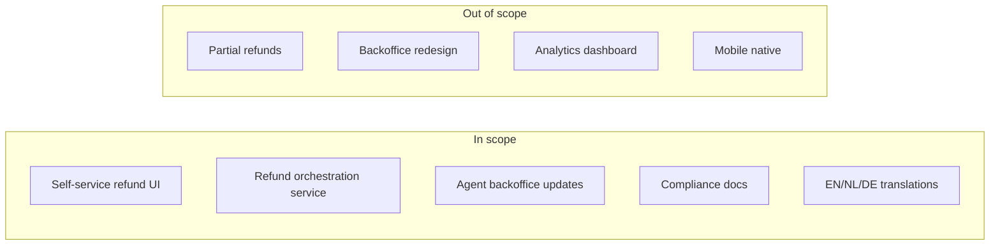
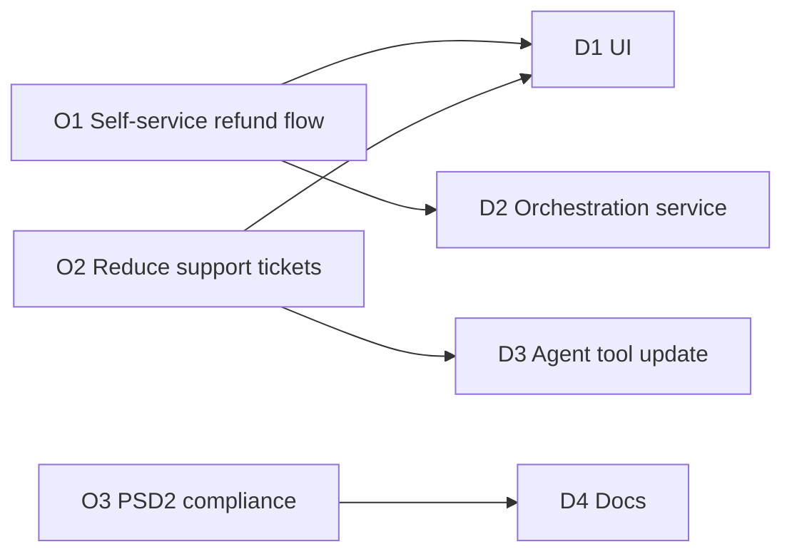

# Scope Statement Writing

You write the scope statement that governs what a project will and won't deliver. Its most valuable function is making the boundary explicit — what's out is as important as what's in.

## Core rules

- **Explicit out-of-scope beats silence** — ambiguity breeds scope creep
- **Deliverables are concrete** — "improved onboarding" is not a deliverable; a redesigned 3-step onboarding flow is
- **Success criteria measurable** — objective, testable, dated where possible
- **Assumptions stated separately** — call them out; they're the fault lines
- **Constraints are real limits** — money, time, regulation, people
- **Approval authority named** — who signs off on scope (and scope changes)
- **No fabricated deliverables** — work from supplied context
- **This is not a business case** — hand off investment rationale / ROI / market to `business-case-management`

## Input handling

| Dimension | Required | Default |
|---|---|---|
| **Project name + sponsor** | Yes | — |
| **Purpose / why now** | Yes | — |
| **Objectives** | Yes | — |
| **Known deliverables** | Yes | — |
| **Known exclusions** | No | Asked |
| **Constraints** (time / budget / people) | No | Asked |
| **Stakeholders** | No | Asked (or recommend `stakeholder-mapping`) |

## Phase 1 — Setup

```
**Project**: [name]
**Sponsor**: [who]
**Purpose**: [why this, why now — one paragraph]
**Objectives**: [3–5 measurable aims]
**Known deliverables**: [list]
**Known exclusions**: [what's explicitly out]
**Constraints**: [hard limits]
**Stakeholders**: [known + unknown]
**Approval authority**: [who signs]
```

Ask render mode per `diagram-rendering` mixin and output path (default: `/documentation/[case]/scope-statement/`).

## Phase 2 — Purpose + objectives

### Purpose

One-paragraph answer to "why does this project exist?" written for a sponsor, not the team.

### Objectives (with success criteria)

SMART-style:

| # | Objective | Success criterion |
|---|---|---|
| O1 | Launch self-service refund flow | 90% of refund requests processed without agent intervention within 3 months post-launch |
| O2 | Reduce support ticket volume for refunds | ≥ 40% reduction in refund-related tickets within 6 months |
| O3 | Stay compliant with PSD2 | No compliance findings in year-1 audit |

Objectives are sparse; not a kitchen sink.

## Phase 3 — Deliverables + acceptance

| # | Deliverable | Description | Acceptance |
|---|---|---|---|
| D1 | Self-service refund UI | End-user web flow for initiating refund | End-to-end test suite passes; a11y AA; translated EN/NL/DE |
| D2 | Refund orchestration service | Backend service coordinating refunds across subsystems | API contract tests pass; p99 < 500ms; 99.9% availability |
| D3 | Agent backoffice updates | Updates to the agent tool for escalated cases | UAT signed by support ops |
| D4 | Compliance documentation | PSD2 / audit evidence | Legal + compliance sign-off |

Each deliverable has acceptance criteria — otherwise "done" is subjective.

## Phase 4 — In-scope (explicit)

List what's covered under this project. Concrete enough to be contested or agreed:

- Refund self-service UI for EU customers
- Backend refund orchestration service
- Integration with existing payment gateway (Stripe)
- Updates to agent backoffice within the existing tool
- PSD2 compliance documentation
- Translations EN / NL / DE

## Phase 5 — Out-of-scope (explicit)

Say clearly what's **not** included — even when it "seems related". This is the single highest-leverage section:

- Partial / item-level refunds (planned for phase 2)
- Full backoffice redesign (only the refund flow is updated)
- Refund analytics dashboard (handled separately by `insights-platform`)
- Currency hedging / reconciliation changes (out)
- Mobile-native apps (web only at launch)
- New payment gateways (Stripe only)

Every exclusion prevents a future argument.

## Phase 6 — Assumptions

Facts treated as given without proof. If wrong, project plan shifts:

- Stripe webhook latency remains < 30s at p99
- Legal has approved the refund policy language (`[assumed — confirm by M1]`)
- Customer support team has capacity for UAT in sprint 5–6
- Existing agent-tool build pipeline can absorb updates without a parallel release

## Phase 7 — Constraints

Non-negotiable limits:

- **Budget**: €350k total
- **Timeline**: GA before year-end EU audit cut-off (2026-10-31)
- **People**: 1 product, 3 eng, 1 design, 0.5 legal — no reinforcement
- **Regulatory**: PSD2 + GDPR for EU customers
- **Technical**: must reuse existing auth + payment gateway (Stripe)

## Phase 8 — Boundaries

| Dimension | Boundary |
|---|---|
| **Organizational** | EU market team only; US / APAC future |
| **Geographic** | EU28 + UK; other regions phase 2 |
| **Temporal** | Project ends at GA + 60 days post-launch stabilization |
| **Technical** | Web only (no native), Stripe only, existing agent tool |
| **Customer segments** | Consumer only; B2B refunds excluded |

Boundaries make scope defensible.

## Phase 9 — Stakeholders + approval authority

| Role | Who | Involvement |
|---|---|---|
| Sponsor | VP Commerce | Accountable |
| Product Owner | Pia M. | Responsible |
| Approver (scope changes) | VP Commerce + Head of Compliance | Sign-off |
| Engineering Lead | Rik V. | Consulted |
| Legal | GDPR Counsel | Consulted |
| Support Ops | Support Manager | Informed + UAT |

Hand off deeper stakeholder analysis to `stakeholder-mapping`.

## Phase 10 — Scope-change protocol

- **Change request** written + submitted to approver
- **Impact assessment** within 5 business days (effort, cost, timeline, risk)
- **Decision rights** with Sponsor + Approvers
- **Baselines updated** only after sign-off
- **No silent scope changes** — anything not in the WBS is out

Hand off to `change-impact-assessment` for deeper analysis.

## Phase 11 — Coverage check with WBS

If a WBS exists (or will), verify:
- Every in-scope item maps to ≥ 1 WBS branch
- No WBS branch is outside in-scope
- Out-of-scope items absent from WBS

Hand off to `work-breakdown-structure`.

## Phase 12 — Open questions / placeholders

Anything the scope statement couldn't nail down — surface it:

- Can we piggyback on existing Stripe webhook handler, or do we need a new one? (decision by M1)
- Will compliance require a cooling-off period message, and if so in which channels?
- Is there a hard stop on legacy agent-tool screen count?

## Phase 13 — Diagrams

### Scope boundary



### Objective → deliverable mapping



## Phase 14 — Diagram rendering

Per `diagram-rendering` mixin.

## Phase 15 — Report assembly and approval

```markdown
# Scope Statement: [Project]

**Date**: [date]
**Project**: [name]
**Sponsor**: [...]
**Approver(s)**: [...]
**Baseline version**: v1.0

## Purpose
[Why this, why now]

## Objectives & Success Criteria
[SMART table]

## Deliverables & Acceptance
[Per deliverable]

## In-Scope
[Explicit list]

## Out-of-Scope
[Explicit exclusions — most important section]

## Assumptions
[Called out + confirm-by dates]

## Constraints
[Budget / time / people / regulatory / technical]

## Boundaries
[Organizational / geographic / temporal / technical / segments]

## Stakeholders & Approval Authority
[Roles + decision rights]

## Scope-Change Protocol
[How changes are proposed + decided]

## Coverage Check (with WBS)
[If WBS exists]

## Open Questions / Placeholders
[Decisions pending]

## Diagrams
[Scope boundary + objective→deliverable mapping]

## Hand-offs
[work-breakdown-structure, stakeholder-mapping, change-impact-assessment, business-case-management]
```

Present for user approval. Save only after confirmation.

## Assessment + planning rules

- Explicit out-of-scope listed
- Deliverables concrete + acceptance criteria defined
- Objectives measurable
- Assumptions separated from facts
- Constraints enumerated
- Boundaries across dimensions
- Approver + change protocol named
- No fabricated deliverables
- Not a business case

## Failure behavior

| Situation | Behavior |
|---|---|
| No purpose / objectives | Interview mode (§7) |
| "Everything" in-scope | Challenge; ask exclusions |
| Deliverables without acceptance | Ask for criteria per deliverable |
| No approver | Require naming before baseline |
| Market / ROI / investment request | Redirect to `business-case-management` |
| Stakeholder mapping request | Redirect to `stakeholder-mapping` |
| Scope-change impact modelling | Redirect to `change-impact-assessment` |
| mmdc failure | See `diagram-rendering` mixin |

## Self-check

```
[] Purpose stated for sponsor audience
[] Objectives with measurable success criteria
[] Deliverables + acceptance criteria
[] Explicit in-scope list
[] Explicit out-of-scope list
[] Assumptions separated
[] Constraints enumerated
[] Boundaries across 4+ dimensions
[] Stakeholders + approval authority
[] Scope-change protocol
[] Open questions surfaced
[] Coverage check (if WBS)
[] Diagrams valid
[] No fabricated deliverables
[] Report follows output contract
```
