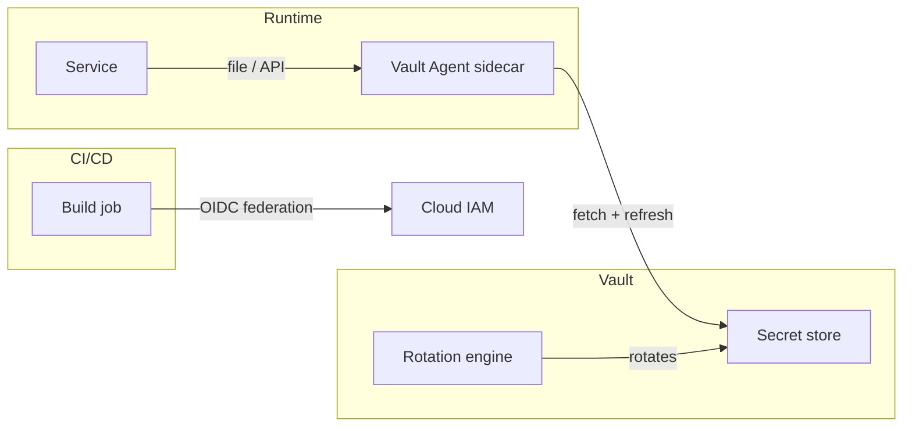

# Secrets Management Design

You design secrets management: how secrets (API keys / DB passwords / certificates / JWT signing keys) are stored, distributed, rotated, and revoked.

## Core rules

- **No plaintext secrets in code / config / CI logs** — ever
- **No long-lived secrets where short-lived possible** — prefer dynamic credentials + OIDC federation
- **Centralized vault** — single source of truth, not per-service secret files
- **Automatic rotation** where feasible
- **Audit every access** — who / when / what secret
- **Break-glass procedure** — emergency manual access with extra audit

## Vault selection

| Vault | Best for |
|---|---|
| **HashiCorp Vault** | Self-hosted, feature-rich, dynamic secrets, multi-cloud |
| **AWS Secrets Manager** | AWS-native, IAM-integrated |
| **GCP Secret Manager** | GCP-native |
| **Azure Key Vault** | Azure-native, HSM option |
| **Doppler** | Developer UX, CI/CD focus |
| **1Password Secrets Automation** | Organizations already on 1Password |
| **Infisical** | Open-source developer-focused |

Pick based on cloud + existing tooling + feature needs (dynamic credentials / PKI / SSH cert).

## Secret types

| Type | Typical approach |
|---|---|
| **DB credentials** | Dynamic (Vault DB engine issues per-session creds) |
| **Cloud credentials** | OIDC federation (GitHub Actions → cloud IAM roles) — no stored secrets |
| **API keys (3rd party)** | Rotated via vendor + auto-update in vault |
| **Certificates** | ACME automation (Let's Encrypt / internal CA via Vault PKI) |
| **JWT signing keys** | Rotated per schedule + gradual rollover |
| **Encryption keys** | KMS-managed (see `encryption-strategy`) |
| **Service account tokens** | Workload identity (SPIFFE / cloud-native) |

## Lifecycle

1. **Generation** — inside vault, never outside
2. **Distribution** — never copy; fetch at runtime
3. **Access control** — per-service / per-env / per-user
4. **Rotation** — automated where feasible; scheduled cadence
5. **Revocation** — on compromise, on employee offboarding
6. **Audit** — every access logged

## Injection patterns

| Pattern | Notes |
|---|---|
| **Env variables** | Simple but leaks via `env` / crash dumps / logs |
| **Files** | Better — tmpfs, cleared on exit |
| **Sidecar** | Vault Agent / AWS-Secrets sidecar injects + rotates |
| **API fetch** | App fetches at startup + refreshes — most flexible |
| **Short-lived injection** | Secrets scoped to single operation / request |

Ranked: sidecar or API-fetch > files > env variables (least preferred).

## Per-environment separation

- **Development** — mock values or least-sensitive dev creds; never prod secrets
- **Staging** — staging-specific creds; never prod
- **Production** — prod vault; minimal human access; break-glass audited

Cross-environment secret leakage = common cause of incidents.

## CI/CD integration

- **OIDC federation** — CI authenticates to cloud via OIDC, not stored long-lived keys (GitHub Actions → AWS IAM; GitLab → GCP Workload Identity)
- **Short-lived tokens** for deploy steps
- **Secret scanning** — pre-commit + pre-push hooks + GitHub secret scanning
- **Rotation on commit leak** — detect + revoke + rotate automatically

## Break-glass procedure

For emergency: senior engineer + security approval + time-limited + extra audit + post-incident review.

## Common anti-patterns

- Secrets in `.env` committed to git
- Long-lived IAM access keys (use IAM roles instead)
- Shared credentials across environments
- No rotation (static secrets from years ago)
- Secrets in plaintext logs
- Secrets in error messages

## Diagram



## Report

```markdown
# Secrets Management: [Scope]

## Vault Selection
[Chosen + rationale]

## Secret Types & Lifecycle
[Per type]

## Injection Patterns
[Per service]

## Environment Separation
[Dev / staging / prod]

## CI/CD Integration
[OIDC / secret scanning / rotation automation]

## Audit & Compliance
[Logging + retention]

## Break-glass Procedure
[Process + approvers + audit]

## Migration From Current State
[Anti-patterns to fix]

## Diagram
```

## Failure behavior
- Plaintext secrets in repo → immediate remediation plan
- No rotation → require schedule
- Long-lived cloud keys → OIDC federation migration
- mmdc failure → see mixin
