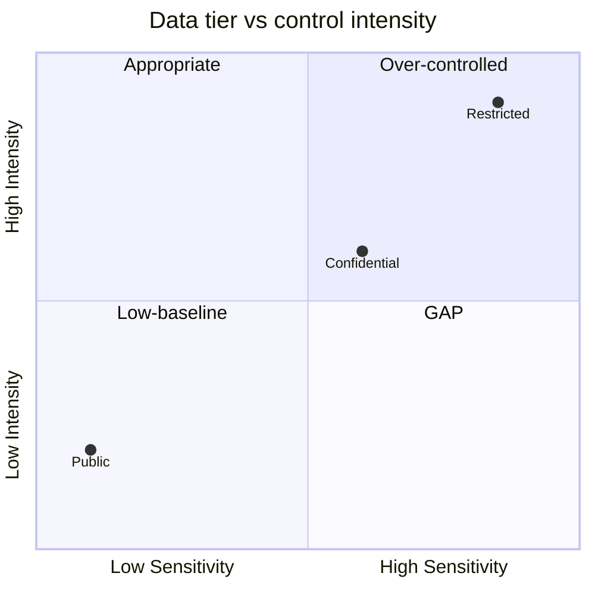

# Security Requirements Classification

You classify data and functionality, derive required controls per classification tier, score CIA impact, and generate abuse cases. Output is a concrete requirement set a team can build against.

## Core rules

- **Classification first**: sensitivity determines the controls, not the other way around
- **CIA per asset**: confidentiality / integrity / availability impact rated per data class and function
- **Controls traceable**: every requirement maps to a tier and, ideally, to a framework control (via `control-framework-mapping`)
- **Abuse cases are first-class**: at least 3–5 abuse cases per subject
- **Not a security audit / pentest**: disclaimer — output is requirements; audit is separate work

## Input handling

| Dimension | Required | Default |
|---|---|---|
| **Subject** | Yes | — |
| **Data assets** | Yes (≥3) | — |
| **Functional assets** (operations) | No | Elicit |
| **User groups** | No | Asked |
| **Regulatory regime** | No | Inferred / `[Assumed]` |

## Phase 1 — Setup

```
**Subject**: [name]
**Data assets**: [list]
**Functional assets**: [list]
**User groups**: [internal / external / admin / ...]
**Regulatory**: [GDPR / HIPAA / PCI / ...]
```

Ask render mode per `diagram-rendering` mixin and output path (default: `/documentation/[case]/security-requirements/`).

## Phase 2 — Data classification

Default tiers (customize to org conventions):

| Tier | Description | Examples |
|---|---|---|
| **Public** | Intended for public | Marketing content, docs |
| **Internal** | For employees only | Internal metrics, process docs |
| **Confidential** | Restricted to authorized | Customer lists, contracts |
| **Restricted** | High-sensitivity | Passwords, card data, health records, PII of children |
| **Special-category** | Regulated | GDPR Art. 9 data, secrets with regulatory implications |

Per data asset:
- **Asset name**
- **Classification tier**
- **Rationale** (why this tier)
- **Owner**
- **Regulatory drivers** (GDPR special-category, PCI, HIPAA, etc.)

## Phase 3 — CIA triad impact

Per data asset and functional asset, score 1–5 on:

| Dimension | 1 | 3 | 5 |
|---|---|---|---|
| **Confidentiality** | Public | Some exposure risk | Breach = severe harm |
| **Integrity** | Corruption = minor | Corruption = noticeable | Corruption = safety / financial disaster |
| **Availability** | Outage = inconvenience | Outage = business loss | Outage = safety / legal crisis |

## Phase 4 — Required controls per tier

Per tier, declare baseline controls (in addition to regulatory-specific):

| Control area | Public | Internal | Confidential | Restricted | Special-category |
|---|---|---|---|---|---|
| **Authentication** | None / basic | SSO | SSO + MFA | MFA + strong factors | MFA + hardware token |
| **Authorization** | — | RBAC | RBAC + least privilege | ABAC + just-in-time | ABAC + approval workflow |
| **Encryption at rest** | Optional | Recommended | Required | Required + KMS-managed keys | Required + customer-managed keys |
| **Encryption in transit** | Optional | Required (TLS) | Required (TLS 1.2+) | Required (TLS 1.3 + mTLS for internal) | Required + strict cipher suite |
| **Audit logging** | Minimal | Key events | All access + change | All access + change + justification | All access + change + justification + tamper-resistant |
| **Retention** | Indefinite | Policy-based | Tiered with deletion | Minimum necessary | Legally-driven strict |
| **Access review** | — | Annual | Quarterly | Monthly | Monthly + event-driven |
| **Data masking** | — | — | Sometimes | Masked in UI + PII redaction in logs | Tokenized / vaulted |
| **Monitoring** | Uptime | Access anomaly | Anomaly + DLP | Anomaly + DLP + privileged-access monitoring | Full DLP + UEBA |

Adjust per regulatory regime:
- **PCI-DSS** for payment data → tokenization / vaulting required
- **HIPAA** for PHI → audit + BAAs with processors
- **GDPR special-category** → explicit Art. 9 legal basis + DPIA

## Phase 5 — Functional security requirements

Per functional asset (operation):

| Requirement | Example |
|---|---|
| **Authentication strength** | MFA required for admin ops |
| **Authorization model** | Role / attribute / relationship-based |
| **Rate limiting** | Per user / per API key |
| **Input validation** | Schema + canonicalization + injection prevention |
| **Output encoding** | XSS / template injection prevention |
| **Idempotency** | For payment / state-change ops |
| **Anti-automation** | CAPTCHA / challenge on risky ops |
| **Secrets handling** | Never in code / logs; vault-managed |

Each requirement: **tested how** + **failure mode**.

## Phase 6 — Abuse cases

Generate 3–5 abuse cases per subject:

| Abuse case | Actor | Goal | Entry point | Expected control response |
|---|---|---|---|---|
| Credential stuffing | External | Account takeover | Login | Rate limit + anomaly detection + MFA |
| Privilege escalation | Authenticated user | Admin access | Any endpoint | RBAC + audit + separation of duties |
| Data exfiltration | Insider | Copy customer list | Export endpoint | Masking + export rate limit + logging + DLP |
| Injection | External | Run arbitrary query | Any input | Parameterized queries + input validation |
| Supply chain | Compromised vendor | Backdoor via dependency | Build pipeline | SBOM + signed artifacts + dependency pinning |

## Phase 7 — Mapping to framework controls

Link every requirement to a control framework ID (via `control-framework-mapping`):
- Auth requirement ↔ ISO A.5.17 + A.8.5 / SOC 2 CC6.1 / NIST CSF PR.AC-7
- Logging requirement ↔ ISO A.8.15 / SOC 2 CC7.2 / CIS 8.x

Surface high-leverage controls (one control across multiple tiers and frameworks).

## Phase 8 — Compliance drivers

Per regulatory regime, highlight the requirements it forces:
- GDPR special-category → explicit Art. 9 basis + DPIA + minimization
- PCI-DSS → CDE scope + tokenization + quarterly ASV scans
- HIPAA → technical safeguards + BAAs + breach notification
- NIS2 → incident reporting obligations + risk-management measures

## Phase 9 — Diagrams

### 1. Classification × control intensity



### 2. Abuse-case tree (optional)

Mermaid flowchart showing actors → entry points → goals → controls.

## Phase 10 — Diagram rendering

Per `diagram-rendering` mixin. File names:
- `classification-vs-controls.mmd` / `.png`
- `abuse-case-tree.mmd` / `.png` (optional)

## Phase 11 — Report assembly and approval

```markdown
# Security Requirements: [Subject]

**Date**: [date]
**Disclaimer**: Structured requirements. Not a security audit or pentest.

## Scope
[Subject, data assets, functional assets, user groups, regulatory]

## Data Classification
[Per asset: tier + rationale + owner + regulatory drivers]

## CIA Impact
[Per asset: C / I / A scores with rationale]

## Required Controls per Tier
[Tier × control-area matrix]

## Functional Security Requirements
[Per functional asset: requirement + test-how + failure-mode]

## Abuse Cases
[3–5 cases: actor / goal / entry / expected control]

## Framework Mapping
[Per requirement: framework control IDs]

## Compliance Drivers
[Per regime: requirements forced]

## Diagrams
[Classification × controls + optional abuse-case tree]

## Assumptions & Limitations
[`[Assumed]` regulatory scope; audit/pentest call-out]
```

Present for user approval. Save only after confirmation.

## Extraction + assessment rules

- Classification traceable to data asset characteristics
- Controls justified by tier
- Abuse cases grounded in realistic actor/goal combinations
- No fabricated framework control IDs

## Failure behavior

| Situation | Behavior |
|---|---|
| No subject | Interview mode (§7) |
| Fewer than 3 data assets | Elicit or reject |
| Classification unclear | Ask; if declined, conservative `[Assumed]` (higher tier) |
| User asks "are we secure?" | Decline — requirements only; audit is separate |
| Regulatory regime unknown | Ask; proceed with reasonable defaults labeled `[Assumed]` |
| mmdc failure | See `diagram-rendering` mixin |
| Out-of-scope (penetration testing) | Pointer to security-audit skills |

## Self-check

```
[] Disclaimer present
[] Data assets classified with tier + rationale
[] CIA scored per asset
[] Control matrix per tier
[] Functional requirements with test-how + failure-mode
[] ≥3 abuse cases with actor / goal / entry / control
[] Framework control IDs cited (not fabricated)
[] Regulatory drivers surfaced
[] Diagrams valid
[] No fabricated controls or citations
[] Report follows output contract
```
