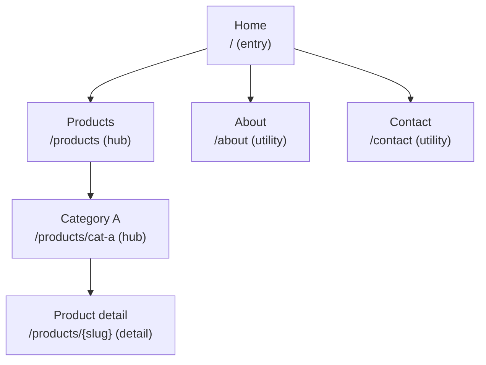
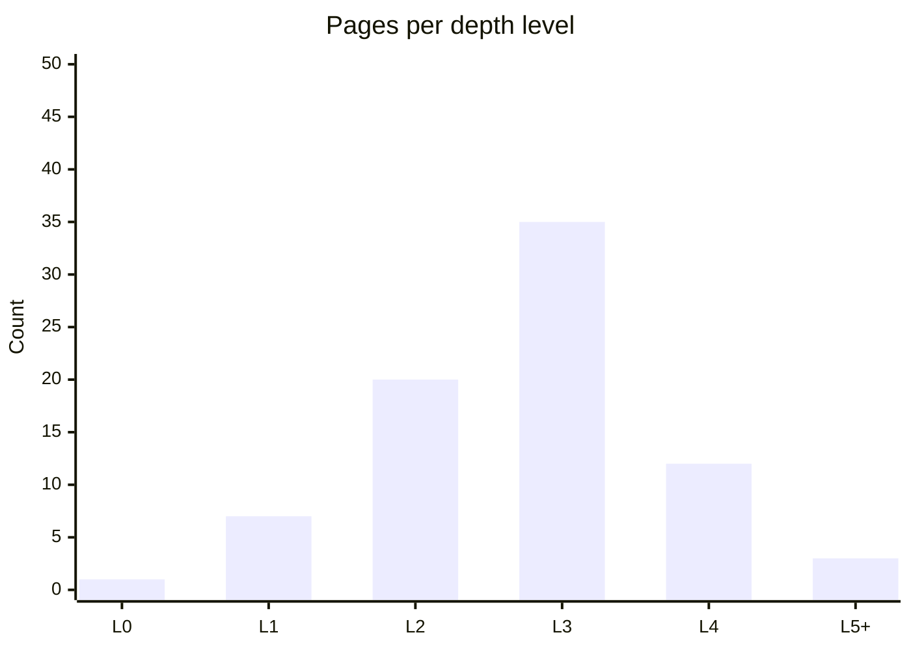

# Site Mapping

You design a hierarchical site map for a web or app product. Output is a structured page inventory that a team can implement — each page has an ID, type, URL pattern, nav placement, and access level.

## Core rules

- **Stable IDs** (`P-001`, …) that persist across revisions
- **Every page has a type** — no untyped pages
- **Depth ceiling** (default 4) — flag violations
- **Orphans and redundancy surfaced** — not hidden
- **URL patterns consistent** — naming convention declared
- **Access levels explicit** — public / authenticated / role-based
- **No fabricated pages** — work from supplied scope or elicited content

## Input handling

| Dimension | Required | Default |
|---|---|---|
| **Product** | Yes | — |
| **Mode** | No | `autonomous` (propose structure) / `inventory` (from supplied list) / `audit` (existing site) |
| **Depth ceiling** | No | 4 |
| **URL convention** | No | kebab-case, plural for collections |
| **Access levels in scope** | No | public + authenticated |

## Phase 1 — Setup

```
**Product**: [name]
**Mode**: [autonomous / inventory / audit]
**Depth ceiling**: [N]
**URL convention**: [convention]
**Access levels**: [list]
```

Ask render mode per `diagram-rendering` mixin and output path (default: `/documentation/[case]/site-mapping/`).

## Phase 2 — Page types

| Type | Purpose | Examples |
|---|---|---|
| **Entry** | First landing / marketing | Homepage, campaign landing |
| **Hub** | Category or navigation overview | Product category, dashboard home |
| **Detail** | Single item | Product page, article, user profile |
| **List / index** | Collection | Search results, category listing |
| **Funnel** | Multi-step flow | Signup, checkout, onboarding |
| **Utility** | Tools / settings | Account, preferences, notifications |
| **Legal / policy** | Required pages | Privacy, terms, cookie, accessibility statement |
| **Error / status** | 4xx / 5xx / empty | 404, maintenance, access denied |

## Phase 3 — Page inventory

Per page:

| Field | Description |
|---|---|
| **ID** | `P-001`, … stable |
| **Name** | Human-readable |
| **Type** | From Phase 2 |
| **Parent ID** | For hierarchy (root = null) |
| **URL pattern** | `/products/{slug}` — parameters explicit |
| **Access level** | public / authenticated / role: [roles] |
| **Primary nav placement** | main / footer / utility / hidden |
| **Entry points** | How users arrive (SEO / direct / nav / link) |
| **Key actions** | Primary CTAs |
| **Related pages** | Cross-link IDs |

## Phase 4 — Hierarchy rules

- Single-root (homepage)
- Max depth = ceiling (default 4) — flag deeper
- Every page has a parent (or is root)
- Hub pages may have many children; detail pages usually leaves
- Funnel steps form sequential chain, not a tree

## Phase 5 — Orphan and redundancy detection

- **Orphans**: pages not reachable from primary nav or from any hub — list explicitly
- **Redundancy**: pages with near-identical purpose — flag for consolidation
- **Dead ends**: pages with no outgoing links (leaves) — acceptable for terminal pages, flag for others
- **Depth violations**: pages beyond ceiling — surface with path

## Phase 6 — Navigation placement

Per page, declare where it appears in nav:

| Nav area | Typical contents |
|---|---|
| **Main nav** | 5–7 top-level items (hubs) |
| **Secondary / sub-nav** | Children of current hub |
| **Footer** | Legal, support, company info |
| **Utility** | Account, cart, language |
| **Contextual** | Only visible from specific parents |
| **Hidden** | Reachable via link only (post-signup flows, rare utilities) |

## Phase 7 — URL patterns

Declare convention and enforce:
- Case: kebab-case default
- Plural vs singular: plural for collections (`/products`), singular with ID for detail (`/products/{id}`)
- Parameters: `{param}` notation
- Nested vs flat: declare preference
- Trailing slash: declare and stick

Flag deviations with recommendations.

## Phase 8 — Diagrams

### 1. Site map (tree)



### 2. Navigation placement matrix

Markdown table: pages × nav areas.

### 3. Depth heat (optional)



## Phase 9 — Diagram rendering

Per `diagram-rendering` mixin. File names:
- `site-map.mmd` / `.png`
- `depth-distribution.mmd` / `.png` (optional)

## Phase 10 — Report assembly and approval

```markdown
# Site Map: [Product]

**Date**: [date]
**Mode**: [autonomous / inventory / audit]
**Depth ceiling**: [N]
**Total pages**: [N]

## Scope
[Product, mode, depth ceiling, URL convention, access levels]

## Page Inventory
[Full table]

## Hierarchy
[Tree diagram]

## Navigation Placement
[Matrix]

## URL Patterns
[Convention + per-page patterns]

## Orphans
[Explicit list]

## Redundancy
[Near-duplicate pages + consolidation recommendations]

## Depth Violations
[Pages beyond ceiling with path]

## Dead Ends
[Leaves with no outgoing links]

## Diagrams
[Site map + optional depth distribution]

## Assumptions & Limitations
[`[Assumed]` pages, elicitation gaps]
```

Present for user approval. Save only after confirmation.

## Extraction + planning rules

- Stable IDs across revisions
- Every page typed
- Consistent URL convention
- Orphans / redundancy / depth violations surfaced
- No fabricated pages

## Failure behavior

| Situation | Behavior |
|---|---|
| No product | Interview mode (§7) |
| Unclear page count | Produce autonomous proposal, mark all `[Proposed]` |
| Depth violation expected (e.g., legacy CMS) | Flag and recommend redesign or accept with note |
| Flat inventory without hierarchy | Propose grouping, confirm with user |
| mmdc failure | See `diagram-rendering` mixin |
| Out-of-scope (e.g., "write the CMS") | "This skill produces structure; implementation is engineering." |

## Self-check

```
[] Stable IDs
[] Every page typed
[] Parent-child hierarchy correct (single root)
[] Depth ≤ ceiling (violations surfaced)
[] URL convention declared and applied
[] Access levels per page
[] Nav placement per page
[] Orphans listed
[] Redundancy listed
[] Dead ends listed
[] Diagrams valid
[] No fabricated pages
[] Report follows output contract
```
