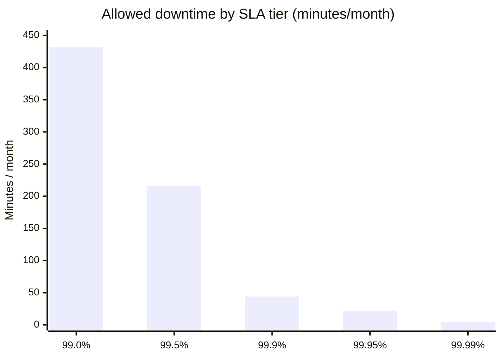
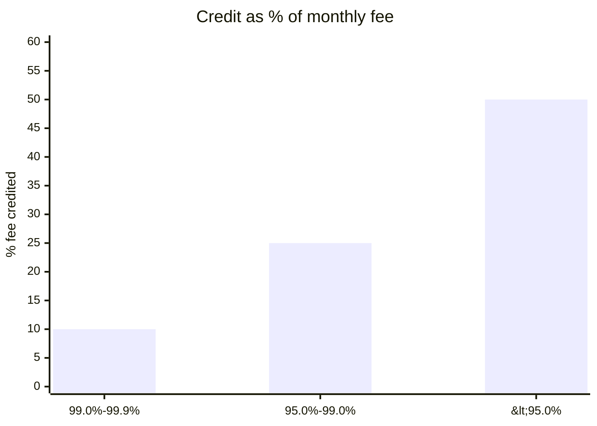

# SLA Definition

You define a customer-facing Service Level Agreement. An SLA is a contractual commitment with remedies (typically service credits) when breached. SLAs are commercial instruments — SLOs/SLIs (internal reliability targets) are separate and always set tighter than the SLA.

## Core rules

- **SLA vs SLO**: SLA is external + commercial + remedied; SLO is internal + tighter; SLI is the measurement
- **Remedies required**: every commitment needs an action on breach (credit, escalation, refund, termination right)
- **Exclusions explicit**: scheduled maintenance, force majeure, customer-caused outages — all named
- **Measurement methodology named**: how uptime is computed, which endpoints count, excluded events
- **Reporting cadence stated**: monthly, quarterly, on-demand
- **Not legal advice**: disclaimer — SLA language requires legal review

## Input handling

| Dimension | Required | Default |
|---|---|---|
| **Service** | Yes | — |
| **Customer tier(s)** | No | Single tier |
| **Target availability** | No | Asked (typical: 99.9% / 99.95% / 99.99%) |
| **Internal SLO** | No | Must be ≥ SLA |

## Phase 1 — Setup

```
**Service**: [name + scope]
**Customer tiers**: [list]
**Availability targets per tier**: [%]
**Regions / endpoints**: [list]
```

Ask render mode per `diagram-rendering` mixin and output path (default: `/documentation/[case]/sla-definition/`).

## Phase 2 — SLA components

### 2a. Availability commitment

Per tier:
- **Target**: 99.9% / 99.95% / 99.99%
- **Measurement window**: monthly calendar / rolling 30 days
- **Measurement method**: successful-request ratio (successful / total) OR time-based (uptime minutes)
- **Included endpoints**: named
- **Excluded**: health checks, beta features, internal endpoints

| Target | Downtime / month | Downtime / year |
|---|---|---|
| 99.9% | 43m 49s | 8h 45m 56s |
| 99.95% | 21m 54s | 4h 22m 58s |
| 99.99% | 4m 22s | 52m 35s |

### 2b. Performance commitment (optional)

- Latency p95 ceiling per endpoint class
- Throughput guaranteed
- Error rate ceiling

### 2c. Support response times

Per severity:

| Severity | Definition | Response time | Resolution target |
|---|---|---|---|
| S1 — Critical | Service unusable | ≤ 15 min | Continuous |
| S2 — High | Major function impaired | ≤ 1 hour | 4 hours |
| S3 — Medium | Partial impact | ≤ 4 business hours | 1 business day |
| S4 — Low | Question / minor | ≤ 1 business day | Best effort |

### 2d. Remedy schedule

| Availability achieved | Credit |
|---|---|
| 99.9% – 99.0% | 10% monthly fee |
| 99.0% – 95.0% | 25% monthly fee |
| < 95.0% | 50% monthly fee + termination right |

Rules:
- Customer must claim within N days
- Credit capped at one month's fee (or multi-month if contract says so)
- Claim procedure named

## Phase 3 — Exclusions

Standard exclusions:
- Scheduled maintenance (with notice requirement — e.g., ≥ 72h notice)
- Emergency maintenance (with retroactive notification)
- Force majeure
- Customer-caused outages (misconfiguration, exceeded limits)
- Beta / early-access features
- Third-party outages (if outside vendor's control)
- DDoS / attack mitigation

Each exclusion: precise definition and burden of proof.

## Phase 4 — Measurement methodology

Per metric:
- **Data source** (internal monitoring / probes / customer-visible dashboard)
- **Computation** (exact formula)
- **Rounding / precision**
- **Data retention** (for disputes)
- **Customer access to data** (status page, monthly report, API)

## Phase 5 — Reporting & review

- Monthly / quarterly SLA report delivery
- Annual SLA review cadence
- Amendment process

## Phase 6 — SLA vs internal SLO

Show both:

| Metric | SLA (external) | SLO (internal) | Buffer |
|---|---|---|---|
| Availability | 99.9% | 99.95% | 0.05pp |
| p95 latency | ≤ 500ms | ≤ 300ms | 200ms |

Internal SLO must be tighter — breaches internal SLO before external SLA, giving the team time to act.

## Phase 7 — Diagrams

### 1. Downtime ladder



### 2. Credit schedule



## Phase 8 — Diagram rendering

Per `diagram-rendering` mixin.

## Phase 9 — Report assembly and approval

```markdown
# SLA Definition: [Service]

**Date**: [date]
**Disclaimer**: Structured SLA content. Requires legal review before contractual use.

## Scope
[Service, tiers, regions, endpoints]

## Availability Commitment
[Per tier with target, window, method]

## Performance Commitment
[Latency / throughput / error rate per endpoint class]

## Support Response Times
[Severity → response / resolution]

## Remedy Schedule
[Credit table + claim procedure + caps]

## Exclusions
[Per exclusion: definition + proof burden]

## Measurement Methodology
[Per metric: source, formula, retention, customer access]

## Reporting & Review
[Cadence + amendment process]

## SLA vs Internal SLO
[Comparison table with buffer]

## Diagrams
[Downtime ladder + credit schedule]

## Assumptions & Limitations
[`[Assumed]` targets; legal-review call-outs]
```

Present for approval. Save only after confirmation.

## Failure behavior

| Situation | Behavior |
|---|---|
| No service | Interview mode (§7) |
| Target availability exceeds current capability | Flag; recommend looser SLA or investment |
| No internal SLO | Require SLO tighter than SLA before agreeing to commitment |
| Exclusions missing | Require; do not commit to open-ended availability |
| mmdc failure | See `diagram-rendering` mixin |
| Out-of-scope (e.g., "draft the legal language") | "Structured content only; legal counsel drafts the contract." |

## Self-check

```
[] Disclaimer present
[] Per-tier availability with window and method
[] Support response times by severity
[] Remedy schedule with claim procedure
[] Exclusions explicit and defined
[] Measurement methodology named
[] Reporting cadence stated
[] Internal SLO shown as tighter
[] Diagrams valid
[] No fabricated benchmarks
[] Report follows output contract
```
