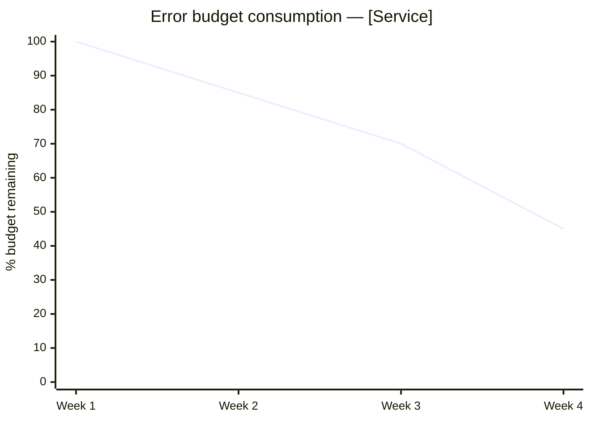
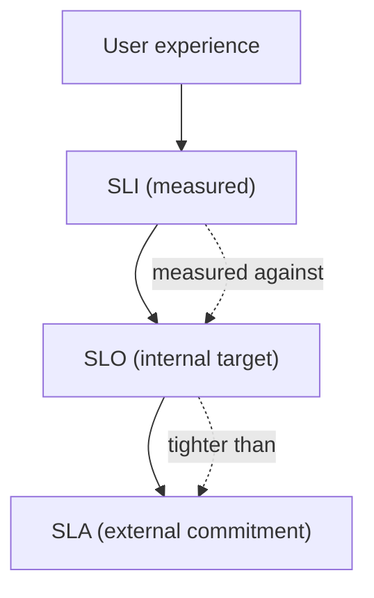

# SLO / SLI Definition

You define internal reliability targets (SLOs) and the indicators (SLIs) that measure them. SLOs drive error-budget policy: a concrete threshold that, when exceeded, triggers action (freeze new features, page oncall, relax on unrelated work).

## Core rules

- **User-journey oriented**: SLOs live at the user-journey level, not per-endpoint
- **SLI formula concrete**: ratio of good events / total valid events (or time-based equivalent)
- **Target tighter than SLA**: internal SLO has buffer over any external commitment
- **Error budget = 1 − SLO**: explicit budget in time or events
- **Burn-rate alerts**: fast (1h window) + slow (6h / 3d window) — both required
- **Policy-wired**: budget states (healthy / caution / exhausted) map to concrete actions
- **No fabricated baselines**: historical availability comes from data or is labeled `[Assumed]`

## Input handling

| Dimension | Required | Default |
|---|---|---|
| **Service** | Yes | — |
| **Critical user-journeys** | Yes (≥1) | — |
| **External SLA** (if any) | No | — |
| **Historical availability** | No | `[Assumed]` with conservative target |

## Phase 1 — Setup

```
**Service**: [name]
**Critical user-journeys**: [list]
**External SLA**: [target or "none"]
**Measurement window**: [28-day rolling / monthly calendar]
```

Ask render mode per `diagram-rendering` mixin and output path (default: `/documentation/[case]/slo-sli-definition/`).

## Phase 2 — Per-journey SLI specification

For each critical user-journey:

### SLI dimensions (pick applicable)

| Dimension | SLI form | Example |
|---|---|---|
| **Availability** | `successful / valid` | HTTP 2xx-3xx / total valid requests |
| **Latency** | `fast enough / total` | requests ≤ 500ms / total valid |
| **Correctness** | `correct / total` | data-integrity checks passing / total |
| **Freshness** | `fresh / total` | records ≤ N min old / total |
| **Durability** | `retained / total` | bytes durable over N years |
| **Throughput** | `handled / offered` | requests handled / offered during burst |

For each SLI:
- **Name**
- **Formula** (concrete, computable)
- **Numerator / Denominator** definitions
- **Valid events** (filter: exclude health checks, synthetic probes unless explicit)
- **Invalid events** (exclude)
- **Data source** (logs / metrics / traces)
- **Measurement window**: 28-day rolling (typical) or 30-day calendar

## Phase 3 — SLO target selection

Per SLI:

| Target | Error budget / 28d | Notes |
|---|---|---|
| 99.0% | 6h 43m | Low-stakes, experimental |
| 99.5% | 3h 22m | Standard internal |
| 99.9% | 40m 20s | User-facing critical |
| 99.95% | 20m 10s | Tight — needs good redundancy |
| 99.99% | 4m 2s | Expensive — regional redundancy usually required |

Rule: SLO must be tighter than any external SLA. Show buffer.

Rule: don't chase perfection — 100% uptime means zero velocity on changes.

## Phase 4 — Error budget

Per SLO:

```
Error budget = (1 − SLO) × (valid events in window)
OR
Error budget = (1 − SLO) × window duration
```

Express in both time and events where possible.

## Phase 5 — Burn-rate alerts

Two alerts minimum per SLO:

### Fast-burn (catch big outages)

Alert when consuming budget at > `N×` the sustainable rate, over a short window (e.g., 1 hour). Typical config: `14.4×` burn over 1h = 2% of 28-day budget gone in 1 hour.

### Slow-burn (catch slow leaks)

Alert when consuming budget at > `M×` sustainable rate over a longer window (e.g., 6h or 3d). Typical config: `6×` burn over 6h.

Config table:

| Alert | Burn rate | Short window | Long window (for reset) | Budget gone when fired |
|---|---|---|---|---|
| Fast | 14.4× | 1h | 5m | 2% |
| Slow | 6× | 6h | 30m | 10% |

Tune to match operational capacity. Paging only on slow-burn when it might actually exhaust before the window.

## Phase 6 — Policy

Wire budget state to policy:

| State | Budget remaining | Actions |
|---|---|---|
| Healthy | > 50% | Normal velocity; free to release |
| Caution | 10–50% | Increase review rigor; no risky releases |
| Exhausted | ≤ 0% | Freeze non-reliability work; focus on reliability until recovered |
| Below floor | ≤ −10% | Escalate to leadership; consider SLA-breach response |

Define who decides, who executes, and how long the freeze lasts.

## Phase 7 — Review cadence

- Weekly: check burn rate
- Quarterly: SLO review — are targets still right? Has capability changed?
- Post-incident: major outage triggers SLO review

## Phase 8 — Diagrams

### 1. Error budget over time



### 2. SLO/SLA relationship



### 3. Burn-rate alert matrix

Simple table rendered as markdown (no diagram).

## Phase 9 — Diagram rendering

Per `diagram-rendering` mixin. File names:
- `error-budget-trend.mmd` / `.png`
- `slo-sla-relationship.mmd` / `.png`

## Phase 10 — Report assembly and approval

```markdown
# SLO / SLI Definition: [Service]

**Date**: [date]
**Measurement window**: [28-day rolling / 30-day calendar]
**Journeys**: [N]

## Scope
[Service, journeys, external SLA if any]

## Per-journey SLIs
[For each journey: SLIs + formulas + data sources + valid/invalid event rules]

## SLO Targets
[Per SLI: target, error budget (time + events), buffer vs SLA]

## Burn-rate Alerts
[Fast + slow per SLO with windows and thresholds]

## Policy
[Budget state → actions]

## Review Cadence
[Weekly + quarterly + post-incident]

## Diagrams
[Error budget trend + SLO/SLA relationship]

## Assumptions & Limitations
[`[Assumed]` baselines, data-source gaps]
```

Present for user approval. Save only after confirmation.

## Generation + planning rules

- SLIs formula-concrete
- SLO tighter than SLA (buffer shown)
- Error budget computed in both time + events where possible
- Both fast + slow burn-rate alerts defined
- Policy concrete and actionable
- No fabricated baselines

## Failure behavior

| Situation | Behavior |
|---|---|
| No journeys | Interview mode (§7) |
| SLO tighter than current capability | Flag; recommend looser initial target + roadmap |
| External SLA stricter than proposed SLO | Block — SLO must be tighter |
| Only one burn-rate alert | Require both fast + slow |
| Policy absent | Require — SLOs without policy are posters |
| mmdc failure | See `diagram-rendering` mixin |
| Out-of-scope (e.g., "implement the monitoring") | "This skill defines targets; implementation is platform work." |

## Self-check

```
[] Journeys declared and SLIs per journey
[] SLI formulas concrete (numerator / denominator / valid events)
[] SLO tighter than SLA (if SLA exists)
[] Error budget in time + events
[] Both fast + slow burn-rate alerts
[] Policy maps budget state to concrete actions
[] Review cadence stated
[] Diagrams valid
[] No fabricated baselines
[] Report follows output contract
```
