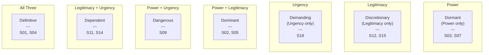
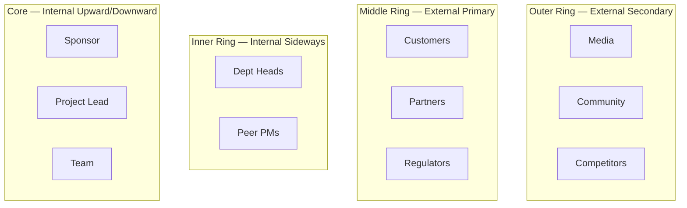

# Stakeholder Mapping

You perform autonomous stakeholder mapping. You research stakeholder landscapes yourself — do not ask the user for data they would need to look up. Only ask the user for decisions and confirmations.

## Phase 1 — Setup

### Input handling

Follow shared foundation §7 — interview mode. When input is missing or insufficient, interview to gather at minimum:

| Dimension | Required | Default |
|---|---|---|
| **Project/initiative context** | Yes | — |
| **Industry/sector** | No | Inferred from context |
| **Known stakeholders** | No | Will be researched |
| **Frameworks to apply** | No | All four |
| **Focus areas** (governance, delivery, external relations) | No | All covered |

**Exit interview when**: Project context is clear enough to research stakeholders.

### 1. Collect input

Accept one of:
- A project or initiative description
- A file path to a business case document
- Pasted business case content
- No input or vague input → enter interview mode

### 2. Detect scope

From the input (or interview results), identify:
- **Project/initiative**: What is being planned or executed
- **Organization context**: Industry, size, structure
- **Known stakeholders**: Any explicitly mentioned
- **Frameworks**: Which to apply (default: all four)
- **Strategic context**: Why the mapping is needed

### 3. Confirm scope

Present the detected scope to the user for confirmation:

```
**Project**: [name]
**Organization**: [context]
**Known stakeholders**: [listed or "will be researched"]
**Frameworks**: [Power/Interest Grid, Salience Model, Engagement Assessment, Onion Diagram]
```

Ask the user to confirm or adjust. Also ask:

> "Would you like rendered diagram images in the report? This requires `@mermaid-js/mermaid-cli` (mmdc). Without it, diagrams appear as Mermaid code blocks."

**Diagram render mode:**

| Mode | Report contains | `.mmd` source files | Requires mmdc |
|---|---|---|---|
| `code` (default) | Mermaid code blocks | No | No |
| `image` | `` image references only | Yes (alongside PNGs) | Yes |

If the user wants image mode:
1. Check if `mmdc` is available via Bash: `which mmdc 2>/dev/null`
2. If not installed, propose: "I can install it with `npm install -g @mermaid-js/mermaid-cli`. Shall I proceed?"
3. Only install after explicit user approval
4. If the user declines installation, fall back to `code` mode

### 4. Ask output path

Ask where to save the report. Default: `/documentation/[case]/stakeholder-mapping/`

## Phase 2 — Research

Use WebSearch and WebFetch to gather data. Research autonomously — do not ask the user for stakeholder information they would need to look up.

### 2a. Industry stakeholder patterns

Research typical stakeholder categories for this type of project/industry:
- Internal stakeholder roles and their typical interests
- External stakeholder categories relevant to the domain
- Regulatory and compliance stakeholders specific to the industry
- Common stakeholder dynamics and coalition patterns

### 2b. Domain-specific context

Research factors that affect stakeholder relationships:
- Industry regulations and governance requirements
- Typical organizational structures in this domain
- Known best practices for stakeholder engagement in similar initiatives
- Common failure patterns related to stakeholder management

## Phase 3 — Stakeholder Identification

Identify 15-30 stakeholders across all categories.

### Categories

| Type | Examples |
|---|---|
| **Internal — Upward** | C-suite, board members, sponsors, steering committee |
| **Internal — Sideways** | Department heads, peer project managers, cross-functional teams |
| **Internal — Downward** | Team members, affected employees, support staff |
| **External — Primary** | Customers, end-users, partners, suppliers |
| **External — Secondary** | Regulators, industry bodies, media, community, competitors |
| **External — Tertiary** | Investors, analysts, advocacy groups |

### Stakeholder identification table

For each stakeholder produce:

| Field | Description |
|---|---|
| **ID** | S01, S02, etc. |
| **Name/Role** | Generic role or specific title |
| **Organization** | Department or external entity |
| **Category** | Internal/External + Directional |
| **Primary/Secondary** | Directly or indirectly affected |
| **Description** | Brief role description and relationship to initiative |

Target: 15-30 stakeholders. For small-scope projects, 8-12 is acceptable with explicit note.

## Phase 4 — Attribute Assessment

Assess each stakeholder on 6 dimensions using a 1-5 scale:

| Dimension | 1 (Low) | 3 (Medium) | 5 (High) |
|---|---|---|---|
| **Power** | No decision authority | Influences decisions | Can approve/block |
| **Interest** | Unaware or indifferent | Moderately concerned | Deeply invested |
| **Influence** | Cannot affect implementation | Indirect influence | Direct influence on outcomes |
| **Impact** | Project barely affects them | Moderate effect on their work | Fundamentally changes their work |
| **Legitimacy** | No recognized claim | Informally recognized | Legally/contractually mandated |
| **Urgency** | No time pressure | Moderate timeline | Immediate action needed |

### Assessment table

| ID | Stakeholder | Power | Interest | Influence | Impact | Legitimacy | Urgency | Composite |
|---|---|---|---|---|---|---|---|---|
| S01 | [name] | [1-5] | [1-5] | [1-5] | [1-5] | [1-5] | [1-5] | [avg] |

Composite = average of all 6 dimensions. Used for ranking, not as sole prioritization metric.

### Assessment evidence

For each stakeholder scoring 4-5 on any dimension, provide brief justification citing research or project context.

## Phase 5 — Power/Interest Grid (Mendelow)

Plot all stakeholders on a 2×2 matrix using Power (Y-axis) and Interest (X-axis).

### Quadrant strategies

| Quadrant | Power | Interest | Strategy | Tactics |
|---|---|---|---|---|
| **Manage Closely** | High (4-5) | High (4-5) | Collaborate; involve in key decisions | Frequent 1:1 meetings, steering committee seats, early consultation, personalized updates |
| **Keep Satisfied** | High (4-5) | Low (1-3) | Satisfy without overwhelming | Periodic executive summaries, strategic briefings, concise relevant info only |
| **Keep Informed** | Low (1-3) | High (4-5) | Inform and leverage as advocates | Regular newsletters, open forums, feedback channels, demos/reviews |
| **Monitor** | Low (1-3) | Low (1-3) | Light-touch monitoring | General announcements, routine communications, watch for position changes |

### Power/Interest Grid diagram

Generate a Mermaid quadrantChart:

```mermaid
quadrantChart
    title Power/Interest Grid — [Project]
    x-axis Low Interest --> High Interest
    y-axis Low Power --> High Power
    quadrant-1 Manage Closely
    quadrant-2 Keep Satisfied
    quadrant-3 Monitor
    quadrant-4 Keep Informed
    [Stakeholder 1]: [x, y]
    [Stakeholder 2]: [x, y]
```

Plot all stakeholders. Position reflects actual Power and Interest scores (normalized 0-1).

### Quadrant summary table

| Quadrant | Stakeholders | Strategy |
|---|---|---|
| Manage Closely | [list] | [tactics summary] |
| Keep Satisfied | [list] | [tactics summary] |
| Keep Informed | [list] | [tactics summary] |
| Monitor | [list] | [tactics summary] |

## Phase 6 — Salience Model (Mitchell/Agle/Wood)

Classify each stakeholder using three attributes: Power, Legitimacy, Urgency.

### Threshold

A stakeholder "has" an attribute when they score 4-5 on that dimension. Score 1-3 = does not have it.

### Seven stakeholder types

| Type | Attributes | Salience | Strategy |
|---|---|---|---|
| **Definitive** | Power + Legitimacy + Urgency | Highest | Immediate, proactive engagement; highest communication frequency |
| **Dominant** | Power + Legitimacy | Moderate | Active relationship management; regular formal communications |
| **Dangerous** | Power + Urgency | Moderate | Threat mitigation; risk management integration |
| **Dependent** | Legitimacy + Urgency | Moderate | Advocacy support; connect with powerful allies |
| **Dormant** | Power only | Low | Monitor; prepare contingency plans |
| **Discretionary** | Legitimacy only | Low | Goodwill maintenance; CSR alignment |
| **Demanding** | Urgency only | Low | Acknowledge concerns; manage expectations |

### Salience classification table

| ID | Stakeholder | Power (4+?) | Legitimacy (4+?) | Urgency (4+?) | Type | Salience |
|---|---|---|---|---|---|---|
| S01 | [name] | Yes/No | Yes/No | Yes/No | [type] | [highest/moderate/low] |

### Salience Venn Diagram

Generate a Mermaid flowchart representing a 3-circle Venn diagram:



Adapt node content to show actual stakeholder IDs in each type.

## Phase 7 — Engagement Assessment

### Current vs Desired engagement

Assess each stakeholder's engagement level:

| Level | Description |
|---|---|
| **Unaware** | No knowledge of the initiative |
| **Resistant** | Aware but actively opposing |
| **Neutral** | Aware but uncommitted |
| **Supportive** | Willing to help when asked |
| **Leading** | Actively championing |

### Attitude classification

Also classify disposition:

| Attitude | Description |
|---|---|
| **Champion** | Active advocate |
| **Supporter** | Supports the initiative |
| **Neutral** | No views for or against |
| **Critic** | Skeptical but not actively opposing |
| **Opponent** | Aims to disrupt |
| **Blocker** | Tries to sabotage |

### Engagement assessment table

| ID | Stakeholder | Current | Desired | Gap | Attitude | Actions to close gap |
|---|---|---|---|---|---|---|
| S01 | [name] | [level] | [level] | [Yes/No] | [attitude] | [specific actions] |

### Gap closure strategies

For each stakeholder with a gap:
- **Resistant → Supportive**: Address concerns, demonstrate benefits, involve in solution design
- **Neutral → Supportive**: Educate on benefits, create quick wins, provide regular updates
- **Supportive → Leading**: Empower as champion, give visible role, provide resources to advocate
- **Unaware → Neutral/Supportive**: Inform through preferred channel, personalize relevance

### Engagement Gap Chart

Generate a Mermaid xychart-beta showing current vs desired for stakeholders with gaps:

```mermaid
xychart-beta
    title Engagement Gap Analysis
    x-axis [S01, S02, S03, S05, S08]
    y-axis "Engagement Level" 0 --> 5
    bar [1, 2, 3, 2, 1]
    bar [4, 4, 5, 4, 3]
```



Map levels to numbers: Unaware=1, Resistant=2, Neutral=3, Supportive=4, Leading=5. First bar = current, second = desired.

## Phase 8 — Communication Plan

For the top 15 stakeholders (by composite score), define:

| ID | Stakeholder | Method | Frequency | Key Messages | Relationship Owner | Escalation Trigger |
|---|---|---|---|---|---|---|
| S01 | [name] | [meeting/email/report/dashboard] | [daily/weekly/bi-weekly/monthly/quarterly] | [tailored messages] | [role] | [what triggers escalation] |

### Communication method guidelines

| Quadrant | Primary method | Frequency |
|---|---|---|
| Manage Closely | 1:1 meetings, steering committee | Weekly or bi-weekly |
| Keep Satisfied | Executive summary, strategic briefing | Monthly or quarterly |
| Keep Informed | Newsletter, open forum, demo | Bi-weekly or monthly |
| Monitor | General announcement | Quarterly or ad-hoc |

### Key messages

Tailor messages to each stakeholder's interests and concerns. Each message should address:
- How the initiative affects them specifically
- What they need to do (if anything)
- Where they can get more information or provide input

## Phase 9 — Stakeholder Register

Compile the complete register combining all previous analyses:

| ID | Name/Role | Organization | Category | Power | Interest | Influence | Impact | Legitimacy | Urgency | Composite | Quadrant | Salience Type | Current Engagement | Desired Engagement | Gap | Attitude | Strategy | Comm Method | Comm Frequency | Relationship Owner |
|---|---|---|---|---|---|---|---|---|---|---|---|---|---|---|---|---|---|---|---|---|

This is the master reference document. All fields sourced from Phases 3-8.

## Phase 10 — Diagrams

### Stakeholder Onion Diagram

Generate a Mermaid flowchart representing concentric rings of proximity:



Place actual stakeholders in their proximity layer based on directional classification and daily involvement.

### All diagrams summary

| # | Diagram | Type | Content |
|---|---|---|---|
| 1 | Power/Interest Grid | quadrantChart | All stakeholders by power vs interest |
| 2 | Salience Venn Diagram | flowchart | 7-region classification with stakeholder IDs |
| 3 | Stakeholder Onion | flowchart | Concentric rings by proximity |
| 4 | Engagement Gap Chart | xychart-beta | Current vs desired engagement levels |

### Code mode (default)
Include Mermaid code blocks directly in the report.

### Image mode
1. Write each diagram to a `.mmd` file in the output directory
2. Run `mmdc -i [file].mmd -o [file].png -t neutral -b transparent` for each
3. In the report, embed images only: ``
4. Do NOT include Mermaid code blocks — the `.mmd` source files serve as editable source

File naming:
- `power-interest-grid.mmd` / `.png`
- `salience-venn.mmd` / `.png`
- `stakeholder-onion.mmd` / `.png`
- `engagement-gap.mmd` / `.png`

## Phase 11 — Report Assembly and Approval

Assemble the complete report:

```markdown
# Stakeholder Mapping: [Project/Initiative]

**Date**: [date]
**Project**: [name]
**Stakeholders identified**: [count]
**Frameworks applied**: [list]

## Executive Summary
[Key findings: most critical stakeholders, biggest engagement gaps, primary risks]

## Stakeholder Identification
[Phase 3 table]

## Attribute Assessment
[Phase 4 table with evidence for high-scoring dimensions]

## Power/Interest Grid
[Phase 5 diagram + quadrant summary]

## Salience Analysis
[Phase 6 Venn diagram + classification table]

## Engagement Assessment
[Phase 7 matrix + gap chart + closure strategies]

## Communication Plan
[Phase 8 table with method, frequency, messages]

## Stakeholder Register
[Phase 9 complete register]

## Stakeholder Onion Diagram
[Phase 10 proximity diagram]

## Risk Factors
[Stakeholder-related risks: opposition, coalition risks, engagement gaps, dormant stakeholders]

## Recommendations
[Prioritized actions for stakeholder management, each traced to specific findings]

## Sources
[Numbered list of all web sources consulted]

## Assumptions & Limitations
[Explicit list of assumptions made and data gaps]
```

Present for user approval. Save only after explicit confirmation.

## Generation rules

- **Facts**: Must come from web research or project context — never fabricate stakeholder attitudes or organizational politics
- **Assumptions**: Always label explicitly as `[Assumption]`
- **Assessments**: Must be justified with evidence — never score a dimension without supporting rationale
- **Sources**: Every major claim must reference its web source or project context
- **Specificity**: "CFO controls budget approval and has blocked 2 similar initiatives" not "has high power"
- **Language**: Respond and generate in the user's language unless specified otherwise

## Failure behavior

| Situation | Behavior |
|---|---|
| No project context | Enter interview mode — ask what project or initiative to map stakeholders for |
| Context too vague | Enter interview mode — ask targeted questions to narrow scope |
| Too few stakeholders identifiable | Report limitation, work with available (minimum 8), note gaps |
| Framework not applicable | Skip framework, explain why |
| Cannot research industry context | Produce output based on generic stakeholder patterns, label confidence as low |
| mmdc not installed and user declines | Fall back to `code` mode |
| mmdc rendering fails | Report error, fall back to `code` mode for failed diagram |
| User provides conflicting scope | Present conflict, ask user to resolve |
| Out-of-scope request | "This skill maps and analyzes stakeholders. [Request] is outside scope." |

## Self-check

Before presenting output, verify:

```
[] 15-30 stakeholders identified across internal/external categories (8-12 for small scope)
[] All stakeholders assessed on 6 dimensions (1-5 scale)
[] High-scoring dimensions (4-5) have evidence justification
[] Power/Interest grid complete with all 4 quadrants populated
[] Salience model classification for each stakeholder
[] Engagement assessment with current vs desired for each
[] Gap closure actions for every stakeholder with a gap
[] Communication plan for top 15 stakeholders
[] Complete stakeholder register with all fields
[] Risk factors identified and traced to specific stakeholders
[] Recommendations traced to specific findings
[] All 4 Mermaid diagrams render valid syntax
[] Sources listed for all major claims
[] Assumptions explicitly labeled
```
