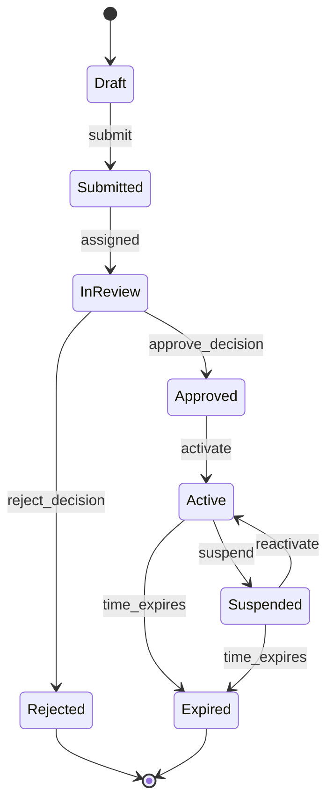
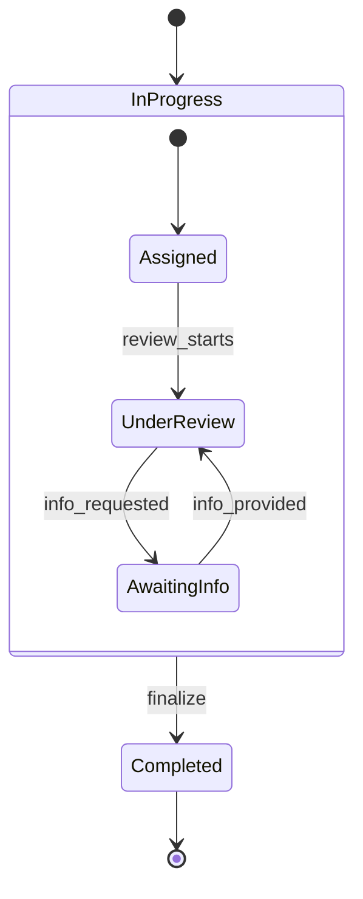
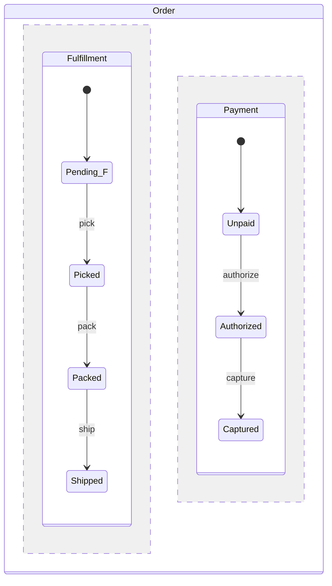

# State Machine Diagramming (Domain Entities)

You model the lifecycle of a business / domain entity as a finite state machine. This is **domain-level** (what states does an order go through: pending → paid → shipped → delivered) — distinct from `state-transition-mapping` which handles **UI component states** (idle / loading / success / error).

## Core rules

- **Entity-scoped**: one entity per state machine
- **States = invariants**: each state defines conditions that must hold while in that state
- **Transitions typed**: trigger (event / time / condition) + optional guard + optional effect (side action)
- **Terminal states explicit**: absorbing states where entity stops evolving
- **No orphan states**: every non-initial state reachable; every non-terminal state has outbound transitions
- **Domain concepts, not UI**: states reflect business state, not what's on the screen

## Input handling

| Dimension | Required | Default |
|---|---|---|
| **Entity** | Yes | — |
| **Lifecycle scope** | Yes | — |
| **Known states / transitions** | No | Elicit |
| **Trigger vocabulary** | No | Elicit |

## Phase 1 — Setup

```
**Entity**: [e.g., Order / User Account / Subscription / Document / Shipment / Loan Application]
**Lifecycle scope**: [from: when entity created → to: terminal states]
**Format**: [flat / hierarchical (nested) / parallel (orthogonal regions)]
**Trigger types**: [event / time / condition / mixed]
```

Ask render mode per `diagram-rendering` mixin and output path (default: `/documentation/[case]/state-machine-diagramming/`).

## Phase 2 — State enumeration

Per state:

| Field | Description |
|---|---|
| **Name** | Business-domain term (e.g., "Pending", "Approved", "Refunded") |
| **Type** | initial / normal / terminal |
| **Invariants** | Conditions true while in this state |
| **Allowed operations** | What can happen to the entity in this state |
| **Disallowed operations** | What's blocked in this state |
| **Entry effect** (optional) | Action on entering (e.g., send email, set timestamp) |
| **Exit effect** (optional) | Action on leaving |
| **Time limit** (optional) | Max time in state before auto-transition |

Rule: if a state has no outbound transitions and is not terminal, it's a bug → flag as deadlock.

## Phase 3 — Transition specification

Per transition:

| Field | Description |
|---|---|
| **From state** | Source |
| **To state** | Target |
| **Trigger** | Event / time / condition causing transition |
| **Guard** | Condition required (if any) |
| **Effect** | Side action during transition (side effects) |
| **Actor** (optional) | Who initiates (user role / system) |
| **Rollback path** | If transition fails mid-way |
| **Idempotency** | Is it safe to retry if ambiguous? |

### Trigger types

| Type | Example |
|---|---|
| **Event** | User submits, system receives webhook |
| **Time** | After 30 days, at end of month |
| **Condition** | When stock reaches 0, when balance > 0 |
| **Composite** | Event + guard condition |

## Phase 4 — Hierarchical / parallel structure

### Hierarchical (nested states / sub-states)

A state can contain sub-states. Useful when a high-level state has internal structure.

Example: "In Progress" contains "Assigned", "Under Review", "Awaiting Info".

Transitions can be:
- **Internal** (within parent state, between sub-states)
- **External** (from parent to another state, collapses sub-state)

### Parallel regions (orthogonal)

Entity is in multiple states simultaneously across independent dimensions.

Example: An order has:
- **Fulfillment dimension**: Pending → Picked → Packed → Shipped → Delivered
- **Payment dimension**: Unpaid → Authorized → Captured → Refunded

Both evolve independently; entity-level is the combination.

Rule: use parallel regions when dimensions are genuinely independent; otherwise collapse into single sequence.

## Phase 5 — Transition matrix

Tabular view showing all transitions:

| From \ Trigger | Event-A | Event-B | Time-X | Condition-C |
|---|---|---|---|---|
| State-1 | → State-2 | — | — | → State-3 |
| State-2 | — | → State-3 | → State-4 | — |

Empty cell = transition not allowed from that state on that trigger. Useful for detecting gaps.

## Phase 6 — Invalid transitions

Explicitly list transitions that should NOT exist:

| Attempted transition | Reason blocked |
|---|---|
| Cancelled → Active | Cancelled is terminal; reactivation = new entity |
| Paid → Unpaid | Accounting integrity — payment cannot un-happen; use Refund transition instead |
| Any → Initial | States are monotonic; restart = new entity |

Prevents bugs where code allows illegal transitions.

## Phase 7 — Side effects & integration hooks

Per state entry / transition, document side effects:

| Event | Side effect |
|---|---|
| Enter "Paid" | Send receipt email; update ledger; decrement inventory |
| Enter "Shipped" | Send tracking notification; schedule delivery SLA timer |
| Transition Paid → Refunded | Call payment gateway refund API; send refund confirmation; credit back |

Side effects should be idempotent (handle retries safely).

## Phase 8 — Diagrams

### 1. State diagram



### 2. Hierarchical state diagram (if applicable)



### 3. Parallel regions (if applicable)



## Phase 9 — Diagram rendering

Per `diagram-rendering` mixin. File names:
- `state-machine.mmd` / `.png`

## Phase 10 — Report assembly and approval

```markdown
# State Machine: [Entity]

**Date**: [date]
**Entity**: [name]
**Format**: [flat / hierarchical / parallel]
**Lifecycle scope**: [from → to]

## Scope
[Entity, lifecycle, format, trigger types]

## States
[Per state: type, invariants, allowed ops, disallowed ops, entry/exit effects, time limit]

## Transitions
[Per transition: from → to, trigger, guard, effect, actor, rollback, idempotency]

## Transition Matrix
[From × Trigger table]

## Invalid Transitions
[Explicit disallowed transitions with reason]

## Side Effects & Integration Hooks
[Per event or transition: side effects with idempotency notes]

## Hierarchical / Parallel Structure
[If applicable]

## Diagrams
[State diagram + hierarchical + parallel]

## Assumptions & Limitations
[Elicitation gaps, domain-model assumptions]
```

Present for user approval. Save only after confirmation.

## Generation + planning rules

- Business-domain vocabulary throughout
- States have invariants
- Transitions typed with trigger + guard + effect
- Invalid transitions explicit
- Side effects idempotent
- No fabricated states / transitions

## Failure behavior

| Situation | Behavior |
|---|---|
| No entity | Interview mode (§7) |
| States conflate domain + UI | Clarify; push UI states to `state-transition-mapping` |
| Deadlock (non-terminal without outbound) | Flag + require outbound transition |
| Invalid transition path bug-prone | Add to invalid-transitions list explicitly |
| Non-idempotent side effect | Flag as reliability risk; recommend idempotency key |
| mmdc failure | See `diagram-rendering` mixin |
| Out-of-scope (implement the state machine) | "Modeling only; implementation is engineering." |

## Self-check

```
[] Entity declared; one entity per machine
[] Format chosen (flat / hierarchical / parallel)
[] States with invariants + allowed / disallowed operations
[] Transitions with trigger + guard + effect + actor + rollback + idempotency
[] Transition matrix (or note if parallel regions)
[] Invalid transitions listed
[] Side effects documented with idempotency
[] Terminal states explicit
[] No deadlocks
[] Domain vocabulary (not UI)
[] Diagrams valid
[] No fabricated states / transitions
[] Report follows output contract
```
