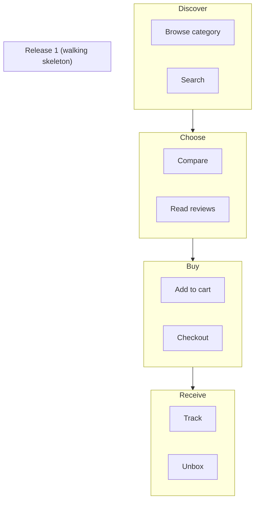

# Story Mapping

You build a user story map in Jeff Patton's format: a **horizontal narrative backbone** of user activities left-to-right, **vertical sub-stories / tasks** below each activity ordered by priority, and **horizontal release slices** that cut across the map indicating what ships in each release.

Distinct from:
- Backlog (flat list, hides narrative)
- `user-journey-management` (strategic journey with emotions)
- `user-flow-diagramming` (UI-task-level)

Story mapping lives between journey and backlog.

## Core rules

- **Backbone is narrative, left-to-right**: reads as "user does X, then Y, then Z"
- **Backbone is activities** (big steps), not features
- **Below each activity: tasks**, which decompose into user stories
- **Priority within a column**: top = must-have, bottom = nice-to-have
- **Release slices are horizontal cuts**: walking skeleton first, then thickening
- **Walking skeleton is end-to-end minimum**: connects backbone from start to finish, thin but complete
- **No fabricated activities**: work from user research / supplied journey / elicitation

## Input handling

| Dimension | Required | Default |
|---|---|---|
| **Product / initiative** | Yes | — |
| **User type / persona** | Yes | — |
| **Journey source** | No | Elicit activities |
| **Release count target** | No | 3 (walking skeleton + 2 thickening) |

## Phase 1 — Setup

```
**Product / initiative**: [name]
**User**: [persona or role]
**Journey source**: [existing journey map / user research / elicitation]
**Release count**: [N, default 3]
```

Ask render mode per `diagram-rendering` mixin and output path (default: `/documentation/[case]/story-mapping/`).

## Phase 2 — Backbone: user activities

Activities are the **big verbs** in the user's journey — high-level chunks of what the user does.

Examples for an e-commerce purchase journey:
- Discover → Choose → Decide → Buy → Receive → Use → Support

Examples for a SaaS onboarding:
- Learn about tool → Sign up → Set up account → Do first task → Invite team → Get results

Rules:
- 4–10 activities (fewer = too coarse, more = probably mixing levels)
- Verb-led from user perspective
- Narrative flows left-to-right chronologically
- No activities hidden — if the user does it, it's on the map

## Phase 3 — Tasks per activity

Below each activity, list the **tasks** the user performs in that activity.

Example under "Choose":
- Browse categories
- Search by keyword
- Filter results
- Compare products
- Read reviews
- Save to wishlist

Rules:
- Each task is a concrete user action
- 3–7 tasks per activity typical
- Organized top-to-bottom by priority (most-important at top)

## Phase 4 — User stories per task

Each task may decompose into user stories (the actual development work):

Example task "Filter results" →
- As a shopper, I can filter by price range
- As a shopper, I can filter by brand
- As a shopper, I can filter by rating
- As a shopper, I can combine multiple filters
- As a shopper, I can save my filter preset

Rules:
- User-story format (As a [role], I want [capability], so I can [outcome])
- Top-to-bottom priority within task column
- Each story goes to `user-story-generator` or existing backlog for full AC + estimation

## Phase 5 — Release slicing

Horizontal lines cut across the map defining what ships when. Each slice selects some subset of stories per task column.

### Walking skeleton (Release 1)

**Minimum end-to-end flow**: one story per task (the top priority), connecting the whole backbone. Thin — user can do each activity, barely.

Purpose: prove the end-to-end flow works. Deliver value early even if shallow.

### Thickening releases (Release 2, 3, ...)

Each subsequent release picks more stories per task column, strengthening coverage.

Example:
- **R1 (Walking skeleton)**: Top 1 story per task column → user can do each activity minimally
- **R2 (Depth)**: Top 2–3 stories per task column → richer experience in most-important tasks
- **R3 (Polish)**: Remaining stories → edge cases, advanced features, power-user capability

Rules:
- Walking skeleton is horizontal — reaches end of backbone
- Never slice vertical (all of Activity 1 then all of Activity 2) — that's a waterfall map, not a story map
- Slices are explicit: every story is in Rx or "parked"

## Phase 6 — Gap detection

The map reveals:

- **Narrative gaps**: activities with obvious missing steps (e.g., "Decide" has no "Compare options" task)
- **Over-detail**: one column with 15 tasks while others have 3 — probably conflating activity with task
- **Orphan stories**: stories that don't fit any task — either task missing or story out of scope
- **Under-prioritization**: story columns where top story isn't the most-valuable — re-order
- **Walking-skeleton infeasibility**: if top-row stories don't connect end-to-end, flow is broken

Flag each explicitly.

## Phase 7 — Annotation overlays

Optional annotations:
- **Persona variants**: some tasks only apply to specific personas
- **Platform**: some stories web-only / mobile-only
- **Risk**: high-risk stories flagged
- **Dependencies**: cross-task dependencies noted

## Phase 8 — Diagrams

### Story map (Mermaid flowchart with columns)



Simpler alternative: markdown-table story map where columns = activities, rows = priority tiers, cells = tasks/stories.

## Phase 9 — Diagram rendering

Per `diagram-rendering` mixin. File names:
- `story-map.mmd` / `.png`
- `release-slicing.md` (table)

## Phase 10 — Report assembly and approval

```markdown
# Story Map: [Product / Initiative]

**Date**: [date]
**User**: [persona / role]
**Backbone activities**: [N]
**Total tasks**: [N]
**Total stories**: [N]
**Releases planned**: [N]

## Scope
[Product, user, journey source, release target]

## Backbone
[Horizontal activity sequence]

## Tasks per Activity
[Table: Activity → Tasks (prioritized)]

## Stories per Task
[Full story list grouped by task, prioritized within task]

## Release Slicing
### Walking Skeleton (R1)
[Minimum end-to-end stories]

### Release 2: Depth
[Additional stories per task]

### Release 3+: Polish
[Remaining stories]

## Gap Detection
[Narrative gaps / over-detail / orphans / walking-skeleton issues]

## Annotations
[Persona / platform / risk / dependency overlays]

## Diagrams
[Story map flowchart + release table]

## Next Steps
[Feed walking-skeleton stories into backlog / sprint planning / user-story-generator]

## Assumptions & Limitations
[Elicitation gaps, persona assumptions]
```

Present for user approval. Save only after confirmation.

## Generation + planning rules

- Backbone narrative-led
- 4–10 activities
- Tasks per activity (3–7)
- Stories user-story format
- Walking skeleton end-to-end
- Releases horizontal not vertical
- No fabricated activities

## Failure behavior

| Situation | Behavior |
|---|---|
| No product / user | Interview mode (§7) |
| Activities too feature-like ("Login page" as activity) | Recast as user activity ("Authenticate") |
| Over-detail in one column | Flag; activity may need splitting |
| Walking skeleton breaks (tasks don't connect) | Flag; revisit activity order or task priorities |
| User wants linear backlog | Fine, but flag value of map format for narrative + release planning |
| mmdc failure | See `diagram-rendering` mixin |
| Out-of-scope ("estimate + plan sprints") | "Mapping only. Estimation in `story-point-estimation` / sprint planning in backlog tooling." |

## Self-check

```
[] Product + user declared
[] Backbone is narrative-ordered user activities (4–10)
[] Tasks per activity (3–7) prioritized top-to-bottom
[] Stories in user-story format
[] Walking skeleton = top row, end-to-end
[] Subsequent releases thickening
[] Gaps surfaced (narrative / over-detail / orphan / broken skeleton)
[] Annotations (if applicable)
[] Diagram or table valid
[] No fabricated activities
[] Report follows output contract
```
