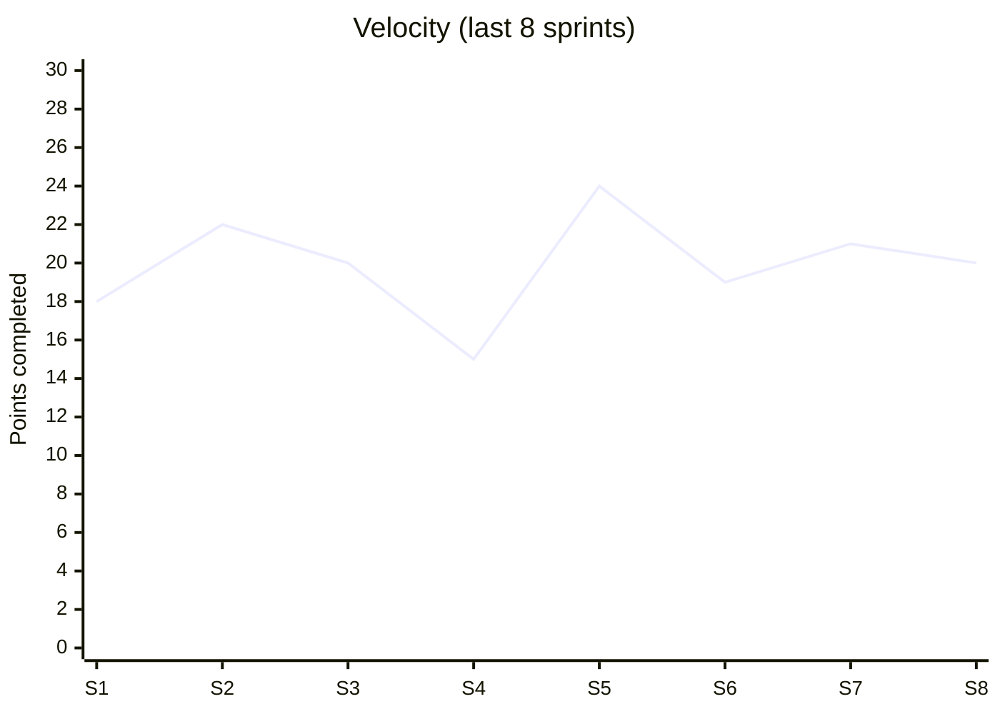
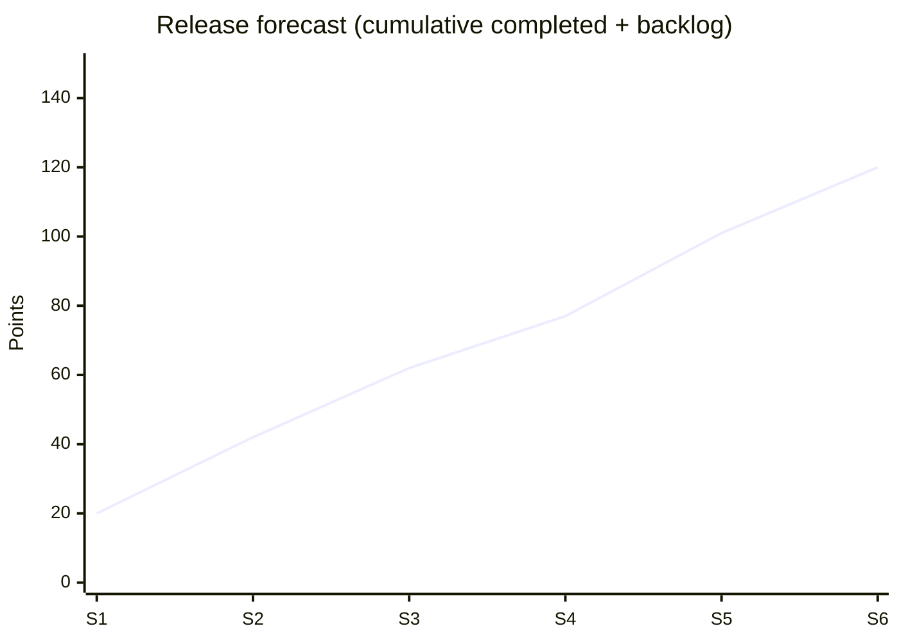
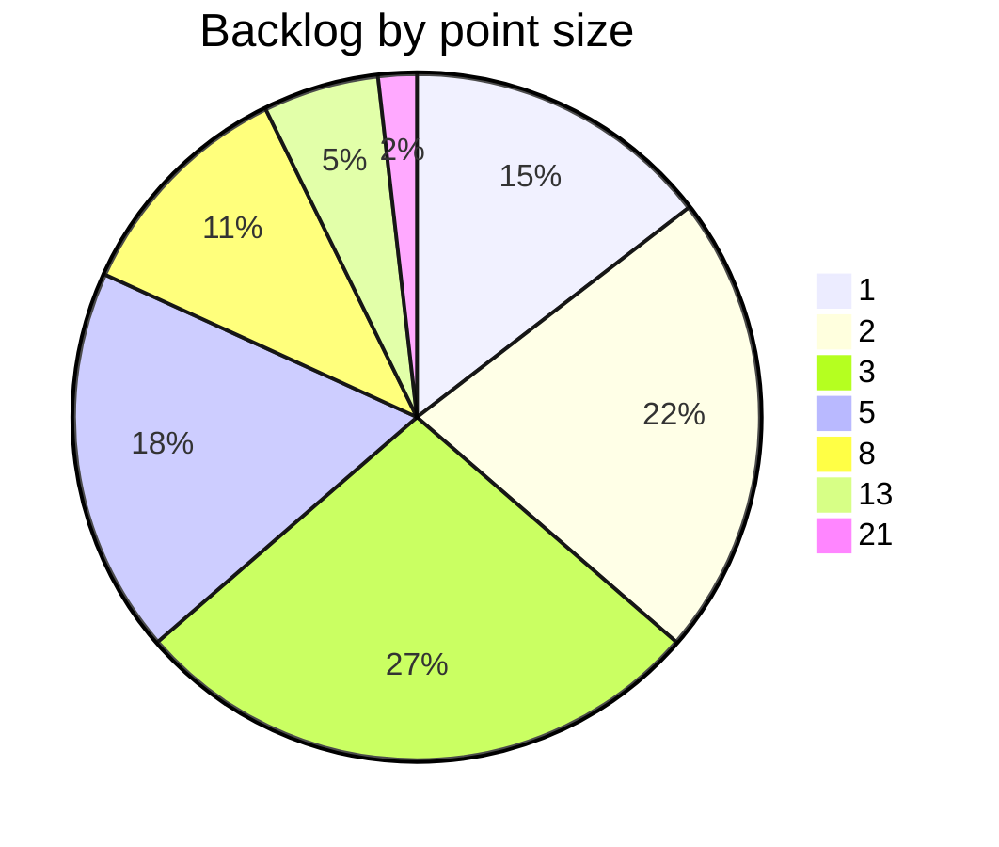

# Story Point Estimation

You apply story-point methodology to estimate work. Distinct from `planning-poker-protocol` (the facilitation technique) — this skill defines **what points mean**, how to calibrate, and how to interpret velocity.

## Core rules

- **Points are relative, not time** — a 5 is ~2× a 2, not "5 days"
- **Three dimensions per point**: complexity + uncertainty + effort
- **Fibonacci progression** (1, 2, 3, 5, 8, 13, 21) reflects exponential uncertainty with size
- **Per-team**: points are not comparable across teams
- **Per-team-composition**: when team composition changes significantly, re-calibrate
- **Velocity ≠ productivity**: velocity is a planning tool, not a performance metric
- **Reference stories** are the source of truth for "what does a 3 mean here"

## Input handling

| Dimension | Required | Default |
|---|---|---|
| **Team context** | Yes | — |
| **Stories to estimate** OR **calibration mode** | Yes | — |
| **Existing reference stories** | No | Elicit or establish |
| **Historical velocity** | No | Asked for forecasting |

## Phase 1 — Setup

```
**Team**: [name + composition]
**Mode**: [estimate (new items) / calibrate (establish/refresh references) / forecast (plan ahead) / audit (evaluate existing estimates)]
**Existing references**: [list or "establishing now"]
**Velocity history**: [recent sprint velocities if known]
```

Ask render mode per `diagram-rendering` mixin and output path (default: `/documentation/[case]/story-point-estimation/`).

## Phase 2 — What story points mean

Three dimensions compound into a single point value:

| Dimension | What it captures | Example effect |
|---|---|---|
| **Complexity** | Cognitive load + architectural reach | Touching 5 services > touching 1 |
| **Uncertainty** | Unknowns, investigation needed | First-time integration > familiar pattern |
| **Effort** | Actual work time (but **not** the only factor) | Long but simple migration > short but tricky refactor |

A 1-point story is well-understood, local, fast.
An 8-point story has moderate uncertainty + complexity + effort.
A 21-point story has high uncertainty in all three — probably needs splitting.

## Phase 3 — Fibonacci progression rationale

Linear scales (1–10) encourage false precision. Fibonacci encodes: **the bigger it is, the less sure we are, so granularity drops**.

- **Small gaps low (1, 2, 3)**: we can distinguish small items confidently
- **Larger gaps high (8, 13, 21)**: we can't tell 10 from 12, don't pretend

Treat Fibonacci as a forcing function. If an item "feels like a 4", it's either a 3 (you're being optimistic) or a 5 (you're underestimating).

## Phase 4 — Reference story calibration

Per team, establish 3–5 reference stories covering the full size range:

| Size | Reference | Why this size |
|---|---|---|
| 1 | "Fix typo in legal footer" | Local, no dependencies, minutes |
| 2 | "Add field to existing form" | One component, straightforward |
| 3 | "Add new column to existing report" | Backend + frontend change, existing pattern |
| 5 | "Add a new CTA to product page with analytics" | Cross-cutting, 2+ components, some a11y check |
| 8 | "Build new side panel with tabs and CRUD" | New UI pattern, state management, 3+ days |
| 13 | "Integrate new payment provider" | Cross-service + data migration + testing rigor |
| 21 | "Full redesign of checkout funnel" | Multi-sprint, needs splitting — caution signal |

Rules:
- Team agrees on references
- References visible during estimation (wall / doc)
- Re-calibrate every quarter or on team change
- Never compare references across teams

## Phase 5 — Per-story estimation

For each new story, compare to references:

| Field | Description |
|---|---|
| **Story ID + title** | Subject |
| **Complexity rationale** | What makes it complex (or not) |
| **Uncertainty rationale** | Known unknowns + "unknown unknowns" flag |
| **Effort rationale** | How long it feels, but as input not output |
| **Closest reference** | Which reference story it most resembles |
| **Size** | Fibonacci value |
| **Confidence** | high (clear reference match) / medium / low (needs more info) |

Sizing through reference-comparison is more reliable than ab-initio judgment.

## Phase 6 — Velocity & forecasting

### Velocity = completed points per sprint (rolling average)

Compute velocity only when:
- Points per story are committed to at start of sprint (not changed mid-sprint)
- "Done" definition is consistent across sprints
- Team composition stable

Use for:
- Sprint planning (how much can fit)
- Release forecasting (backlog points ÷ velocity = sprints needed, with range)
- Trend analysis (stable? declining? why?)

### Forecasting range

Velocity varies. Use recent N sprints:

| Metric | Use |
|---|---|
| **Mean velocity** | Central forecast |
| **Min recent velocity** | Conservative forecast |
| **Max recent velocity** | Optimistic forecast |
| **Standard deviation** | Forecast uncertainty |

Example:
- Backlog: 120 points
- Velocity last 6 sprints: 18, 22, 20, 15, 24, 19 → mean 19.7, min 15, max 24
- Forecast: 120 / 24 = 5 sprints (optimistic) to 120 / 15 = 8 sprints (conservative), central 6
- Communicate as **range**, not point estimate

## Phase 7 — Anti-patterns

Surface anti-patterns observed or prevent them proactively:

| Anti-pattern | Why bad | Mitigation |
|---|---|---|
| **Hours-to-points conversion** ("2 points = 1 day") | Kills relative nature; reduces points to time | Ban time-talk; anchor to references |
| **Velocity-as-productivity** | Creates gaming incentive; inflates points | Velocity for planning only; not for performance review |
| **Cross-team velocity comparison** | Punishes team with more-conservative calibration | Each team's points are internal currency |
| **Estimating in isolation** | Misses team-level insight | Team-based estimation (`planning-poker-protocol`) |
| **Estimating epics** | Too much uncertainty; size meaningless | Split epics into stories; size stories |
| **Inflation over time** | Points creep up to hit velocity targets | Re-calibrate references quarterly |
| **Ignoring `?` cards** | Hides needed clarification | Respect `?` — park item for refinement |
| **Converting velocity to hours** ("20 points = 160 hours") | Reintroduces time-basis | Point capacity ≠ hour capacity |

## Phase 8 — Forecasting diagrams

### Velocity trend



### Burn-up / release forecast



### Size distribution



## Phase 9 — Diagram rendering

Per `diagram-rendering` mixin. File names:
- `velocity-trend.mmd` / `.png`
- `release-forecast.mmd` / `.png`
- `size-distribution.mmd` / `.png`

## Phase 10 — Report assembly and approval

```markdown
# Story Point Estimation: [Team / Subject]

**Date**: [date]
**Team**: [name + composition]
**Mode**: [estimate / calibrate / forecast / audit]

## Scope
[Team, mode, references, velocity history]

## What Story Points Mean (team-specific definition)
[Complexity × uncertainty × effort]

## Reference Stories
[Calibrated with size + rationale]

## Per-story Estimates (estimate mode)
[Story / closest reference / rationale / size / confidence]

## Velocity & Forecast (forecast mode)
[Mean / min / max / std-dev + release forecast]

## Anti-patterns Surfaced
[Observed or prevention recommendations]

## Diagrams
[Velocity trend + release forecast + size distribution]

## Assumptions & Limitations
[Team-level assumptions, forecast caveats]
```

Present for user approval. Save only after confirmation.

## Assessment + planning rules

- Per-story rationale on three dimensions
- Reference-comparison based (not ab-initio)
- Fibonacci values only
- Velocity as range not point
- Anti-patterns called out
- No fabricated velocity history

## Failure behavior

| Situation | Behavior |
|---|---|
| No references | Establish first (calibrate mode) |
| Request hours conversion | Refuse; explain relative basis |
| Velocity for performance | Refuse; explain velocity is planning tool |
| Cross-team comparison | Refuse; explain team-specific points |
| Epic-level estimation | Split first (pointer to `story-splitting`) |
| Low-confidence estimates | Mark as `?` — requires refinement |
| mmdc failure | See `diagram-rendering` mixin |
| Out-of-scope ("guarantee delivery") | "Points inform forecasts as ranges, not commitments." |

## Self-check

```
[] Team + mode declared
[] Points definition stated (complexity × uncertainty × effort)
[] References established or applied
[] Fibonacci values only
[] Per-story: complexity + uncertainty + effort rationale + closest reference + confidence
[] Velocity as range (mean / min / max / std)
[] Forecast as range not point
[] Anti-patterns surfaced
[] No hours-to-points conversion
[] No cross-team comparison
[] Diagrams valid
[] Report follows output contract
```
