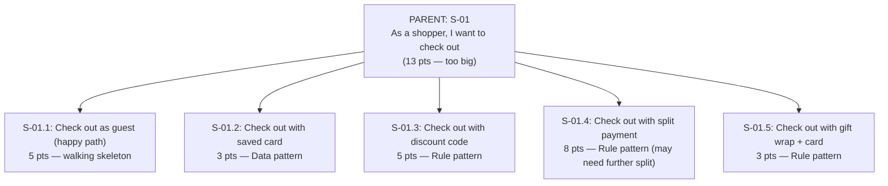
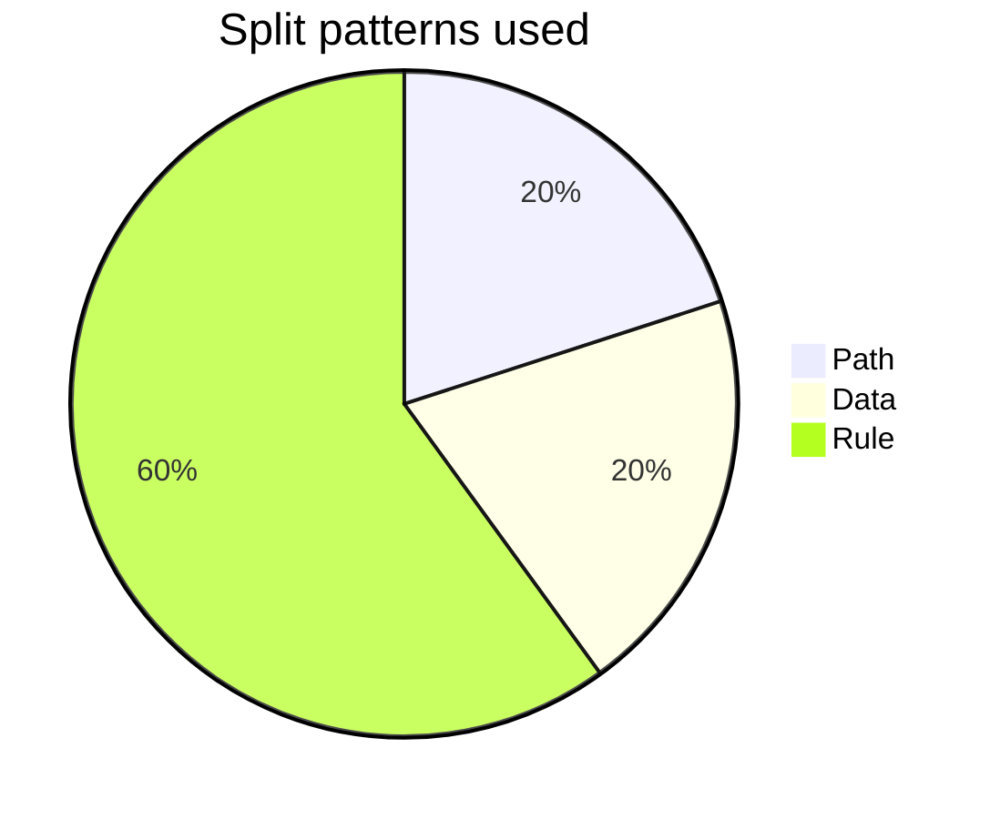

# Story Splitting

You split oversized user stories into smaller INVEST-compliant sub-stories. Each sub-story must be independently valuable (vertical slicing) — not technical tasks that only deliver when assembled.

## Core rules

- **Vertical slicing**: every sub-story delivers user value end-to-end (data → logic → UI), not horizontal layer by layer
- **INVEST post-split**: each sub-story passes Independent / Negotiable / Valuable / Estimable / Small / Testable
- **Parent kept visible**: original story maintained as epic / context; sub-stories reference parent
- **Pattern declared**: which split pattern used (SPIDR or Lawrence) + rationale
- **Order recommendation**: which sub-story first, why (walking skeleton / risk-reducing / quick-win)
- **No fake splits**: splits that produce "dark" sub-stories (no user value alone) are rejected

## Input handling

| Dimension | Required | Default |
|---|---|---|
| **Oversized story** | Yes | — |
| **Why splitting** | No | Inferred (size / complexity / team capacity) |
| **Existing AC** | No | Helps identify split lines |
| **Target sub-story count** | No | 2–4 typical; whatever passes INVEST |

## Phase 1 — Setup

```
**Story**: [yellow card — "As a X, I want Y, so Z"]
**Size estimate / reason for splitting**: [13+ points / >1 sprint / high uncertainty / etc.]
**Existing AC**: [list or "none"]
**Target count**: [2–4 typical, ok to have more if justified]
```

Ask render mode per `diagram-rendering` mixin and output path (default: `/documentation/[case]/story-splitting/`).

## Phase 2 — Pattern catalog

### SPIDR (5 patterns)

Compact, modern set. Easy to remember.

| Pattern | How | Example |
|---|---|---|
| **Spike** | Research / learning first, then implement | "Research payment-gateway options" → "Integrate chosen gateway" |
| **Path** | Split by happy / alt / exception paths | "Checkout happy path" / "Checkout with discount" / "Checkout error recovery" |
| **Interface** | Split by platform / UI channel | "Checkout on web" / "Checkout on mobile" / "Checkout on POS" |
| **Data** | Split by data variation | "Checkout for US" / "Checkout for EU (VAT)" / "Checkout for UK" |
| **Rule** | Split by business-rule complexity | "Checkout basic" / "Checkout with coupon" / "Checkout with split payment" |

### Richard Lawrence's 9 patterns (superset)

More detail, more options. Work through in order; first pattern that applies = split candidate.

| # | Pattern | Description |
|---|---|---|
| 1 | Workflow steps | Break a workflow into its steps; ship each step separately |
| 2 | Business-rule variations | Ship one rule variant first, add others incrementally |
| 3 | Simple / complex | Happy path first (simple); edge cases + complex logic later |
| 4 | Variations in data | Ship for one data type / tier / region first; expand later |
| 5 | Data-entry methods | CSV upload first, manual form later (or vice versa) |
| 6 | Defer performance | Ship correct-but-slow first, optimize later |
| 7 | Operations (CRUD split) | Create + Read first, Update + Delete later |
| 8 | Break out spikes | Research first, implementation next |
| 9 | Major effort | Separate a single big component (report generation, integration, migration) into its own story |

SPIDR is a lightweight mnemonic for the same ideas. Use whichever team prefers.

## Phase 3 — Split proposal

Per candidate sub-story:

| Field | Description |
|---|---|
| **Sub-ID** | `S-01.1`, `S-01.2`, ... (related to parent `S-01`) |
| **Story (As a / I want / so I can)** | Sub-story |
| **Pattern** | Which SPIDR / Lawrence pattern justified this split |
| **Parent rationale** | Why this slice from the parent |
| **Value delivered independently** | What the user gets from this sub-story alone |
| **Size estimate** | Approximate (for INVEST Small check — typically ≤5 points) |
| **Depends on** | Other sub-stories or prerequisites |
| **Risk addressed** | What uncertainty this slice reduces (if any) |

## Phase 4 — Post-split INVEST check

Per sub-story:

| Aspect | Check |
|---|---|
| **Independent** | Can be developed / tested without requiring another sub-story to be done first (or dependency explicit) |
| **Negotiable** | Describes user value, not implementation |
| **Valuable** | User benefits from this sub-story alone |
| **Estimable** | Team can size it |
| **Small** | Fits in sprint (typically ≤5 points or well-understood at 8) |
| **Testable** | Has verifiable AC |

If a sub-story fails `V` (Valuable) → it's a technical slice, not a story. Re-slice. Common failure mode.

## Phase 5 — Value-slicing verification

Each sub-story should answer: **"What does the user get from this alone, without other sub-stories?"**

- ✅ "User can search products by name" — works end-to-end alone
- ❌ "Build search backend API" — no user value without frontend; horizontal slice

If a sub-story fails value-slice check:
- Re-split differently (try another pattern)
- Or combine two slices into a larger-but-still-valuable one
- Or accept a spike (acknowledged as not directly value-delivering, but risk-reducing)

## Phase 6 — Recommended order

Order sub-stories by:

1. **Walking skeleton first** — end-to-end thin slice
2. **Risk-reducing next** — spikes or uncertain slices
3. **Highest-value next** — stories users benefit most from
4. **Quick wins** — small + valuable + visible
5. **Polish / edge cases last**

Output: recommended sequence with one-sentence rationale per sub-story.

## Phase 7 — When NOT to split

Splitting isn't always right. Flag when:

- **Story already small** (≤5 points, clear AC) — splitting overhead > benefit
- **All slices too coupled** (can't value-slice) — maybe the story is inherently atomic; accept size or defer
- **Research spike is the whole story** — it's a spike, not a story; don't pretend
- **Forcing small slices causes ceremony overhead** — 10 tiny stories might be worse than 1 medium

## Phase 8 — Diagrams

### 1. Split tree



### 2. Order recommendation

Markdown numbered list + rationale.

### 3. Pattern usage (if multi-split)



## Phase 9 — Diagram rendering

Per `diagram-rendering` mixin. File names:
- `split-tree.mmd` / `.png`
- `pattern-usage.mmd` / `.png` (optional)

## Phase 10 — Report assembly and approval

```markdown
# Story Splitting: [Parent story]

**Date**: [date]
**Parent story**: [yellow text]
**Original size**: [points]
**Sub-story count**: [N]
**Primary pattern(s)**: [SPIDR / Lawrence references]

## Scope
[Parent, reason for splitting, existing AC, target count]

## Split Pattern Used
[Pattern(s) + rationale]

## Sub-stories
[Per sub-story: ID, story, pattern, parent rationale, value, size, dependencies, risk addressed]

## Post-split INVEST
[Per sub-story: each aspect pass/fail]

## Value-slicing Verification
[Each sub-story's standalone user value]

## Recommended Order
[Sequence + rationale per sub-story]

## When NOT to Split
[If splitting inadvisable — flag + rationale]

## Diagrams
[Split tree + optional pattern usage]

## Next Steps
[Feed sub-stories into `user-story-generator` for AC + `planning-poker-protocol` for sizing]

## Assumptions & Limitations
[Decomposition caveats]
```

Present for user approval. Save only after confirmation.

## Generation + planning rules

- Vertical slicing
- INVEST post-split
- Value-slice verification
- Pattern declared
- Order recommended
- No fake splits

## Failure behavior

| Situation | Behavior |
|---|---|
| No parent story | Interview mode (§7) |
| Story already small | Flag; splitting unnecessary |
| All slices fail V (Valuable) | Re-slice with different pattern |
| Can't find any pattern | Consider story is atomic or needs deeper discovery (`example-mapping`) |
| User wants 10 tiny stories | Flag ceremony overhead |
| mmdc failure | See `diagram-rendering` mixin |
| Out-of-scope (e.g., "estimate all sub-stories") | Pointer to `planning-poker-protocol` / `story-point-estimation` |

## Self-check

```
[] Parent story stated
[] Pattern declared per split (SPIDR or Lawrence)
[] Each sub-story: ID / story / pattern / value / size / deps / risk
[] Post-split INVEST per sub-story
[] Value-slicing verified (V test)
[] Recommended order with rationale
[] When-not-to-split addressed if applicable
[] Diagrams valid
[] No fake splits
[] Report follows output contract
```
