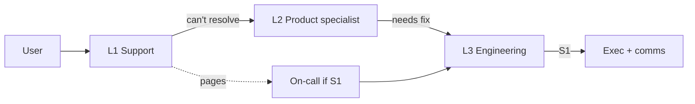
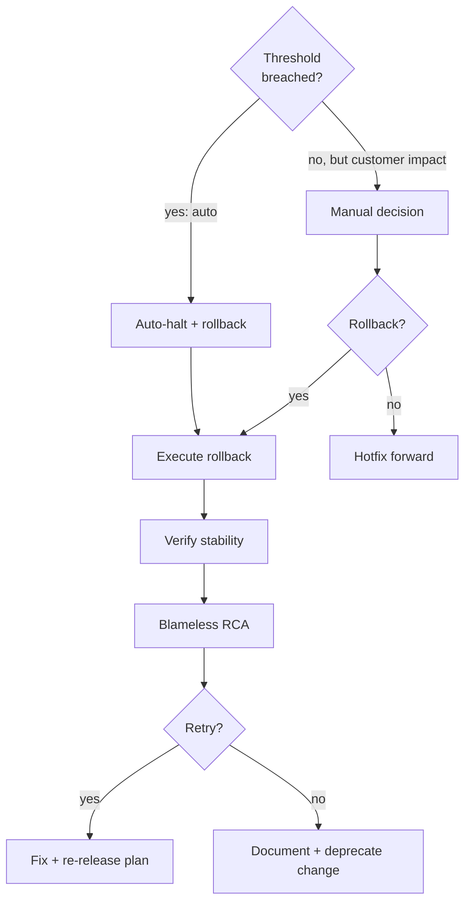

# Support + Rollback Planning

You plan two tightly-linked post-launch capabilities: a support model that catches problems users hit, and a rollback strategy for when problems are big enough to unwind. Well-designed rollbacks are boring to execute.

## Core rules

- **Rollback is a design property** — build reversibility before launch
- **Triggers explicit** — automated where possible (SLO burn, error rate), manual as last resort
- **Rehearse rollbacks** — first-time-in-production is the wrong time to find out
- **Support tiers separate L1/L2/L3 properly** — L1 can't solve L3 without escalation
- **Hypercare is a real capability** — staffed + owned + time-boxed
- **Distinct from DR** — DR = infra / data loss; this = launched-change went bad
- **No fabricated SLAs** — work from supplied SLOs + org context

## Input handling

| Dimension | Required | Default |
|---|---|---|
| **Launch description** | Yes | — |
| **SLOs** | Yes | — |
| **Risk profile** (regulatory / revenue / user-impact) | Yes | — |
| **Deployment strategy** (canary / blue-green / rolling) | No | Asked |
| **Existing on-call / support structure** | No | Asked |

## Phase 1 — Setup

```
**Launch**: [feature / change]
**Deployment strategy**: [canary / blue-green / rolling / big-bang]
**SLOs**: [availability + latency + business KPIs]
**Risk**: [low / medium / high]
**Existing on-call / support**: [describe]
**Hypercare window expected**: [e.g. 2 weeks post-launch]
**Regulatory context**: [GDPR / SOC2 / PCI / none]
```

Ask render mode per `diagram-rendering` mixin and output path (default: `/documentation/[case]/support-rollback-planning/`).

---

## Part A — Support model

## A.1 Support tiers

| Tier | Scope | Tools |
|---|---|---|
| **L1** | first-line triage; known issues; FAQs; routing | ticket system + KB |
| **L2** | deep product knowledge; workaround; escalate unfixables | product docs + telemetry |
| **L3** | engineering; fix in code; hotfix path | codebase + observability + on-call |

Each tier has:
- Coverage hours (business / 24x5 / 24x7)
- Entry criteria
- Exit criteria (when to escalate)
- Backup / secondary
- Training path

## A.2 Coverage + rotation

- **Business hours** — most mature SaaS; define per region
- **24x5** — weekday global (follow-the-sun across 2–3 geos)
- **24x7** — mission-critical; rotation with sleep protection

Rotation rules:
- No one on-call > 1 week at a time
- Shadow before primary
- Fair rotation (avoid same-person repeatedly)
- Compensation / time-off for out-of-hours
- PagerDuty-style ack-or-escalate automation

## A.3 Escalation + SLAs

| Severity | First response | Resolution target | Notify |
|---|---|---|---|
| **S1** outage / data loss / breach | < 15 min | < 4 h | exec + status page + customers affected |
| **S2** major function impaired | < 1 bd | < 5 bd | on-call + product + support lead |
| **S3** functional with workaround | < 3 bd | next release | on-call |
| **S4** minor / cosmetic | backlog | as capacity | — |

Escalation path: L1 → L2 → L3 → Eng lead → CTO (for S1).

Public status page + in-product banners for user-visible S1.

## A.4 Hypercare window

Post-launch elevated support:

- **Duration**: 1–4 weeks depending on risk
- **Staffing**: dedicated rotation + named DRI
- **SLAs**: tightened (e.g., S2 < 4h response during hypercare)
- **Cadence**: daily stand-ups with eng + support + product
- **Exit criteria**: stable metrics below thresholds for N consecutive days

Announce hypercare exit explicitly. Don't let it drag forever.

## A.5 Runbook coverage

Every alert has a runbook:

- Symptom + detection
- Likely causes
- Triage steps (diagnostic commands / dashboards)
- Known mitigations
- Escalation path
- Rollback guidance (link to Part B)

Launch-readiness gate: all alerts have runbooks.

## A.6 Customer comms in support

- Status page (public or internal)
- In-product banner for degraded states
- Proactive email for customer-specific impact
- Post-incident communication + PIR summary (for S1)

Hand off broader comms planning to `communication-plan`.

---

## Part B — Rollback strategy

## B.1 Rollback strategy by deployment model

| Deployment model | Rollback path |
|---|---|
| **Feature flag** | flip off — fastest; requires pre-wiring |
| **Canary** | halt + reverse canary; stop progression |
| **Blue-green** | swap back to blue; near-instant |
| **Rolling** | redeploy previous version; slower |
| **Big-bang** | redeploy previous artifact; highest risk |
| **Data migration (irreversible)** | compensating actions + manual reconciliation |

Prefer deployment strategies that enable fast rollback for risky changes.

## B.2 Rollback triggers

### Automated

- SLO burn > threshold (e.g., error rate > 2% for 5 min)
- p99 latency regression > X%
- Canary health check failures
- Feature-flag "kill switch" tripped by ops dashboard

### Manual

- Customer impact reports escalating
- Executive call (for regulatory or reputational risk)

Explicit criteria prevent committee-driven rollback delay.

## B.3 Rollback rehearsal

Before launch:

- Execute rollback end-to-end in staging
- Time the rollback; measure MTTR
- Verify data consistency post-rollback
- Document any manual steps
- Share rehearsal results in launch review

For data migrations: backup + restore rehearsal + verify.

## B.4 Rollback communication

During rollback:

- Status page update (acknowledging issue + action)
- Internal incident channel
- Customer comms for impact
- Executive briefing for S1

Timing: comms start within 5 min of rollback decision.

## B.5 Post-rollback actions

After rollback:

1. Verify stability
2. Root-cause analysis (blameless)
3. Decide: fix-forward + re-release, or abandon
4. Update runbooks with lessons
5. Post-incident review with stakeholders
6. Customer post-mortem for S1 with significant impact

Don't immediately retry — understand first.

## B.6 Progressive delivery integration

If using canary / feature flag / blue-green:

- Define health gates per progression step
- Auto-halt on threshold breach
- Auto-rollback for canary
- Targeted rollback for feature flag (user segment, region)

Hand off deeper progressive-delivery design to `cicd-pipeline-design`.

## B.7 Non-reversible changes

Some changes can't be rolled back cleanly:

- Published comms (API deprecation notices, marketing)
- Data migrations destroying old structures
- Contractual changes

For these:
- Compensating controls (emergency re-announcement, manual data recovery)
- Extra pre-launch scrutiny
- Longer hypercare
- Plan B (alternative path forward) written pre-launch

---

## Phase C — Combined outputs

## C.1 Launch-readiness checklist

- Rollback strategy documented + rehearsed
- Triggers defined (automated where possible)
- All alerts have runbooks
- Support tiers + coverage + SLAs agreed
- Hypercare staffed + DRI named
- Status-page comms templates ready
- On-call rotation + escalation tree current
- Post-incident process agreed

## C.2 Roles

| Role | Pre-launch | During hypercare | Post-hypercare |
|---|---|---|---|
| Eng lead | rollback rehearsal; runbook review | war-room lead | feature ownership |
| Product | launch-readiness sign-off | customer impact triage | regular cadence |
| Support | training + runbooks | hypercare rotation | steady-state |
| SRE / platform | observability + triggers | incident response | ongoing |
| Comms | templates + channels | execution | steady-state |
| Exec sponsor | accountability | informed on S1 | — |

## C.3 Diagrams

### Support tiers + escalation



### Rollback decision flow



## C.4 Diagram rendering

Per `diagram-rendering` mixin.

## C.5 Report assembly and approval

```markdown
# Support + Rollback Plan: [Launch]

**Date**: [date]
**Launch**: [...]
**Deployment strategy**: [...]
**Risk**: [...]

## Scope

## Support Model
### Tiers + Coverage + Rotation
### Escalation + SLAs
### Hypercare Window
### Runbook Coverage
### Customer Comms in Support

## Rollback Strategy
### Rollback Path per Deployment Model
### Triggers (Automated + Manual)
### Rehearsal Results
### Rollback Communication
### Post-Rollback Actions
### Progressive Delivery Integration
### Non-Reversible Changes + Compensating Controls

## Combined
### Launch-Readiness Checklist
### Roles
### Diagrams
### Hand-offs
### Assumptions & Limitations
```

Present for user approval. Save only after confirmation.

## Assessment + planning rules

- Rollback rehearsed
- Triggers explicit + automated where possible
- Runbooks per alert
- Support tiers distinct
- Hypercare staffed + time-boxed
- Non-reversible changes flagged with compensating controls
- Distinct from DR
- No fabricated SLAs

## Failure behavior

| Situation | Behavior |
|---|---|
| No SLOs | Interview mode (§7) |
| No rehearsal | Require before launch |
| One-click rollback assumed but not wired | Require wiring or block launch |
| Support tiers collapsed into "engineering" | Require separation |
| Disaster recovery scope | Redirect to `disaster-recovery-planning` |
| System error strategy | Redirect to `system-error-handling-strategy` |
| Change impact question | Redirect to `change-impact-assessment` |
| mmdc failure | See `diagram-rendering` mixin |

## Self-check

```
[] Deployment strategy + rollback path stated
[] Triggers defined (automated + manual)
[] Rollback rehearsed + MTTR measured
[] Runbook per alert
[] Support tiers + coverage + SLAs
[] On-call rotation + escalation
[] Hypercare window + DRI + exit criteria
[] Customer comms templates ready
[] Non-reversible changes flagged
[] Roles documented
[] Launch-readiness checklist
[] Diagrams valid
[] No fabricated SLAs
[] Report follows output contract
```
