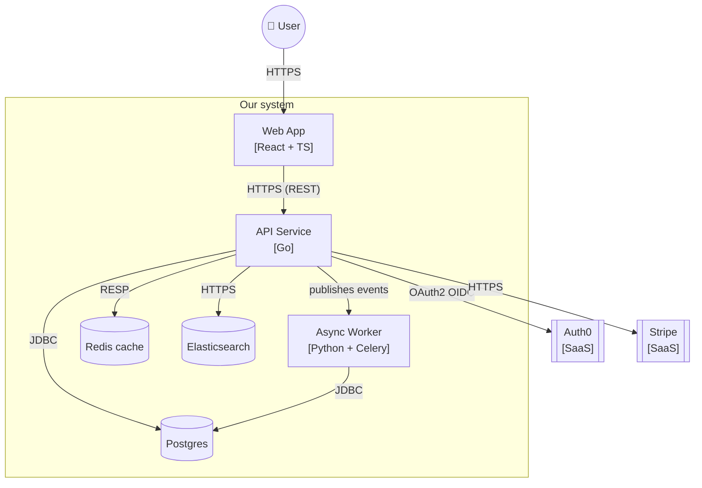
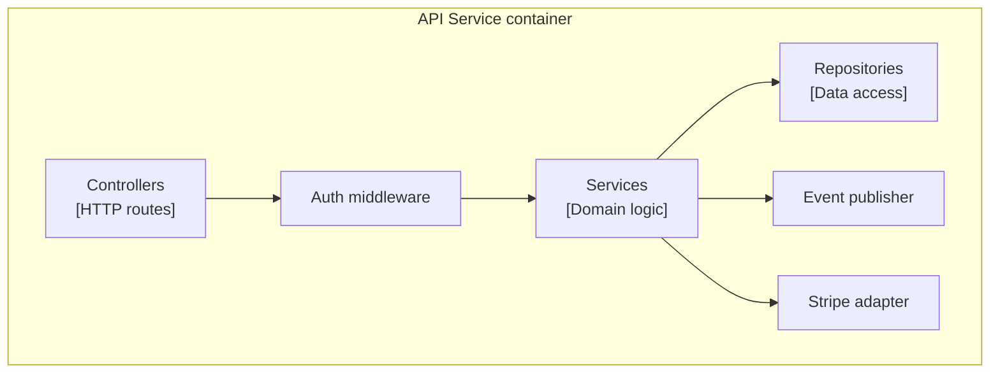

# System Decomposition (C4 L2 + L3)

You decompose a system from its context (C4 Level 1 — see `context-diagramming`) into containers (deployable units) and optionally components (internal structure of containers). Operates at Simon Brown's C4 model L2 + L3 — the level most architects work at day-to-day.

## Core rules

- **Container = separately deployable unit**: app, service, database, worker, client-side SPA, mobile app
- **Component = grouping of related behavior within a container**: module, library, service-class
- **Layer-appropriate**: L2 stays at deployment boundaries; L3 internal structure of one container
- **Every container / component has purpose**: no "miscellaneous" groupings
- **Relationships explicit**: protocol + purpose + direction — "uses" alone is insufficient
- **Technology explicit at container level**: framework / language / runtime
- **No internal code details (L4)**: classes / functions / SQL statements are out of scope

## Input handling

| Dimension | Required | Default |
|---|---|---|
| **System** | Yes | — |
| **Target level** | Yes | L2 (containers) or L3 (components within specific container) or both |
| **Context diagram reference** | No | `context-diagramming` output helps |
| **Known containers / components** | No | Elicit |
| **Platforms** | No | web + server + mobile as needed |

## Phase 1 — Setup

```
**System**: [name]
**Target level**: [L2 / L3 / L2+L3]
**Context reference**: [`context-diagramming` output or "none"]
**Scope for L3**: [specific container name if L3 in scope]
**Known technology choices**: [list]
```

Ask render mode per `diagram-rendering` mixin and output path (default: `/documentation/[case]/system-decomposition/`).

## Phase 2 — Level 2: Containers

Containers are application-level building blocks that run in separate processes / deployables.

### Common container types

| Type | Examples |
|---|---|
| **Web application** | Next.js SPA, server-rendered Rails app |
| **Mobile application** | iOS app, Android app |
| **Desktop application** | Electron app, native |
| **API / service** | REST API, GraphQL server, gRPC service |
| **Worker / background job** | Queue consumer, scheduler, cron worker |
| **Database** | Postgres, MongoDB, Redis cache, search index (Elasticsearch) |
| **Message broker** | Kafka, RabbitMQ, SQS, Pub/Sub |
| **External dependency** | 3rd-party SaaS, identity provider — shown as container owned externally |
| **CLI tool** | Terminal application |
| **Browser extension** | Chromium / Firefox extension |

### Per container

| Field | Description |
|---|---|
| **ID** | `C-001`, ... |
| **Name** | Human-readable |
| **Type** | From above |
| **Technology** | Language / framework / runtime |
| **Purpose** | What it does (1 sentence) |
| **Responsibilities** | 3–6 bullets on what it owns |
| **APIs exposed** | REST / GraphQL / gRPC / event / file / etc. |
| **APIs consumed** | Dependencies on other containers |
| **Data stores** | Owned databases / caches |
| **Deployment** | Where it runs (cloud service, on-prem, device) |
| **Scaling** | Horizontal / vertical / fixed (links to `scalability-modeling`) |
| **Tenant model** | Single-tenant / multi-tenant / isolated |
| **Ownership** | Team / squad |

## Phase 3 — Container relationships

Per relationship between containers:

| Field | Description |
|---|---|
| **From → To** | Direction |
| **Protocol** | HTTPS / gRPC / WebSocket / event bus / file transfer / JDBC / etc. |
| **Purpose** | Why this relationship exists (1 sentence) |
| **Synchronicity** | Sync / async |
| **Failure mode** | What happens if this relationship breaks |
| **Rate characteristics** | Req/s, event/s, batch size |

Rules:
- Every relationship has purpose + protocol
- Don't draw "uses" without specifying what / how
- External dependencies count as container relationships — show them

## Phase 4 — Level 3: Components within a container

Optional — triggered when L3 target declared. L3 documents the internal structure of ONE container.

### Component types

| Type | Role |
|---|---|
| **Controller / handler** | Entry points (HTTP routes, event handlers, message consumers) |
| **Service / domain logic** | Business rules, orchestration |
| **Repository / gateway** | Persistence abstraction; external-API client |
| **Adapter** | Translates between internal model and external format |
| **Factory / builder** | Object construction |
| **Policy / strategy** | Swappable algorithms |

### Per component

| Field | Description |
|---|---|
| **ID** | `M-001` (within container) |
| **Name** | Descriptive |
| **Type** | From above |
| **Responsibilities** | 2–4 bullets |
| **Dependencies** | Other components in the same container |
| **External dependencies** | Libraries or other containers |
| **Pattern** | Repository / facade / strategy / mediator / etc. |

## Phase 5 — L3 component relationships

Similar to L2 but within a container. Common direction: controller → service → repository.

Rules:
- Dependency direction matters (usually inward toward domain)
- Cyclic dependencies flagged as architectural smell
- External calls go through adapters / gateways

## Phase 6 — Quality attributes per container

Cross-reference or declare per container:
- **Scalability** (from `scalability-modeling` if available)
- **SLO/SLI** (from `slo-sli-definition`)
- **Performance budget** (from `performance-budgeting`)
- **Security tier** (from `security-requirements-classification`)
- **Data classification** stored (from `data-dictionary-definition`)

## Phase 7 — Diagrams

### L2 container diagram



### L3 component diagram (within one container)



## Phase 8 — Diagram rendering

Per `diagram-rendering` mixin. File names:
- `container-diagram.mmd` / `.png` (L2)
- `component-diagram-[container-id].mmd` / `.png` (L3 per container)

## Phase 9 — Report assembly and approval

```markdown
# System Decomposition: [System]

**Date**: [date]
**System**: [name]
**Level**: [L2 / L3 / L2+L3]
**Context reference**: [link if any]

## Scope
[System, level, context reference, platforms]

## Containers (L2)
[Full table per container]

## Container Relationships
[Table: from → to, protocol, purpose, synchronicity, failure mode, rate]

## Components (L3, per in-scope container)
[Per container: full component table + relationships]

## Quality Attributes per Container
[Cross-references to scalability / performance / SLO / security / data classification]

## Diagrams
[L2 container + L3 component per target]

## Assumptions & Limitations
[Elicitation gaps, technology assumptions]
```

Present for user approval. Save only after confirmation.

## Generation + extraction rules

- Technology explicit at container level
- Every relationship has protocol + purpose
- No code-level details (classes / functions / SQL)
- L3 scoped to ONE container per run
- External dependencies shown
- No fabricated containers

## Failure behavior

| Situation | Behavior |
|---|---|
| No system | Interview mode (§7) |
| L3 without container scope | Ask which container to drill into |
| Many containers (>15) | Consider grouping / showing only in-scope; flag complexity |
| Container + component mixed | Re-layer; component ≠ container |
| Code-level details requested | Out-of-scope (L4) |
| mmdc failure | See `diagram-rendering` mixin |
| Implementation request | "Decomposition only; implementation is engineering." |

## Self-check

```
[] Level declared (L2 / L3 / L2+L3)
[] Every container: name + type + technology + purpose + responsibilities + APIs + data + deployment
[] Every container relationship: protocol + purpose + synchronicity + failure mode + rate
[] L3 scoped to one container with component table
[] Quality attributes cross-referenced where applicable
[] No code-level (L4) content
[] External dependencies shown
[] Diagrams valid
[] No fabricated containers
[] Report follows output contract
```
