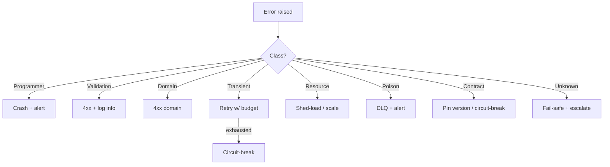
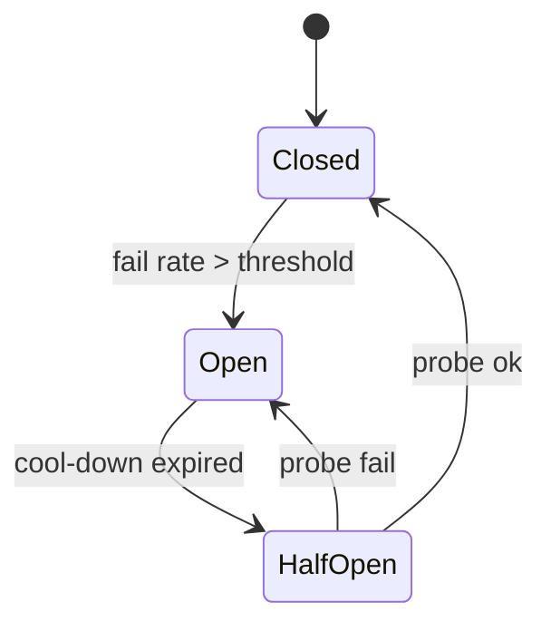

# System Error-Handling Strategy

You design how errors are classified, propagated, translated, and acted on across an entire system. Distinct from UX error design — this is about software behavior under failure.

## Core rules

- **Classify, then handle** — strategy follows category
- **Retries have budgets** — exponential backoff + jitter + max attempts + deadline
- **Idempotency is required for retry-safe operations**
- **Failed-to-handle → escalate** — log + metric + alert; never swallow
- **Translate at boundaries** — don't leak internal errors to external consumers
- **User-facing vs operator-facing split** — different audiences, different messages
- **Poison messages go to DLQ, not infinite retry**
- **Timeouts + budgets propagate** — inherit deadline across call chain
- **No fabricated dependencies** — work from supplied system facts

## Input handling

| Dimension | Required | Default |
|---|---|---|
| **System scope** | Yes | — |
| **Dependencies** (DBs, brokers, external APIs) | Yes | — |
| **SLOs** | No | Asked |
| **Consumer types** (user-facing / internal / partner) | No | Asked |
| **Existing patterns** (retry lib, circuit breaker lib) | No | Asked |

## Phase 1 — Setup

```
**System**: [service or system-of-services]
**Dependencies**: [DBs, brokers, APIs]
**SLOs**: [availability, latency]
**Consumer types**: [end-user / internal / partner]
**Existing patterns**: [libs in use]
**Regulatory / compliance**: [audit trail, breach reporting]
```

Ask render mode per `diagram-rendering` mixin and output path (default: `/documentation/[case]/system-error-handling-strategy/`).

## Phase 2 — Error classification

| Class | Source | Example | Recovery |
|---|---|---|---|
| **Programmer** | bug | null deref, invariant violation | fail-fast, alert, fix |
| **Validation** | malformed input | bad JSON, wrong type | 4xx to caller, no retry |
| **Domain rejection** | business rule | insufficient funds | 4xx user-visible, no retry |
| **Transient dependency** | downstream blip | DB timeout, 503 | retry with budget; circuit-break |
| **Resource exhaustion** | saturation | OOM, connection pool exhausted | shed-load, backpressure, scale |
| **Poison data** | persistently failing item | bad event schema | DLQ + alert, skip |
| **External contract** | upstream change | partner API returns new field types | circuit-break, pin to known version, escalate |
| **Unknown / unclassified** | unexpected | panic, unexpected state | fail-safe, escalate, investigate |

Every error should map to one class; unclassified → treat as unknown + investigate.

## Phase 3 — Per-class strategy

### Programmer errors

- Crash-only / fail-fast at the earliest opportunity
- No retry (bug doesn't fix itself)
- Emit panic / Sentry alert with stack
- Recovery: restart process (let supervisor handle)
- Health: process crash counts inform alerts

### Validation errors

- Reject at ingress with structured error (RFC 7807 for REST)
- No retry
- Log at info level, not error (not a system fault)

### Domain rejection

- Return domain error to caller; explain briefly
- No retry (rule is intentional)
- Track as business metric, not fault

### Transient dependency

- Retry with exponential backoff + jitter
- Budget: max attempts N, max wall-clock T
- Idempotency required (use `Idempotency-Key` or natural key)
- Circuit breaker opens after threshold; half-open probes
- Fallback: cached / degraded / default result if safe

### Resource exhaustion

- Shed-load: return 503 + `Retry-After`
- Bulkhead: isolate pools per tenant / endpoint
- Scale-out signal: autoscaler metric
- Queue caps: never unbounded

### Poison data

- N retry attempts; then DLQ
- DLQ entry retains full context + error
- Alert on DLQ depth threshold
- Manual replay after fix; skip if unrecoverable

### External contract

- Schema-validate at boundary
- Circuit-break partner; fallback if partial outage acceptable
- Alert product owner; partner comms
- Roll-forward only after contract confirmed

### Unknown / unclassified

- Fail-safe action (abort, preserve invariants)
- Alert P2/P3 with context
- Root-cause required before close
- Classify as another category once understood

## Phase 4 — Retry budgets

Budget parameters:

| Parameter | Guidance |
|---|---|
| Base delay | 100–500 ms |
| Backoff | exponential (2x typical) |
| Jitter | full or decorrelated jitter |
| Max attempts | 3–7 |
| Deadline | tighter than caller's deadline |
| Budget scope | per-call vs per-second-rate (token bucket) |

Budget propagation:
- Caller passes remaining deadline; callee respects it
- gRPC: deadlines + cancellation
- HTTP: request deadline via context

## Phase 5 — Circuit breaker

States: Closed → Open → Half-open → Closed.

| State | Behavior |
|---|---|
| Closed | pass through; count failures |
| Open | fail fast, return cached / default / error |
| Half-open | send limited probes; on success Close, on failure Open again |

Thresholds: failure rate (e.g. > 50% in 10 s), or consecutive failures (e.g. > 5).

Recovery: open duration (30–60 s typical); exponential if keeps failing.

## Phase 6 — Timeouts

- **Total budget < upstream timeout** — inner timeouts sum to less than outer
- **Idle vs total timeout** — both set
- **Timeout is the primary defense against slow dependencies**
- **Cancellation propagates** — don't keep working after caller gives up

## Phase 7 — Idempotency

Required for retry-safe calls. Patterns:
- `Idempotency-Key` HTTP header
- Natural key dedup (order id, payment id)
- Exactly-once producer (broker) + idempotent consumer
- Outbox pattern prevents dual-write

## Phase 8 — Propagation + translation

Layer translation (for REST service):

```
domain error (internal)
  ↓
application error (structured)
  ↓
HTTP error (RFC 7807)
  ↓
external client-facing message
```

Rules:
- Never expose stack traces externally
- Never leak internal system names in error messages
- Provide `trace_id` for support correlation
- Internal audit logs retain full detail

Across services:
- Preserve correlation + causation ids
- Don't re-wrap errors blindly — translate meaning
- Consider `Problem Details` for consistency

## Phase 9 — Dead-letter queue

- Per input source (per topic / queue / event type)
- Entry = full message + error chain + attempt history
- Ops UI: inspect, requeue, skip, annotate
- Alerting: depth threshold + age threshold
- Retention: policy-driven (often 30–90 days)

## Phase 10 — Observability

- **Structured logs** at error boundaries
- **Metrics**: error rate by class + per-dependency availability
- **Traces**: span-level errors + attributes
- **Alerts**: SLO burn (not raw counts); on unknown-error spikes; on DLQ depth
- **Dashboards**: error budget + top N errors + recent changes correlation

Hand off to `logging-tracing-design` / `observability-strategy`.

## Phase 11 — User-facing vs operator-facing

| Audience | Message |
|---|---|
| End-user | "Something went wrong. Please try again. Ref: abc123" |
| Internal user | "Service `inventory` unavailable. Retry possible." |
| Operator | Full stack + context + links to runbook |

Hand off user-facing UX to `error-handling-design`.

## Phase 12 — Runbooks + incident coupling

Every alert → runbook link. Runbook contains:
- Symptom + detection
- Likely causes
- Triage steps
- Known good mitigations
- Rollback path
- Escalation path

Hand off to `incident-management-planning` (future skill) / `disaster-recovery-planning`.

## Phase 13 — Diagrams

### Error classification flow



### Circuit-breaker state



## Phase 14 — Diagram rendering

Per `diagram-rendering` mixin.

## Phase 15 — Report assembly and approval

```markdown
# System Error-Handling Strategy: [System]

**Date**: [date]
**System**: [...]
**Dependencies**: [...]

## Scope
[System, deps, SLOs, consumers]

## Error Classification
[Per-class definitions + examples]

## Per-Class Strategy
[Fail-fast / retry / compensate / circuit-break / shed / DLQ / escalate]

## Retry Budgets
[Params + propagation]

## Circuit Breakers
[Per dependency: thresholds + state model]

## Timeouts
[Budgets + cascade rule]

## Idempotency
[Patterns in use]

## Propagation + Translation
[Layer translation rules]

## Dead-Letter Queue
[Per source + ops UI + alerting]

## Observability
[Metrics + alerts + dashboards]

## User-Facing vs Operator-Facing
[Message policy]

## Runbooks
[Per alert; links + structure]

## Diagrams
[Classification flow + circuit-breaker state]

## Hand-offs
[logging-tracing-design, observability-strategy, DR, incident-management]

## Assumptions & Limitations
```

Present for user approval. Save only after confirmation.

## Assessment + planning rules

- Every error mapped to a class
- Retry has budget + idempotency
- Circuit breaker per dependency
- Timeouts + cascade rule
- DLQ for poison data
- Translation at boundaries
- User vs operator messages
- Runbook coupling
- No fabricated dependencies

## Failure behavior

| Situation | Behavior |
|---|---|
| No dependencies listed | Interview mode (§7) |
| Unbounded retry | Require budget |
| No DLQ | Add |
| Internal stack traces to users | Require translation |
| Missing idempotency | Add requirement |
| No circuit breaker on external | Flag |
| mmdc failure | See `diagram-rendering` mixin |
| UX microcopy request | Redirect to `error-handling-design` |

## Self-check

```
[] Classification covers all error sources
[] Per-class strategy clear
[] Retry budgets concrete
[] Circuit breakers per external dep
[] Timeouts with cascade rule
[] Idempotency patterns in place
[] DLQ per source
[] Observability + alerts
[] User vs operator split
[] Runbook links
[] Diagrams valid
[] No fabricated dependencies
[] Report follows output contract
```
