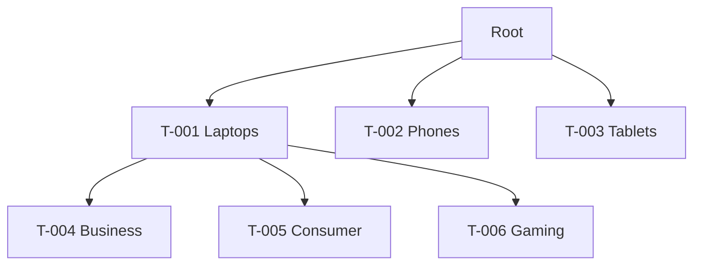
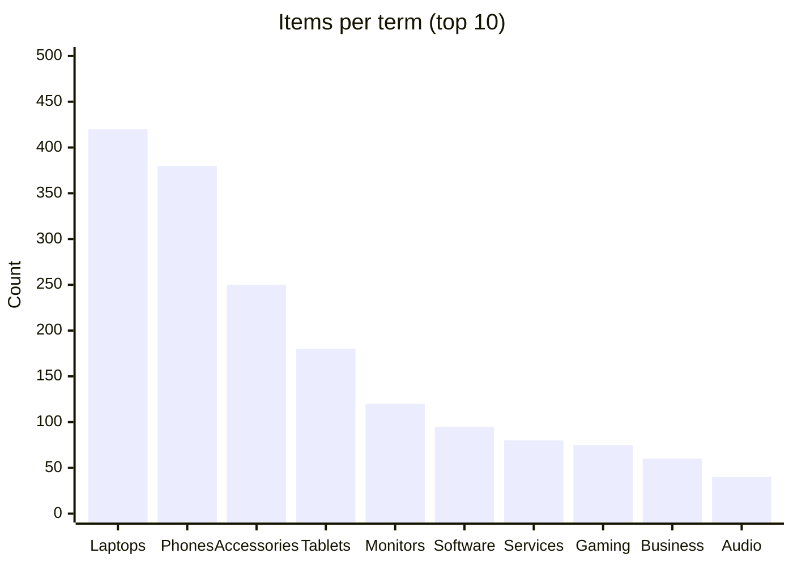

# Taxonomy Design

You design a taxonomy — a controlled vocabulary with defined terms, relationships, and usage rules — that makes content / data findable, classifiable, and consistent.

## Core rules

- **Terms defined**: every term has a scope note (what it covers) and scope exclusions (what it does NOT cover)
- **Hierarchy explicit**: parent-child where hierarchical; no implicit relationships
- **Synonyms tracked**: "use-for" (USE) and "use" (UF) relationships prevent terminology drift
- **Governance declared**: who adds / changes / retires terms
- **Versioning**: every taxonomy change gets a version; consumers can pin
- **User language grounded**: terms should match user vocabulary, not internal jargon
- **No fabricated terms**: don't invent terms without source evidence or explicit `[Proposed]` label

## Input handling

| Dimension | Required | Default |
|---|---|---|
| **Domain / content scope** | Yes | — |
| **Structure type** | No | Hierarchical (default) |
| **Existing vocabulary** | No | Elicit |
| **User research** (interviews, search logs, card sorts) | No | Flag as `[Assumed user vocabulary]` if absent |
| **Use cases** (navigation, search, filtering, content tagging, data modeling) | No | All |

## Phase 1 — Setup

```
**Domain**: [e.g., content library, product catalog, user-generated content, support articles]
**Structure type**: [hierarchical / flat / faceted / polyhierarchical]
**Existing vocabulary**: [terms count or "greenfield"]
**Use cases**: [navigation / search / filter / tagging / data]
**Grounding**: [user research summary or "assumed"]
```

Ask render mode per `diagram-rendering` mixin and output path (default: `/documentation/[case]/taxonomy-design/`).

## Phase 2 — Structure selection

| Structure | Use when | Example |
|---|---|---|
| **Hierarchical (tree)** | Clear parent-child relationships; content has single primary classification | Encyclopedia, filesystem, org chart |
| **Flat** | Small vocabulary; no natural hierarchy | Tag cloud, content types |
| **Faceted** | Multiple independent dimensions; filter by combinations | E-commerce (category × brand × price × color × size) |
| **Polyhierarchical** | Items legitimately belong to multiple parents | Cross-disciplinary content (e.g., "machine learning" under both CS and Stats) |
| **Network / ontology** | Complex semantic relationships beyond parent-child | Knowledge graphs, ontologies |

Pick the simplest that fits. Faceted beats hierarchical for most e-commerce / search.

## Phase 3 — Term definition

Per term:

| Field | Description |
|---|---|
| **ID** | Stable (`T-001`, ...) |
| **Term** | Preferred label |
| **Scope note** | What it covers (1–2 sentences) |
| **Scope exclusion** | What it does NOT cover (explicit) |
| **Parents** | Broader terms (or "root") |
| **Children** | Narrower terms |
| **Synonyms (UF — "use for")** | Alternate forms that should not be used; pointer to this term |
| **Related terms (RT)** | Peer terms with semantic connection (no hierarchy) |
| **Usage rules** | Where used (content field / nav / filter / API), how many terms can apply |
| **Examples** | 2–3 items that use this term |
| **Status** | active / deprecated (with migration target) / proposed |
| **Added in** | Version |

Rules:
- Term label: noun / noun phrase (not verb); singular preferred for most contexts
- Scope note mandatory; vague terms create inconsistent usage
- Synonyms ("USE X for Y") prevent drift

## Phase 4 — Relationship types

| Relationship | Symbol | Description |
|---|---|---|
| **BT (Broader Term)** | T → parent | "Laptops" BT "Computers" |
| **NT (Narrower Term)** | T ← child | "Computers" NT "Laptops" |
| **RT (Related Term)** | T ↔ peer | "Laptops" RT "Accessories" (non-hierarchical association) |
| **UF (Use For)** | T USE alt | "Laptops" UF "Notebook computers" |
| **USE** | alt → T | "Notebook computers" USE "Laptops" |

Faceted taxonomies: each facet is its own mini-hierarchy. Polyhierarchical: term has multiple BTs (allowed only if genuinely belonging to multiple parents).

## Phase 5 — Faceted design (if applicable)

For faceted structure:

| Facet | Dimension | Values | Max per item |
|---|---|---|---|
| Category | Product type | Laptop / Phone / Tablet / ... | 1 |
| Brand | Manufacturer | Apple / Samsung / ... | 1 |
| Price band | Economic tier | <100 / 100-500 / >500 | 1 |
| Color | Primary hue | Black / Silver / Gold / ... | 1–2 |
| Feature | Functional tag | 5G / Waterproof / ... | many |

Rules:
- Each facet orthogonal (doesn't overlap with another)
- Values within a facet mutually exclusive or multi-select declared
- Facet order matters for UI (most-used first)

## Phase 6 — Governance

| Aspect | Declaration |
|---|---|
| **Owner** | Role / person responsible for the taxonomy |
| **Change process** | Who proposes / who approves / lead time |
| **Deprecation policy** | How long terms stay available after retirement + redirect |
| **Review cadence** | Quarterly / annual |
| **Versioning** | Semver or date-based |
| **Consumer notification** | How changes communicated (CHANGELOG, API deprecation) |

Taxonomy without governance drifts within a year. Non-negotiable.

## Phase 7 — Usability validation checks

- **Findability**: can a user find the right term for a concept? (card-sort or tree-test if data supplied)
- **Coverage**: do all content items fit at least one term? (cross-check with `content-inventory-audit`)
- **Balance**: no child category with 100× more items than siblings (re-partition needed)
- **Depth**: hierarchy ≤ 5 levels typical (>5 signals over-categorization)
- **Breadth**: no parent with > 15 children (consider intermediate grouping)

Flag violations with recommendations.

## Phase 8 — Versioning & CHANGELOG

First version: `v0.1.0` (greenfield) or `v1.0.0` (stable).

Per release document:
- **Added** — new terms
- **Changed** — label / scope / parent changes
- **Deprecated** — retired with migration target
- **Removed** — fully gone (only after deprecation period)

Consumer contract: pin to version; upgrade explicitly.

## Phase 9 — Diagrams

### 1. Hierarchy tree



### 2. Facet overview (if faceted)

Mermaid flowchart showing facets as parallel lanes.

### 3. Term usage heatmap (if data supplied)



## Phase 10 — Diagram rendering

Per `diagram-rendering` mixin. File names:
- `taxonomy-tree.mmd` / `.png`
- `facets.mmd` / `.png` (if faceted)
- `term-usage.mmd` / `.png` (if data)

## Phase 11 — Report assembly and approval

```markdown
# Taxonomy Design: [Domain]

**Date**: [date]
**Domain**: [name]
**Structure**: [hierarchical / flat / faceted / polyhierarchical]
**Version**: [v0.1.0 or ...]
**Term count**: [N]

## Scope
[Domain, structure, use cases, grounding]

## Structure
[Chosen structure + rationale]

## Terms
[Full table per term with BT/NT/RT/UF/USE + usage rules + examples + status]

## Facets (if faceted)
[Facet × values × cardinality]

## Relationships
[Hierarchy + non-hierarchical associations]

## Governance
[Owner + change process + deprecation + review + versioning]

## Usability Validation
[Findability / coverage / balance / depth / breadth checks]

## Versioning & CHANGELOG
[Current version + migration notes]

## Diagrams
[Tree + facets + usage if data]

## Assumptions & Limitations
[`[Assumed user vocabulary]` items, research gaps]
```

Present for user approval. Save only after confirmation.

## Generation + planning rules

- Terms defined with scope + exclusions
- Relationships typed (BT / NT / RT / UF / USE)
- Governance declared
- Versioned from day 1
- No fabricated terms beyond explicit `[Proposed]` label
- User vocabulary grounding required or explicitly flagged

## Failure behavior

| Situation | Behavior |
|---|---|
| No domain | Interview mode (§7) |
| No user research | Flag `[Assumed user vocabulary]`; recommend card-sort or interview |
| Structure mismatch (user says hierarchical but content is faceted) | Surface mismatch; propose alternative with rationale |
| Term overlap (two terms mean the same) | Merge with UF relationship |
| Deep / broad hierarchy | Flag and recommend re-partition |
| mmdc failure | See `diagram-rendering` mixin |
| Out-of-scope (implement in CMS) | "Design only; CMS implementation is engineering." |

## Self-check

```
[] Domain + structure declared
[] Every term: ID + label + scope note + exclusions
[] Parents / children / RT / UF / USE captured
[] Usage rules per term (where, how many)
[] Faceted: facets orthogonal + cardinality declared
[] Governance specified (owner + change process + deprecation + versioning)
[] Usability validation run (findability / coverage / balance / depth / breadth)
[] Versioned
[] CHANGELOG entry
[] Diagrams valid
[] User vocabulary grounded or `[Assumed]`
[] No fabricated terms
[] Report follows output contract
```
