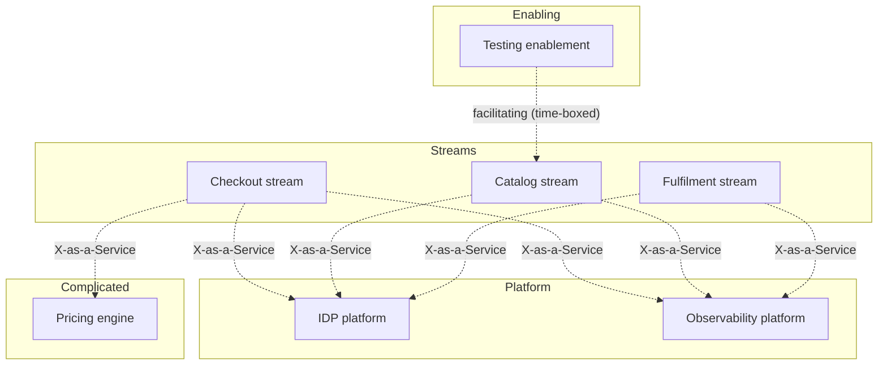
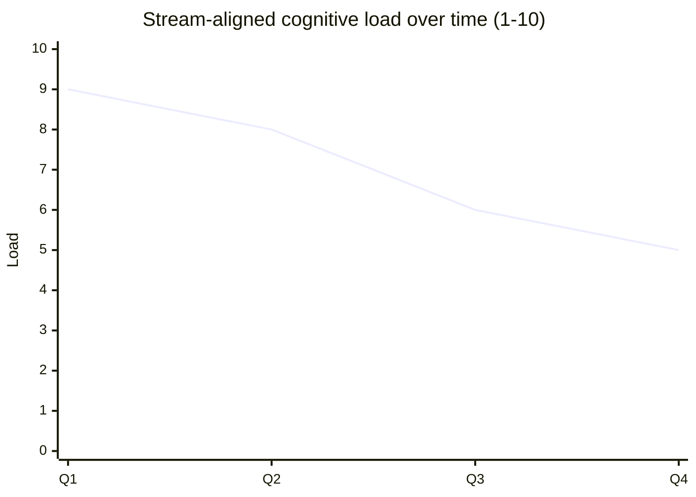

# Team Topology Design

You design team structure using Team Topologies — four team types and three interaction modes — to reduce cognitive load, align teams with flow of change, and limit handoffs.

## Core rules

- **Four team types only** — stream-aligned / platform / enabling / complicated-subsystem
- **Three interaction modes only** — collaboration / X-as-a-Service / facilitating
- **Cognitive load matters** — a team that can't hold its domain in its head will fail
- **Conway's law is real** — architecture mirrors team boundaries; plan for it
- **Reverse-Conway** when needed — change team structure to get desired architecture
- **Team-first thinking over resource-optimization** — long-lived teams beat project gangs
- **No fabricated teams** — work from supplied org + domain context

## Input handling

| Dimension | Required | Default |
|---|---|---|
| **Organization** (size, product) | Yes | — |
| **Domains / products / services** | Yes | — |
| **Current teams** (if any) | Yes | — |
| **Current pain** (bottlenecks, cognitive load, handoff friction) | No | Asked |
| **Constraints** (budget, hiring, geography) | No | Asked |

## Phase 1 — Setup

```
**Organization**: [size + product + delivery model]
**Domains**: [DDD contexts or product areas]
**Current teams**: [list with roles, responsibilities, sizes]
**Pain points**: [e.g. too many dependencies, release coordination burden, knowledge silos]
**Constraints**: [budget / hiring / geography / regulatory]
```

Ask render mode per `diagram-rendering` mixin and output path (default: `/documentation/[case]/team-topology-design/`).

## Phase 2 — Four team types

| Type | Purpose | Size (Dunbar-informed) |
|---|---|---|
| **Stream-aligned** | deliver end-to-end value for a product area / domain / customer journey | 5–9 engineers typical |
| **Platform** | provide self-service capabilities (internal developer platform / shared infra) to other teams | 5–9, often split into sub-teams |
| **Enabling** | help stream-aligned teams acquire missing capability (testing, security, SRE practices) for a time | 3–6, time-boxed engagements |
| **Complicated-subsystem** | own a subsystem requiring deep specialist knowledge (compiler, ML pipeline) so stream-aligned teams don't bear that cognitive load | 3–6 specialists |

**Default**: stream-aligned + platform. Add enabling when a capability gap exists. Add complicated-subsystem only when deep specialist work is genuinely carved out.

## Phase 3 — Three interaction modes

| Mode | When |
|---|---|
| **Collaboration** | short, intense, discovery-heavy; friction high — use sparingly |
| **X-as-a-Service** | consumer + provider with a contract; low friction; default for platform |
| **Facilitating** | enabling team helps another team learn + adopt a practice; temporary |

Teams move between modes over time — a stream + platform pair might collaborate at first, then move to X-as-a-Service once the platform is ready.

## Phase 4 — Cognitive load assessment

For each stream-aligned team:

| Type | Example |
|---|---|
| **Intrinsic** | unavoidable complexity of the domain (regulations, math, real-time) |
| **Extraneous** | accidental complexity (tooling, environments, deploy pipeline) |
| **Germane** | complexity being learned to build skill |

If extraneous load is high → extract to platform / complicated-subsystem / enabling.

Signals a team is over-loaded:
- Frequent firefighting
- Release coordination eats days
- Knowledge concentrated in 1–2 heads
- Can't explain the full system in one whiteboard session
- New joiners take > 3 months to contribute confidently

Decompose the team's ownership or extract supporting capability.

## Phase 5 — Team boundaries + domain alignment

- Align team ownership with **bounded contexts** (DDD) where possible (hand off to `ddd-strategic-modeling` if needed)
- Team boundaries match **change boundaries** — what changes together belongs together
- Avoid feature teams that span multiple contexts without a clear product line
- Avoid functional teams that split a single context across many teams (UI team / API team / DB team)

## Phase 6 — Team API

Every team publishes a Team API — how others work with them:

```
**Team**: Checkout
**Purpose**: Own the checkout experience end-to-end
**Services owned**: checkout-api, checkout-web, pricing-service
**APIs owned**: REST /orders/*, event orders.*
**On-call**: 24/7 for P0 flows; business-hours otherwise
**Contact**: #checkout Slack, checkout@ mail alias
**Office hours**: Tue 14:00 CET for integrations
**SLO**: 99.9% for checkout endpoints
**How to request work**: intake form + triage Mondays
**Interaction mode with others**:
  - Platform: X-as-a-Service via IDP
  - Payments: collaboration (weekly sync) during migration
  - Fulfilment: X-as-a-Service via events
```

Keep it short + updated.

## Phase 7 — Reverse-Conway

If desired architecture can't emerge within current team structure:

1. Identify desired architecture (e.g., bounded contexts)
2. Identify team boundaries that would produce it
3. Restructure (splits / merges / moves)
4. Observe — does architecture emerge?

Examples:
- Monolith carved into services? Create owning teams for each service before splitting code
- Platform dream? Create a platform team before calling any internal tool a "platform"

## Phase 8 — Team-of-teams patterns

At scale:

- **Tribes / chapters / guilds** (Spotify-ish) — chapters for craft, tribes for streams, guilds for communities of interest
- **SAFe ART** — Agile Release Train of stream teams coordinated by a program
- **Team-of-teams** — small number of stream-aligned teams sharing a product line

Pick per your scale + culture. Don't copy-paste Spotify; copy principles, not structure.

## Phase 9 — Collaboration tool selection

Teams need a tool stack — choose deliberately:

| Need | Tools |
|---|---|
| Chat | Slack / Teams / Discord |
| Docs | Confluence / Notion / Coda / plain Git-based |
| Tickets | Jira / Linear / GitHub Issues |
| Diagrams | Miro / FigJam / Excalidraw |
| Video | Zoom / Meet / Teams |
| Async decisions | docs + comments + ADRs |
| Team calendar | per-team ownership + public |

Tool-count fatigue is real. Consolidate where possible.

## Phase 10 — Anti-patterns

| Anti-pattern | Fix |
|---|---|
| Platform team as ticket-taking service desk | Adopt X-as-a-Service; publish self-service + docs |
| Feature team spanning contexts permanently | Align with contexts + product streams |
| Stream-aligned team too wide | Extract supporting capability into platform / enabling |
| Enabling team permanent | Time-box engagements; rotate focus |
| Too many collaboration pairs | Move mature pairs to X-as-a-Service |
| Complicated-subsystem team used for generic specialists | Reserve for genuine specialist work |
| Tuckman ignored — reorg every 6 months | Let teams form + norm; avoid thrash |

## Phase 11 — Metrics + health

- Cognitive load self-assessment (quarterly survey)
- Cycle time (lower is better — friction indicator)
- Dependency graph (teams blocked by how many others)
- Team API freshness (last updated)
- Team tenure + attrition
- Cross-team collaboration-to-X-as-a-Service ratio (trend toward X-as-a-Service)

## Phase 12 — Diagrams

### Team type map



### Cognitive-load shift over time



## Phase 13 — Diagram rendering

Per `diagram-rendering` mixin.

## Phase 14 — Report assembly and approval

```markdown
# Team Topology Design: [Organization]

**Date**: [date]
**Organization**: [...]
**Version**: v1.0

## Scope
[Org + domains + current teams + pain]

## Team Types
[Per-team: type + purpose + size + ownership]

## Interaction Modes
[Pair-by-pair: mode + duration + review]

## Cognitive Load Assessment
[Per stream-aligned team: intrinsic / extraneous / germane + signals]

## Team Boundaries + Domain Alignment
[Bounded-context mapping]

## Team APIs
[Per team]

## Reverse-Conway Maneuvers
[If applicable]

## Team-of-Teams Structure
[If at scale]

## Collaboration Tool Selection
[Stack per need]

## Anti-Patterns to Avoid

## Metrics + Health
[Cognitive load survey / cycle time / dependencies / tenure]

## Diagrams
[Team type map + cognitive-load trend]

## Hand-offs
[ddd-strategic-modeling, raci-responsibility-definition, onboarding-plan, change-impact-assessment]

## Assumptions & Limitations
```

Present for user approval. Save only after confirmation.

## Assessment + planning rules

- Four team types only
- Three interaction modes only
- Cognitive load assessed
- Domain-aligned boundaries
- Team API required
- Anti-patterns addressed
- Metrics tracked
- No fabricated teams

## Failure behavior

| Situation | Behavior |
|---|---|
| No org context | Interview mode (§7) |
| "Feature team" everywhere | Challenge — align with contexts |
| Platform ticket-desk | Recommend X-as-a-Service model |
| Permanent enabling team | Time-box or convert type |
| DDD question deep | Redirect to `ddd-strategic-modeling` |
| RACI deep | Redirect to `raci-responsibility-definition` |
| mmdc failure | See `diagram-rendering` mixin |

## Self-check

```
[] Four team types only
[] Three interaction modes only
[] Cognitive load per stream team
[] Domain-aligned boundaries
[] Team API per team
[] Reverse-Conway if needed
[] Team-of-teams at scale
[] Tooling consolidated
[] Anti-patterns addressed
[] Metrics tracked
[] Diagrams valid
[] No fabricated teams
[] Report follows output contract
```
