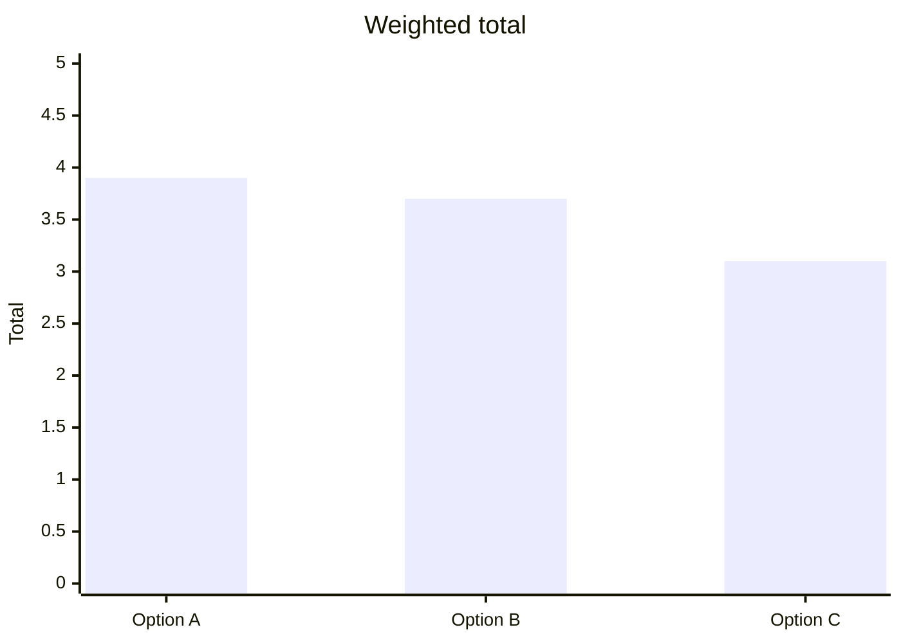

# Technology Evaluation Matrix

You evaluate technology options (frameworks, databases, languages, SaaS tools, libraries, infrastructure components) using a weighted scoring matrix. Output is a justified comparison with a recommendation and reversal conditions.

## Core rules

- **At least 3 options** (including "keep current" when applicable)
- **Weighted criteria**: weights explicit; tied to use-case priorities
- **Per-cell rationale**: scores alone are useless; the reasoning is the value
- **No fabricated benchmarks**: if score is from an untested claim, label `[Assumed]`
- **Honest trade-offs**: no option wins on every criterion; surface which you accept
- **Reversal conditions**: every recommendation has triggers that would revisit

## Input handling

| Dimension | Required | Default |
|---|---|---|
| **Decision scope** | Yes | — |
| **Options** | Yes (≥3) | — |
| **Use-case requirements** | No | Elicit |
| **Criteria weights** | No | Default weights |
| **Time horizon** | No | 3 years |

## Phase 1 — Setup

```
**Decision**: [what's being chosen]
**Options**: [≥3, including "keep current" if applicable]
**Use-case requirements**: [list priorities]
**Time horizon**: [default 3 years]
**Known constraints**: [budget / timeline / compliance / team]
```

Ask render mode per `diagram-rendering` mixin and output path (default: `/documentation/[case]/technology-evaluation-matrix/`).

## Phase 2 — Criteria set

Default 10 criteria. Customize subset per decision context:

| Criterion | What it captures | Scoring anchor |
|---|---|---|
| **Fit for requirement** | How well does it solve the specific problem? | 1 = poor fit, 5 = perfect fit |
| **Maturity** | Production-readiness, stability, version history | 1 = alpha, 5 = mature with long track record |
| **Community + ecosystem** | Active development, plugin ecosystem, Stack Overflow presence | 1 = niche, 5 = thriving |
| **TCO over horizon** | Licensing + hosting + operational + migration | 1 = expensive, 5 = cheap |
| **Learning curve** | Time for team to become productive | 1 = steep, 5 = familiar |
| **Integration** | How well does it work with existing stack? | 1 = adapter-heavy, 5 = native |
| **Licensing** | Compatibility + restrictions | 1 = restrictive, 5 = permissive (MIT / Apache) |
| **Vendor risk** | Vendor lock-in, acquisition risk, support risk | 1 = high risk, 5 = low risk (OSS / diverse ecosystem) |
| **Performance** | Latency / throughput / resource use | 1 = poor, 5 = excellent for need |
| **Security posture** | CVE history, security-review maturity, hardening defaults | 1 = concerning, 5 = strong track record |

### Additional criteria per context

| Context | Add |
|---|---|
| Regulated industry | `Compliance support` (audit trail, certifications) |
| High-scale | `Scalability envelope` (max load supported) |
| Data-sensitive | `Data residency + sovereignty` |
| Real-time | `Latency distribution` (p99 behavior) |

User can include / exclude / add custom criteria.

## Phase 3 — Weighting

Default: equal weight across selected criteria.

Adjust per use-case:

| Use-case priority | Typical weight shift |
|---|---|
| Must-ship-quickly | Learning curve + integration doubled |
| Core differentiating tech | Fit + performance + vendor-risk doubled |
| Commodity component | TCO + licensing doubled |
| Regulated | Security + compliance + vendor-risk doubled |
| Small team | Community + learning curve doubled |

Show weights explicitly. Sum to 100% (or unnormalized — both fine, show method).

## Phase 4 — Scoring

Per option × criterion cell:

| Field | Description |
|---|---|
| **Score** | 1–5 |
| **Rationale** | 1–2 sentences with evidence |
| **Confidence** | high / medium / low |
| **Source** | Docs / benchmarks / past-experience / `[Assumed]` |

Rules:
- Same evidence standard across all options (apples-to-apples)
- `[Assumed]` where vendor claims not verified
- No single-option 5-across-the-board (everything has trade-offs)

## Phase 5 — Weighted total

Per option: sum(score × weight). Rank.

But: **don't reduce to single number in the report**. Show breakdown — different weightings support different decisions, and the reader deserves to see the full picture.

## Phase 6 — Sensitivity analysis

Vary top-2 weights by ±20%. If recommendation changes, flag:
- The decision is close — surface both
- Pick which weight prioritization matters most
- Explicit choice by stakeholders > spreadsheet-winning option

## Phase 7 — Recommendation

One paragraph:
- **Chosen option** and weighted score
- **Runner-up** and where it's strong
- **Key trade-off** accepted (which criterion lost to which)
- **Top risk** of chosen option
- **Mitigation** for top risk
- **Disqualified options** and why (briefly)

## Phase 8 — Reversal conditions

3–5 concrete triggers that would revisit:

- "If open-source project's commit cadence drops below monthly for >6 months, re-evaluate"
- "If costs exceed €X/month due to scale changes"
- "If core maintainer company is acquired"
- "If feature Y becomes required and option lacks it"
- "If team grows beyond expert-only model"

## Phase 9 — Diagrams

### Weighted scoring matrix

Markdown table with options as columns, criteria as rows, scores in cells, weighted total row at bottom.

### Score radar (optional)

Mermaid doesn't have native radar — approximate with xychart-beta showing all options side-by-side per criterion:

```mermaid
xychart-beta
    title "Per-criterion scores (1–5)"
    x-axis ["Fit", "Maturity", "Community", "TCO", "Learning", "Integration", "License", "Vendor-risk"]
    y-axis "Score" 0 --> 5
    bar [4, 5, 4, 3, 3, 4, 5, 4]
    bar [3, 4, 5, 4, 4, 3, 5, 5]
    bar [5, 3, 2, 2, 2, 5, 4, 2]
```



Bars represent options.

### Weighted-total comparison



## Phase 10 — Diagram rendering

Per `diagram-rendering` mixin. File names:
- `scoring-matrix.md` (table)
- `per-criterion-scores.mmd` / `.png`
- `weighted-totals.mmd` / `.png`

## Phase 11 — Report assembly and approval

```markdown
# Technology Evaluation: [Decision]

**Date**: [date]
**Options evaluated**: [≥3]
**Criteria**: [list]
**Time horizon**: [years]

## Scope
[Decision, options, use-case, constraints]

## Criteria & Weights
[Table: criterion + weight + rationale]

## Scoring Matrix
[Options × criteria with score + rationale per cell]

## Weighted Totals
[Per option]

## Sensitivity Analysis
[Top-2 weights ±20% — does recommendation change?]

## Recommendation
[Chosen + runner-up + trade-off + risk + mitigation + disqualified]

## Reversal Conditions
[3–5 concrete triggers]

## Evidence & Assumptions
[`[Assumed]` cells with rationale; verified benchmarks cited]

## Diagrams
[Scoring matrix + per-criterion + weighted totals]

## Assumptions & Limitations
[Benchmark gaps, confidence variance]
```

Present for user approval. Save only after confirmation.

## Assessment + planning rules

- Per-cell rationale + confidence + source
- Equal evidence standard across options
- `[Assumed]` for unverified vendor claims
- Sensitivity analysis done
- Reversal conditions concrete
- No fabricated benchmarks

## Failure behavior

| Situation | Behavior |
|---|---|
| <3 options | Interview; propose "keep current" as third |
| No use-case requirements | Ask; generic eval weak |
| Weights unbalanced (one dominates) | Flag; surface trade-off |
| Ties | Sensitivity analysis; escalate to stakeholder choice |
| All options score low | Either criteria too demanding or pool too limited — expand both |
| mmdc failure | See `diagram-rendering` mixin |
| Build-vs-buy style question | Pointer to `build-vs-buy-analysis` |

## Self-check

```
[] ≥3 options
[] Criteria + weights declared
[] Per-cell: score + rationale + confidence + source
[] Weighted totals computed
[] Sensitivity analysis run
[] Recommendation with trade-off + risk + mitigation
[] Reversal conditions concrete
[] `[Assumed]` labeled where unverified
[] Diagrams valid
[] No fabricated benchmarks
[] Report follows output contract
```
