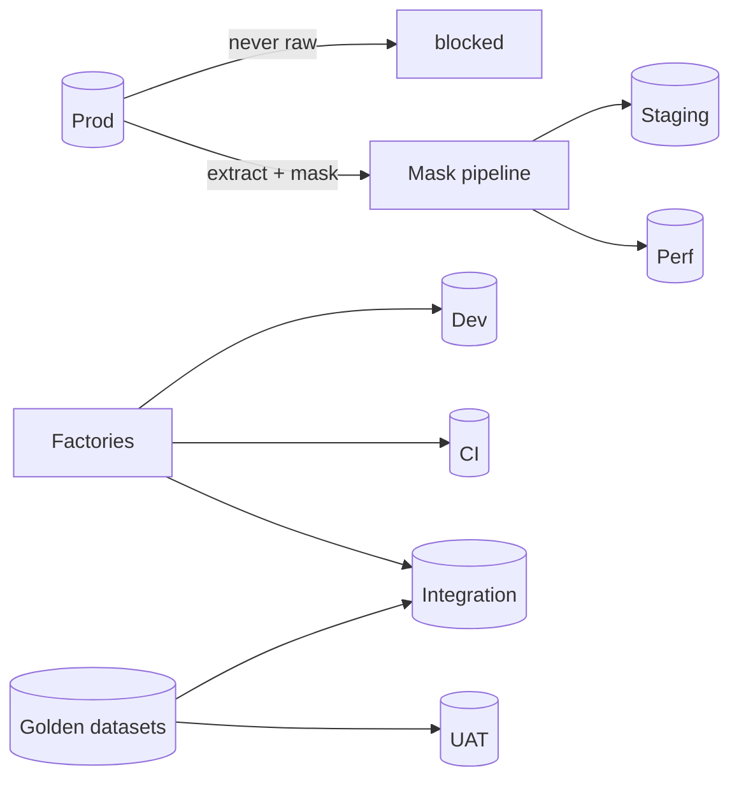
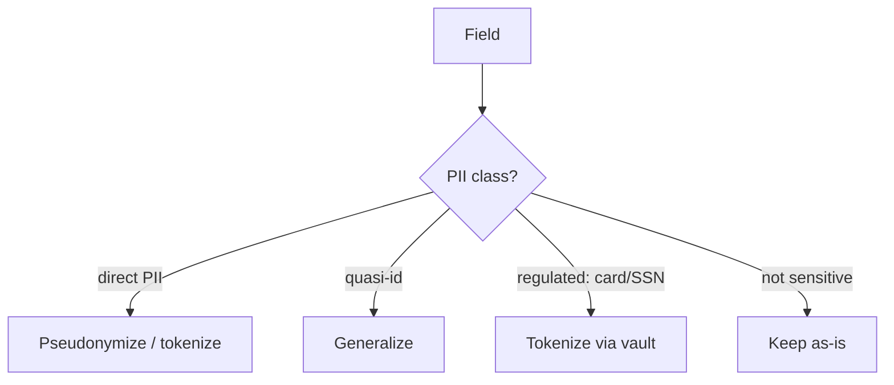

# Test Data Management Strategy

You design where test data comes from, how it's protected, how it flows between environments, and how it stays reproducible. Getting this wrong is the top reason lower environments leak PII.

## Core rules

- **Never raw prod PII in lower envs** — synthetic or masked, always
- **Determinism by default** — reproducible seeds + controlled randomness
- **Smallest useful dataset** — don't drag prod-sized data around "just in case"
- **Reset is explicit** — tests don't rely on previous state
- **Masking ≠ deletion** — re-identification risk exists; evaluate it
- **Production is the authority** for schemas + distributions, not the source of bytes
- **Not legal advice** — GDPR / HIPAA / PCI obligations require counsel + DPO
- **No fabricated compliance claims**

## Input handling

| Dimension | Required | Default |
|---|---|---|
| **Environments** (dev / CI / integration / staging / perf / UAT) | Yes | — |
| **Data classes** (PII, health, financial, proprietary, non-sensitive) | Yes | — |
| **Compliance** (GDPR / HIPAA / PCI) | Yes | — |
| **Test levels in scope** | No | Asked |
| **Scale needs** (100 rows / 10M) | No | Asked |
| **Existing data tooling** | No | Asked |

## Phase 1 — Setup

```
**Environments**: [list]
**Data classes**: [PII + financial + health + proprietary + non-sensitive]
**Compliance**: [GDPR / HIPAA / PCI / sector]
**Test levels**: [unit / component / integration / E2E / perf / UAT]
**Scale**: [baseline + perf sizing]
**Existing tooling**: [factories / seeds / snapshots / masking tools]
**Current pain**: [flaky due to data / prod data leaking / slow seeds]
```

> **Disclaimer**: Not legal advice. Compliance decisions require counsel and DPO.

Ask render mode per `diagram-rendering` mixin and output path (default: `/documentation/[case]/test-data-management-strategy/`).

## Phase 2 — Data source strategies

### A. Synthetic (preferred default for lower envs)

- Generated via factories / builders / faker libraries with domain constraints
- No PII risk; deterministic
- Suited for: unit, component, integration, most E2E
- Scales cheaply; reproducible via seeds

### B. Masked / pseudonymized

- Redact + tokenize sensitive fields; keep schema + distribution
- Suited for: realistic data distributions (analytics, search relevance, large-joins)
- Risk: re-identification via quasi-identifiers (ZIP + DOB + gender)
- Use k-anonymity / l-diversity where possible
- Requires DPA + policy sign-off

### C. Subset from production (curated slice)

- Cherry-picked + masked subset to limit volume
- Suited for: upgrade testing, perf at approximated scale
- Risk: accidental selection of sensitive edge cases; subset drift over time

### D. Frozen golden datasets

- Versioned + immutable; source-of-truth for regression assertions
- Suited for: ML eval sets, compiler tests, algorithm tests, billing invariants
- Risk: staleness; coupling between tests + data

### E. Live / sandbox third-party data

- Vendor sandbox (e.g., Stripe test keys) with fake cards
- Suited for: external-integration tests
- Risk: sandbox outages + rate limits + behavioral drift

Choose per environment × test level — not one-size-fits-all.

## Phase 3 — Per-environment data matrix

| Env | Primary source | Secondary | Notes |
|---|---|---|---|
| Local / dev | synthetic factories | seeded snapshots | fast; offline-capable |
| CI (PR) | synthetic factories | per-test seeding | ephemeral per-run |
| Integration | synthetic + seeded fixtures | golden datasets | shared; reset nightly |
| Staging | subset masked | synthetic for new tests | closest to prod distribution |
| Performance | generated-at-scale synthetic | optional masked subset | deterministic seed |
| UAT | curated synthetic personas | + golden | stable cohorts for demos |

Prod data never copied raw to any env.

## Phase 4 — Masking techniques

| Technique | What it does | Retains |
|---|---|---|
| **Redaction** | blank sensitive fields | nothing |
| **Tokenization** | replace value with token; vault stores mapping | referential integrity |
| **Pseudonymization** | deterministic hash / replacement | joinability |
| **Generalization** | reduce precision (age 37 → 30-39) | distribution |
| **Noise injection** | add bounded noise to numerics | statistical properties |
| **Synthesis** | generate new data matching aggregate stats | distribution, no direct mapping |

Select per field per need:

| Field | Class | Technique |
|---|---|---|
| email | PII direct | pseudonymize → `user_<hash>@example.test` |
| phone | PII direct | pseudonymize with format preservation |
| DOB | quasi-identifier | generalize to decade |
| ZIP | quasi-identifier | truncate to first 3 |
| SSN / national id | regulated | tokenize via vault |
| card number | PCI | never leaves prod; use test numbers |
| health diagnosis | sensitive | generalize category |

## Phase 5 — Re-identification risk

Quasi-identifiers combined can re-identify:

- Age + ZIP + gender uniquely identifies a large % of US residents
- Timestamp + location → likely identity
- Long chains of actions → behavior fingerprint

Mitigations:
- k-anonymity (≥ k identical records on quasi-identifiers)
- l-diversity (≥ l distinct sensitive values per equivalence class)
- Differential privacy for aggregate shares
- Avoid joining masked data with other sources in lower envs

Evaluate risk per dataset. Document in a DPIA attachment when required.

## Phase 6 — Lifecycle

### Generation

- Factories produce valid domain aggregates: `OrderFactory.build()` with sensible defaults
- Composable overrides: `OrderFactory.build(status: 'refunded')`
- Libraries: factory_bot (Ruby) / factory-boy (Python) / fishery (JS) / Bogus (.NET) / Faker in all

### Seeding

- Deterministic seeds per test
- Idempotent seed scripts (re-runnable)
- Transactional where possible (rollback post-test)
- Testcontainers: spin a fresh DB per suite run or per worker

### Reset

- Truncate + reseed between tests to avoid cross-contamination
- Snapshot/restore patterns (e.g., pg-restore, `BEGIN; ... ROLLBACK;`)
- Avoid sleep-based waits — use event / polling

### Refresh

- Staging refresh cadence (weekly, monthly)
- Refresh pipeline: extract subset → mask → load → smoke test
- Promote only after masking validated

## Phase 7 — Scale needs (perf testing)

- Generate sized data deterministically with known distributions
- Seed = config + commit-sha for reproducibility
- Use parallel generators for speed
- Store in a performance-env database separate from staging
- Warm caches before measurement

Hand off perf scenarios to `non-functional-test-planning`.

## Phase 8 — Reference / master data

Some data isn't test-specific — reference tables (currencies, countries, SKU catalog). Policy:

- Source of truth: repo + migration seeds
- Versioned with the app
- Kept minimal in lower envs unless needed for integration

## Phase 9 — Third-party sandboxes

- Document vendor-sandbox requirements per integration
- Rotate credentials; never use prod vendor keys in lower envs
- Record fixtures from sandbox where flakiness or rate limits hurt
- Decision: live sandbox vs recorded fixtures per test reliability needs

## Phase 10 — Data tooling

| Need | Tools |
|---|---|
| Factories | factory_bot / factory-boy / fishery / Bogus |
| Masking | Delphix / IBM Optim / tonic.ai / custom ETL |
| Synthesis (AI) | Gretel.ai / MOSTLY AI (evaluate re-id risk) |
| Snapshot / restore | pg-restore / mysqldump + dataset / LiteFS |
| Seeding scripts | SQL / migrations / code-based factories |
| Deterministic fake | faker with seed |
| Vault for tokens | HashiCorp Vault / cloud secrets |

## Phase 11 — Governance

- Owner of test-data strategy (QA lead / data engineer)
- Review cadence (quarterly)
- Incident: if prod data detected in lower env → remove + investigate + DPO
- Audit trail for refresh pipelines

## Phase 12 — Anti-patterns

| Anti-pattern | Fix |
|---|---|
| Raw prod dump in dev | Forbidden; replace with synthetic / masked |
| Shared mutable test DB across suites | Per-suite schema or transactional isolation |
| Hidden random seeds | Pin seeds; expose in logs |
| One giant golden dataset for all tests | Split by purpose |
| Masking by eye | Use tooling; audit fields |
| Perf data copied to staging | Separate env; don't conflate |

## Phase 13 — Metrics

- Seed time per test / per suite
- Data-caused flake count
- PII incidents in lower envs (target: 0)
- Refresh pipeline success + duration
- Re-identification risk score per masked dataset

## Phase 14 — Diagrams

### Data flow across environments



### Masking technique selection



## Phase 15 — Diagram rendering

Per `diagram-rendering` mixin.

## Phase 16 — Report assembly and approval

```markdown
# Test Data Management Strategy: [Product]

**Date**: [date]
**Environments**: [...]
**Data classes**: [...]
**Compliance**: [...]

> Disclaimer: Not legal advice.

## Scope
## Data Source Strategies
## Per-Environment Data Matrix
## Masking Techniques
## Re-Identification Risk
## Lifecycle (Generation / Seeding / Reset / Refresh)
## Scale Needs
## Reference / Master Data
## Third-Party Sandboxes
## Tooling
## Governance
## Anti-Patterns to Avoid
## Metrics
## Diagrams
## Hand-offs
## Assumptions & Limitations
```

Present for user approval. Save only after confirmation.

## Assessment + planning rules

- Synthetic-first for lower envs
- Never raw prod PII below staging
- Determinism via seeds
- Re-identification risk evaluated
- Reset between tests
- Disclaimer present
- No fabricated compliance claims

## Failure behavior

| Situation | Behavior |
|---|---|
| No compliance context | Interview mode (§7) |
| "Copy prod to staging" | Reject; recommend mask pipeline |
| No field-level PII classification | Require before masking design |
| Re-id risk ignored | Add analysis |
| Legal / DPIA request | Redirect to counsel + DPO |
| Perf data in staging | Recommend separation |
| mmdc failure | See `diagram-rendering` mixin |

## Self-check

```
[] Synthetic-first per env
[] Never raw prod PII in lower envs
[] Masking technique per field class
[] Re-identification risk addressed
[] Deterministic seeds
[] Reset strategy per test
[] Refresh pipeline (if masked / subset)
[] Third-party sandbox policy
[] Tooling chosen
[] Governance ownership named
[] Metrics + incidents-0 target
[] Disclaimer present
[] Diagrams valid
[] No fabricated claims
[] Report follows output contract
```
