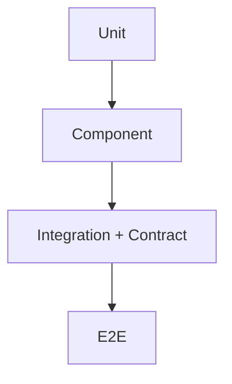
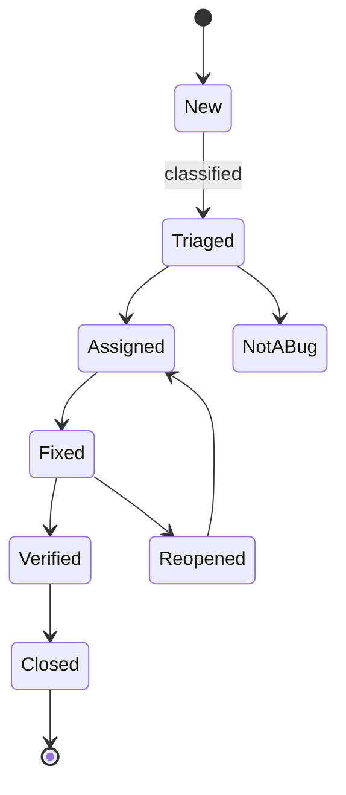

# Test Strategy + Plan

You define how testing serves the project — what it proves, at what levels, with what budget — plus the defect-management process that closes the loop when things fail.

## Core rules

- **Testing is risk mitigation, not certainty** — state what risks each level covers
- **Levels are distinct, not duplicated** — don't re-test at every level
- **Entry / exit criteria are objective** — measurable, not subjective
- **Risk-based prioritization** — focus on highest-risk, highest-value
- **Defect management is part of testing** — triage + SLAs + RCA
- **Hand off deeper topics** to automation / data / perf / security test skills
- **No fabricated scope** — work from supplied product + risk

## Input handling

| Dimension | Required | Default |
|---|---|---|
| **Product** (service / feature / system) | Yes | — |
| **Delivery model** (continuous / releases / agile / waterfall) | Yes | — |
| **Risk profile** (regulatory / user-impact / revenue) | Yes | — |
| **Current test maturity** | No | Asked |
| **Tooling in use** | No | Asked |
| **Compliance needs** | No | Asked |

## Phase 1 — Setup

```
**Product**: [name]
**Delivery model**: [trunk-based / release-branch / PI cadence / waterfall]
**Risk profile**: [low / medium / high]
**Compliance**: [GDPR / SOC2 / HIPAA / PCI / none]
**Team**: [size + skills]
**Existing tools**: [JUnit / pytest / Jest / Cypress / k6 / Playwright / ...]
**Current pain**: [escape defects / slow feedback / test flakes / env instability]
```

Ask render mode per `diagram-rendering` mixin and output path (default: `/documentation/[case]/test-strategy-plan/`).

## Phase 2 — Objectives + quality goals

Three-to-five goals, measurable:

- Prevent regressions of paying-customer flows (escape-defect rate < 1/quarter for P0 flows)
- Reduce feedback cycle for developers (median PR CI time < 10 minutes)
- Assure compliance claims (automated evidence captured per release)
- Enable confident deploys (rollback-without-panic within 5 minutes)

Link each to business driver.

## Phase 3 — Scope

- **In scope**: systems, components, interfaces, flows, data sets
- **Out of scope**: explicit exclusions (e.g., third-party partner-side tests, deprecated modules)
- **Assumptions**: dependencies owned elsewhere, environments stable

## Phase 4 — Test levels

Testing-pyramid + friends:

| Level | Purpose | Who | Tools |
|---|---|---|---|
| **Unit** | verify smallest units in isolation | engineers | JUnit / pytest / Jest / Go test |
| **Component** | one service/module in isolation with in-process deps | engineers | same as unit + testcontainers |
| **Contract** | API / event compat between producer + consumer | engineers | Pact / Spring Cloud Contract |
| **Integration** | interactions with real infra (DB, broker, external stubs) | engineers | testcontainers / docker-compose |
| **System / E2E** | end-to-end workflow across services | QA + engineers | Cypress / Playwright / k6 |
| **Acceptance / UAT** | validate user-visible criteria | PO / stakeholders | feature-flag-gated staging |
| **Exploratory** | heuristic, charter-based exploration | QA | session-based testing |
| **Non-functional** (perf / security / a11y / i18n) | NFR verification | specialist + engineers | hand off to `non-functional-test-planning` |

State the **ratio** intended — typical pyramid is heavy unit/component, medium integration, thin E2E.

## Phase 5 — Environments

| Env | Purpose | Data | Stability |
|---|---|---|---|
| Local | dev iteration | mocked + synthetic | per-dev |
| CI | isolated per PR | synthetic | ephemeral |
| Integration | cross-service | synthetic / subset | shared, rolling |
| Staging | pre-prod validation | subset masked / synthetic | stable daily |
| Performance | load testing | sized data | on-demand |
| UAT | stakeholder validation | curated | cohort-stable |

Hand off test data strategy to `test-data-management-strategy`.

## Phase 6 — Entry + exit criteria per level

Examples:

**Unit/component — entry**
- Code compiles
- Dependencies mocked or provided via testcontainers

**Unit/component — exit**
- 100% pass
- Coverage thresholds (domain ≥ 80%, infra ≥ 60%)
- No flaky tests in main

**System/E2E — entry**
- Target build deployed to integration env
- Test data seeded
- Dependencies healthy

**System/E2E — exit**
- All P0 flows pass
- P1 flows ≥ 95% pass
- No new P1 defects open against scope

Each criterion objective + measurable.

## Phase 7 — Risk-based prioritization

Inventory flows + components + map to risk:

| Item | Probability of defect | Impact | Score | Priority |
|---|---|---|---|---|
| Checkout order-placement | M | H | 6 | P0 |
| Refund flow | L | H | 3 | P1 |
| Admin reports | M | L | 2 | P2 |

High-risk items get:
- Dedicated test charters
- Automation coverage (regression suite)
- Performance + security tests
- Production observability asserts

Low-risk items: minimal automation + exploratory + monitoring.

## Phase 8 — Tools + framework choices

Per level — one row:

| Level | Tool | Rationale |
|---|---|---|
| Unit | Vitest | TS monorepo standard |
| Integration | testcontainers + Jest | real DB + broker in CI |
| Contract | Pact Broker | producer/consumer decoupling |
| E2E | Playwright | cross-browser + stable |
| Load | k6 | scripts in-repo |
| Visual | Chromatic | CI integration |

Aligned with existing org tooling where sensible.

## Phase 9 — Roles + governance

| Role | Responsibility |
|---|---|
| Engineer | unit / component / contract / integration; own their defects |
| QA engineer | E2E + exploratory + test-plan stewardship |
| SDET | automation framework + shared libs |
| Specialist (perf / security / a11y) | NFR tests |
| Release manager | exit-criteria call + go/no-go |
| PO | UAT sign-off |

Quality is whole-team; not "throw over the wall".

## Phase 10 — Traceability

Requirement → test case → test result:

| Req | Test cases | Automated? | Last run | Result |
|---|---|---|---|---|
| F-001 Place order | TC-101, TC-102 | yes | 2026-04-17 | pass |
| F-007 Refund | TC-201, TC-202 | yes + manual | 2026-04-17 | pass |

Matrix surfaces:
- Uncovered requirements
- Over-tested requirements (often indicates duplication)

Hand off deeper traceability to Phase 3 traceability skills.

## Phase 11 — Test plan (cadence + schedule)

Per release / sprint:

- Test cases allocated
- Exploratory charters identified
- Regression suite runs scheduled
- Environments booked
- UAT windows arranged
- Go/no-go review

Produce a schedule table for the horizon in scope.

## Phase 12 — Defect management

### Classification

| Severity | Meaning |
|---|---|
| S1 Critical | production outage; data loss; security breach |
| S2 High | major function broken; no workaround |
| S3 Medium | feature impaired with workaround |
| S4 Low | cosmetic or minor |

| Priority | When to fix |
|---|---|
| P0 | immediate |
| P1 | this sprint |
| P2 | next sprint |
| P3 | backlog |

Severity + priority independent.

### Triage cadence

- S1: continuous (as they appear)
- S2: daily standup / tri-weekly triage
- S3/S4: weekly

### SLAs

| Severity | Response | Resolution target |
|---|---|---|
| S1 | < 15 min | < 4 h |
| S2 | < 1 bd | < 5 bd |
| S3 | < 3 bd | next release |
| S4 | backlog | as capacity |

### Root-cause categories

- Missing test coverage
- Test passed but wrong
- Environment/config
- Data-related
- Timing / concurrency
- Third-party change
- Requirements unclear
- Production-only configuration

Track + trend to drive process improvement.

## Phase 13 — Metrics

- Defect escape rate (post-release P0/P1)
- Test execution time (median / p95 per level)
- Test flakiness rate (failures attributable to flake)
- Requirement coverage (% reqs with tests)
- Automation share per level
- Mean time to detect / mean time to repair

Dashboards per audience (team / leadership / compliance).

## Phase 14 — Living documents

Quarterly review + after major incident. Version the strategy; record changes + drivers.

## Phase 15 — Diagrams

### Test pyramid



### Defect lifecycle



## Phase 16 — Diagram rendering

Per `diagram-rendering` mixin.

## Phase 17 — Report assembly and approval

```markdown
# Test Strategy + Plan: [Product]

**Date**: [date]
**Product**: [...]
**Delivery model**: [...]
**Risk profile**: [...]
**Version**: v1.0

## Scope
## Objectives + Quality Goals
## In/Out of Scope
## Test Levels
## Environments
## Entry + Exit Criteria per Level
## Risk-Based Prioritization
## Tools + Framework Choices
## Roles + Governance
## Traceability
## Test Plan / Cadence
## Defect Management
## Metrics
## Living Documents / Review Cadence
## Diagrams
## Hand-offs
## Assumptions & Limitations
```

Present for user approval. Save only after confirmation.

## Assessment + planning rules

- Objectives measurable
- Levels distinct, not duplicated
- Entry / exit objective
- Risk-based prioritization
- Defect classification + SLAs + RCA
- Traceability matrix
- Metrics dashboards
- Hand-offs for automation / data / perf / security
- No fabricated scope

## Failure behavior

| Situation | Behavior |
|---|---|
| No product / risk context | Interview mode (§7) |
| Ask for deep automation detail | Hand off to `test-automation-strategy` |
| Perf / security test detail | Hand off to `non-functional-test-planning` |
| Test data detail | Hand off to `test-data-management-strategy` |
| DoD/DoR detail | Redirect to `definition-of-ready-done` |
| mmdc failure | See `diagram-rendering` mixin |
| Implementation request | Out of scope |

## Self-check

```
[] Objectives measurable + linked to drivers
[] Levels distinct
[] Entry / exit criteria objective
[] Risk-based prioritization
[] Tools per level
[] Roles + governance
[] Traceability matrix
[] Defect classification + SLA + RCA
[] Metrics + dashboards
[] Living-document cadence
[] Diagrams valid
[] No fabricated scope
[] Report follows output contract
```
