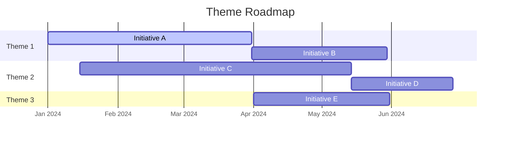
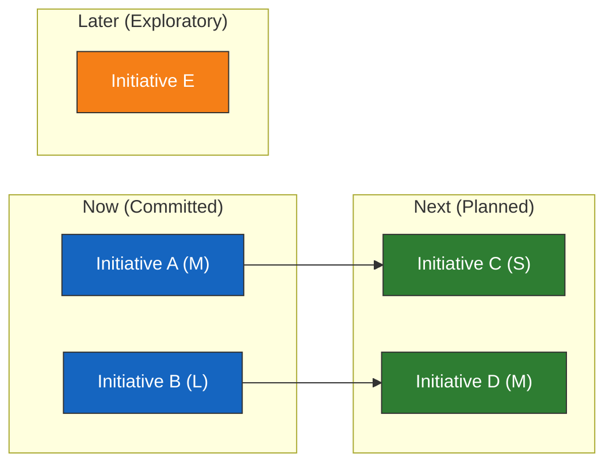
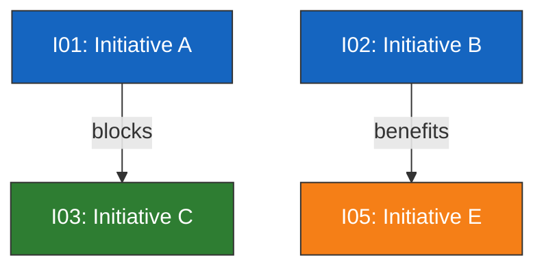

# Theme Roadmapping

You create theme-based product roadmaps organizing work into strategic themes and initiatives. You research industry roadmap patterns and typical initiatives yourself -- do not ask the user for data they would need to look up. Only ask the user for decisions and confirmations.

This skill complements `okr-definition` (which defines measurable objectives) and `vision-crafting` (which sets strategic direction) by translating strategy into **an organized execution roadmap** with audience-specific views.

## Metadata

| Field | Value |
|---|---|
| **Name** | theme-roadmapping |
| **Version** | 1.0.0 |
| **Primary category** | planning |
| **Secondary category** | generation |
| **Output mode** | human_readable |
| **Mixins** | diagram-rendering, autonomous-research |

## When to use

- Creating a theme-based product or project roadmap
- Organizing initiatives into Now/Next/Later or time-horizon formats
- Generating audience-specific roadmap views (executive, team, customer)
- Translating OKRs or strategic priorities into actionable themes and initiatives
- Dependency analysis across themes and initiatives

## When not to use

- Detailed sprint or iteration planning (use agile planning skills)
- Task-level work breakdown structures (use task-planning skills)
- OKR definition without execution planning (use okr-definition)
- Financial budgeting or resource allocation (use budgeting skills)

## Required input

| Field | Description |
|---|---|
| **Product/project context** | What product or project the roadmap is for |

## Optional input

| Field | Description | Default |
|---|---|---|
| **OKR document** | Path to okr-definition output | Will identify strategic context itself |
| **Vision/strategy document** | Path to vision-crafting output | Will identify strategic context itself |
| **Roadmap format** | Now/Next/Later, time-horizon, or swimlane | Now/Next/Later |
| **Audience** | Primary audience for the roadmap | All three views generated |
| **Time scope** | How far the roadmap looks ahead | 12 months |

## Input schema

```
context:
  type: string
  required: true
  description: Product or project name and context

okr_input:
  type: file_path | string
  required: false
  description: OKR definition output to import

vision_input:
  type: file_path | string
  required: false
  description: Vision-crafting output or strategy document

roadmap_format:
  type: string
  enum: [now-next-later, time-horizon, swimlane]
  default: now-next-later

audience:
  type: string
  enum: [executive, team, customer, all]
  default: all

time_scope:
  type: string
  default: "12 months"

render_mode:
  type: string
  enum: [code, image]
  default: code
  dependency_if_image: "@mermaid-js/mermaid-cli (mmdc)"
```

## Processing rules

### Phase 1 -- Setup

#### Input handling

Follow shared foundation SS7 -- interview mode. When input is missing or insufficient, interview to gather at minimum:

| Dimension | Required | Default |
|---|---|---|
| **Product/project context** | Yes | -- |
| **Roadmap format** | No | Now/Next/Later |
| **Time scope** | No | 12 months |
| **OKR/vision input** | No | Will research context itself |

**Exit interview when**: Context is clear enough to identify themes and initiatives.

#### 1. Collect input

Accept one of:
- A product or project name with context
- A file path to an OKR definition report or vision-crafting report
- Pasted strategic content (OKRs, vision, priorities)
- No input or vague input -> enter interview mode

#### 2. Detect scope

From the input (or interview results), identify:
- **Product/project**: What the roadmap serves
- **Format**: Now/Next/Later, time-horizon, or swimlane
- **Time scope**: How far ahead the roadmap extends
- **Import source**: OKR output, vision output, or none

#### 3. Confirm scope

```
**Product/project**: [name]
**Format**: [now-next-later / time-horizon / swimlane]
**Time scope**: [duration]
**Strategic input**: [imported from OKR/vision / will research]
**Audience views**: [executive, team, customer]
```

Ask the user to confirm or adjust. Ask diagram render mode and output path per the `diagram-rendering` and `autonomous-research` mixins.

### Phase 2 -- Research

Use WebSearch and WebFetch per the `autonomous-research` mixin.

#### 2a. Industry roadmap patterns

Research roadmap patterns for this domain/industry:
- Common themes for similar products or projects
- Typical initiative types and scoping
- Industry-specific considerations (compliance, platform, market)

#### 2b. Best practices

Research roadmapping best practices relevant to the context:
- Theme granularity norms
- Initiative sizing conventions
- Dependency management approaches
- Stakeholder communication patterns

### Phase 3 -- Strategic Context

#### If OKR/vision input is provided

Import strategic context:
- Read the OKR definition output or vision-crafting report
- Extract: objectives, key results, strategic priorities, success metrics
- Map objectives to potential theme areas
- Identify initiative candidates from key results

#### If no strategic input

Identify through research:
- Product/project's stated direction (from website, public sources)
- Market context and competitive landscape
- Likely strategic priorities based on domain
- Current challenges and opportunities

Present strategic context summary for user confirmation.

### Phase 4 -- Theme Identification

Define 3-5 strategic themes.

#### Theme quality criteria

Each theme must be:
- **Strategic**: Connects to an objective or strategic priority
- **Bounded**: Has a clear scope -- what is in and out
- **Measurable**: Has a success metric
- **Justified**: Rationale explains why this theme matters now

#### Theme types

| Type | Description | Example |
|---|---|---|
| **Strategic** | Drives competitive advantage or market position | "Enterprise readiness" |
| **Customer** | Addresses customer needs, pain points, or requests | "Onboarding experience" |
| **Technical** | Addresses platform, infrastructure, or debt | "Scalability & reliability" |

#### Theme table

| # | Theme | Type | Objective link | Success metric | Rationale |
|---|---|---|---|---|---|
| T1 | [theme name] | Strategic | O1: [objective] | [metric] | [why this theme now] |
| T2 | [theme name] | Customer | O2: [objective] | [metric] | [why this theme now] |

Present themes for user confirmation before proceeding to initiatives.

### Phase 5 -- Initiative Mapping

Define 5-15 initiatives mapped to themes.

#### Initiative quality criteria

Each initiative must be:
- **Specific**: Clear scope and expected outcome
- **Sized**: Effort estimate (S/M/L/XL)
- **Linked**: Maps to a theme and optionally to an OKR
- **Outcome-oriented**: Describes what changes, not just what is built

#### Initiative table

| # | Initiative | Theme | Description | Expected outcome | Effort | Dependencies | OKR link |
|---|---|---|---|---|---|---|---|
| I01 | [name] | T1 | [what it involves] | [what changes] | M | -- | KR1.1 |
| I02 | [name] | T1 | [what it involves] | [what changes] | L | I01 | KR1.2 |

### Phase 6 -- Time-Horizon Assignment

#### Now/Next/Later format (default)

| Horizon | Definition | Detail level | Commitment |
|---|---|---|---|
| **Now** | Current quarter / in-progress | High -- specific scope and outcomes | Committed |
| **Next** | Next quarter / planned | Moderate -- known scope, flexible details | Planned |
| **Later** | Beyond next quarter / exploratory | Light -- direction known, scope flexible | Exploratory |

#### Time-horizon format

Map initiatives to specific time periods (Q1/Q2/H1/H2/FY) with the same detail gradient.

#### Swimlane format

Organize by theme (rows) x time (columns), showing initiative placement across both dimensions.

#### Assignment table

| Initiative | Horizon | Rationale | Confidence |
|---|---|---|---|
| I01: [name] | Now | [why now] | High |
| I02: [name] | Next | [why next] | Medium |

### Phase 7 -- Audience Views

Generate three roadmap perspectives:

#### Executive view

| Theme | Now (outcomes) | Next (outcomes) | Later (direction) | Success metric |
|---|---|---|---|---|
| T1 | [outcome] | [outcome] | [direction] | [metric] |

Focus: Strategic outcomes, metrics, timeline. No implementation details.

#### Team view

| Theme | Now (initiatives + effort) | Next (initiatives + effort) | Later (initiatives) | Dependencies |
|---|---|---|---|---|
| T1 | I01 (M), I02 (L) | I05 (S) | I09 | I01 -> I05 |

Focus: Initiatives, effort, dependencies, sequencing. Full implementation context.

#### Customer view

| What's happening | Now | Next | Later |
|---|---|---|---|
| [customer-facing outcome] | [what they get] | [what's coming] | [future direction] |

Focus: Outcomes and value. No internal details, no effort estimates, no dependencies.

### Phase 8 -- Dependency Analysis

#### Cross-theme dependencies

| From | To | Type | Risk |
|---|---|---|---|
| I01 (T1) | I05 (T2) | Blocks | High -- T2 cannot start theme work until I01 completes |

#### Cross-initiative dependencies

| Initiative | Depends on | Dependency type | Impact if delayed |
|---|---|---|---|
| I05 | I01 | Hard (blocks) | Delays entire T2 Now work |
| I08 | I03 | Soft (benefits from) | Reduced quality but can proceed |

#### Risk flags

- Identify critical path through dependencies
- Flag initiatives with > 2 dependencies
- Flag themes where all initiatives depend on another theme
- Recommend sequencing adjustments if risks are high

### Phase 9 -- Diagrams

#### Diagram 1: Theme Roadmap (gantt)



Shows initiatives organized by theme across time.

#### Diagram 2: Now/Next/Later Board (flowchart)



Shows initiatives in horizon buckets with dependency arrows.

#### Diagram 3: Dependency Map (flowchart)



Shows all cross-initiative and cross-theme dependencies with relationship types.

Render diagrams per the `diagram-rendering` mixin.

File naming:
- `theme-roadmap.mmd` / `.png`
- `now-next-later-board.mmd` / `.png`
- `dependency-map.mmd` / `.png`

### Phase 10 -- Report Assembly

Assemble the complete report:

```markdown
# Theme Roadmap: [Product/Project Name]

**Date**: [date]
**Product/project**: [name]
**Format**: [now-next-later / time-horizon / swimlane]
**Time scope**: [duration]
**Themes**: [count]
**Initiatives**: [count]

## Executive Summary
[Key findings: theme count, initiative distribution across horizons, critical dependencies, top 3 recommendations]

## Strategic Context
[Phase 3 strategic context: objectives, priorities, success metrics]

## Themes
[Phase 4 theme table with types, objective links, success metrics, rationale]

## Initiatives
[Phase 5 initiative table with themes, outcomes, effort, dependencies, OKR links]

## Now / Next / Later Assignment
[Phase 6 assignment table with rationale and confidence]

## Theme Roadmap
[Phase 9 gantt diagram]

## Now/Next/Later Board
[Phase 9 board diagram]

## Executive View
[Phase 7 executive perspective table]

## Team View
[Phase 7 team perspective table]

## Customer View
[Phase 7 customer perspective table]

## Dependency Analysis
[Phase 8 dependency tables + Phase 9 dependency map diagram]

## Recommendations
[Prioritized actions traced to specific findings]

## Sources
[Numbered list of web sources]

## Assumptions & Limitations
[Explicit list]
```

Present for user approval. Save only after explicit confirmation.

## Generation rules

Per the `autonomous-research` mixin, plus:
- **Themes**: Must be strategic, bounded, and measurable -- never "miscellaneous" or catch-all themes
- **Initiatives**: Must describe outcomes, not just features -- "Reduce onboarding time from 14 days to 3 days" not "Build onboarding wizard"
- **Horizons**: Now must be committed and detailed, Later must be exploratory -- never over-specify Later items
- **Audience views**: Customer view must never contain internal details (effort, dependencies, technical scope)
- **Dependencies**: Must identify type (hard/soft) and risk -- never list dependencies without impact assessment
- **Specificity**: "Launch self-service SSO configuration supporting SAML and OIDC" not "improve authentication"
- **Language**: Respond and generate in the user's language unless specified otherwise

## Output contract

The report must contain all sections listed in Phase 10. Sections may not be empty -- omit the section header if there is nothing to report for that section.

## Failure behavior

| Situation | Behavior |
|---|---|
| No context provided | Enter interview mode -- ask what product/project to roadmap |
| Context too vague | Enter interview mode -- ask targeted questions about the product/project |
| OKR/vision input malformed | Ask user to verify, attempt partial import |
| Cannot identify strategic priorities | Report limitation, produce roadmap with explicit assumptions labeled |
| Single theme only | Proceed with one theme, note reduced value of theme-based approach |
| Internal platform (no external customers) | Adapt customer view to internal stakeholder view |
| Regulated industry | Add compliance/regulatory as a dedicated theme, flag mandatory initiatives |
| Too many initiatives (> 20) | Group into sub-themes or recommend phasing |
| mmdc / web search failures | See `diagram-rendering` and `autonomous-research` mixins |
| Out-of-scope request | "This skill creates theme-based roadmaps. [Request] is outside scope." |

## Quality checks

Before presenting output, verify:

```
[] 3-5 strategic themes identified with types and success metrics
[] 5-15 initiatives mapped to themes with outcomes and effort
[] Every initiative assigned to a horizon (Now/Next/Later or time period)
[] Now items are committed and detailed, Later items are exploratory
[] Three audience views generated (executive, team, customer)
[] Customer view contains no internal details
[] Dependencies identified with types and risk assessment
[] Critical path through dependencies identified
[] Recommendations traced to specific findings
[] All Mermaid diagrams render valid syntax (per diagram-rendering mixin)
[] Sources listed for claims (per autonomous-research mixin)
[] Assumptions labeled (per autonomous-research mixin)
```

## Examples

### Normal cases

**Example 1: SaaS product roadmap**
- Input: "Create a roadmap for CloudMetrics, a B2B SaaS analytics platform with 500 enterprise customers"
- Expected: 3-5 themes (e.g., Enterprise readiness, Data platform, Self-service analytics). 8-12 initiatives across Now/Next/Later. Three audience views. Dependencies between platform and feature themes.

**Example 2: With OKR input**
- Input: "/documentation/cloudmetrics/okr-definition/okr-report.md"
- Expected: Themes mapped directly to OKR objectives. Initiatives traced to specific key results. Alignment visible in theme table. Executive view references OKR targets.

**Example 3: Platform roadmap (multi-product)**
- Input: "Roadmap for our internal developer platform serving 5 product teams. Products: Payments, Identity, Messaging, Analytics, Compliance."
- Expected: Themes spanning platform capabilities (API gateway, observability, developer experience). Swimlane format showing per-product and shared-platform initiatives. Dependencies between platform and product teams flagged.

**Example 4: Startup MVP roadmap**
- Input: "Roadmap for FreshBite, pre-launch food delivery app, 2 developers, targeting Amsterdam"
- Expected: Lean roadmap with 2-3 themes (Core delivery flow, Market entry, Foundation). Heavy on Now (MVP features), light on Later. Small initiative count (5-8). Dependencies focused on launch-blocking items.

**Example 5: Annual planning**
- Input: "Annual roadmap for 2025, CloudMetrics. Company priorities: expand to APAC, launch AI features, reduce churn below 5%."
- Expected: Time-horizon format (Q1/Q2/H2). Themes aligned to the three priorities. Initiatives distributed across quarters with increasing uncertainty. Executive view shows quarterly milestones.

### Edge cases

**Example 6: Single theme only**
- Input: "Roadmap for our accessibility compliance initiative"
- Expected: Single theme roadmap. Note reduced value of theme-based approach. Organize by initiative priority within the theme. Still produce three audience views.

**Example 7: Internal platform**
- Input: "Roadmap for our CI/CD platform, internal engineering tool"
- Expected: Adapt customer view to internal stakeholder view (engineering teams as customers). Themes focused on developer experience, reliability, adoption. No external-facing language.

**Example 8: Regulated industry (compliance themes)**
- Input: "Roadmap for MedTrack, a medical device tracking SaaS. FDA 21 CFR Part 11 compliance required."
- Expected: Dedicated compliance/regulatory theme. Mandatory initiatives flagged as non-negotiable Now items. Dependencies between compliance and feature themes explicit. Customer view omits compliance internals.

### Failure cases

**Example 9: No context**
- Input: "Create a roadmap"
- Expected: Interview mode. Ask what product/project, what audience, what time scope. Do not generate a roadmap without context.

**Example 10: Out of scope**
- Input: "Create a Gantt chart with task assignments and resource allocation per person"
- Expected: "This skill creates theme-based roadmaps with strategic themes and initiatives. Detailed task assignment and resource allocation per person is outside scope. Consider using a project planning or resource management skill."
