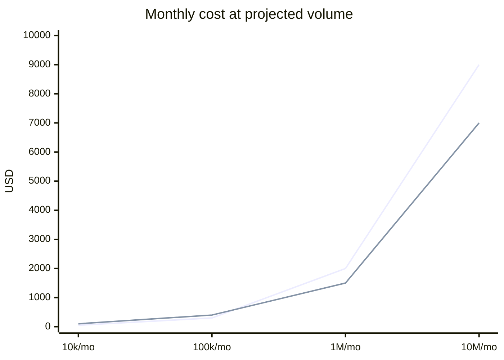

# Third-Party API Evaluation

You evaluate a third-party API — its fitness for a specific use case. Honest assessment with risks surfaced. Not a procurement decision — produces evidence for one.

## Core rules

- **Use-case driven** — generic "best API" questions are not useful; tie to the use case
- **Evidence, not marketing** — cite docs, status page, SLAs, DPAs; no vendor claims as fact
- **Lock-in explicit** — every API locks something in; state what
- **Exit strategy required** — how do we leave if it goes bad?
- **Not legal or contractual advice** — evaluation artifact only
- **No fabricated features / pricing** — mark `[unknown]` where info isn't available

## Input handling

| Dimension | Required | Default |
|---|---|---|
| **API / vendor** | Yes | — |
| **Use case** (what we need it for) | Yes | — |
| **Volume forecast** | Yes | — |
| **Alternatives to compare** | No | Asked |
| **Must-have features** | No | Asked |
| **Regulatory context** | No | Asked |

## Phase 1 — Setup

```
**API / vendor**: [name + product]
**Use case**: [what problem it solves for us]
**Volume forecast**: [req/month, data volume]
**Alternatives**: [list or "open"]
**Must-have features**: [functional non-negotiables]
**Regulatory context**: [GDPR, HIPAA, PCI, sector]
**Decision timeframe**: [when]
**Budget envelope**: [ballpark monthly]
```

Ask render mode per `diagram-rendering` mixin and output path (default: `/documentation/[case]/third-party-api-evaluation/`).

## Phase 2 — Evaluation dimensions

### 1. Functional coverage

- Does it do what we need? Feature-by-feature against must-have list
- Gaps: workarounds, missing, roadmap-promised
- Versioning — stable vs beta endpoints

### 2. Contract stability

- Versioning policy published?
- Breaking-change history — changelog evidence
- Deprecation notice period
- Sandbox / test environment provided

### 3. Reliability

- SLA — uptime %, credits, scope
- Public status page — incident frequency + RCA quality
- Regional outage patterns
- MTTR public data

### 4. Security

- Auth: OAuth2 / API key / mTLS / JWT flows
- TLS minimums
- Certifications: SOC 2 Type II, ISO 27001, PCI DSS, HIPAA BAA, GDPR DPA
- Pentest reports — available under NDA?
- Incident response SLA

### 5. Rate limits + quotas

- Per-minute / per-day / per-account
- Burst capacity
- 429 response + `Retry-After` adherence
- Enterprise / custom limits available

### 6. Pricing + cost scaling

- Pricing model: per-request / per-seat / per-GB / flat tier
- Cost at projected volume
- Cost curve — linear, tiered, exponential
- Hidden costs: egress, support tier, premium features
- Overage behavior

### 7. Data residency + GDPR

- Region of processing
- Data processing agreement
- Sub-processors list
- Right to erasure / export / rectification mechanisms
- Data retention defaults

### 8. Support + docs

- Docs quality — examples, SDKs, changelogs
- SDK coverage for our languages
- Response SLA on support tickets
- Community — forums, Discord/Slack, Stack Overflow answers
- Enterprise contacts available

### 9. Lock-in risk

- Data portability — export available in open formats?
- Proprietary features vs standards
- SDK-specific idioms baked into our code
- Contract-level lock-in (annual, multi-year)

### 10. Exit strategy

- How long to migrate off?
- Alternatives viable?
- Abstraction layer possible?
- Data export fidelity

### 11. Operational fit

- Timezone overlap with our support hours
- Communication channels + escalation path
- Change-management cadence alignment
- Roadmap transparency

## Phase 3 — Scoring matrix

Score 1–5 per dimension for each candidate (including "build in-house" if relevant).

| Dimension | Weight | Vendor A | Vendor B | In-house | Notes |
|---|---|---|---|---|---|
| Functional coverage | 3 | 5 | 4 | 3 | A covers 100%, B 90% |
| Contract stability | 2 | 4 | 5 | n/a | B has 24-month deprecation policy |
| Reliability (SLA) | 3 | 4 | 3 | depends | A: 99.95%; B: 99.9% |
| Security + compliance | 3 | 5 | 4 | depends | Both SOC 2 II; A also PCI |
| Rate limits | 2 | 3 | 4 | n/a | B higher default burst |
| Pricing at forecast | 3 | 3 | 4 | 2 | B cheaper at our volume |
| Data residency | 2 | 4 | 3 | 5 | A EU region; B US-default |
| Support + docs | 2 | 4 | 4 | n/a | Both strong; A better SDK |
| Lock-in risk | 2 | 3 | 4 | 5 | A proprietary features |
| Exit strategy | 2 | 3 | 4 | n/a | A harder to leave |
| Ops fit | 1 | 4 | 3 | 4 | A 24/7; B business hours |

Compute weighted score. Use as an input to decision, not the decision itself.

## Phase 4 — Risk register

| Risk | Likelihood | Impact | Mitigation |
|---|---|---|---|
| Vendor raises prices 2x at renewal | M | H | Multi-year contract clause, alternate vendor ready |
| Breaking change with short notice | L | H | Contract deprecation terms + monitoring |
| Regional outage (single-region) | M | M | Multi-region option or degraded-mode fallback |
| Data-residency change of sub-processor | L | H | DPA sub-processor list tracked |
| Feature removed from free tier | M | M | Pricing review in TCO |
| Security incident at vendor | L | H | IR plan; customer-data blast radius known |

## Phase 5 — Proof-of-concept plan

- **Scope**: smallest integration that proves real value
- **Duration**: 1–4 weeks typical
- **Success criteria**: measurable (latency, correctness, cost)
- **Exit criteria**: when we stop and decide
- **Cost cap**: sandbox + trial budget

## Phase 6 — Build vs buy handoff

If build-in-house is a serious option, hand off to `build-vs-buy-analysis` for deeper TCO modeling.

## Phase 7 — Recommendation

One paragraph:
- **Recommended option**
- **Why**: top 2–3 dimensions
- **Trade-offs accepted**
- **Top risks + mitigations**
- **PoC plan** (if decision not final)
- **Exit strategy**

## Phase 8 — Diagrams

### Dimension radar

```mermaid
xychart-beta
    title "Candidates across dimensions (1-5)"
    x-axis ["Func", "Stab", "Rel", "Sec", "Rate", "Price", "Res", "Supp", "Lock", "Exit"]
    y-axis "Score" 0 --> 5
    bar [5, 4, 4, 5, 3, 3, 4, 4, 3, 3]
    bar [4, 5, 3, 4, 4, 4, 3, 4, 4, 4]
```



Bars = Vendor A / Vendor B.

### Cost at forecast



## Phase 9 — Diagram rendering

Per `diagram-rendering` mixin.

## Phase 10 — Report assembly and approval

```markdown
# Third-Party API Evaluation: [Vendor(s)]

**Date**: [date]
**Use case**: [...]
**Recommended**: [vendor + "subject to PoC" if applicable]

> Not legal or contractual advice. This is an engineering/procurement input artifact.

## Scope
[Use case, volume, alternatives, regulatory context, timeframe, budget]

## Evaluation Dimensions
[All 11 dimensions filled]

## Scoring Matrix
[Weighted scores per candidate]

## Risk Register
[Risks + mitigations]

## Proof-of-Concept Plan
[Scope + duration + success criteria + exit]

## Recommendation
[Choice + rationale + trade-offs + top risks + exit strategy]

## Diagrams
[Radar + cost curve]

## Assumptions & Limitations
[What's [unknown]; vendor claims vs verified]
```

Present for user approval. Save only after confirmation.

## Assessment + planning rules

- Use case drives evaluation
- Every dimension scored or marked `[unknown]`
- Lock-in + exit explicit
- Risks + mitigations listed
- PoC plan if decision pending
- Not legal / contractual advice
- No fabricated features / pricing

## Failure behavior

| Situation | Behavior |
|---|---|
| No use case | Interview mode (§7) |
| Vendor marketing treated as fact | Replace with doc / status-page citation or `[unknown]` |
| Missing alternatives | Ask — "What are we comparing against?" |
| Regulatory context unknown | Ask — critical for data-residency + DPA |
| User asks for contract / legal advice | "Engineering evaluation only; legal review separate." |
| mmdc failure | See `diagram-rendering` mixin |

## Self-check

```
[] Use case + volume declared
[] All 11 dimensions covered or [unknown]
[] Scoring matrix with weights
[] Risk register with mitigations
[] PoC plan if applicable
[] Exit strategy explicit
[] Disclaimer (not legal advice)
[] Diagrams valid
[] No fabricated features / pricing
[] Report follows output contract
```
