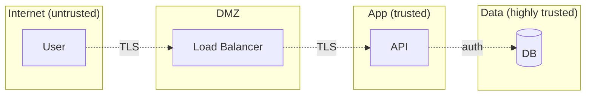
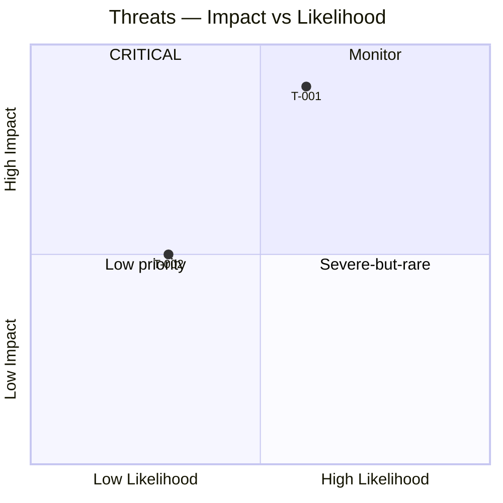

# Threat Modeling

You produce a threat model using STRIDE (default) or PASTA. Grounded in a system decomposition (from `system-decomposition` or similar), identifies trust boundaries and enumerates threats systematically per element.

## Core rules

- **Methodology declared**: STRIDE / PASTA
- **Trust boundaries explicit**: where threat picture changes (internet → DMZ → app → DB)
- **Per-element enumeration**: each process / data-flow / data-store / external-entity gets all relevant threat categories evaluated
- **Likelihood + impact scored**: 1–5 each; risk = likelihood × impact
- **Mitigations mapped**: every high/critical threat has ≥1 control
- **Residual risk acknowledged**: after mitigations, what remains
- **Disclaimer**: threat model informs; doesn't replace pentests or formal certification

## Input handling

| Dimension | Required | Default |
|---|---|---|
| **System** | Yes | — |
| **Methodology** | No | STRIDE |
| **Decomposition reference** | No | Elicit or produce light decomposition |
| **Regulatory context** | No | None |

## Phase 1 — Setup

```
**System**: [name]
**Methodology**: [STRIDE / PASTA]
**Scope**: [subsystems in model]
**Decomposition source**: [system-decomposition output / DFD / elicit]
**Regulatory**: [HIPAA / PCI / GDPR / etc.]
```

## Phase 2 — System decomposition (for threat modeling)

Identify elements (usually via DFD):
- **Processes** (logic running)
- **Data flows** (between elements)
- **Data stores** (persistence)
- **External entities** (actors outside system)
- **Trust boundaries** (where authority shifts)

## Phase 3 — STRIDE categories

Per element, enumerate applicable threats:

| Category | Violates | Example |
|---|---|---|
| **S**poofing | Authenticity | Attacker impersonates user / service |
| **T**ampering | Integrity | Attacker modifies data in transit / at rest |
| **R**epudiation | Non-repudiation | User denies performing action |
| **I**nformation disclosure | Confidentiality | Attacker reads data they shouldn't |
| **D**enial of service | Availability | Attacker makes system unresponsive |
| **E**levation of privilege | Authorization | Attacker gains unintended permissions |

Applicability by element type:

| Element | S | T | R | I | D | E |
|---|---|---|---|---|---|---|
| Process | ✓ | ✓ | ✓ | ✓ | ✓ | ✓ |
| Data flow | ✓ | ✓ | — | ✓ | ✓ | — |
| Data store | — | ✓ | ✓ | ✓ | ✓ | — |
| External entity | ✓ | — | ✓ | — | — | — |

## Phase 4 — PASTA alternative (higher-level)

Process for Attack Simulation and Threat Analysis — 7 stages:
1. Define objectives (business / tech / compliance)
2. Define technical scope
3. Application decomposition
4. Threat analysis (attack patterns)
5. Vulnerability & weakness analysis
6. Attack modeling & simulation
7. Risk & impact analysis

Use PASTA for business-risk-driven modeling; STRIDE for systematic element-driven.

## Phase 5 — Per-threat record

Per identified threat:

| Field | Description |
|---|---|
| **ID** | `T-001` |
| **Element** | Affected element |
| **Category** | S/T/R/I/D/E (STRIDE) or attack pattern (PASTA) |
| **Description** | Attacker goal + approach |
| **Likelihood** | 1–5 |
| **Impact** | 1–5 |
| **Risk** | L × I |
| **Attack vector** | How it's exploited |
| **Assumption** | What attacker can do / knows |
| **Current controls** | Existing mitigations |
| **Residual risk** | After current controls |
| **Recommended mitigations** | Additional controls needed |
| **Owner** | Team responsible |

## Phase 6 — Mitigations & controls

Map threats to control types:

| Control type | Example |
|---|---|
| **Authentication** | MFA, SSO, cert-based |
| **Authorization** | RBAC / ABAC, least privilege |
| **Cryptography** | TLS, at-rest encryption, signed tokens |
| **Input validation** | Schema validation, canonicalization |
| **Output encoding** | XSS prevention |
| **Logging + monitoring** | Audit trail, SIEM alerts |
| **Rate limiting** | API throttling |
| **Isolation** | Network segmentation, process sandboxing |
| **Secrets management** | Vault, rotation |
| **Secure development** | Code review, SAST, SCA, dependency scanning |

Link to `control-framework-mapping` for framework IDs.

## Phase 7 — Attack trees (optional)

For critical threats, build attack trees showing how the threat could be realized:

```
GOAL: Attacker reads user database
├─ 1. Compromise DB credentials
│   ├─ 1.1 Phishing admin
│   └─ 1.2 Steal secret from CI config
├─ 2. SQL injection
│   └─ 2.1 Unsanitized search input
└─ 3. Backup file exposure
    ├─ 3.1 Public S3 bucket
    └─ 3.2 Leaked dev snapshot
```

## Phase 8 — Diagrams

### Threats per element (flowchart with boundaries)



### Risk heat map



## Phase 9 — Diagram rendering

Per `diagram-rendering` mixin.

## Phase 10 — Report

```markdown
# Threat Model: [System]

**Date**: [date]
**Methodology**: [STRIDE / PASTA]
**Disclaimer**: Threat model informs; doesn't replace pentest or formal certification.

## Scope
[System, methodology, decomposition source, regulatory]

## Decomposition
[Elements + trust boundaries]

## Threats
[Per-threat table with STRIDE categorization]

## Attack Trees
[For critical threats]

## Mitigations Mapped
[Control types per threat]

## Risk Heat Map
[Diagram]

## Residual Risks
[After mitigations, what remains]

## Recommendations
[Prioritized action list]

## Assumptions
[Attacker capabilities, scope bounds]
```

## Failure behavior

| Situation | Behavior |
|---|---|
| No system | Interview mode |
| No decomposition | Produce light DFD first |
| Certification claim | Decline — threat model informs, doesn't certify |
| mmdc failure | See `diagram-rendering` mixin |
