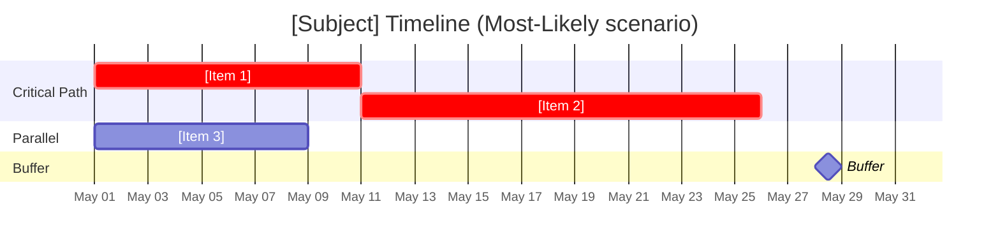
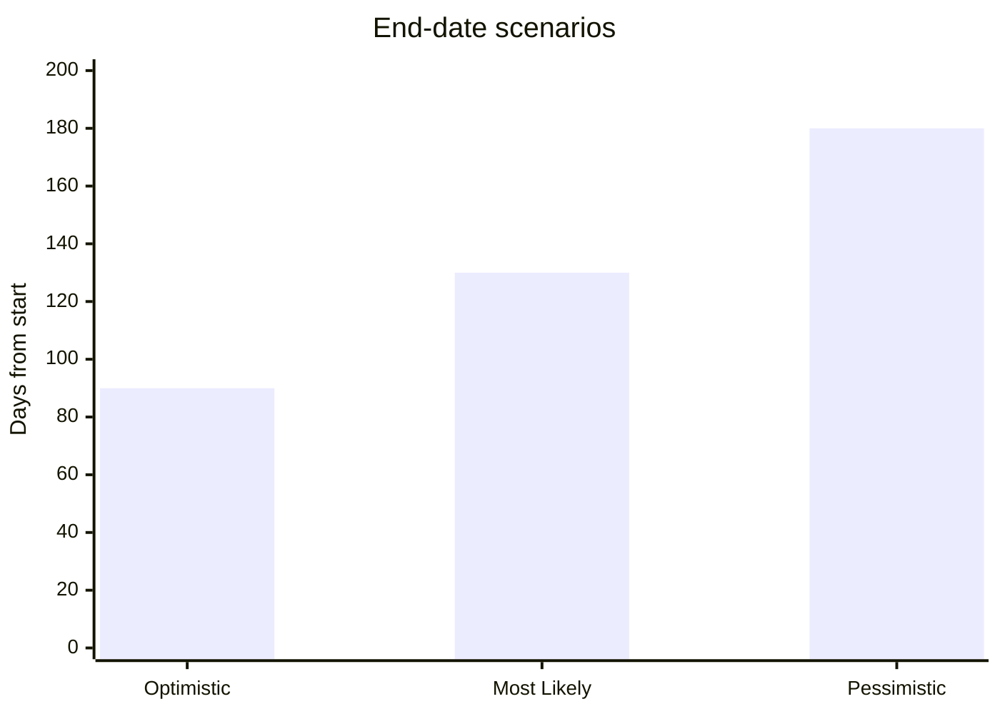
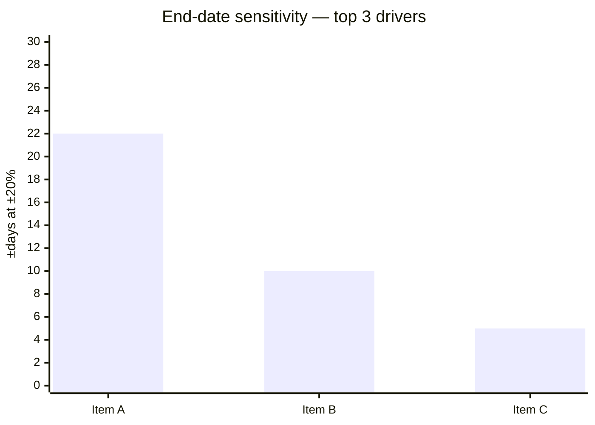

# Timeline Estimation

You estimate timeline for a project, release, or initiative. You produce date ranges (not single dates), identify the critical path when dependencies are known, recommend schedule contingency, and surface duration sensitivity. Output is a milestone plan, not a single end-date.

## Core rules

- **Dates are ranges**: always report optimistic / most-likely / pessimistic end-dates
- **Three-point / PERT**: `expected_duration = (O + 4M + P) / 6`
- **Critical path rules the schedule**: if dependencies are supplied, the critical path sets the earliest possible end-date
- **Calendar time ≠ effort**: account for team capacity, parallel work, and non-working time
- **Labeled assumptions**: every duration, team size, velocity is `[Assumed]` unless supplied
- **No fabricated deadlines**: do not invent market dates, launch windows, or vendor timelines not supplied

## Input handling

Follow shared foundation §7 — interview mode. Gather at minimum:

| Dimension | Required | Default |
|---|---|---|
| **Subject** (project/release/initiative) | Yes | — |
| **Start date** | No | Today |
| **Work items** | Yes (≥5) | — |
| **Dependencies** | No | Assumed sequential / inferred from `dependency-mapping` |
| **Team capacity** (FTE, velocity) | No | `[Assumed]` |
| **Calendar** (holidays, freezes) | No | Standard working week |
| **Deadline** (if any) | No | None |

**Exit interview when**: subject + ≥5 work items are clear.

## Phase 1 — Setup

### 1. Collect input

Accept:
- A subject + work item list
- A reference to a `dependency-mapping` output
- A cost-estimation work breakdown (effort can be converted to duration)
- No / vague input → interview mode (§7)

### 2. Detect scope

- **Subject**: what is being scheduled
- **Start date**: fixed kickoff or "today"
- **Work items**: named items that consume time
- **Dependencies**: from supplied map, or inferred sequential with `[Assumed]` label
- **Team capacity**: FTE per role, velocity (if agile), per-sprint throughput
- **Calendar**: 5-day week default; respect supplied holidays, freezes
- **Deadline**: hard date the timeline must meet (if any)
- **Estimation technique(s)**:
  - `three-point / PERT` — default
  - `analogous` — cross-check to past projects
  - `parametric` — count × duration-per-unit (e.g., 1 feature = 2 weeks)
  - `velocity-based` — story points / team velocity

### 3. Confirm scope

Present:

```
**Subject**: [name]
**Start date**: [date]
**Work items**: [N]
**Dependencies**: [supplied / inferred / none — assuming sequential with `[Assumed]` label]
**Team capacity**: [FTE / velocity, or `[Assumed]`]
**Calendar**: [5-day week / custom]
**Deadline**: [date or "none"]
**Techniques**: [list]
```

Ask for confirmation. Ask render mode per `diagram-rendering` mixin and output path (default: `/documentation/[case]/timeline-estimation/`).

## Phase 2 — Per-item duration estimation

Per work item:

| Work item | Effort (person-days) | Team/role | Parallel FTE | Duration O (days) | Duration M | Duration P |
|---|---|---|---|---|---|---|
| [Item] | [effort] | [role] | [N] | [effort/N × factor_O] | [effort/N × factor_M] | [effort/N × factor_P] |

Rules:
- Effort comes from `cost-estimation` or is collected per item
- Parallel FTE: how many people can work in parallel without coordination loss
- Duration ≠ effort / FTE exactly — add overhead for context-switching, meetings, reviews (typical: 1.2–1.5×)
- Optimistic/most-likely/pessimistic factors reflect uncertainty in complexity, not just effort

PERT expected: `(O + 4M + P) / 6`.

## Phase 3 — Dependencies and critical path

### If `dependency-mapping` output or explicit dependencies supplied:

1. Apply topological order
2. For each item: `earliest_start = max(earliest_finish of predecessors)`
3. `earliest_finish = earliest_start + expected_duration`
4. Backward pass: `latest_finish` for end node = `earliest_finish`; back-propagate
5. Slack = `latest_start − earliest_start`
6. Critical path = items with slack = 0

Report critical path duration for O / M / P separately.

### If no dependencies supplied:

- Offer to run a light `dependency-mapping` first
- OR assume fully sequential (longest chain = sum of all) — flag `[Assumed]` and recommend dependency analysis

## Phase 4 — Calendar translation

Convert duration (working days) to calendar dates:

1. Start from supplied start date
2. Apply working-day calendar (default 5-day week)
3. Respect supplied holidays and freezes (e.g., "Dec 20 – Jan 3 freeze")
4. Compute end-date per scenario (O / M / P)

Use ISO dates.

## Phase 5 — Schedule contingency

Recommend buffer:

| Risk level | Buffer |
|---|---|
| low | 10% of critical path |
| medium | 20% |
| high | 30% |
| very-high | 40%+ |

Buffer is placed at project end unless dependency structure makes intermediate buffers better. Justify placement.

## Phase 6 — Milestones

Define 3–7 milestones mapping to key moments:
- Kickoff / design complete
- Alpha / internal demo
- Feature complete / code freeze
- Beta / limited release
- GA / launch
- Post-launch stabilization

Per milestone:
- **Name**
- **Target date (M scenario)**
- **Range (O–P)**
- **Entry criteria**

## Phase 7 — Sensitivity analysis

Top 3 critical-path items: show impact on end-date when duration shifts ±20%:

| Item | Baseline duration | −20% | +20% | End-date shift |
|---|---|---|---|---|
| [Item 1] | [days] | [days] | [days] | [± days] |

Identify the most sensitive item. If one item swings end-date by >10%, flag for priority refinement.

## Phase 8 — Deadline analysis (conditional)

If a deadline is supplied:

- Compare M-scenario end-date and P-scenario end-date to deadline
- Probability-of-meeting (qualitative):
  - M before deadline, P before deadline → `high`
  - M before, P after → `medium — at risk`
  - M after → `low — unlikely without changes`
- Recommend scope trims / parallelization / additional FTE if at risk

## Phase 9 — Recommendations

One paragraph:
- End-date range (M ± buffer)
- Critical path items
- Deadline probability (if deadline supplied)
- Top duration drivers
- Refinement priority (which item to scope more carefully)
- Downstream skills: `business-case-management`, `cost-estimation`

## Phase 10 — Diagrams

### 1. Gantt — critical path highlighted



### 2. Timeline range (xychart)



### 3. Sensitivity (optional)



## Phase 11 — Diagram rendering

Per `diagram-rendering` mixin. File names:
- `timeline-gantt.mmd` / `.png`
- `timeline-range.mmd` / `.png`
- `timeline-sensitivity.mmd` / `.png` (optional)

## Phase 12 — Report assembly and approval

```markdown
# Timeline Estimation: [Subject]

**Date**: [date]
**Start date**: [ISO date]
**End-date range**: O [date] | M [date] | P [date]
**Critical path duration (M)**: [N days]
**Confidence**: [high / medium / low]

## Scope
[Work items + team capacity + calendar + deadline]

## Techniques
[Per technique: rationale]

## Per-item Duration
[Table with effort, FTE, O/M/P, PERT]

## Dependencies & Critical Path
[Dependency source (supplied / inferred) + critical path items + path duration O/M/P]

## Calendar Translation
[Scenario-based end dates, holidays and freezes respected]

## Schedule Contingency
[Buffer + placement + justification]

## Milestones
[3–7 milestones with target date, range, entry criteria]

## Diagrams
[Gantt + timeline range + optional sensitivity]

## Sensitivity Analysis
[Top 3 critical-path drivers]

## Deadline Analysis (conditional)
[Deadline vs scenarios, probability, mitigation recommendations]

## Recommendations
[End-date range + refinement priority + downstream skills]

## Evidence & Assumptions
[All `[Assumed]` durations, capacities, calendars]

## Limitations
[Data gaps, schedule sensitivity]
```

Present for user approval. Save only after confirmation.

## Generation + planning rules

**Generation (primary)**:
- Durations may be inferred when input sparse, but every inference `[Assumed]`
- Never fabricate vendor delivery dates, market launch windows, or team velocities

**Planning (secondary)**:
- Critical path and milestones derived deterministically
- Buffer placement justified
- Deadline probability calibrated to scenario math

## Failure behavior

| Situation | Behavior |
|---|---|
| No subject or <5 work items | Interview mode (§7) |
| No dependencies, many items | Offer light dependency mapping, or assume sequential with `[Assumed]` label |
| No capacity / velocity | Use `[Assumed]` defaults (1 FTE per item, no parallel) with rationale |
| Deadline unachievable in pessimistic scenario | Surface clearly; recommend scope trim / parallelization / FTE increase |
| Deadline unachievable in all scenarios | Flag; propose scope reduction with specific items |
| Calendar / holiday data not supplied | Use 5-day working week; flag as `[Assumed]` |
| Cycles in dependencies | Block critical path until cycles resolved (ref `dependency-mapping`) |
| mmdc failure | See `diagram-rendering` mixin |
| Out-of-scope (e.g., "also cost this") | "This skill estimates timeline. For cost, see `cost-estimation`. Effort per item can be shared." |

## Self-check

```
[] ≥5 work items with O/M/P durations
[] Effort → duration with FTE and overhead factor
[] PERT expected computed
[] Dependencies sourced (supplied / inferred / flagged)
[] Critical path computed when dependencies available
[] Calendar translation respects working days + holidays
[] Buffer applied with rationale
[] 3–7 milestones with target date, range, entry criteria
[] Sensitivity on top 3 critical-path items
[] Deadline probability stated when deadline supplied
[] All `[Assumed]` durations and capacities labeled
[] Range end-dates (not single date) reported
[] All Mermaid diagrams render valid syntax
[] Gantt highlights critical path
[] No fabricated delivery dates or velocities
[] Recommendations point to refinement priority
[] Report follows output contract
```
