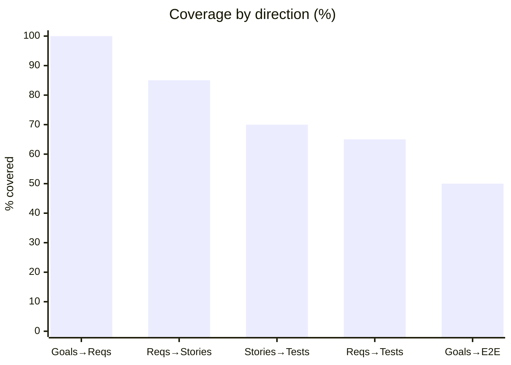
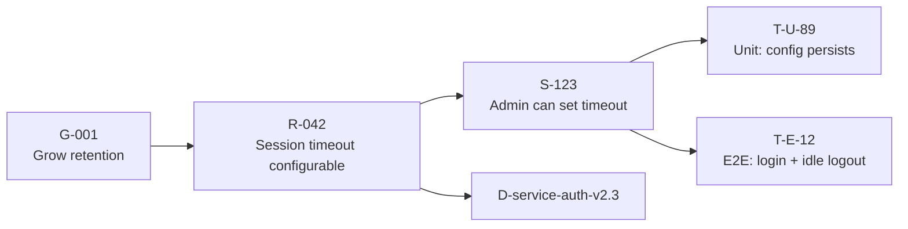

# Traceability Matrix

You build a requirements traceability matrix (RTM) that links artifacts across the delivery chain. A good RTM answers: "If requirement X changes, what else changes?" and "Does every goal have a test?"

## Core rules

- **Stable IDs**: once assigned, never reused — closed / removed items retain their ID
- **Bidirectional**: forward trace (goal → test) and backward trace (test → goal) both supported
- **Links typed**: `implements` / `verifies` / `validates` / `satisfies` / `derives-from` — not just "related"
- **Orphans surfaced**: items with no forward OR no backward link are flagged
- **Evidence preserved**: link rationale kept for audit

## Input handling

| Dimension | Required | Default |
|---|---|---|
| **Subject** (program / product / release) | Yes | — |
| **Artifact types in scope** | Yes | goals, requirements, stories, tests (default); add ADRs, risks, deployed artifacts if relevant |
| **Artifact inventory or sources** | Yes | Supplied or pointer (Jira / GitHub / test mgmt / ADR docs) |
| **Regulatory context** | No | None |

## Phase 1 — Setup

```
**Subject**: [program / product / release]
**Artifact types**: [goals / requirements / stories / tests / ...]
**Sources**: [Jira project / docs folder / test-mgmt tool]
**Regulatory context**: [ISO 13485 / IEC 62304 / FDA / SOC 2 / none]
```

Ask render mode per `diagram-rendering` mixin and output path (default: `/documentation/[case]/traceability-matrix/`).

## Phase 2 — Artifact inventory

Per artifact type, produce table with stable IDs:

| Type | ID prefix | Example |
|---|---|---|
| Goal / Objective | `G-` | `G-001` Grow retention |
| Requirement | `R-` | `R-042` Session timeout configurable |
| Story | `S-` | `S-123` Enable admin to set session timeout |
| Test (unit / integration / E2E) | `T-` | `T-U-89` / `T-E-12` |
| ADR | `ADR-` | `ADR-017` JWT session strategy |
| Risk | `RR-` | `RR-008` Session hijacking |
| Deployed artifact | `D-` | `D-service-auth-v2.3` |

IDs stable; never renumbered on removal.

## Phase 3 — Link types

| Link | From → To | Example |
|---|---|---|
| `derives-from` | Requirement → Goal | R-042 derives from G-001 |
| `implements` | Story → Requirement | S-123 implements R-042 |
| `verifies` | Test → Story or Requirement | T-U-89 verifies S-123 |
| `validates` | Test → Goal | T-E-12 validates G-001 (end-to-end validation) |
| `satisfies` | Deployed → Requirement | D-service-auth-v2.3 satisfies R-042 |
| `mitigates` | Requirement → Risk | R-042 mitigates RR-008 |
| `decided-by` | Requirement → ADR | R-042 decided-by ADR-017 |

Per link: **from ID**, **to ID**, **type**, **rationale** (1 sentence), **confidence** (high / medium / low), **source** (who asserted the link).

## Phase 4 — Matrix views

### Forward trace view

| Goal | Requirements | Stories | Tests | Deployed |
|---|---|---|---|---|
| G-001 | R-042, R-043 | S-123, S-124 | T-U-89, T-E-12 | D-service-auth-v2.3 |

### Backward trace view

| Test | Story | Requirement | Goal |
|---|---|---|---|
| T-U-89 | S-123 | R-042 | G-001 |

### Compact matrix

Optional: single table with columns per artifact type.

## Phase 5 — Coverage computation

Per direction:

| Direction | Coverage |
|---|---|
| Goals → Requirements | % goals with ≥ 1 requirement |
| Requirements → Stories | % requirements with ≥ 1 implementing story |
| Stories → Tests | % stories with ≥ 1 verifying test |
| Requirements → Tests | % requirements with ≥ 1 verifying test |
| Goals → E2E validation | % goals with ≥ 1 end-to-end validating test |

Identify:
- **Orphan goals** — no requirements
- **Orphan requirements** — no implementing story
- **Orphan stories** — no verifying test
- **Unvalidated goals** — no end-to-end test
- **Homeless tests** — test without traced requirement (maintenance or exploratory)

## Phase 6 — Change impact helpers

For any artifact, produce "if this changes, what else?" view:
- **Upstream impact** — what depends on this (children)
- **Downstream dependency** — what this depends on (parents)
- **Change risk** — high if many downstream artifacts, many tests, or regulatory scope

This feeds `impact-analysis` (deeper analysis lives there).

## Phase 7 — Regulatory overlay (if applicable)

If regulatory context supplied (ISO 13485, IEC 62304, FDA, aerospace, automotive):

- **Required traces per regulation** — e.g., IEC 62304 requires software requirement → software unit → test trace
- **Orphan severity** — orphans in regulated contexts are audit findings
- **Evidence retention** — regulatory records stored per retention policy
- **Baseline linkage** — current matrix points to a baseline (`baseline-management` skill)

## Phase 8 — Views and exports

- **Markdown** — full report with forward + backward + coverage + orphans
- **CSV** — one row per link for import into tools
- **Graph view** — Mermaid of the chain for a subset (e.g., per-goal subgraph)

## Phase 9 — Diagrams

### 1. Coverage summary



### 2. Sample trace chain



### 3. Orphan view (optional)

Flowchart / list showing orphans by type.

## Phase 10 — Diagram rendering

Per `diagram-rendering` mixin. File names:
- `coverage-summary.mmd` / `.png`
- `sample-trace-chain.mmd` / `.png`
- `orphans-view.mmd` / `.png` (optional)

## Phase 11 — Report assembly and approval

```markdown
# Traceability Matrix: [Subject]

**Date**: [date]
**Subject**: [program / product / release]
**Artifact types**: [list]
**Regulatory context**: [list or "none"]

## Scope
[Subject, types, sources, regulatory]

## Artifact Inventory
[Per type: ID prefix, count]

## Links
[Table per link: from, to, type, rationale, confidence, source]

## Forward Trace
[Goal → Req → Story → Test → Deployed]

## Backward Trace
[Test → Story → Req → Goal]

## Coverage
[Per-direction % with orphan lists]

## Change Impact Helpers
[Per artifact: upstream + downstream + risk]

## Regulatory Overlay
[If applicable — required traces + orphan-severity + evidence retention]

## Diagrams
[Coverage + sample chain + optional orphans]

## Exports
[Markdown (this report) + CSV]

## Assumptions & Limitations
[Source-tool gaps, confidence variance, retention policy]
```

Present for user approval. Save only after confirmation. Also offer CSV export.

## Extraction + planning rules

- Stable IDs across sessions
- Link types from controlled vocabulary
- Source attribution per link
- Confidence labels
- Orphans never hidden

## Failure behavior

| Situation | Behavior |
|---|---|
| No subject or sources | Interview mode (§7) |
| Existing IDs unclear | Propose ID scheme; confirm with user |
| Partial data | Process what's available; flag missing types as gap |
| Regulated context, high orphan rate | Surface as audit finding, not report footnote |
| Tool-specific link formats | Normalize to controlled link types; preserve original |
| mmdc failure | See `diagram-rendering` mixin |
| Out-of-scope (impact analysis depth) | Pointer to `impact-analysis` |

## Self-check

```
[] Stable IDs per artifact type (prefix visible)
[] Links typed from controlled vocabulary
[] Forward + backward views present
[] Coverage computed per direction
[] Orphans explicitly surfaced
[] Change-impact helper per artifact
[] Regulatory overlay if applicable
[] Source attribution per link
[] Confidence labels
[] Markdown + CSV exports available
[] Diagrams valid
[] No fabricated links
[] Report follows output contract
```
