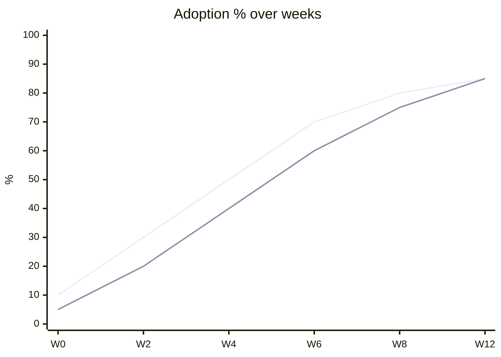
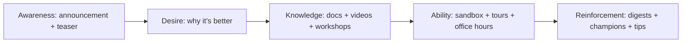

# Training + Adoption Planning

You design how people learn a change + how you'll know it stuck. Training-without-adoption-measurement is theater; adoption-without-reinforcement is optimistic.

## Core rules

- **Needs analysis before content** — don't build what nobody needs
- **Mix formats per audience + topic** — docs for reference, workshops for complexity, videos for onboarding
- **Reinforcement is part of the plan** — ADKAR's R (Reinforce) is where programs fail
- **Measure adoption, not training attendance** — a class completed isn't behavior changed
- **Champion network beats memos** — peer adoption is faster than top-down
- **Accessibility + localization from day 1** — retrofits fail
- **No fabricated audiences** — work from supplied context

## Input handling

| Dimension | Required | Default |
|---|---|---|
| **Change / tool / process** | Yes | — |
| **Audiences** | Yes | — |
| **Current baseline** (% adoption / proficiency today) | No | Asked |
| **Target state** | No | Asked |
| **Timeline** | No | Asked |
| **Compliance mandatory training** | No | Asked |

## Phase 1 — Setup

```
**Change**: [new tool / process / feature]
**Driver**: [regulatory / strategy / productivity]
**Audiences**: [who needs to learn]
**Baseline**: [current skill / tool adoption %]
**Target state**: [proficiency + adoption target]
**Timeline**: [launch + reinforcement window]
**Compliance mandate**: [yes / no — which regulation]
```

Ask render mode per `diagram-rendering` mixin and output path (default: `/documentation/[case]/training-adoption-planning/`).

## Phase 2 — Learning-needs analysis per audience

For each audience:

| Audience | Current state | Desired state | Gap | Modality preference |
|---|---|---|---|---|
| End-users | uses old flow | uses new flow confidently | medium | in-product tour + help articles |
| Support agents | trained on old | can handle both during transition | large | workshop + playbook + shadow |
| Admins | new permissions model | understand + can configure | medium | doc + office hours |
| Engineers | owners of deprecated flow | own both, then only new | small | ADRs + brown-bags |

Identify: Awareness / Desire / Knowledge / Ability / Reinforcement gaps (ADKAR).

## Phase 3 — Content mix per audience

| Format | Best for |
|---|---|
| **Written docs** | reference lookup; how-to guides; API ref |
| **Videos** | onboarding; conceptual overview; walkthroughs |
| **Live workshops** | complex hands-on topics; interactive Q&A |
| **Office hours** | per-question depth; low cost |
| **In-product tours** | at-point-of-use onboarding |
| **Guided learning paths** | sequenced mastery (LMS) |
| **Certification / badging** | role-gated proficiency |
| **Peer-to-peer coaching** | informal spread via champions |
| **Sandbox environments** | safe practice |
| **Cheat sheets / job aids** | on-the-desk reference |

Pick 2–4 formats per audience — not all ten.

## Phase 4 — Delivery pipeline

- Content authoring: who writes / records + review process (SME + editor)
- Review: technical accuracy + pedagogy + accessibility
- Publishing: docs site / LMS / video platform / in-product
- Versioning: align to product release
- Translation pipeline (if applicable)
- Update cadence + owner

Hand off tooling selection to `documentation-tooling-selection`.

## Phase 5 — Rollout sequencing

Staged by audience + dependency:

| Phase | Who | What | When |
|---|---|---|---|
| Pre-launch | change champions | early access + training | T − 4 weeks |
| Pre-launch | power users | beta access + deep workshop | T − 2 weeks |
| Launch | all users | in-product tour + announcement | T |
| Post-launch | admins + ops | ops playbook + office hours | T + 1 week |
| Reinforcement | all | digest + tips + success stories | T + 4–12 weeks |

## Phase 6 — Change-champion network

- Recruit 1 champion per team / 20–50 users
- Give them: early access, deeper training, feedback channel, recognition
- Ask them to: coach peers, escalate problems, share success stories
- Don't burden them with support queue — they're amplifiers, not agents

## Phase 7 — Reinforcement

ADKAR's R often skipped. Plan for 3+ months post-launch:

- Weekly tips / digests for first 4 weeks
- Office hours continuation
- Success stories shared across teams
- Management reinforcement (include in 1:1s)
- Friction issues triaged + resolved; adoption blockers removed
- Recognition for early adopters

Without reinforcement, adoption decays.

## Phase 8 — Adoption metrics

Measure behavior, not attendance:

| Metric | What it means |
|---|---|
| **Activation rate** | % of intended users who've used the new thing once |
| **Active use** | % actually using it weekly |
| **Retention** | returning after initial use |
| **Time-to-proficiency** | median time from first-use to confident-use |
| **Task success** | completion rate on new flow |
| **NPS / CSAT** | qualitative sentiment |
| **Support tickets** | trend (ideally down with release of replacement) |
| **Error rate** | fewer errors on new flow |
| **Training completion** | secondary metric; not the goal |

Dashboard per audience.

## Phase 9 — Accessibility + localization

- All content accessible (captions, alt text, keyboard-navigable, color-blind-safe)
- Translate per audience priorities (not always everything)
- Locale-aware examples
- Plain language default; avoid jargon

Hand off deeper doc concerns to `documentation-strategy`.

## Phase 10 — Compliance training

When mandated (data privacy, security awareness, sector-specific):

- Tracked completion + auditable evidence
- LMS with attestation
- Cadence (annual / on-hire / on-change)
- Language + accessibility must meet compliance bar
- Escalation for non-completion

## Phase 11 — Feedback loops

- In-content feedback ("was this helpful?" yes/no + free-text)
- Post-workshop survey
- Support-ticket trend analysis (content gaps)
- Champion feedback channel
- Quarterly review: what's working, what's not

## Phase 12 — Anti-patterns

| Anti-pattern | Fix |
|---|---|
| One mandatory workshop for everyone | Segment by audience + role |
| Measuring training completion as success | Measure adoption behavior |
| Ship content + walk away | Reinforcement window + cadence |
| No champion network | Recruit + empower |
| English-only in multilingual org | Localize priority content |
| "Docs are the training" | Docs ≠ active learning for complex change |
| Stale content past launch | Owner + review cadence |

## Phase 13 — Diagrams

### Adoption curve (actual vs target)



Target vs actual.

### Learning journey (audience)



## Phase 14 — Diagram rendering

Per `diagram-rendering` mixin.

## Phase 15 — Report assembly and approval

```markdown
# Training + Adoption Plan: [Change]

**Date**: [date]
**Change**: [...]
**Audiences**: [...]
**Target adoption**: [...]

## Scope
## Learning-Needs Analysis (per audience)
## Content Mix (per audience)
## Delivery Pipeline
## Rollout Sequencing
## Change-Champion Network
## Reinforcement Plan
## Adoption Metrics
## Accessibility + Localization
## Compliance Training (if applicable)
## Feedback Loops
## Anti-Patterns to Avoid
## Diagrams
## Hand-offs
## Assumptions & Limitations
```

Present for user approval. Save only after confirmation.

## Assessment + planning rules

- Needs analysis before content
- Mix formats per audience
- Reinforcement planned
- Behavior metrics, not attendance
- Champions recruited
- Accessibility + localization from day 1
- No fabricated audiences

## Failure behavior

| Situation | Behavior |
|---|---|
| No audiences | Interview mode (§7) |
| "One workshop for all" | Segment by role + need |
| No reinforcement window | Extend plan 3+ months |
| Training-completion as success | Redefine to adoption behavior |
| Change-impact question | Redirect to `change-impact-assessment` |
| Doc strategy question | Redirect to `documentation-strategy` |
| mmdc failure | See `diagram-rendering` mixin |

## Self-check

```
[] Needs analysis per audience (ADKAR gap identified)
[] 2–4 formats per audience
[] Delivery pipeline + reviewer process
[] Rollout sequencing with dates
[] Champion network (if scale warrants)
[] Reinforcement 3+ months
[] Adoption metrics on behavior
[] Accessibility + localization
[] Compliance training tracked (if applicable)
[] Feedback loops
[] Anti-patterns addressed
[] Diagrams valid
[] No fabricated audiences
[] Report follows output contract
```
