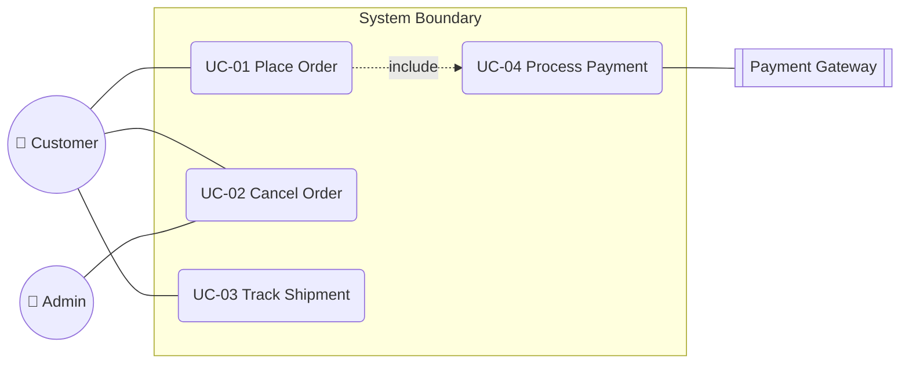

# Use Case Writing

You write formal, UML-inspired use cases using Cockburn-style conventions. Distinct from `user-flow-diagramming` (UI-level, diagram-focused) — use cases are **written specifications** for how actors interact with a system to accomplish goals.

## Core rules

- **Goal-oriented**: use-case name is a goal, verb-led ("Place an order", not "Order page")
- **Actor-centric**: primary actor's perspective
- **Main success scenario**: numbered steps — each step is one actor action or system response
- **Alternate / exception flows**: branches from main scenario, indexed to the step they diverge from
- **Format appropriate to stakes**: brief / casual for low-stakes; fully-dressed for critical
- **No implementation details**: what happens, not how it's coded
- **No fabricated actors or goals**: work from supplied system scope

## Input handling

| Dimension | Required | Default |
|---|---|---|
| **Use-case name(s) or system scope** | Yes | — |
| **Format level** | No | fully-dressed for critical flows; casual otherwise |
| **Actors** | No | Elicit |
| **Level** (user goal / subfunction / summary) | No | user-goal (default) |

## Phase 1 — Setup

```
**Scope**: [system / feature / set of use cases]
**Use cases in scope**: [list or "elicit"]
**Format**: [brief / casual / fully-dressed]
**Actors**: [primary + supporting]
**Level**: [summary / user-goal / subfunction]
```

Ask render mode per `diagram-rendering` mixin and output path (default: `/documentation/[case]/use-case-writing/`).

## Phase 2 — Format selection

Cockburn's three formats:

### Brief

Single paragraph summary. Use for internal communication, low stakes.

> UC-01 Place Order. A customer places an order via the web storefront. System validates, charges payment, confirms, and schedules shipment.

### Casual

Multi-paragraph prose with informal scenarios. Use for early exploration, non-critical flows.

### Fully-dressed (default for important use cases)

Structured template with all sections. Use for contractual / regulated / mission-critical flows.

## Phase 3 — Fully-dressed template

```
## UC-[ID]: [Use case name — verb-led goal]

**Primary actor**: [who triggers]
**Supporting actors**: [other roles / systems involved]
**Scope**: [what system boundary — usually the black-box system]
**Level**: [summary / user-goal / subfunction]
**Stakeholders & interests**:
- [Actor]: [what they care about]
- [Actor]: [...]

**Preconditions**: [what must be true before the case starts]
**Postconditions (success)**: [what is true after main success scenario]
**Postconditions (failure)**: [what is true if abandoned / failed]

**Trigger**: [event that starts the use case]

**Main Success Scenario**:
1. [Actor] [action]
2. System [response]
3. [Actor] [next action]
4. System [response]
...
N. System [final response], ending with postcondition

**Alternate Flows**:
- **3a. [Condition]**: [Divergence from step 3]
  3a.1. ...
  3a.2. ...
  3a.N. Returns to step 4 (or terminates)

**Exception Flows**:
- **4. [Exception]**: [When step 4 fails]
  4.1. System shows error
  4.2. User retries or abandons

**Special Requirements**:
- [Performance / security / usability constraints specific to this use case]

**Technology & Data Variations**:
- [Optional channel / device / data variations]

**Frequency**: [Daily / hourly / N per day]
**Priority**: [must-have / should-have / could-have]
**Open issues**: [unresolved questions]
```

## Phase 4 — Level classification

Cockburn's level concept — what altitude is this use case at:

| Level | Symbol | Example |
|---|---|---|
| **Summary / Cloud (white)** | `☁` | "Manage customer lifecycle" — multi-session, multi-goal |
| **User-goal / Sea (blue)** | `☸` | "Place an order" — single session achievement |
| **Subfunction / Fish (indigo)** | `〜` | "Find product by keyword" — step within user-goal |
| **Clam (black)** | `🦪` | "Encrypt password" — too detailed for use case, belongs in component design |

Default and most useful: **user-goal level**. Summary cases aggregate user-goals; subfunctions decompose them when complexity warrants.

## Phase 5 — Writing the main success scenario

Rules for steps:
- **Numbered sequentially** (1, 2, 3, ...)
- **Actor + verb + object** ("Customer submits order form"; "System validates payment method")
- **Alternating actor / system steps** typical but not required
- **One action per step** — don't cram two
- **Avoid UI language** — "user clicks Submit" is too UI-specific; "customer submits order" works at system level
- **Concrete enough to be testable** — "System charges card via payment gateway" ≠ "System handles payment"

## Phase 6 — Alternate and exception flows

Alternates branch from specific main-scenario steps:

- **Naming**: step-number + letter (e.g., 3a, 3b)
- **Scope**: divergence starts at the labeled step
- **Return**: either rejoin main scenario at specific step OR terminate with failure postcondition

Exceptions are errors:
- **4.** (or step number where exception occurs) — unexpected condition at this step
- Treatment: handle + recover OR abandon with failure postcondition

Aim for:
- 1–3 alternates (common valid variations)
- 2–5 exceptions (common failure modes)
- More → consider splitting into separate use cases

## Phase 7 — Relationships between use cases

| Relationship | Semantics | UML notation |
|---|---|---|
| **include** | This use case always includes another as a sub-step | UC-A includes UC-B |
| **extend** | This use case optionally extends another at an extension point | UC-B extends UC-A at step 4 |
| **generalization** | Specialized variant of a parent use case | UC-Premium generalizes UC-Place-Order |

Include/extend are often abused. Default: write self-contained use cases. Use include when the same sub-flow genuinely recurs in 2+ places.

## Phase 8 — Use-case diagram (UML)

Showing actor-to-usecase relationships:



## Phase 9 — Diagram rendering

Per `diagram-rendering` mixin. File names:
- `use-case-diagram.mmd` / `.png`

## Phase 10 — Report assembly and approval

```markdown
# Use Cases: [System]

**Date**: [date]
**Scope**: [system / feature]
**Format**: [brief / casual / fully-dressed]
**Actors**: [primary + supporting]
**Use-case count**: [N]

## Scope
[System + scope boundary + actors + level]

## Actors
[Per actor: name, type (user / system), role]

## Use-case Diagram
[Mermaid]

## Use Cases
[Per UC: full template — fully-dressed format]
[Or brief / casual prose for lower-stakes]

## Relationships
[include / extend / generalization between use cases]

## Cross-use-case Notes
[Shared preconditions, common exceptions, pattern observations]

## Assumptions & Limitations
[Gaps, open issues flagged, scope boundary caveats]
```

Present for user approval. Save only after confirmation.

## Generation + planning rules

- Format chosen per stakes
- Main scenario has numbered steps
- Alternates + exceptions indexed to step
- No implementation details
- No fabricated actors / goals

## Failure behavior

| Situation | Behavior |
|---|---|
| No system or use-case names | Interview mode (§7) |
| Level confusion (summary vs user-goal vs subfunction) | Clarify target level; recommend user-goal default |
| Many exception flows (>5) | Suggest splitting use case |
| Fully-dressed requested for trivial use cases | Propose casual format instead |
| Missing actors | Ask |
| Main scenario uses UI-specific language | Rewrite at system level |
| mmdc failure | See `diagram-rendering` mixin |
| Out-of-scope (e.g., "also write tests") | Pointer to user-story-generator's AC or test-writing skills |

## Self-check

```
[] Scope declared
[] Format selected per stakes
[] Each use case: primary actor + preconditions + postconditions + trigger + MSS
[] MSS numbered, actor-verb-object
[] Alternates indexed to step
[] Exceptions indexed to step
[] Special requirements if applicable
[] Frequency + priority for prioritization
[] Use-case diagram valid
[] Include / extend used only when justified
[] No UI-specific language
[] No implementation details
[] Report follows output contract
```
