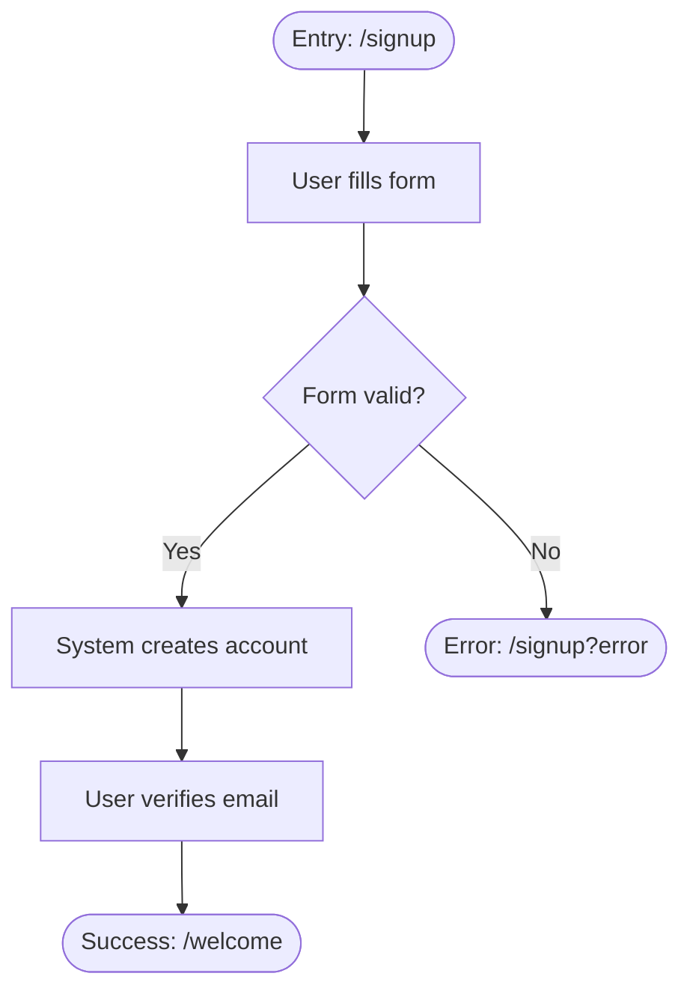
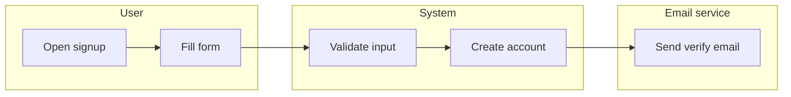

# User Flow Diagramming

You produce user flow diagrams at the UI-task level. A user flow is the step-by-step sequence of actions, decisions, and system responses as a user completes a task. Sits between user-journey-management (strategic, emotional) and wireframing (screen layout).

## Core rules

- **Task-scoped**: one flow per task; complex journeys = multiple flows that compose
- **Actor explicit**: who does what — user / system / third party
- **Decision points labeled**: every diamond has a condition
- **Happy path first, then edges**: primary flow separate from alternative / error flows
- **Instrumentation called out**: which steps are measured
- **No fabricated UI**: this skill describes steps, not screens (that's `wireframing`)

## Input handling

| Dimension | Required | Default |
|---|---|---|
| **Task / flow name** | Yes | — |
| **Actor(s)** | Yes | user + system |
| **Entry point(s)** | Yes | — |
| **Outcome(s)** | Yes | — |
| **Flow types in scope** | No | happy path + 1–3 edge / error variants |

## Phase 1 — Setup

```
**Flow name**: [task]
**Actors**: [user + system + third parties]
**Entry points**: [URL / deep link / email / notification / ...]
**Outcomes**: [success / failure / alternate outcomes]
**Flow types**: [happy / edge / error-recovery / abandonment]
```

Ask render mode per `diagram-rendering` mixin and output path (default: `/documentation/[case]/user-flow-diagramming/`).

## Phase 2 — Flow decomposition

Per flow type, decompose into steps:

| Field | Description |
|---|---|
| **Step ID** | `F-01-S-001`, ... |
| **Actor** | user / system / third party |
| **Action** | What happens (verb-led) |
| **Input / data** | What's provided or consumed |
| **System response** | UI response, API call, event |
| **Preconditions** | State required before step |
| **Postconditions** | State after step |
| **Possible errors** | What can go wrong |
| **Next step(s)** | Conditional transitions |

## Phase 3 — Decision points

Every branching point is a decision node:

- **Condition** — stated precisely (e.g., `user.verified == true`)
- **Branches** — all outcomes explicit (no implicit "else")
- **Data source** — where the decision value comes from

## Phase 4 — Flow types

### Happy path

Primary success flow. Single sequence from entry to success outcome.

### Edge cases

Valid-but-uncommon paths (e.g., user is logged in via SSO, user retries after validation, user uses keyboard shortcut). Name each variant.

### Error paths

What happens on failure: validation error, network error, third-party failure, timeout, unauthorized, rate-limited. Include recovery actions.

### Abandonment

What happens if user leaves mid-flow (close tab, back button, timeout): state retention, cleanup, re-entry point. Especially important for funnels.

## Phase 5 — Instrumentation points

Mark steps where events should be captured:

| Step ID | Event name | Purpose | Funnel stage |
|---|---|---|---|
| F-01-S-002 | `flow_started` | Entry count | 0 |
| F-01-S-008 | `primary_cta_clicked` | Engagement | 3 |
| F-01-S-012 | `flow_completed` | Success count | 5 |

These feed `metric-definition` or analytics setup.

## Phase 6 — Flow composition (if multiple flows)

If task involves multiple flows (e.g., signup then onboarding), document composition:
- Sequential composition: flow A → flow B
- Conditional composition: flow A → flow B or C
- Parallel composition: flow A || flow B (rare for user-facing)

## Phase 7 — Diagrams

### 1. Flow diagram (Mermaid flowchart)



Rules:
- Rounded nodes for entry/exit
- Rectangles for steps
- Diamonds for decisions
- Labels on every decision edge
- Separate sub-graph per flow type or color-code

### 2. Happy path vs alternatives (optional)

Two side-by-side flowcharts or one diagram with styled edges (solid = happy, dashed = alternative).

### 3. Swimlane view (if multi-actor)



## Phase 8 — Diagram rendering

Per `diagram-rendering` mixin. File names:
- `user-flow-[flow-id].mmd` / `.png`
- `swimlane-[flow-id].mmd` / `.png` (if multi-actor)

## Phase 9 — Report assembly and approval

```markdown
# User Flow: [Task]

**Date**: [date]
**Actors**: [list]
**Entry points**: [list]
**Outcomes**: [list]
**Flow types documented**: [happy / edges / errors / abandonment]

## Scope
[Task, actors, entry points, outcomes, flow types]

## Happy Path
[Diagram + step table]

## Edge Cases
[Per variant: diagram + step table]

## Error Paths
[Per error scenario: diagram + recovery steps]

## Abandonment
[State retention + re-entry]

## Instrumentation Points
[Event table]

## Flow Composition
[If multiple flows]

## Swimlane View
[If multi-actor]

## Assumptions & Limitations
[`[Assumed]` steps; UI specifics deferred to `wireframing`]
```

Present for user approval. Save only after confirmation.

## Extraction + planning rules

- Every decision has explicit branches
- Every error path has recovery or abandonment note
- Actors explicit per step
- No fabricated API calls or UI specifics
- Instrumentation events named, not invented

## Failure behavior

| Situation | Behavior |
|---|---|
| No task | Interview mode (§7) |
| Task too broad (journey-level) | Recommend `user-journey-management` first, then flows per critical touchpoint |
| Implicit "else" branches | Require explicit branches at every decision |
| UI specifics creeping in | Note and defer to `wireframing` |
| Missing error paths | Prompt for ≥1 error variant per happy-path step with external dependency |
| mmdc failure | See `diagram-rendering` mixin |
| Out-of-scope (e.g., "also draw the screens") | Pointer to `wireframing` |

## Self-check

```
[] Task scoped (one flow focus)
[] Actors declared
[] Entry points and outcomes explicit
[] Happy path complete (entry → outcome)
[] Decision points labeled with conditions
[] All branches explicit (no implicit else)
[] Edge cases named
[] Error paths with recovery
[] Abandonment handled
[] Instrumentation events named
[] All Mermaid diagrams valid
[] Swimlane if multi-actor
[] No fabricated UI or API details
[] Report follows output contract
```
